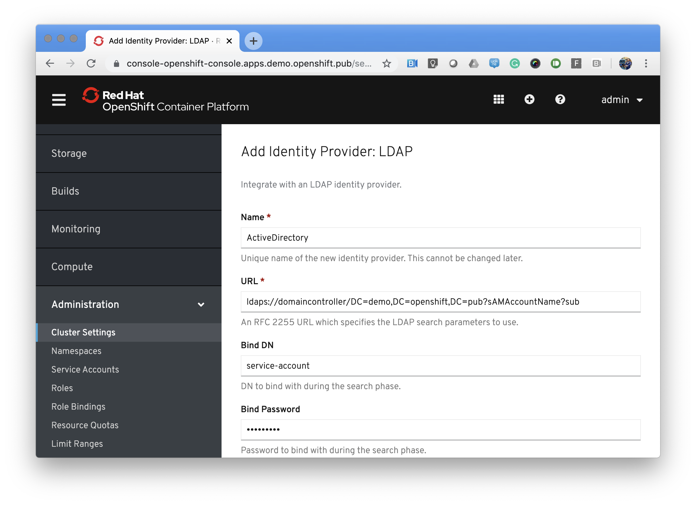

# ActiveDirectory \(LDAP\)

## Setup ActiveDirectory Authentication

Go to Administration -&gt; Cluster Settings -&gt; Global Configuration -&gt; OAuth -&gt; Add -&gt; LDAP




Important part is the URL! 


| **Option** | **Value** |
| :--- | :--- |
| Name | Active Directory |
| URL | ldaps://domaincontroller/DC=demo,DC=openshift,DC=pub?sAMAccountName?sub |
| Bind DN | service-account |
| Bind Password | \*\*\*\*\*\*\*\*\* |
| **Attributes** | \*\*\*\* |
| ID | sAMAccountName |
| Preferred Username | sAMAccountName |
| Name | cn |
| Email | mail |

#### User filter examples

`ldaps://domaincontroller/DC=demo,DC=openshift,DC=pub?sAMAccountName?sub?(&(filter=asdfg)(!(adsf=asdf)))`

**Filter:**

1. All user `objectclass=person`
2. Member of group \(inclusive nested group\) OpenShift-User
3. Active AD Account

```text
(&
    (memberOf:1.2.840.113556.1.4.1941:=CN=OpenShift-User,OU=Gruppen,DC=demo,DC=openshift,DC=pub)
    (objectClass=person)
    (!(userAccountControl:1.2.840.113556.1.4.803:=2))
)
```

## Group Sync

Documentation: [https://docs.openshift.com/container-platform/latest/authentication/ldap-syncing.html](https://docs.openshift.com/container-platform/latest/authentication/ldap-syncing.html)

### Create ldap sync configuration files



```yaml
kind: LDAPSyncConfig
apiVersion: v1
url: ldaps://domaincontroller
bindDN: service-account
bindPassword: '********'
insecure: false
ca: /ldap-sync/ca.crt
groupUIDNameMapping:
  "CN=Basis Server Admins,OU=Groups,DC=demo,DC=openshift,DC=pub": Basis-Server-Admins 
augmentedActiveDirectory:
    groupsQuery: 
        derefAliases: never
        pageSize: 0
    groupUIDAttribute: dn 
    groupNameAttributes: [ cn ] 
    usersQuery:
        baseDN: "DC=demo,DC=openshift,DC=pub"
        scope: sub
        derefAliases: never
        filter: (objectclass=person)
        pageSize: 0
    userNameAttributes: [ sAMAccountName ] 
    groupMembershipAttributes: [ "memberOf:1.2.840.113556.1.4.1941:" ] 
```



```
CN=Basis Server Admins,OU=Groups,DC=demo,DC=openshift,DC=pub
CN=OCP-Users,OU=Groups,DC=demo,DC=openshift,DC=pub
```



```
-----BEGIN CERTIFICATE-----
.....
-----END CERTIFICATE-----
```



### Create secret with all ldap sync conf files

```text
oc create secret generic ldap-sync \
    --from-file=ldap-sync.yaml=ldap-sync.yaml \
    --from-file=whitelist.txt=whitelist.txt \
    --from-file=ca.crt=ca.crt
```

### Deploy recular sync via CronJob/ScheduledJob

#### Create ldap-group-sync cluster role



```bash
oc create clusterrole ldap-group-sync \
    --verb=create,update,patch,delete,get,list \
    --resource=groups.user.openshift.io
```



```yaml
apiVersion: rbac.authorization.k8s.io/v1
kind: ClusterRole
metadata:
  name: ldap-group-sync
rules:
- apiGroups:
  - user.openshift.io
  resources:
  - groups
  verbs:
  - create
  - update
  - patch
  - delete
  - get
  - list
```



#### Create project, service account and cluster-role-binding

```text
oc new-project ldap-sync
oc create sa ldap-sync
oc adm policy add-cluster-role-to-user ldap-group-sync \
    -z ldap-sync \
    -n ldap-sync
```

#### Create CronJob



```yaml
apiVersion: batch/v1beta1
kind: CronJob
metadata:
  name: ldap-group-sync
spec:
  # Format: https://en.wikipedia.org/wiki/Cron
  schedule: '@hourly'
  suspend: false
  jobTemplate:
    spec:
      template:
        spec:
          serviceAccountName: ldap-sync
          restartPolicy: Never
          containers:
            - name: oc-cli
              command:
                - /bin/oc
                - adm
                - groups
                - sync
                - --whitelist=/ldap-sync/whitelist.txt
                - --sync-config=/ldap-sync/ldap-sync.yaml
                - --confirm
              image: registry.redhat.io/openshift4/ose-cli
              imagePullPolicy: Always
              volumeMounts:
              - mountPath: /ldap-sync/
                name: config
                readOnly: true
          volumes:
          - name: config
            secret:
              defaultMode: 420
              secretName: ldap-sync
```



## How to debug with ldapsearch

Install ldapsearch with `yum install openldap-clients.x86_64`

```
$ ldapsearch -x -H ldap://domaincontroler -D service-account \
    -b "DC=demo,DC=openshift.,DC=pub" \
    -W '(sAMAccountName=rbohne)'
```

