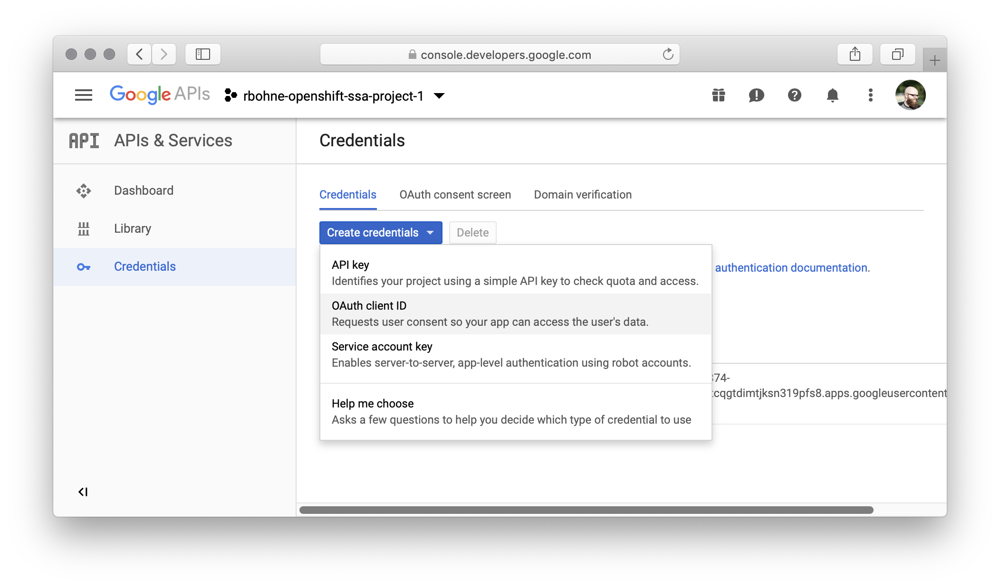

# Red Hat SSO - via Google

## Official documentation:

* [OpenShift 4 - latest](https://docs.openshift.com/container-platform/latest/authentication/identity_providers/configuring-google-identity-provider.html)

## Setup OAuth 2.0 client at Google <a id="user-content-setup-oauth-2-0-client-at-google"></a>

### Visit: [https://console.developers.google.com/apis/credentials](https://console.developers.google.com/apis/credentials)



### Create OAuth client ID


### Copy Client ID and Client secret

Example Client ID and secret  
Client ID: `1079862778375-60es8d8ugvg3e54csnesgf94p6r4rc6s.apps.googleusercontent.com`  
Client Secret: `rJR1jmiUnk_ZWZFxqbMxhShn`

### Create client secret

```text
oc create secret generic google-secret \
  --from-literal=clientSecret=rJR1jmiUnk_ZWZFxqbMxhShn \
  -n openshift-config
```

### Update OAuth Config



```yaml
apiVersion: config.openshift.io/v1
kind: OAuth
metadata:
  name: cluster
spec:
  identityProviders:
  - name: RedHatSSO
    mappingMethod: claim
    type: Google
    google:
      clientID: "1079862778375-60es8d8ugvg3e54csnesgf94p6r4rc6s.apps.googleusercontent.com"
      clientSecret:
        name: google-secret
      hostedDomain: "redhat.com"
```



Apply: `oc apply -f oauth.yaml`

**Optional** Remove kubeadm account

```text
oc delete secrets kubeadmin -n kube-system
```

[Documentation](https://docs.openshift.com/container-platform/4.1/authentication/remove-kubeadmin.html)

**Optional** Remove self-provisioner

```text
oc adm policy remove-cluster-role-from-group self-provisioner system:authenticated system:authenticated:oauth
```

