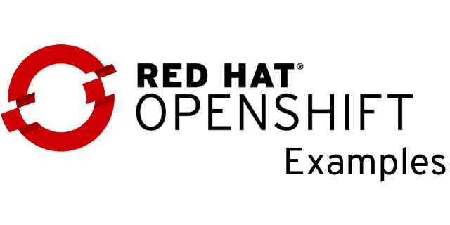

# [OpenShift Examples](https://examples.openshift.pub/)

The OpenShift Examples is a personal collection of valuable information, code snippets, and practical demonstrations related to OpenShift and Kubernetes. It serves as a repository of Robert's own experiences & contributions, solutions, and best practices in managing and deploying applications on OpenShift.

Contributions to this collection are warmly welcomed and highly appreciated!

They foster collaboration and knowledge sharing within the OpenShift community,
making the repository even more valuable as a collective resource.

Feel free to explore the examples, contribute your own insights,
and benefit from the expertise shared in this repository.

## Last updates

|Date|Headline|
|---|---|
|2026-07-10|[Updated SCC anyuid page with selection process and modern examples](deploy/scc-anyuid.md)|
|2026-07-03|[Updated KubeVirt networking: OVN-Bridge, Linux-Bridge, ClusterUserDefinedNetwork](kubevirt/networking/)|
|2026-05-29|[Updated disconnected installation section](cluster-installation/disconnected/)|
|2026-05-26|[Added Hosted Control Plane and tenant networking](cluster-installation/hosted-control-plane/tenant-network/)|
|2026-05-05|[Added cluster-installation on STACKIT](cluster-installation/stackit/)|
|2026-03-19|[Added Portworx on Two-Node with Arbiter](storage/portworx-and-tna/)|
|2026-03-19|[Added Agent-base installation example (proxy)](cluster-installation/agent-base-proxy/)|
|2026-03-17|[Added KubeVirt CSI](kubevirt/kubevirt-csi-driver/)|
|2026-02-12|[Update networking/egressip](networking/egress-ip/)|
|2026-02-06|[Added domain.xml adjustment example via sidecar hook](kubevirt/adjust-domain-xml/)|
|2026-02-06|[Updated IBM Fusion Access for SAN with air-gapped/disconnected details](storage/ibm-fusion-access-san/)|
|2026-01-29|[Added how to setup a rhel 10 router](my-lab/rhel-router/)|
|2026-01-12|[Added storage/ibm-fusion-access-san](storage/ibm-fusion-access-san/)|

## Usefull Red Hat Solutions articles & blog posts

* [How can a user update OpenShift 4 console route](https://access.redhat.com/solutions/4539491)
* [Red Hat Operators Supported in Disconnected Mode](https://access.redhat.com/articles/4740011)
* [Support Policies for Red Hat OpenShift Container Platform Clusters - Deployments Spanning Multiple Sites(Data Centers/Regions)](https://access.redhat.com/articles/3220991)
* [Red Hat OpenShift Container Platform Update Graph](https://access.redhat.com/labs/ocpupgradegraph/update_channel)
* [Consolidated Troubleshooting Article OpenShift Container Platform 4.x](https://access.redhat.com/articles/4217411)
* [Red Hat Container Support Policy](https://access.redhat.com/articles/2726611)
* [Red Hat Enterprise Linux Container Compatibility Matrix](https://access.redhat.com/support/policy/rhel-container-compatibility)
* [Consolidated Troubleshooting Article OpenShift Container Platform 4.x](https://access.redhat.com/articles/4217411)
* [Red Hat OpenShift Container Platform Life Cycle Policy](https://access.redhat.com/support/policy/updates/openshift)
* [Deploying OpenShift 4.x on non-tested platforms using the bare metal install method](https://access.redhat.com/articles/4207611)
* [Certified OpenShift CNI Plug-ins](https://access.redhat.com/articles/5436171)
* [Is it supported to have mixed environment (VMware+Baremetal) setup for RHOCP 4.x cluster](https://access.redhat.com/solutions/5376701)
* [Demystifying the OpenShift release image](https://www.stb.id.au/blog/demystifying-ocp-release-image)
* [OpenShift Virtualization – Fencing and VM High Availability Guide](https://access.redhat.com/articles/7057929)

## Stargazers over time

