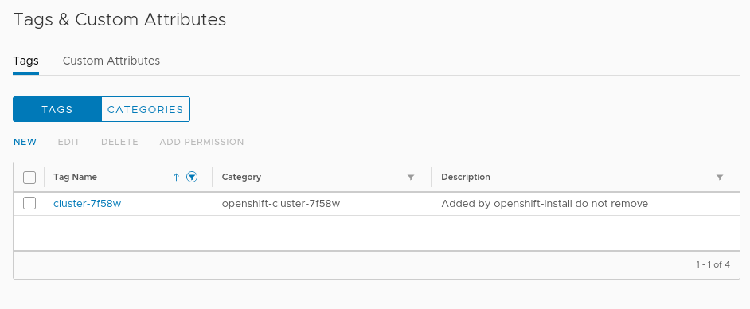
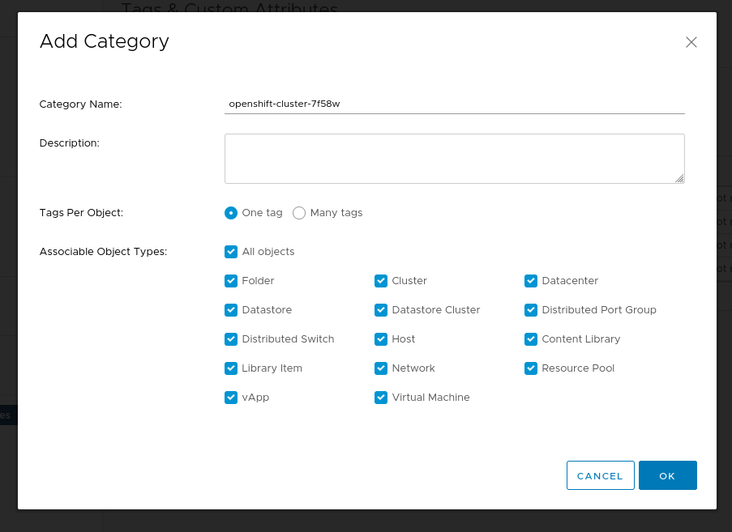
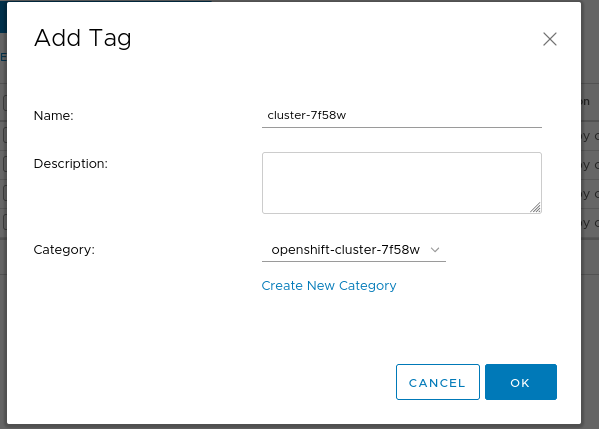

# Create MachineSets on VMware UPI (integrated)

## Resources

* [KCS: How to create a MachineSet for VMware in OCP 4 UPI installations](https://access.redhat.com/solutions/5307621)
* Internal gDoc: [vSphere machinesets](https://docs.google.com/document/d/13Cvg9grWQshhaBzdOGItB-8dJCRSUC9TaG5-gRI4L-w/edit#)

## Create VMware Tags based on `infrastructureName`

Double check if tags are available or not at `Menu -> Tags & Custom Attributes` (VMware [documentation](https://docs.vmware.com/en/VMware-vSphere/6.7/com.vmware.vsphere.vcenterhost.doc/GUID-E8E854DD-AA97-4E0C-8419-CE84F93C4058.html))

Here an example:

* Get infrastructureName

    ```
    [root@jump ~]# oc get infrastructure cluster -o jsonpath='{.status.infrastructureName}{"\n"}'
    cluster-7f58w
    ```

* Check if tag is already available

    

* If not, create tag category and tag:
* tag category
  
* tag it self
  

## Others

<https://github.com/openshift/machine-config-operator/blob/master/templates/common/vsphere/files/vsphere-hostname.yaml>
