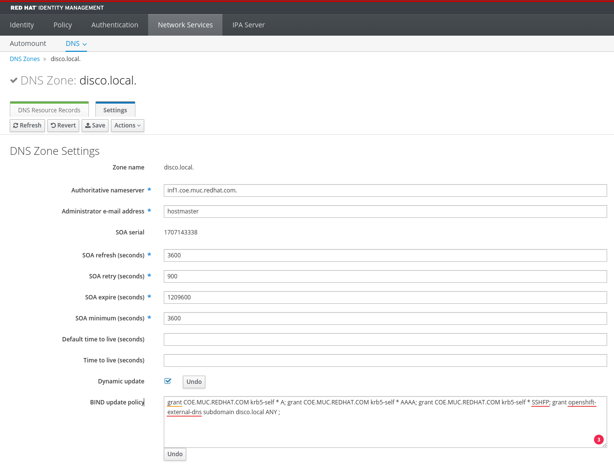

# External DNS with FreeIPA (RFC2136)

Sadly the External DNS Operator do not support RFC2136. Let's use the upstream one.

Thanks to <https://astrid.tech/2021/04/18/0/k8s-freeipa-dns/> for the starting point.

## Prepare IPA DNS Zone

### Generate a TSIG key and register it

```bash
dnssec-keygen -a HMAC-SHA512 -b 512 -n HOST openshift-external-dns
```

```bash
$ cat Kopenshift-external-dns.+165+16478.private
Private-key-format: v1.3
Algorithm: 165 (HMAC_SHA512)
Key: c3LyD11u....xX6WA==
Bits: AAA=
Created: 20240205134832
Publish: 20240205134832
Activate: 20240205134832
```

### Configure the key at ipa server and all replicas

```bash
$ cat /etc/named/ipa-ext.conf
...
key "openshift-external-dns" {
       algorithm hmac-sha512;
       secret "c3LyD11u....xX6WA==";
};

```

### Allow DNS updates and zone transfer for the key

Select the zone you want to manage, in my example `.disco.local`:

* Enable `Dynamic update`
* Add `grant openshift-external-dns subdomain disco.local ANY ;` to BIND update policy
  Details about the policy configuration you can [here](https://bind9.readthedocs.io/en/v9.16.20/reference.html#dynamic-update-policies)



* Configure `Allow transfer` is not possible via WebUI. [Because](https://www.freeipa.org/page/Howto/DNS_updates_and_zone_transfers_with_TSIG)

    ??? example "ldap search example"

        At the ipa server

        ```bash
        # kinit admin
        Password for admin@DISCO.LOCAL:
        # ldapsearch idnsname=disco.local.  dn idnsAllowTransfer
        SASL/GSSAPI authentication started
        SASL username: admin@disco.local
        SASL SSF: 256
        SASL data security layer installed.
        # extended LDIF
        #
        # LDAPv3
        # base <cn=dns,dc=disco,dc=local> (default) with scope subtree
        # filter: idnsname=disco.local.
        # requesting: dn idnsAllowTransfer
        #

        # disco.local., dns, disco.local
        dn: idnsname=disco.local.,cn=dns,dc=disco,dc=local
        idnsAllowTransfer: none;

        # search result
        search: 4
        result: 0 Success

        # numResponses: 2
        # numEntries: 1
        #
        ```

    ```bash
    kinit admin

    ldapmodify -Y GSSAPI << EOF
    dn: idnsname=coe.muc.redhat.com.,cn=dns,dc=disco,dc=local
    changetype: modify
    replace: idnsAllowTransfer
    idnsAllowTransfer: key openshift-external-dns;
    -
    EOF

    ```

## Deploy External DNS

based on [Configuring RFC2136 provider](https://github.com/kubernetes-sigs/external-dns/blob/master/docs/tutorials/rfc2136.md)

??? example "Deployment"

    Create a secret with the tsig key `c3LyD11u....xX6WA==`

    ```bash
     oc create secret generic external-dns-rfc2136-tsig-secret \
        --from-literal=EXTERNAL_DNS_RFC2136_TSIG_SECRET="c3LyD11u....xX6WA=="
    ```
    === "YAML"

        ```yaml
        --8<-- "content/cluster-configuration/external-dns/deployment/namespace.yaml"
        --8<-- "content/cluster-configuration/external-dns/deployment/serviceaccount.yaml"
        --8<-- "content/cluster-configuration/external-dns/deployment/clusterrole.yaml"
        --8<-- "content/cluster-configuration/external-dns/deployment/clusterrolebinding.yaml"
        --8<-- "content/cluster-configuration/external-dns/deployment/deployment.yaml"
        ```

    === "oc apply -k ...."

        ```bash
        oc apply -k https://github.com/openshift-examples/web/tree/main/content/cluster-configuration/external-dns/deployment/
        ```

Check the logs of the external-dns pod

```bash
oc logs -n infra-external-dns deployment/external-dns
```

## Example deployment

* Required MetalLB or support of service type LoadBalancer.

```bash
oc new-project external-dns-demo

oc apply -f {{ page.canonical_url }}../../deploy/deployment-simple-nginx.yaml

oc patch service/simple-nginx --type merge -p '{"spec":{"type":"LoadBalancer"}}'

oc annotate service/simple-nginx external-dns.alpha.kubernetes.io/hostname='external-dns-demo.disco.local'
oc annotate service/simple-nginx external-dns.alpha.kubernetes.io/ttl='60'
```
