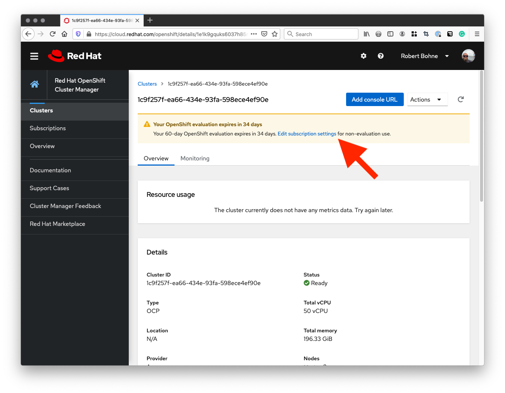
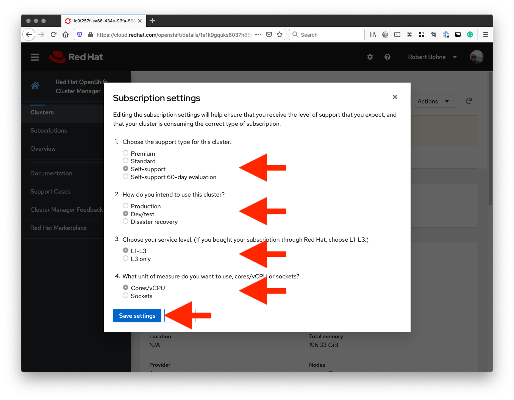
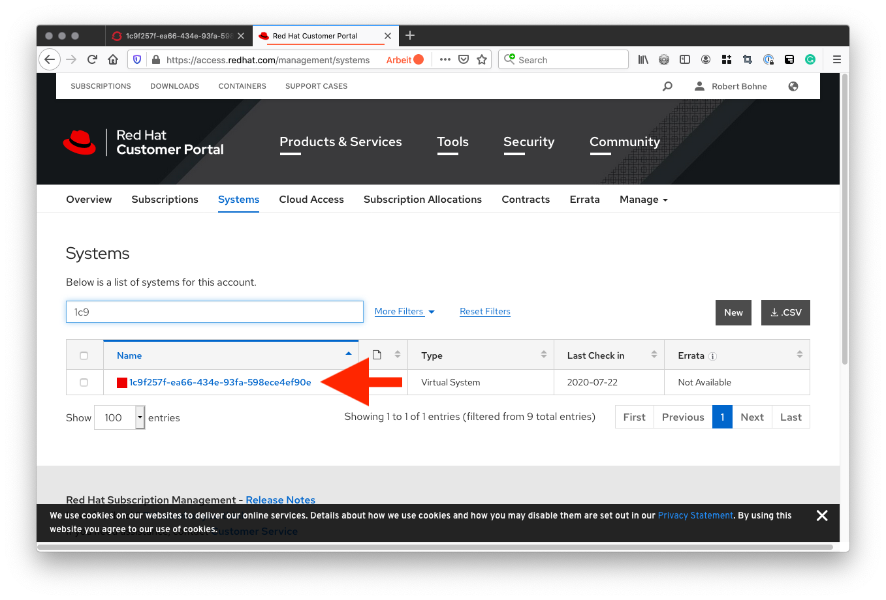
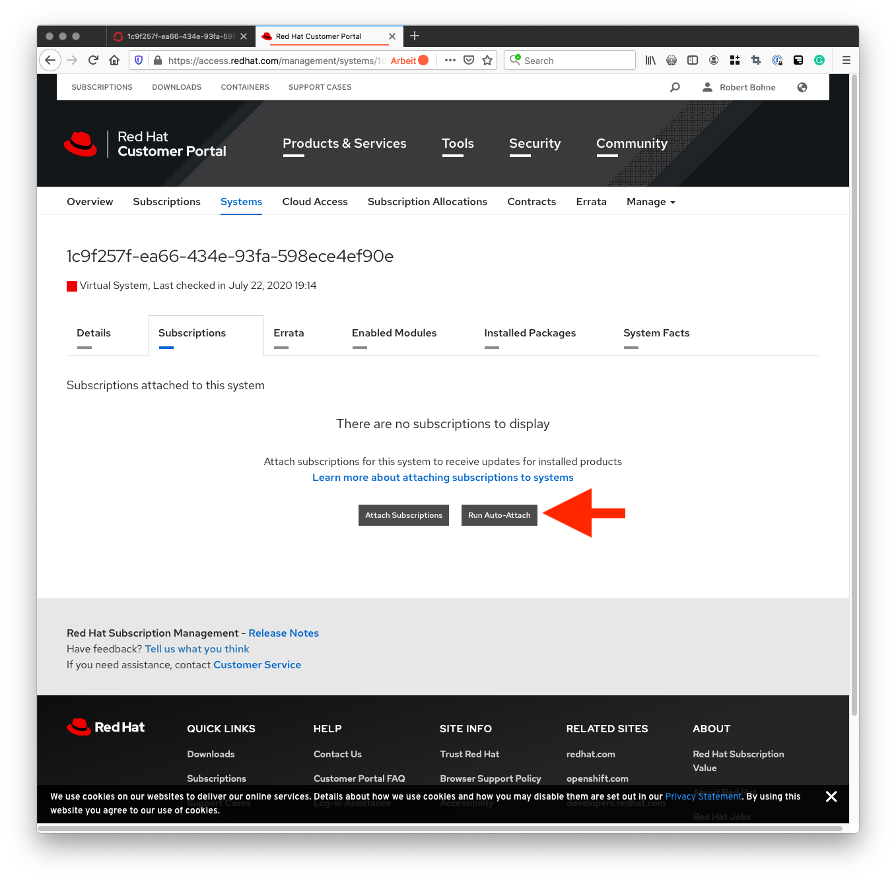
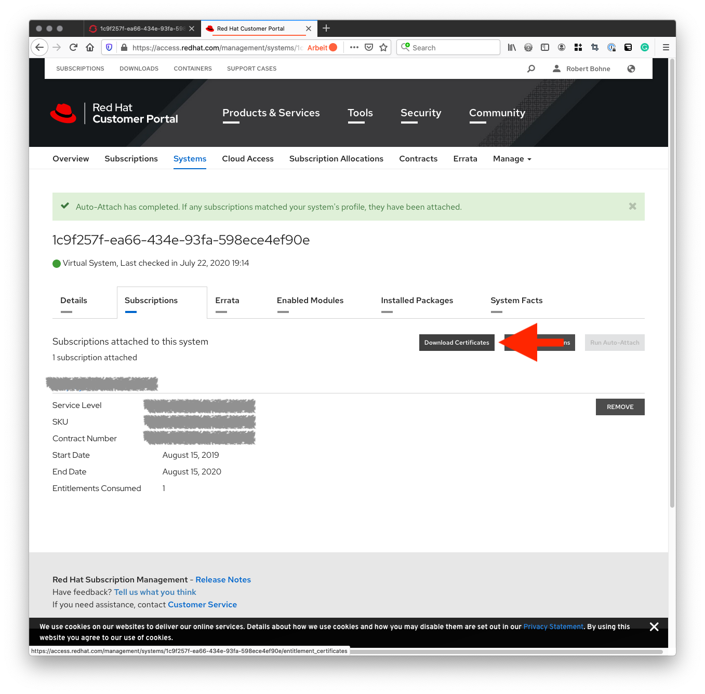

# How to get and configure full cluster entitlement

## Subscribe the cluster and fetch the entitlement

### Edit subscription settings

Select the cluster at [cloud.redhat.com](https://cloud.redhat.com) and edit subscription settings.




### Attach subscription to cluster

Go to [access.redhat.com](https://access.redhat.com) and select the virtual System:



Attach your subscription:



**Download the entitlement**




## Install the entitlement to your cluster

Official solution: [How to use entitled image builds on Red Hat OpenShift Container Platform 4.x cluster ?](https://access.redhat.com/solutions/4908771)


```
$ unzip 7f6df4a3-a693-45ca-9f29-81f0328d4f5e_certificates.zip
Archive:  7f6df4a3-a693-45ca-9f29-81f0328d4f5e_certificates.zip
signed Candlepin export for 7f6df4a3-a693-45ca-9f29-81f0328d4f5e
  inflating: consumer_export.zip
  inflating: signature
$ unzip consumer_export.zip
Archive:  consumer_export.zip
Candlepin export for 7f6df4a3-a693-45ca-9f29-81f0328d4f5e
  inflating: export/meta.json
  inflating: export/entitlement_certificates/4562443306095312060.pem
$ cp export/entitlement_certificates/4562443306095312060.pem nvidia.pem
$ curl -L -O https://raw.githubusercontent.com/openshift-psap/blog-artifacts/master/how-to-use-entitled-builds-with-ubi/0003-cluster-wide-machineconfigs.yaml.template
$ sed -i -f - 0003-cluster-wide-machineconfigs.yaml.template << EOF
s/BASE64_ENCODED_PEM_FILE/$(base64 -w0 nvidia.pem)/g
EOF
$ oc apply -f 0003-cluster-wide-machineconfigs.yaml.template
machineconfig.machineconfiguration.openshift.io/50-rhsm-conf created
machineconfig.machineconfiguration.openshift.io/50-entitlement-pem created
machineconfig.machineconfiguration.openshift.io/50-entitlement-key-pem created
```

### Watch the entitlement rollout

**Copy&Paste the command:**
```bash
watch 'oc get nodes -o custom-columns=NAME:.metadata.name,Status:.metadata.annotations."machineconfiguration\.openshift\.io/state",currentConfig:.metadata.annotations."machineconfiguration\.openshift\.io/currentConfig",desiredConfig:.metadata.annotations."machineconfiguration\.openshift\.io/desiredConfig"'
```

**Example output:**
```bash
$ oc get nodes -o custom-columns=NAME:.metadata.name,Status:.metadata.annotations."machineconfiguration\.openshift\.io/state",currentConfig:.metadata.annotations."machineconfiguration\.openshift\.io/currentConfig",desiredConfig:.metadata.annotations."machineconfiguration\.openshift\.io/desiredConfig"
NAME        Status    currentConfig                                      desiredConfig
compute-0   Done      rendered-worker-15dd6aa49dab77cc95f392b99ecca248   rendered-worker-15dd6aa49dab77cc95f392b99ecca248
compute-1   Done      rendered-worker-15dd6aa49dab77cc95f392b99ecca248   rendered-worker-15dd6aa49dab77cc95f392b99ecca248
compute-2   Working   rendered-worker-15dd6aa49dab77cc95f392b99ecca248   rendered-worker-c486cfec526faa411a36efa31b426237
master-0    Done      rendered-master-26b61ef596395a9b098c4c1e0e5255cb   rendered-master-26b61ef596395a9b098c4c1e0e5255cb
master-1    Done      rendered-master-26b61ef596395a9b098c4c1e0e5255cb   rendered-master-26b61ef596395a9b098c4c1e0e5255cb
master-2    Done      rendered-master-26b61ef596395a9b098c4c1e0e5255cb   rendered-master-26b61ef596395a9b098c4c1e0e5255cb
```

You are done if all nodes have the new config, or the machineconfigpool is done:
```
$ oc get machineconfigpool/worker
NAME     CONFIG                                             UPDATED   UPDATING   DEGRADED   MACHINECOUNT   READYMACHINECOUNT   UPDATEDMACHINECOUNT   DEGRADEDMACHINECOUNT   AGE
worker   rendered-worker-15dd6aa49dab77cc95f392b99ecca248   True     False       False      3              0                   0                     0                      3h47m
```

## How to test it

```bash
oc apply -f - <<EOF
apiVersion: v1
kind: Pod
metadata:
  name: rhel
spec:
  containers:
    - name: rhel
      image: registry.access.redhat.com/ubi8/ubi:latest
      command:
        - /bin/sh
        - -c
        - |
          dnf search kernel-headers
  restartPolicy: Never
EOF
```

Output of entitled cluster:

```
$ oc logs rhel
Updating Subscription Management repositories.
Unable to read consumer identity
Subscription Manager is operating in container mode.
Red Hat Enterprise Linux 8 for x86_64 - BaseOS  2.5 MB/s |  22 MB     00:09
Red Hat Enterprise Linux 8 for x86_64 - AppStre  15 MB/s |  19 MB     00:01
Red Hat Universal Base Image 8 (RPMs) - BaseOS  2.8 MB/s | 772 kB     00:00
Red Hat Universal Base Image 8 (RPMs) - AppStre  13 MB/s | 4.0 MB     00:00
Red Hat Universal Base Image 8 (RPMs) - CodeRea  83 kB/s |  13 kB     00:00
===================== Name Exactly Matched: kernel-headers =====================
kernel-headers.x86_64 : Header files for the Linux kernel for use by glibc
```

Important are the enabled Red Hat Enterprise Linux 8 repositories.
```
Red Hat Enterprise Linux 8 for x86_64 - BaseOS
Red Hat Enterprise Linux 8 for x86_64 - AppStre
```

Output of non entitled cluster:
```
$ oc logs rhel
Updating Subscription Management repositories.
Unable to read consumer identity
Subscription Manager is operating in container mode.
This system is not registered to Red Hat Subscription Management. You can use subscription-manager to register.
Red Hat Universal Base Image 8 (RPMs) - BaseOS  141 kB/s | 772 kB     00:05
Red Hat Universal Base Image 8 (RPMs) - AppStre 7.6 MB/s | 4.0 MB     00:00
Red Hat Universal Base Image 8 (RPMs) - CodeRea  51 kB/s |  13 kB     00:00
===================== Name Exactly Matched: kernel-headers =====================
kernel-headers.x86_64 : Header files for the Linux kernel for use by glibc
```