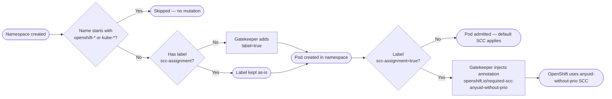

# Gatekeeper — Automatic SCC Assignment

This setup uses OPA Gatekeeper mutations to automatically assign a specific SCC
to every workload namespace cluster-wide. Gatekeeper labels each namespace and
then injects the `openshift.io/required-scc` annotation onto pods, ensuring
OpenShift uses the designated SCC instead of its default selection logic.

!!! info

    `AssignMetadata` only sets a value when the field is **not already present** — pods with an existing `openshift.io/required-scc` annotation are not touched.

Official documentation:

- [OPA Gatekeeper](https://open-policy-agent.github.io/gatekeeper/website/)
- [Managing SCCs in OpenShift](https://docs.openshift.com/container-platform/latest/authentication/managing-security-context-constraints.html)

Tested with:

|Component|Version|
|---|---|
|OpenShift|v4.21.22|
|OPA Gatekeeper|v3.21.0|

## How It Works



## Prerequisites

- OpenShift 4.x cluster
- OPA Gatekeeper installed with mutation enabled

## Installation

### 1. Install the Gatekeeper Operator

Install the **Gatekeeper Operator** from OperatorHub (search for "Gatekeeper") and create
a `Gatekeeper` CR with `mutatingWebhook: Enabled`. See the
[Chapter 5. Gatekeeper operator overview](https://docs.redhat.com/en/documentation/red_hat_advanced_cluster_management_for_kubernetes/2.17/html/governance/gk-operator-overview)
for details, or the [upstream operator README](https://github.com/open-policy-agent/gatekeeper-operator#readme).

### 2. Create the SCC and RBAC

In this example, all workloads should run with any UID. The built-in `anyuid` SCC has a higher priority and would always win, meaning it would also be applied to workloads not intended to run as anyuid.

That's the reason why I created a copy of anyuid without a prio:

=== "scc-anyuid-without-prio.yaml"

    ```yaml
    --8<-- "content/cluster-configuration/gatekeeper-opa/automatic-scc-assignment/scc-anyuid-without-prio.yaml"
    ```

=== "oc apply"

    ```shell
    oc apply -f {{ page.canonical_url }}scc-anyuid-without-prio.yaml
    ```

Now it's time to allow all services accounts (group `system:serviceaccounts`) to use our own SCC.

=== "clusterrole-use-anyuid-without-prio.yaml"

    ```yaml
    --8<-- "content/cluster-configuration/gatekeeper-opa/automatic-scc-assignment/clusterrole-use-anyuid-without-prio.yaml"
    ```

=== "clusterrolebinding-use-anyuid-without-prio.yaml"

    ```yaml
    --8<-- "content/cluster-configuration/gatekeeper-opa/automatic-scc-assignment/clusterrolebinding-use-anyuid-without-prio.yaml"
    ```

=== "oc apply"

    ```shell
    oc apply -f {{ page.canonical_url }}clusterrole-use-anyuid-without-prio.yaml
    oc apply -f {{ page.canonical_url }}clusterrolebinding-use-anyuid-without-prio.yaml
    ```

### 3. Deploy the Gatekeeper mutations

Let's apply our two mutations.

#### 3.1. Ensure the namespace labeling

=== "assign-namespace-label.yaml"

    ```yaml
    --8<-- "content/cluster-configuration/gatekeeper-opa/automatic-scc-assignment/assign-namespace-label.yaml"
    ```

=== "oc apply"

    ```shell
    oc apply -f {{ page.canonical_url }}assign-namespace-label.yaml
    ```

#### 3.2. Add `openshift.io/required-scc` to all Pods

Add the annotation `openshift.io/required-scc` to all pods in namespaces with a specific label.

=== "assign-metadata.yaml"

    ```yaml
    --8<-- "content/cluster-configuration/gatekeeper-opa/automatic-scc-assignment/assign-metadata.yaml"
    ```

=== "oc apply"

    ```shell
    oc apply -f {{ page.canonical_url }}assign-metadata.yaml
    ```

### 4. Verify

Create a namespace and deploy an application:

```shell
oc create namespace test-app
oc project test-app
oc apply -k git@github.com:openshift-examples/kustomize/components/simple-http-server
```

```shell
% oc get pods -o custom-columns=NAMESPACE:.metadata.namespace,NAME:.metadata.name,SCC:.metadata.annotations."openshift\.io/scc",REQ-SCC:.metadata.annotations."openshift\.io/required-scc"
NAMESPACE   NAME                                SCC                   REQ-SCC
test-app    simple-http-server-7fbb8879-sn9tx   anyuid-without-prio   anyuid-without-prio
```

🎉 SCC `anyuid-without-prio` is in use and required.

## Opting Out

To exclude a namespace from automatic SCC assignment, explicitly set the label
to `"false"`:

```shell
oc label --overwrite namespace/test-app examples.openshift.pub/scc-assignment=false
```

Force to restart pods:

```shell
oc delete pods --all
```

Let's check the pods again:

```shell
% oc get pods -o custom-columns=NAMESPACE:.metadata.namespace,NAME:.metadata.name,SCC:.metadata.annotations."openshift\.io/scc",REQ-SCC:.metadata.annotations."openshift\.io/required-scc"

NAMESPACE   NAME                                SCC             REQ-SCC
test-app    simple-http-server-7fbb8879-7mvzb   restricted-v2   <none>
```

🎉 default SCC `restricted-v2` is in use and no specific SCC is required.

The Gatekeeper mutation only fires when the label is absent, so an explicit
`"false"` value is preserved and the SCC annotation is not injected.

## Security Considerations

- The `anyuid-without-prio` SCC has **no priority**, so it is never automatically
  selected by OpenShift's SCC admission. It is only used when explicitly
  requested via the `openshift.io/required-scc` annotation.
- The SCC still drops the `MKNOD` capability and does not allow host-level
  access (hostNetwork, hostPID, hostIPC, hostPath volumes, or privileged
  containers).
- The ClusterRoleBinding grants usage to **all** service accounts
  (`system:serviceaccounts`). Restrict the binding to specific namespaces or
  service accounts if needed.
