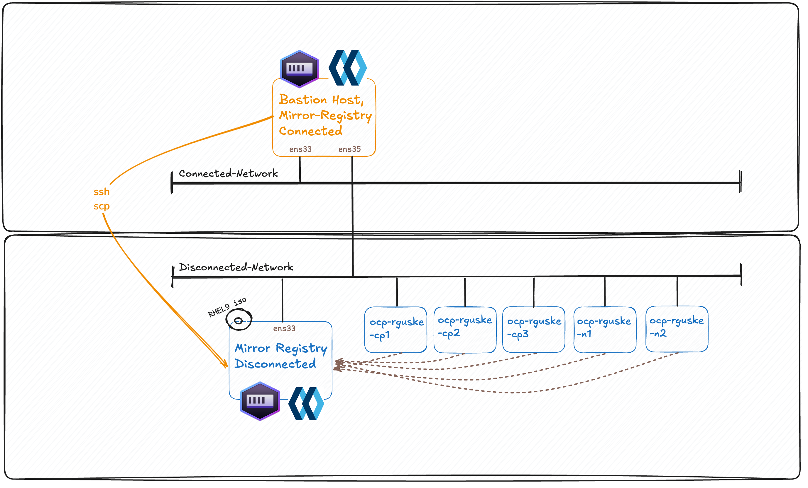
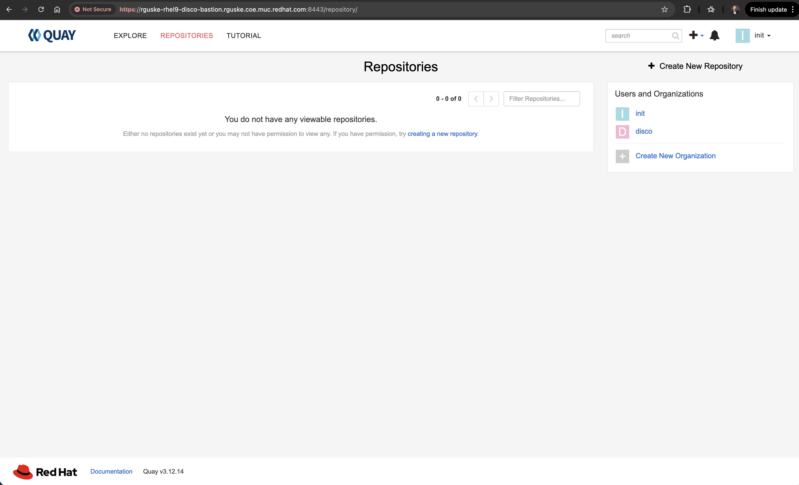
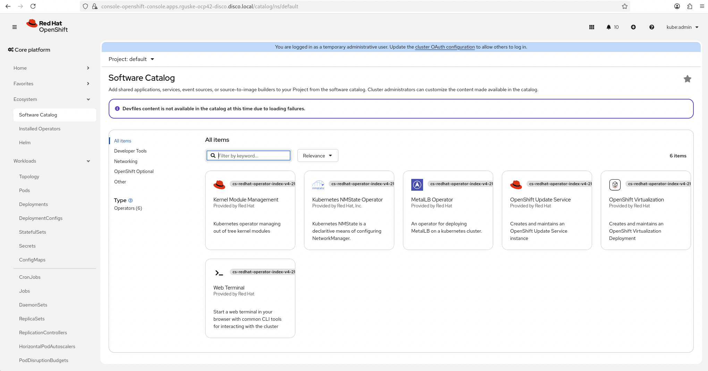

# Disconnected Agent-Based Cluster Installation

A disconnected environment is an environment that does not have full access to the internet.

OpenShift Container Platform is designed to perform many automatic functions that depend on an internet connection, such as retrieving release images from a registry or retrieving update paths and recommendations for the cluster. Without a direct internet connection, you must perform additional setup and configuration for your cluster to maintain full functionality in the disconnected environment.

Source: [Understanding disconnected installation mirroring](https://docs.redhat.com/en/documentation/openshift_container_platform/4.21/html/installing_an_on-premise_cluster_with_the_agent-based_installer/understanding-disconnected-installation-mirroring)

## How it works

You can use a mirror registry for disconnected installations and to ensure that your clusters only use container images that satisfy your organization’s controls on external content. Before you install a cluster on infrastructure that you provision in a disconnected environment, you must mirror the required container images into that environment. To mirror container images, you must have a registry for mirroring.

## Connected Mirroring vs Disconnected Mirroring

**Connected Mirroring** is if you have a host that can access both the internet and your mirror registry, but not your cluster nodes, you can directly mirror the content from that machine.

**Disconnected Mirroring** is if you have no such host, you must mirror the images to a file system and then bring that host or removable media into your restricted environment.

## Lab Environment Setup

At a high-level, the testing setup has a bastion host which is dual-homed configured. One NIC is connected to the "public" network and the other NIC to the "disconnected" network. Most customer setups don't have a bastion connected to the public (internet) network. Anyways! We're going to "download" the images and storing all in a tar ball. This tar ball will be copied over to the mirror-registry host.



## Bastion Host Preperation

### Hostname

Make sure that your `hostname` is set correctly!

```code
hostnamectl
```

The hostname must be a fqdn!

```code
sudo hostnamectl set-hostname rguske-rhel9-disco-bastion.rguske.coe.muc.redhat.com
sudo reboot
```

### RHEL Subscription Manager

Configure RHEL Subscription Manager:

`sudo subscription-manager register --username --password '' --auto-attach`

### Networking Bastion-Host

Setup a Bastion Host with two nics. One is connected to the "internet-zone" and the other one to the disconnected network.

Configure the interfaces accordingly:

Configure the interface which has internet connection:

```code
nmcli con show

NAME                UUID                                  TYPE      DEVICE
System eth0         5fb06bd0-0bb0-7ffb-45f1-d6edd65f3e03  ethernet  eth0
lo                  dd314177-6d3f-4ad3-a1af-2875d094c193  loopback  lo
Wired connection 1  c8d40ef7-3d02-3ba5-b047-dacd6d013b24  ethernet  --
```

```bash
nmcli con mod "System eth0" \
ipv4.addresses 10.32.96.145/20 \
ipv4.gateway 10.32.111.254 \
ipv4.dns "10.32.96.1,10.32.96.31" \
ipv4.method manual
```

Configure the interface which is connected to the disconnected network:

```bash
nmcli con mod "Wired connection 1" \
ipv4.addresses 192.168.69.208/24 \
ipv4.method manual
```

Bring both interfaces up:

```code
nmcli dev reapply eth0 && nmcli dev reapply eth1

Connection successfully reapplied to device 'eth0'.
Connection successfully reapplied to device 'eth1'.
```

Alternatively:

```code
nmcli con up "System eth0" && nmcli con up "Wired connection 1"

Connection successfully activated (D-Bus active path: /org/freedesktop/NetworkManager/ActiveConnection/25)
Connection successfully activated (D-Bus active path: /org/freedesktop/NetworkManager/ActiveConnection/26)
```

Check the new config:

```code
ip -br a
lo               UNKNOWN        127.0.0.1/8 ::1/128
eth0             UP             10.32.96.145/20 2620:52:0:2060:d8:6dff:fe0f:3ed3/64 fe80::d8:6dff:fe0f:3ed3/64
eth1             UP             192.168.69.208/24 fe80::a0eb:9896:d4e1:3fbb/64
```

The configuration is stored under:

```code
nmcli -f NAME,UUID,FILENAME con show
NAME                UUID                                  FILENAME
System eth0         5fb06bd0-0bb0-7ffb-45f1-d6edd65f3e03  /etc/sysconfig/network-scripts/ifcfg-eth0
Wired connection 1  c8d40ef7-3d02-3ba5-b047-dacd6d013b24  /etc/NetworkManager/system-connections/Wired connection 1.nmconnection
lo                  dd314177-6d3f-4ad3-a1af-2875d094c193  /run/NetworkManager/system-connections/lo.nmconnection
```

Readable configuration:

```bash
less /etc/sysconfig/network-scripts/ifcfg-eth0

# Created by cloud-init automatically, do not edit.
#
AUTOCONNECT_PRIORITY=120
BOOTPROTO=none
DEVICE=eth0
HWADDR=02:D8:6D:0F:3E:D3
IPV6INIT=yes
ONBOOT=yes
TYPE=Ethernet
USERCTL=no
PROXY_METHOD=none
BROWSER_ONLY=no
IPADDR=10.32.96.145
PREFIX=20
GATEWAY=10.32.111.254
DNS1=10.32.96.1
DNS2=10.32.96.31
DEFROUTE=yes
IPV4_FAILURE_FATAL=no
IPV6_AUTOCONF=yes
IPV6_DEFROUTE=yes
IPV6_FAILURE_FATAL=no
NAME="System eth0"
UUID=5fb06bd0-0bb0-7ffb-45f1-d6edd65f3e03
```

And the other interface:

```bash
less /etc/NetworkManager/system-connections/Wired\ connection\ 1.nmconnection

[connection]
id=Wired connection 1
uuid=c8d40ef7-3d02-3ba5-b047-dacd6d013b24
type=ethernet
autoconnect-priority=-999
interface-name=eth1

[ethernet]

[ipv4]
address1=192.168.69.208/24
method=manual

[ipv6]
addr-gen-mode=default
method=auto

[proxy]
```

Enable IP Forwarding: `sysctl -w net.ipv4.ip_forward=1`

This allows the VM to forward packets between interfaces.

Make it permanently:

```bash
vi /etc/sysctl.conf
net.ipv4.ip_forward = 1
```

Apply the changes: `sysctl -p`

On Red Hat Enterprise Linux, `firewall-cmd` is provided by the firewalld package. It is not guaranteed to be installed in minimal VM images.

Check whether firewalld is installed:

```code
rpm -q firewalld
```

If it is missing, install and enable it:

```code
sudo dnf install -y firewalld
sudo systemctl enable --now firewalld
```

Allow forwarding:

`firewall-cmd --permanent --add-forward-port=port=22:proto=tcp:toport=22`

Add trusted zones for both interfaces:

```bash
firewall-cmd --permanent --zone=public --add-interface=eth0
firewall-cmd --permanent --zone=trusted --add-interface=eth1
```

Check the configs:

```code
firewall-cmd --get-active-zones
public
  interfaces: eth0
trusted
  interfaces: eth1
```

Also:

```code
firewall-cmd --zone=public --list-all
public (active)
  target: default
  icmp-block-inversion: no
  interfaces: eth0
  sources:
  services: cockpit dhcpv6-client ssh
  ports:
  protocols:
  forward: yes
  masquerade: no
  forward-ports:
  source-ports:
  icmp-blocks:
  rich rules:
```

```code
firewall-cmd --zone=trusted --list-all
trusted (active)
  target: ACCEPT
  icmp-block-inversion: no
  interfaces: eth1
  sources:
  services:
  ports:
  protocols:
  forward: yes
  masquerade: no
  forward-ports:
  source-ports:
  icmp-blocks:
  rich rules:
```

We will need to open up port 8443 for Quay:

```code
firewall-cmd --add-port 8443/tcp --permanent
```

Reload firewall rules: `firewall-cmd --reload`

Configure Routing (if needed).

If devices in 192.168.69.0/24 need internet access via the VM, you need NAT:

```bash
sudo firewall-cmd --permanent --add-masquerade
sudo firewall-cmd --reload
```

Check IP forwarding: `cat /proc/sys/net/ipv4/ip_forward`

### SSH

Copy your ssh key to the bastion host (client --> bastion)

`ssh-copy-id -f ~/.ssh/id_ed25519 rguske@rguske-rhel9-disco-bastion.rguske.coe.muc.redhat.com`

Generate a SSH key pair on your bastion host. The ssh key can be used for troubleshooting purposes with the OpenShift nodes.

`ssh-keygen -t ed25519 -N '' -f ~/.ssh/id_ed25519`

### Command Line Interfaces (CLIs)

On the bastion host, download the necessary cli's from [Homepage](https://console.redhat.com/openshift/downloads):

You could use `curl -LO <url>` for it:

OpenShift Installer: `curl -LO https://mirror.openshift.com/pub/openshift-v4/clients/ocp/4.21.11/openshift-install-rhel9-amd64.tar.gz`

OpenShift Client: `curl -LO https://mirror.openshift.com/pub/openshift-v4/clients/ocp/4.21.11/openshift-client-linux-amd64-rhel9-4.21.11.tar.gz`

The "mirror" plugin for the OpenShift CLI client (oc) controls the process of mirroring all relevant container image for a full disconnected OpenShift installation in a central, declarative tool. Learn more(new window or tab)

RHEL 9 is FIPS compatible; RHEL 8 is non-FIPS compatible.

OpenShift Mirror CLI: `curl -LO https://mirror.openshift.com/pub/openshift-v4/x86_64/clients/ocp/latest/oc-mirror.rhel9.tar.gz`

Download and install a local, minimal single instance deployment of Red Hat Quay to aid bootstrapping the first disconnected cluster.

OpenShift Tiny Quay Registry: `curl -LO https://mirror.openshift.com/pub/cgw/mirror-registry/latest/mirror-registry-amd64.tar.gz`

This helps untaring the packages:

```code
alias untar='tar -zxvf'
```

This is how it should like if you've downloaded all:

```code
tree
.
├── clis
│   ├── oc-mirror.rhel9.tar.gz
│   ├── openshift-client-linux-amd64-rhel9-4.21.11.tar.gz
│   └── openshift-install-rhel9-amd64.tar.gz
└── mirror-registry
    └── mirror-registry-amd64.tar.gz
```

Unpack the `.gz` files, except execution-environment.tar, image-archive.tar and sqlite3.tar of the folder mirror-registry and move them into `/usr/local/bin`:

```code
sudp mv {kubectl,oc,oc-mirror,openshift-install-fips} /use/local/bin
```

Apply rights:

```code
sudo chown -R $USER /usr/local/bin/{kubectl,oc,oc-mirror,openshift-install-fips}
sudo chmod +x /usr/local/bin/{kubectl,oc,oc-mirror,openshift-install-fips}
```

```code
tree /usr/local/bin
/usr/local/bin
├── execution-environment.tar
├── firstboot-network-firewall.sh
├── image-archive.tar
├── kubectl
├── mirror-registry
├── oc
├── oc-mirror
├── openshift-install-fips
└── sqlite3.tar

0 directories, 9 file
```

If /usr/local/bin isn't included in the `$PATH`, run
`export PATH=/usr/local/bin:$PATH`

### Install Podman and Nmstate

In order to run the mirror registry, the bastion host needs a container-runtime installed.

Podman is the runtime of choice and is included in the `container-tools` package.

Install it via `sudo dnf install container-tools -y`.

The installer also uses `nmstatectl` for the creation of the agent.iso. Install it via `sudo dnf install nmstate -y`. Otherwise, you'll get the error:

```code
FATAL   * failed to validate network yaml for host 0, install nmstate package, exec: "nmstatectl": executable file not found in $PATH
```

### Installing Podman Offline

- Mount a RHEL installation iso file to the system (VM or BM via Board Management Controller).

Check e.g. with `lsblk` for the disconnected "cdrom" (iso) device:

```bash
[root@mirror-rguske ~]# lsblk
NAME          MAJ:MIN RM   SIZE RO TYPE MOUNTPOINTS
sda             8:0    0   120G  0 disk
├─sda1          8:1    0   600M  0 part /boot/efi
├─sda2          8:2    0     1G  0 part /boot
└─sda3          8:3    0 118.4G  0 part
  ├─rhel-root 253:0    0    70G  0 lvm  /
  ├─rhel-swap 253:1    0   7.9G  0 lvm  [SWAP]
  └─rhel-home 253:2    0  40.5G  0 lvm  /home
sr0            11:0    1    11G  0 rom
```

- Create a folder in which the iso content will be accessible:

`mkdir -p /mnt/rhel-iso`

- Mount the connected iso accordingly:

`mount -o loop /path/to/rhel.iso /mnt/rhel-iso`

Example in my case with a VM: `mount -o loop /dev/sr0 /mnt/rhel-iso`

- Create a Local Repository:

```code
cat <<EOF | tee /etc/yum.repos.d/rhel9-iso.repo
[rhel9-iso-BaseOS]
name=RHEL9-ISO-BaseOS
baseurl=file:///mnt/rhel-iso/BaseOS/
enabled=1
gpgcheck=0

[rhel9-iso-AppStream]
name=RHEL9-ISO-AppStream
baseurl=file:///mnt/rhel-iso/AppStream/
enabled=1
gpgcheck=0
EOF
```

- Install Podman and `nmstate`

`dnf install podman -y`
`dnf install nmstate -y`

## Installing the Mirror Registry on the Bastion Host

### Prerequisites

- An OpenShift Container Platform subscription.
- Red Hat Enterprise Linux (RHEL) 8 and 9 with Podman 3.4.2 or later and OpenSSL installed. If you are using Podman 5.7 or later, see "Configuring rootless Podman networking".
- Fully qualified domain name for the Red Hat Quay service, which must resolve through a DNS server.
- Key-based SSH connectivity on the target host. SSH keys are automatically generated for local installs. For remote hosts, you must generate your own SSH keys.
- 2 or more vCPUs.
- 8 GB of RAM.
- About 12 GB for OpenShift Container Platform 4.21 release images, or about 358 GB for OpenShift Container Platform 4.21 release images and OpenShift Container Platform 4.21 Red Hat Operator images.

You can use any container registry that supports Docker v2-2, such as Red Hat Quay, the mirror registry for Red Hat OpenShift, Artifactory, Sonatype Nexus Repository, or Harbor.
> The OpenShift image registry cannot be used as the target registry because it does not support pushing without a tag, which is required during the mirroring process.

Install the mirror registry:

At this point it is important to understand that my bastion is dual-homed.

```code
dig +short rguske-rhel9-disco-bastion.rguske.coe.muc.redhat.com
10.32.96.145
dig +short rguske-rhel9-disco-bastion.disco.local
192.168.69.208
```

In this scenario it is important to use the DNS record which points to the IP in the disco subnet.

```code
mirror-registry install \
  --quayHostname rguske-rhel9-disco-bastion.disco.local \
  --quayRoot "$HOME/quay-install/root" \
  --quayStorage $HOME/quay-install \
  --sqliteStorage $HOME/quay-install \
  --initPassword 'r3dh4t1!' \
  --verbose

   __   __
  /  \ /  \     ______   _    _     __   __   __
 / /\ / /\ \   /  __  \ | |  | |   /  \  \ \ / /
/ /  / /  \ \  | |  | | | |  | |  / /\ \  \   /
\ \  \ \  / /  | |__| | | |__| | / ____ \  | |
 \ \/ \ \/ /   \_  ___/  \____/ /_/    \_\ |_|
  \__/ \__/      \ \__
                  \___\ by Red Hat
 Build, Store, and Distribute your Containers

INFO[2026-04-22 05:16:03] Install has begun
DEBU[2026-04-22 05:16:03] Ansible Execution Environment Image: quay.io/quay/mirror-registry-ee:latest
DEBU[2026-04-22 05:16:03] Pause Image: registry.access.redhat.com/ubi8/pause:8.10-5
DEBU[2026-04-22 05:16:03] Quay Image: registry.redhat.io/quay/quay-rhel8:v3.12.14
DEBU[2026-04-22 05:16:03] Redis Image: registry.redhat.io/rhel8/redis-6:1-1766406130
INFO[2026-04-22 05:16:03] Found execution environment at /usr/local/bin/execution-environment.tar
INFO[2026-04-22 05:16:03] Loading execution environment from execution-environment.tar
DEBU[2026-04-22 05:16:03] Importing execution environment with command: /bin/bash -c /usr/bin/podman image import \
                                        --change 'ENV PATH=/usr/local/sbin:/usr/local/bin:/usr/sbin:/usr/bin:/sbin:/bin' \
                                        --change 'ENV HOME=/home/runner' \
                                        --change 'ENV container=oci' \
                                        --change 'ENTRYPOINT=["entrypoint"]' \
                                        --change 'WORKDIR=/runner' \
                                        --change 'EXPOSE=6379' \
                                        --change 'VOLUME=/runner' \
                                        --change 'CMD ["ansible-runner", "run", "/runner"]' \
                                        - quay.io/quay/mirror-registry-ee:latest < /usr/local/bin/execution-environment.tar
Getting image source signatures
Copying blob 159de7f3f142 done   |
Copying config 3055d6ebc0 done   |
Writing manifest to image destination
sha256:3055d6ebc0dd81d1b676e94a7c1c06eef2c94ddc5abe2f197147b013184afd81
INFO[2026-04-22 05:16:13] Detected an installation to localhost
INFO[2026-04-22 05:16:13] Did not find SSH key in default location. Attempting to set up SSH keys.
INFO[2026-04-22 05:16:13] Generating SSH Key
Generating public/private rsa key pair.
Your identification has been saved in /root/.ssh/quay_installer
Your public key has been saved in /root/.ssh/quay_installer.pub

[...]

TASK [mirror_appliance : Create init user] ***********************************************************************************************************************************************************************************************************************************************************************
included: /runner/project/roles/mirror_appliance/tasks/create-init-user.yaml for rguske@rguske-rhel9-disco-bastion.rguske.coe.muc.redhat.com

TASK [mirror_appliance : Creating init user at endpoint https://rguske-rhel9-disco-bastion.disco.local:8443/api/v1/user/initialize] ******************************************************************************************************************************************************************************
ok: [rguske@rguske-rhel9-disco-bastion.rguske.coe.muc.redhat.com]

TASK [mirror_appliance : Enable lingering for systemd user processes] ********************************************************************************************************************************************************************************************************************************************
changed: [rguske@rguske-rhel9-disco-bastion.rguske.coe.muc.redhat.com]

PLAY RECAP *******************************************************************************************************************************************************************************************************************************************************************************************************
rguske@rguske-rhel9-disco-bastion.rguske.coe.muc.redhat.com : ok=49   changed=29   unreachable=0    failed=0    skipped=15   rescued=0    ignored=0

INFO[2026-04-24 10:18:34] Quay installed successfully, config data is stored in /home/$USER/downloads/mirror-registry/root
INFO[2026-04-24 10:18:34] Quay is available at https://rguske-rhel9-disco-bastion.disco.local:8443 with credentials (init, r3dh4t1!)
```

Alternative customizations examples:

```code
/mirror-registry install \
--quayHostname mirror.example.org \
--sslKey tls.key \
--targetHostname internal.mirror \
--quayRoot /var/mirror-registry \
--initPassword changeme
```

Source: [Mirror registry for Red Hat OpenShift flags](https://docs.redhat.com/en/documentation/openshift_container_platform/4.21/html/disconnected_environments/installing-mirroring-creating-registry).



### Validating the installation

Validating the endpoint using `curl`:

```code
curl -k https://rguske-rhel9-disco-bastion.disco.local:8443/health/instance
{"data":{"services":{"auth":true,"database":true,"disk_space":true,"registry_gunicorn":true,"service_key":true,"web_gunicorn":true}},"status_code":200}
```

Checking the certificate:

```code
echo | openssl s_client -connect rguske-rhel9-disco-bastion.disco.local:8443 -showcerts
Connecting to 192.168.69.208
CONNECTED(00000003)
depth=1 C=US, ST=VA, L=New York, O=Quay, OU=Division, CN=rguske-rhel9-disco-bastion.disco.local
verify error:num=19:self-signed certificate in certificate chain
verify return:1
depth=1 C=US, ST=VA, L=New York, O=Quay, OU=Division, CN=rguske-rhel9-disco-bastion.disco.local
verify return:1
depth=0 CN=quay-enterprise
verify return:1
---
Certificate chain
 0 s:CN=quay-enterprise
   i:C=US, ST=VA, L=New York, O=Quay, OU=Division, CN=rguske-rhel9-disco-bastion.disco.local
   a:PKEY: RSA, 2048 (bit); sigalg: sha256WithRSAEncryption
   v:NotBefore: Apr 24 14:17:18 2026 GMT; NotAfter: Apr 15 14:17:18 2027 GMT
-----BEGIN CERTIFICATE-----

[...]
```

Also, validate the certificate which we are going trust on our bastion host.

```code
openssl x509 -in ~/downloads/mirror-registry/root/quay-config/ssl.cert -text -noout
Certificate:
    Data:
        Version: 3 (0x2)
        Serial Number:
            16:06:dd:b0:be:99:47:81:76:52:85:9c:15:1e:76:0d:ab:99:35:ea
        Signature Algorithm: sha256WithRSAEncryption
        Issuer: C=US, ST=VA, L=New York, O=Quay, OU=Division, CN=rguske-rhel9-disco-bastion.disco.local
        Validity
            Not Before: Apr 24 14:17:18 2026 GMT
            Not After : Apr 15 14:17:18 2027 GMT
[...]
```

Systemd auto-start is also configured:

```code
sudo systemctl list-units --type service | grep quay
  quay-app.service                                      loaded active running Quay Container
  quay-pod.service                                      loaded active exited  Infra Container for Quay
  quay-redis.service                                    loaded active running Redis Podman Container for Quay
```

### Login into the Mirror Registry

```code
podman login -u init \
-p 'r3dh4t1!' \
https://rguske-rhel9-disco-bastion.disco.local:8443 \
--tls-verify=false
```

It is also possible without using the option `--tls-verify=false` by trusting the newly created certificates which are stored in `root` / `quay-config`:

```code
tree
.
├── pause.tar
├── quay.tar
├── redis.tar
└── root
    ├── quay-config
    │   ├── config.yaml
    │   ├── openssl.cnf
    │   ├── ssl.cert
    │   ├── ssl.csr
    │   └── ssl.key
    └── quay-rootCA
        ├── rootCA.key
        ├── rootCA.pem
        └── rootCA.srl
```

Copy the certs:

`sudo cp ~/downloads/mirror-registry/root/quay-config/ssl.cert /etc/pki/ca-trust/source/anchors/`

```code
tree /etc/pki/ca-trust/source/anchors/
└── ssl.cert

0 directories, 1 file
```

Update the trust:

`update-ca-trust`

Logout:

```code
podman logout https://rguske-rhel9-disco-bastion.disco.local:8443

Removed login credentials for rguske-rhel9-disco-bastion.disco.local:8443
```

Login again:

```code
podman login -u init \
-p 'r3dh4t1!' \
'https://rguske-rhel9-disco-bastion.disco.local:8443'

Login Succeeded!
```

### Uninstalling the Mirror Registry

`mirror-registry uninstall`

## Mirroring Images

> You must have access to the internet to obtain the necessary container images. In this procedure, you place your mirror registry on a mirror host that has access to both your network and the internet. If you do not have access to a mirror host, use the [Mirroring Operator catalogs](https://docs.redhat.com/en/documentation/openshift_container_platform/4.21/html-single/disconnected_environments/index#olm-mirror-catalog_installing-mirroring-installation-images) for use with disconnected clusters procedure to copy images to a device you can move across network boundaries with.

Procedure and prerequisites:

- You configured a mirror registry to use in your disconnected environment.
- You identified an image repository location on your mirror registry to mirror images into.
- You provisioned a mirror registry account that allows images to be uploaded to that image repository.
- You have write access to the mirror registry.

Obtain your [pull secret from Red Hat OpenShift Cluster Manager](https://console.redhat.com/openshift/install/pull-secret) and paste the json content into $XDG_RUNTIME_DIR/containers/auth.json. Be careful! It must be in `json`.

Make a copy of your pull secret in JSON format by running the following command:

Paste the content in the file pull-scret. Then:

`cat ./pull-secret | jq . > $(pwd)/pull-secret.json`

Replace the existing `auth.json` file in $XDG_RUNTIME_DIR/containers/

```code
sudo mv pull-secret.json $XDG_RUNTIME_DIR/containers/auth.json
```

Next up is to generate the base64-encoded user name and password or token for your mirror registry by running the following command:

`echo -n '<user_name>:<password>' | base64 -w0`

For <user_name> and <password>, specify the user name and password that you configured for your registry.

Example:

`echo -n 'init:r3dh4t1!' | base64 -w0`

Edit the JSON file and add a section that describes your registry to it:

```json
  "auths": {
    "rguske-rhel9-disco-bastion.rguske.coe.muc.redhat.com:8443": {
      "auth": "aW5pdDpyM2RoNHQxIQ==",
      "email": "rguske@redhat.com"
    },
    "cloud.openshift.com": {

[...]
```

## Creating the image set configuration

Create an `ImageSetConfiguration` YAML file and modify it to include your required images.

List the available Operator using e.g.:

```code
oc mirror list operators --catalogs --version=4.21 --v1
```

```yaml
tee imagesetconfiguration.yaml > /dev/null <<'EOF'
kind: ImageSetConfiguration
apiVersion: mirror.openshift.io/v2alpha1
mirror:
  platform:
    channels:
    - name: stable-4.21
      type: ocp
      shortestPath: true
      minVersion: 4.21.10
      maxVersion: 4.21.11
    graph: true
  operators:
  - catalog: registry.redhat.io/redhat/redhat-operator-index:v4.21
    packages:
## cincinnati-operator:v1
    - name: cincinnati-operator
      channels:
      - name: v1
        minVersion: '5.0.3'
        # maxVersion: '5.0.3'
## kubernetes-nmstate-operator:stable
    - name: kubernetes-nmstate-operator
      channels:
      - name: 'stable'
        minVersion: '4.21.0-202604080925'
        # maxVersion: '4.17.0-202502120148'
## kubevirt-hyperconverged:stable
    - name: kubevirt-hyperconverged
      channels:
      - name: stable
        minVersion: '4.21.3'
        # maxVersion: '4.17.4'
## metallb-operator:stable
    - name: metallb-operator
      channels:
      - name: stable
        minVersion: '4.21.0-202604140043'
        # maxVersion: 'v4.17.0'
## web-terminal:fast
    - name: web-terminal
      channels:
      - name: fast
        minVersion: '1.16.0'
        # maxVersion: 'v1.15.0'
## web-terminal relies on devworkspace-operator
#    - name: devworkspace-operator
#      channels:
#      - name: fast
#        minVersion: '0.40-1776457293'
## OpenShift Data Foundation
    - name: odf-operator
      channels:
      - name: stable-4.21
        minVersion: '4.21.2-rhodf'
## OpenShift Local Storage Operator
    - name: local-storage-operator
      channels:
      - name: stable
        minVersion: '4.21.0-202604200440'
  additionalImages:
    - name: registry.redhat.io/ubi8/ubi:latest
    - name: registry.redhat.io/rhel9/rhel-guest-image:latest
    - name: quay.io/rhn_support_sreber/curl:latest
    # Important for KMM & GPFS Build
    - name: registry.redhat.io/ubi9/ubi-minimal:latest
    - name: registry.redhat.io/ubi9/ubi@sha256:20f695d2a91352d4eaa25107535126727b5945bff38ed36a3e59590f495046f0
    - name: quay.io/rguske/vddk@sha256:26d07e11f7f8dcca263e83a1d942fe9274c90418c5bfc17fad88b61ddabf95ed
    - name: quay.io/rguske/simple-web-app@sha256:f1c474d0b214975d2fb95d14967b620daa0cdbef094ee509fec1659d55c3a6de
    # Virtualization Images
    - name: quay.io/containerdisks/centos-stream:9
    - name: quay.io/containerdisks/fedora:latest
EOF
```

Ensure that clis are in your $PATH. Otherwise `export PATH=/usr/local/bin:$PATH`.

The oc-mirror plugin v2 automatically generates the following custom resources:

- `ImageDigestMirrorSet` (IDMS): Handles registry mirror rules when using image digest pull specifications. Generated if at least one image of the image set is mirrored by digest.
- `ImageTagMirrorSet` (ITMS): Handles registry mirror rules when using image tag pull specifications. Generated if at least one image from the image set is mirrored by tag.
- `CatalogSource`: Retrieves information about the available Operators in the mirror registry. Used by Operator Lifecycle Manager (OLM) Classic.
- `ClusterCatalog`: Retrieves information about the available cluster extensions (which includes Operators) in the mirror registry. Used by OLM v1.
- `UpdateService`: Provides update graph data to the disconnected environment. Used by the OpenShift Update Service.

Mirror the images from the specified image set configuration to the disk by running the following command:

```code
oc mirror -c $(pwd)/openshift/imagesetconfiguration.yaml file://$(pwd) --v2
```

```code
oc-mirror -c $(pwd)/openshift/imagesetconfiguration.yaml file:///home/rguske/openshift/mirror --v2
```

Result:

```code
2026/04/23 12:55:55  [INFO]   : === Results ===
2026/04/23 12:55:55  [INFO]   :  ✓  193 / 193 release images mirrored successfully
2026/04/23 12:55:55  [INFO]   :  ✓  95 / 95 operator images mirrored successfully
2026/04/23 12:55:55  [INFO]   :  ✓  7 / 7 additional images mirrored successfully
2026/04/23 12:55:55  [INFO]   : 📦 Preparing the tarball archive...
2026/04/23 12:58:48  [INFO]   : mirror time     : 19m53.229903012s
2026/04/23 12:58:48  [INFO]   : 👋 Goodbye, thank you for using oc-mirror
```

```code
ls -ltr
total 61212944
drwxr-xr-x. 12 rguske rguske        4096 Apr 23 12:39 working-dir
-rw-r--r--.  1 rguske rguske 62682043392 Apr 23 12:58 mirror_000001.tar
```

Upload to your mirror registry:

```code
oc mirror -c $(pwd)/imagesetconfiguration.yaml \
--from file://$(pwd)/mirror/ \
docker://rguske-rhel9-disco-bastion.disco.local:8443/disco \
--v2
```

Results:

```code
2026/04/24 11:34:43  [INFO]   : === Results ===
2026/04/24 11:34:43  [INFO]   :  ✓  193 / 193 release images mirrored successfully
2026/04/24 11:34:43  [INFO]   :  ✓  95 / 95 operator images mirrored successfully
2026/04/24 11:34:43  [INFO]   :  ✓  7 / 7 additional images mirrored successfully
2026/04/24 11:34:43  [INFO]   : 📄 Generating IDMS file...
2026/04/24 11:34:43  [INFO]   : /home/rguske/openshift/mirror/working-dir/cluster-resources/idms-oc-mirror.yaml file created
2026/04/24 11:34:43  [INFO]   : 📄 Generating ITMS file...
2026/04/24 11:34:43  [INFO]   : /home/rguske/openshift/mirror/working-dir/cluster-resources/itms-oc-mirror.yaml file created
2026/04/24 11:34:43  [INFO]   : 📄 Generating CatalogSource file...
2026/04/24 11:34:43  [INFO]   : /home/rguske/openshift/mirror/working-dir/cluster-resources/cs-redhat-operator-index-v4-21.yaml file created
2026/04/24 11:34:43  [INFO]   : 📄 Generating ClusterCatalog file...
2026/04/24 11:34:43  [INFO]   : /home/rguske/openshift/mirror/working-dir/cluster-resources/cc-redhat-operator-index-v4-21.yaml file created
2026/04/24 11:34:43  [INFO]   : 📄 Generating Signature Configmap...
2026/04/24 11:34:43  [INFO]   : /home/rguske/openshift/mirror/working-dir/cluster-resources/signature-configmap.json file created
2026/04/24 11:34:43  [INFO]   : /home/rguske/openshift/mirror/working-dir/cluster-resources/signature-configmap.yaml file created
2026/04/24 11:34:43  [INFO]   : 📄 Generating UpdateService file...
2026/04/24 11:34:43  [INFO]   : /home/rguske/openshift/mirror/working-dir/cluster-resources/updateService.yaml file created
2026/04/24 11:34:43  [INFO]   : mirror time     : 50m26.676667165s
2026/04/24 11:34:43  [INFO]   : 👋 Goodbye, thank you for using oc-mirror
```

NOTE! The necessary manifests for your `install-config.yaml` are generated by the `oc-mirror` tool:

> Generating IDMS file...
2026/04/24 11:34:43  [INFO]   : /home/rguske/openshift/mirror/working-dir/cluster-resources/

### Unexpected status code 413 Request Entity Too Large

If this hits you, try using the following options:

```code
oc mirror -c $(pwd)/imagesetconfiguration.yaml \
--from file://$(pwd)/mirror/ \
docker://rguske-rhel9-disco-bastion.disco.local:8443/disco \
--image-timeout 2h \
--parallel-images=10 \
--parallel-layers=10 \
--retry-times=5 \
--retry-delay=10s \
--v2
```

Documented in [oc-mirror v2 fails with context deadline exceeded when mirroring large images to a local registry in RHOCP 4](https://access.redhat.com/solutions/7130341).

## Installing a disconnected Cluster using the Agent Based Installer

> When you use a disconnected mirror registry, you must add the certificate file that you created previously for your mirror registry to the additionalTrustBundle field of the install-config.yaml file.

Workflow:

- Create mirror registry content (oc mirror) ✅
- Create installation assets (install-config.yaml)
- Create the cluster
- Apply mirror configuration to the new cluster

### Cluster Preperations

Network 192.168.69.0/24
DNS: 192.168.69.6
GW: 192.168.69.254
VLAN ID 69

Collecting the necessary nic information:

| name  | nic | mac | ipv4 | comment |
|---|---|---|---|---|
| rguske-ocp42-disco-1  | enp1s0 | 02:d8:6d:0f:3e:dc | 192.168.69.202  | Node 1  |
| rguske-ocp42-disco-2  | enp1s0 |  02:d8:6d:0f:3e:dd | 192.168.69.203  | Node 2  |
| rguske-ocp42-disco-3  | enp1s0 | 02:d8:6d:0f:3e:de | 192.168.69.204  | Node 3  |

BaseDomain: disco.local

## Configurations

Create the `agent-config.yaml as well as the install-config.yaml`

```code
tree rguske-ocp42-disco/
rguske-ocp42-disco/
└── conf
    ├── agent-config.yaml
    └── install-config.yaml
```

```yaml
cat > agent-config.yaml << EOF
apiVersion: v1beta1
kind: AgentConfig
metadata:
  name: rguske-ocp42-disco
rendezvousIP: 192.168.69.202
hosts:
  - hostname: rguske-ocp42-disco-1.disco.local
    role: master
    interfaces:
      - name: enp1s0
        macAddress: 02:d8:6d:0f:3e:dc
    networkConfig:
      interfaces:
        - name: enp1s0
          type: ethernet
          state: up
          mac-address: 02:d8:6d:0f:3e:dc
          ipv4:
            enabled: true
            address:
              - ip: 192.168.69.202
                prefix-length: 24
            dhcp: false
      dns-resolver:
        config:
          server:
            - 192.168.69.6
      routes:
        config:
          - destination: 0.0.0.0/0
            next-hop-address: 192.168.69.254
            next-hop-interface: enp1s0
            table-id: 254
  - hostname: rguske-ocp42-disco-2.disco.local
    role: master
    interfaces:
      - name: enp1s0
        macAddress: 02:d8:6d:0f:3e:dd
    networkConfig:
      interfaces:
        - name: enp1s0
          type: ethernet
          state: up
          mac-address: 02:d8:6d:0f:3e:dd
          ipv4:
            enabled: true
            address:
              - ip: 192.168.69.203
                prefix-length: 24
            dhcp: false
      dns-resolver:
        config:
          server:
            - 192.168.69.6
      routes:
        config:
          - destination: 0.0.0.0/0
            next-hop-address: 192.168.69.254
            next-hop-interface: enp1s0
            table-id: 254
  - hostname: rguske-ocp42-disco-3.disco.local
    role: master
    interfaces:
      - name: enp1s0
        macAddress: 02:d8:6d:0f:3e:de
    networkConfig:
      interfaces:
        - name: enp1s0
          type: ethernet
          state: up
          mac-address: 02:d8:6d:0f:3e:de
          ipv4:
            enabled: true
            address:
              - ip: 192.168.69.204
                prefix-length: 24
            dhcp: false
      dns-resolver:
        config:
          server:
            - 192.168.69.6
      routes:
        config:
          - destination: 0.0.0.0/0
            next-hop-address: 192.168.69.254
            next-hop-interface: enp1s0
            table-id: 254
EOF
```

The ssl certificate of the mirror-registry which will be used in the `install-config.yaml` can be found within the `mirror-registry/root/quay-rootCA` folder. Example: `/home/rguske/downloads/mirror-registry/root/quay-rootCA`

```json
{
  "auths": {
    "rguske-rhel9-disco-bastion.rguske.coe.muc.redhat.com:8443": {
      "auth": "aW5pdDpyM2RoNHQxIQ==",
      "email": "rguske@redhat.com"
    }
  }
}
```

Remember! The IDS config is stored here:

```code
Generating IDMS file...
2026/04/24 11:34:43  [INFO]   : /home/rguske/openshift/mirror/working-dir/cluster-resources/
```

```yaml
cat > install-config.yaml << EOF
apiVersion: v1
baseDomain: disco.local
ImageDigestSources:
- mirrors:
  - rguske-rhel9-disco-bastion.disco.local:8443/disco/openshift/release
  source: quay.io/openshift-release-dev/ocp-v4.0-art-dev
- mirrors:
  - rguske-rhel9-disco-bastion.disco.local:8443/disco/openshift/release-images
  source: quay.io/openshift-release-dev/ocp-release
additionalTrustBundle: |
  -----BEGIN CERTIFICATE-----
  MIIEHDCCAwSgAwIBAgIUFY/Z+WmgJ+8SIREIa3Cl3FRj9jYwDQYJKoZIhvcNAQEL
  BQAwgYAxCzAJBgNVBAYTAlVTMQswCQYDVQQIDAJWQTERMA8GA1UEBwwITmV3IFlv
  cmsxDTALBgNVBAoMBFF1YXkxETAPBgNVBAsMCERpdmlzaW9uMS8wLQYDVQQDDCZy
  Z3Vza2UtcmhlbDktZGlzY28tYmFzdGlvbi5kaXNjby5sb2NhbDAeFw0yNjA0MjQx
  NDE3MTZaFw0yOTAyMTExNDE3MTZaMIGAMQswCQYDVQQGEwJVUzELMAkGA1UECAwC
...
  ZyYMLJyR83M5sD7sVbbuSOkYgNt20ZdIcqigIkyABRkqcahC7kOypXXJbhkj3fYL
  kyGukgbJRF96hCB9oO8bW3evact/P40arsjHT6qKRIZf0kKm7CYUVRjI4+jlz+oV
  n7iB3Rs8P16UvuFB2LfWmyNfuu21InZhXLmJ+rZJc0qnpq6Rm8iXAq0n8L5ycCHc
  gPt4JJQZJ8JP6bSREgAhqfNSngfLj73O1+S2fuN7i3mCQEv0UajEhQgHQtcZ6r1C
  -----END CERTIFICATE-----
compute:
- name: worker
  replicas: 0
controlPlane:
  name: master
  replicas: 3
metadata:
  name: rguske-ocp42-disco
networking:
  clusterNetwork:
    - cidr: 10.128.0.0/14
      hostPrefix: 23
  machineNetwork:
    - cidr: 192.168.69.0/24
  serviceNetwork:
    - 172.30.0.0/16
  networkType: OVNKubernetes
platform:
  baremetal:
    apiVIPs:
    - 192.168.69.200
    ingressVIPs:
    - 192.168.69.201
fips: false
pullSecret: '{
  "auths": {
    "rguske-rhel9-disco-bastion.disco.local:8443": {
      "auth": "aW5pdDpyM2RoNHQxIQ==",
      "email": "rguske@redhat.com"
    }
  }
}'
sshKey: 'ssh-ed25519 AAAAC3NzaC1lZ...VzGQ/Ur5Ek0v9gF rguske@rguske-rhel9-disco-bastion.rguske.coe.muc.redhat.com'
EOF
```

Create a new `openshift-install-fips` binary which only points to your mirror-registry.

```code
export LOCAL_SECRET_JSON='/home/rguske/openshift/new-pull-secret.json' \
export LOCAL_REGISTRY='rguske-rhel9-disco-bastion.disco.local:8443' \
export LOCAL_REPOSITORY='disco/openshift/release-images' \
export OCP_RELEASE='4.21.10' \
export ARCHITECTURE='x86_64'
```

```code
oc adm release extract -a ${LOCAL_SECRET_JSON} \
--idms-file=/home/rguske/openshift/mirror/working-dir/cluster-resources/idms-oc-mirror.yaml \
--command=openshift-install-fips "${LOCAL_REGISTRY}/${LOCAL_REPOSITORY}:${OCP_RELEASE}-${ARCHITECTURE}"
```

```code
tree -L 1
.
├── downloads
├── oc-mirror-web-app
├── openshift
└── openshift-install-fips
```

Validate it:

```code
./openshift-install-fips version
./openshift-install-fips 4.21.10
built from commit 6285755d199e7aa7bf29db5fe6964ce7f3684ed9
release image rguske-rhel9-disco-bastion.disco.local:8443/disco/openshift/release-images@sha256:5d591a70c92a6dfa3b6b948ffe5e5eac7ab339c49005744006aa0dd9d6d98898
Release Image Architecture is unknown
release architecture unknown
default architecture amd64
```

Note the `release image` reference! This binary will be used for the creation of the agent.iso.

## Create Agent iso

Create the install-config.yaml and agent-install.yaml file.

Run `./openshift-install-fips agent create image --dir /home/rguske/openshift/rguske-ocp42-disco/conf/`

Example output :

```code
INFO Configuration has 3 master replicas, 0 arbiter replicas, and 0 worker replicas
WARNING The imageDigestSources configuration in install-config.yaml should have at least one source field matching the releaseImage value rguske-rhel9-disco-bastion.disco.local:8443/disco/openshift/release-images@sha256:5d591a70c92a6dfa3b6b948ffe5e5eac7ab339c49005744006aa0dd9d6d98898
INFO The rendezvous host IP (node0 IP) is 192.168.69.202
INFO Extracting base ISO from release payload
INFO Base ISO obtained from release and cached at [/home/rguske/.cache/agent/image_cache/coreos-x86_64.iso]
INFO Consuming Install Config from target directory
INFO Consuming Agent Config from target directory
INFO Generated ISO at /home/rguske/openshift/rguske-ocp42-disco/conf/agent.x86_64.iso.
```

If you still have problemes with the release-image reference use:

```code
export OPENSHIFT_INSTALL_RELEASE_IMAGE_OVERRIDE='rguske-rhel9-disco-bastion.rguske.coe.muc.redhat.com:8443/disco/openshift/release-images@sha256:5d591a70c92a6dfa3b6b948ffe5e5eac7ab339c49005744006aa0dd9d6d98898'
```

Mount the `agent.x86_64.iso` on the machines (BM or VM).

---

If you're running the bastion host on e.g. OpenShift Virtualization, you can use the following command in order to upload the ise to a pvc:

```code
VERSION=$(curl -s https://api.github.com/repos/kubevirt/kubevirt/releases/latest | grep tag_name | cut -d '"' -f 4)
curl -L -o virtctl https://github.com/kubevirt/kubevirt/releases/download/$VERSION/virtctl-$VERSION-linux-amd64
chmod +x virtctl
sudo mv virtctl /usr/local/bin/
```

Login into your existing OpenShift cluster, change into your project and upload the iso:

```code
virtctl image-upload pvc rguskeagentiso-disco --size 2Gi --storage-class coe-netapp-nas --access-mode ReadWriteMany --image-path ~/openshift/rguske-ocp42-disco/conf/agent.x86_64.iso --insecure
```

---

Boot the machines and wait until the installation is done.

Validate the installer progress using `./openshift-install-fips wait-for install-complete --dir /home/rguske/openshift/rguske-ocp42-disco/conf/ --log-level=debug`

## Run a `httpd` webserver on the bastion to share the iso

Depending on your environment, providing the created iso can be cumbersome.

One quick and easy way could be by making it downloadable via a webserver.

Install `httpd` on the bastion host.

```bash
dnf install httpd
sudo systemctl enable --now httpd
sudo firewall-cmd --permanent --add-service=http
sudo firewall-cmd --reload
```

Validate the service is running:

```bash
sudo ss -tuln | grep :80
curl -I http://localhost
sudo tail -f /var/log/httpd/error_log
```

Copy (`scp agent.x86_64.iso root@192.168.69.208:/root/download/`) the agent.iso from the mirror registry to the bastion host which has access to the target (ESXi server for example).

Copy the created iso into `/var/www/html/` on the bastion host.

Download the iso by using e.g. `wget http://<bastion-name/ip>/agent.x86_64.iso`.

Example:

```code
wget http://bastion-rguske.rguske.coe.muc.redhat.com/agent.x86_64.iso
Connecting to bastion-rguske.rguske.coe.muc.redhat.com (10.32.96.138:80)
saving to 'agent.x86_64.iso'
agent.x86_64.iso      21%  ********************************************   |  261M  0:00:10 ETA
```

## Post Cluster Installation

After the cluster installation is done, apply the by `oc-mirror ... --from file://` created manifests to the cluster:

```code
oc apply -f /home/rguske/openshift/mirror/working-dir/cluster-resources/ .
```

## Using Operator Lifecycle Manager in disconnected environments

Docs: [Using Operator Lifecycle Manager in disconnected environments](https://docs.redhat.com/en/documentation/openshift_container_platform/4.21/html/disconnected_environments/olm-restricted-networks)

Disable the `CatalogSources` for the default catalogs by adding `disableAllDefaultSources`: true to the OperatorHub object:

```code
oc patch OperatorHub cluster --type json \
    -p '[{"op": "add", "path": "/spec/disableAllDefaultSources", "value": true}]'
```

The new `CatalogSource` manifest was create by `oc-mirror` in the working-dir:  (/home/rguske/openshift/mirror/working-dir/cluster-resources/)

Example:

```yaml
oc create -f - <<EOF
apiVersion: operators.coreos.com/v1alpha1
kind: CatalogSource
metadata:
  name: cs-redhat-operator-index-v4-21
  namespace: openshift-marketplace
spec:
  sourceType: grpc
  grpcPodConfig:
    securityContextConfig: legacy
  image: rguske-rhel9-disco-bastion.disco.local:8443/disco/redhat/redhat-operator-index:v4.21
  displayName: My Operator Catalog
  publisher: rguske-disco-lab
  updateStrategy:
    registryPoll:
      interval: 30m
EOF
```



Install the OpenShift Update Serve Operator and create the instance using the created file which is located in `/home/rguske/openshift/mirror/working-dir/cluster-resources/`:

updateService.yaml

```yaml
apiVersion: updateservice.operator.openshift.io/v1
kind: UpdateService
metadata:
  annotations:
    createdAt: Monday, 27-Apr-26 15:46:08 UTC
    createdBy: oc-mirror v2
    oc-mirror_version: 4.21.0-202604140043.p2.g12f1b06.assembly.stream.el9-12f1b06
  name: update-service-oc-mirror
spec:
  graphDataImage: rguske-rhel9-disco-bastion.disco.local:8443/disco/openshift/graph-image:latest
  releases: rguske-rhel9-disco-bastion.disco.local:8443/disco/openshift/release-images
  replicas: 2
status: {}
```

The update service will be available after applying the configuration but it'll not trust your registry. Therefore, a ConfigMap with the root certificate of yopur mirror registry needs to be created.

Docs: [Configuring access to a secured registry for the OpenShift Update Service](https://docs.redhat.com/en/documentation/openshift_container_platform/4.21/html/disconnected_environments/updating-a-cluster-in-a-disconnected-environment#registry-configuration-for-update-service_updating-disconnected-cluster-osus)
Docs: [Configuring additional trust stores for image registry access](https://docs.redhat.com/en/documentation/openshift_container_platform/4.21/html-single/registry/index#images-configuration-cas_configuring-registry-operator)

You can add references to a config map that has additional certificate authorities (CAs) to be trusted during image registry access to the `image.config.openshift.io/cluster` custom resource (CR).

Important is, that the name of your mirror registry is included as well as the name `updateservice-registry`, which will be picked up by the CLuster Service Operator.

```yaml
oc -n openshift-config apply -f - <<EOF
apiVersion: v1
kind: ConfigMap
metadata:
  name: my-mirror-registry-ca
data:
  updateservice-registry: |
    -----BEGIN CERTIFICATE-----
    MIIEHDCCAwSgAwIBAgIUFY/Z+WmgJ+8SIREIa3Cl3FRj9jYwDQYJKoZIhvcNAQEL
    BQAwgYAxCzAJBgNVBAYTAlVTMQswCQYDVQQIDAJWQTERMA8GA1UEBwwITmV3IFlv
    cmsxDTALBgNVBAoMBFF1YXkxETAPBgNVBAsMCERpdmlzaW9uMS8wLQYDVQQDDCZy
    Z3Vza2UtcmhlbDktZGlzY28tYmFzdGlvbi5kaXNjby5sb2NhbDAeFw0yNjA0MjQx
    NDE3MTZaFw0yOTAyMTExNDE3MTZaMIGAMQswCQYDVQQGEwJVUzELMAkGA1UECAwC
    VkExETAPBgNVBAcMCE5ldyBZb3JrMQ0wCwYDVQQKDARRdWF5MREwDwYDVQQLDAhE
...
    AQUFBwMBMDEGA1UdEQQqMCiCJnJndXNrZS1yaGVsOS1kaXNjby1iYXN0aW9uLmRp
    c2NvLmxvY2FsMBIGA1UdEwEB/wQIMAYBAf8CAQEwHQYDVR0OBBYEFJvWooMOH9HM
    69OZwSFGVXzbJ5wrMA0GCSqGSIb3DQEBCwUAA4IBAQA6BS7YqGzv0TYbLWs0iG3r
    YTQeVGt1dZK5uf8k2mRHiNkmPbNAsSeEb8eh+Wes3MNn6iT3fC55kZVdGL21jzYu
    ZyYMLJyR83M5sD7sVbbuSOkYgNt20ZdIcqigIkyABRkqcahC7kOypXXJbhkj3fYL
    kyGukgbJRF96hCB9oO8bW3evact/P40arsjHT6qKRIZf0kKm7CYUVRjI4+jlz+oV
    n7iB3Rs8P16UvuFB2LfWmyNfuu21InZhXLmJ+rZJc0qnpq6Rm8iXAq0n8L5ycCHc
    gPt4JJQZJ8JP6bSREgAhqfNSngfLj73O1+S2fuN7i3mCQEv0UajEhQgHQtcZ6r1C
    -----END CERTIFICATE-----
  rguske-rhel9-disco-bastion.rguske.coe.muc.redhat.com..8443: |
    -----BEGIN CERTIFICATE-----
    MIIEHDCCAwSgAwIBAgIUFY/Z+WmgJ+8SIREIa3Cl3FRj9jYwDQYJKoZIhvcNAQEL
    BQAwgYAxCzAJBgNVBAYTAlVTMQswCQYDVQQIDAJWQTERMA8GA1UEBwwITmV3IFlv
    cmsxDTALBgNVBAoMBFF1YXkxETAPBgNVBAsMCERpdmlzaW9uMS8wLQYDVQQDDCZy
    Z3Vza2UtcmhlbDktZGlzY28tYmFzdGlvbi5kaXNjby5sb2NhbDAeFw0yNjA0MjQx
...
    c2NvLmxvY2FsMBIGA1UdEwEB/wQIMAYBAf8CAQEwHQYDVR0OBBYEFJvWooMOH9HM
    69OZwSFGVXzbJ5wrMA0GCSqGSIb3DQEBCwUAA4IBAQA6BS7YqGzv0TYbLWs0iG3r
    YTQeVGt1dZK5uf8k2mRHiNkmPbNAsSeEb8eh+Wes3MNn6iT3fC55kZVdGL21jzYu
    ZyYMLJyR83M5sD7sVbbuSOkYgNt20ZdIcqigIkyABRkqcahC7kOypXXJbhkj3fYL
    kyGukgbJRF96hCB9oO8bW3evact/P40arsjHT6qKRIZf0kKm7CYUVRjI4+jlz+oV
    n7iB3Rs8P16UvuFB2LfWmyNfuu21InZhXLmJ+rZJc0qnpq6Rm8iXAq0n8L5ycCHc
    gPt4JJQZJ8JP6bSREgAhqfNSngfLj73O1+S2fuN7i3mCQEv0UajEhQgHQtcZ6r1C
    -----END CERTIFICATE-----
EOF
```

After creating the `ConfigMap`, edit the CR `config.openshift.io/v1` named cluster with the new `additionalTrustedCA`

```yaml
[...]
spec:
  additionalTrustedCA:
    name: my-mirror-registry-ca
```

Check the pods within the namespace `openshift-update-service`:

```code
oc -n openshift-update-service get pods
NAME                                      READY   STATUS    RESTARTS   AGE
graph-data-tag-digest                     1/1     Running   0          2m17s
update-service-oc-mirror-98764cbd-cj2sd   2/2     Running   0          8m4s
update-service-oc-mirror-98764cbd-t87tf   2/2     Running   0          8m4s
updateservice-operator-74d959fd7d-qzj8s   1/1     Running   0          46m
```

The next step is to update the Cluster Update Service with the new `route` object.

```code
oc -n openshift-update-service get route
NAME                             HOST/PORT                                                                                     PATH   SERVICES                                 PORT            TERMINATION   WILDCARD
update-service-oc-mirror-route   update-service-oc-mirror-route-openshift-update-service.apps.rguske-ocp42-disco.disco.local          update-service-oc-mirror-policy-engine   policy-engine   edge/None     None
```

After updating the `route` via the WebConsole in Administration - Cluster Settings - Upstream Configuration, the Service will complain about the not trusted cluster certificate.

It is necessary to patch the cluster-wide `proxy` configuration with a config map object which contains the cluster self-signed certificate.

Create the `cm`:

```yaml
oc apply -f - <<EOF
apiVersion: v1
kind: ConfigMap
metadata:
  name: ocp-disco-ingress-certs
  namespace: openshift-config
data:
  ca-bundle.crt: |
    # MyPrivateCA (root.crt)
    -----BEGIN CERTIFICATE-----
   zzzzz
    -----END CERTIFICATE-----
EOF
```

Patch the `proxy` object:

```code
oc patch proxy/cluster \
     --type=merge \
     --patch='{"spec":{"trustedCA":{"name":"user-ca-bundle"}}}'
```

Check the updates to the cluster operators:

```code
oc get co -w
```

After a successful reconciliation, the update graph should look good.

## Troubleshooting

Typical disconnected blockers in OpenShift agent-based installs are:

- release image not mirrored correctly
- OS image URL inaccessible
- missing release signatures
- mirrored registry CA not trusted
- incorrect imageContentSources / ImageDigestMirrorSet
- registry auth not included in pull secret
- missing boot artifacts in disconnected cache
- cluster never transitions from insufficient → ready

### Networking

`ssh -i ~/.ssh/id_ed25519 core@rguske-ocp42-disco-2.disco.local`

DNS:

```code
[core@rguske-ocp42-disco-1 ~]$ dig +short rguske-ocp42-disco-2.disco.local
192.168.69.203
[core@rguske-ocp42-disco-1 ~]$ dig +short rguske-ocp42-disco-1.disco.local
192.168.69.202
[core@rguske-ocp42-disco-1 ~]$ dig +short rguske-ocp42-disco-3.disco.local
192.168.69.204
[core@rguske-ocp42-disco-1 ~]$ dig +short api.rguske-ocp42-disco.disco.local
192.168.69.200
[core@rguske-ocp42-disco-1 ~]$ dig +short console.apps.rguske-ocp42-disco.disco.local
192.168.69.201
```

Ping:

```code
[core@rguske-ocp42-disco-2 ~]$ ping -c 3 rguske-ocp42-disco-1
PING rguske-ocp42-disco-1.disco.local (192.168.69.202) 56(84) bytes of data.
64 bytes from rguske-ocp42-disco-1.disco.local (192.168.69.202): icmp_seq=1 ttl=64 time=0.311 ms
64 bytes from rguske-ocp42-disco-1.disco.local (192.168.69.202): icmp_seq=2 ttl=64 time=0.435 ms
64 bytes from rguske-ocp42-disco-1.disco.local (192.168.69.202): icmp_seq=3 ttl=64 time=0.341 ms

--- rguske-ocp42-disco-1.disco.local ping statistics ---
3 packets transmitted, 3 received, 0% packet loss, time 2003ms
rtt min/avg/max/mdev = 0.311/0.362/0.435/0.052 ms
[core@rguske-ocp42-disco-2 ~]$ ping -c 3 rguske-ocp42-disco-2
PING rguske-ocp42-disco-2.disco.local (192.168.69.203) 56(84) bytes of data.
64 bytes from rguske-ocp42-disco-2.disco.local (192.168.69.203): icmp_seq=1 ttl=64 time=0.052 ms
64 bytes from rguske-ocp42-disco-2.disco.local (192.168.69.203): icmp_seq=2 ttl=64 time=0.103 ms
64 bytes from rguske-ocp42-disco-2.disco.local (192.168.69.203): icmp_seq=3 ttl=64 time=0.082 ms

--- rguske-ocp42-disco-2.disco.local ping statistics ---
3 packets transmitted, 3 received, 0% packet loss, time 2027ms
rtt min/avg/max/mdev = 0.052/0.079/0.103/0.020 ms
[core@rguske-ocp42-disco-2 ~]$ ping -c 3 rguske-ocp42-disco-3
PING rguske-ocp42-disco-3.disco.local (192.168.69.204) 56(84) bytes of data.
64 bytes from rguske-ocp42-disco-3.disco.local (192.168.69.204): icmp_seq=1 ttl=64 time=0.360 ms
64 bytes from rguske-ocp42-disco-3.disco.local (192.168.69.204): icmp_seq=2 ttl=64 time=1.24 ms
64 bytes from rguske-ocp42-disco-3.disco.local (192.168.69.204): icmp_seq=3 ttl=64 time=1.25 ms
```

### Logs

Logs:

On the Rendevouz host run `journalctl assisted-service.service -f`

On the worker nodes run `journalctl -b -f -u release-image.service -u bootkube.service -u node-image-pull.service -f`

### Cluster Status validations

Inspect cluster validation status directly.

```code
curl -s http://localhost:8090/api/assisted-install/v2/clusters | jq
```

Authorization failed:

```code
{ "code": 401, "message": "unauthenticated for invalid credentials" }
```

The assisted-service API is protected, so the unauthenticated response is expected.

Obtain the token:

```code
podman inspect 580  | jq '.[0].Config.Env' | grep USER_AUTH_TOKEN
  "USER_AUTH_TOKEN=eyJhbGciOiJFUzI1Ni...OFQ1DwtPZBRY3UKEswjgXEJSbrQ",
```

Check the cluster status:

```code
TOKEN="eyJhbGciOiJFUzI1Ni...OFQ1DwtPZBRY3UKEswjgXEJSbrQ"

curl -s \
  -H "Authorization: $TOKEN" \
  http://localhost:8090/api/assisted-install/v2/clusters | jq
```

The status summary:

```json
[
  {
    "api_vips": [
      {
        "cluster_id": "ceeb9d66-c894-4224-adcc-72283fd213f4",
        "ip": "192.168.69.200",
        "verification": "succeeded"
      }
    ],
    "base_dns_domain": "disco.local",
    "cluster_networks": [
      {
        "cidr": "10.128.0.0/14",
        "cluster_id": "ceeb9d66-c894-4224-adcc-72283fd213f4",
        "host_prefix": 23
      }
    ],
    "connectivity_majority_groups": "{\"majority_groups\":{\"192.168.69.0/24\":[\"35ddb3ef-1234-5220-b32c-331d1cb817a3\",\"96f0818e-1d12-5a86-ab09-ddaacf305552\",\"9bda5859-ae9b-5c6f-87ac-8904cc41b857\"],\"IPv4\":[\"35ddb3ef-1234-5220-b32c-331d1cb817a3\",\"96f0818e-1d12-5a86-ab09-ddaacf305552\",\"9bda5859-ae9b-5c6f-87ac-8904cc41b857\"],\"IPv6\":[]},\"l3_connected_addresses\":{\"35ddb3ef-1234-5220-b32c-331d1cb817a3\":[\"192.168.69.203\"],\"96f0818e-1d12-5a86-ab09-ddaacf305552\":[\"192.168.69.204\"],\"9bda5859-ae9b-5c6f-87ac-8904cc41b857\":[\"192.168.69.202\"]}}",
    "control_plane_count": 3,
    "controller_logs_collected_at": "0001-01-01T00:00:00.000Z",
    "controller_logs_started_at": "0001-01-01T00:00:00.000Z",
    "cpu_architecture": "x86_64",
    "created_at": "2026-04-27T06:55:16.101392Z",
    "deleted_at": null,
    "disk_encryption": {
      "enable_on": "none",
      "mode": "tpmv2"
    },
    "email_domain": "Unknown",
    "enabled_host_count": 3,
    "feature_usage": "{\"Hyperthreading\":{\"data\":{\"hyperthreading_enabled\":\"all\"},\"id\":\"HYPERTHREADING\",\"name\":\"Hyperthreading\"},\"OVN network type\":{\"id\":\"OVN_NETWORK_TYPE\",\"name\":\"OVN network type\"},\"Static Network Config\":{\"id\":\"STATIC_NETWORK_CONFIG\",\"name\":\"Static Network Config\"}}",
    "high_availability_mode": "Full",
    "host_networks": null,
    "hosts": [],
    "href": "/api/assisted-install/v2/clusters/ceeb9d66-c894-4224-adcc-72283fd213f4",
    "hyperthreading": "all",
    "id": "ceeb9d66-c894-4224-adcc-72283fd213f4",
    "ignition_endpoint": {},
    "image_info": {
      "created_at": "2026-04-27T06:55:16.101392Z",
      "expires_at": "0001-01-01T00:00:00.000Z"
    },
    "ingress_vips": [
      {
        "cluster_id": "ceeb9d66-c894-4224-adcc-72283fd213f4",
        "ip": "192.168.69.201",
        "verification": "succeeded"
      }
    ],
    "install_completed_at": "0001-01-01T00:00:00.000Z",
    "install_started_at": "0001-01-01T00:00:00.000Z",
    "ip_collisions": "{}",
    "kind": "Cluster",
    "last-installation-preparation": {},
    "load_balancer": {
      "type": "cluster-managed"
    },
    "machine_networks": [
      {
        "cidr": "192.168.69.0/24",
        "cluster_id": "ceeb9d66-c894-4224-adcc-72283fd213f4"
      }
    ],
    "monitored_operators": [
      {
        "bundles": null,
        "cluster_id": "ceeb9d66-c894-4224-adcc-72283fd213f4",
        "name": "console",
        "operator_type": "builtin",
        "status_updated_at": "0001-01-01T00:00:00.000Z",
        "timeout_seconds": 3600
      }
    ],
    "name": "rguske-ocp42-disco",
    "network_type": "OVNKubernetes",
    "ocp_release_image": "rguske-rhel9-disco-bastion.disco.local:8443/disco/openshift/release-images@sha256:5d591a70c92a6dfa3b6b948ffe5e5eac7ab339c49005744006aa0dd9d6d98898",
    "openshift_version": "4.21.10",
    "org_soft_timeouts_enabled": true,
    "platform": {
      "external": {},
      "type": "baremetal"
    },
    "progress": {
      "finalizing_stage_started_at": "0001-01-01T00:00:00.000Z"
    },
    "pull_secret_set": true,
    "ready_host_count": 1,
    "schedulable_masters": false,
    "schedulable_masters_forced_true": true,
    "service_networks": [
      {
        "cidr": "172.30.0.0/16",
        "cluster_id": "ceeb9d66-c894-4224-adcc-72283fd213f4"
      }
    ],
    "ssh_public_key": "ssh-ed25519 AAAAC3NzaC1lZDI1NTE5AAAAIODE9JnscEgdhihWM2xsqlqsRgBjkVzGQ/Ur5Ek0v9gF rguske@rguske-rhel9-disco-bastion.rguske.coe.muc.redhat.com",
    "status": "insufficient",
    "status_info": "Cluster is not ready for install",
    "status_updated_at": "2026-04-27T06:55:16.099Z",
    "total_host_count": 3,
    "updated_at": "2026-04-27T06:56:30.886142Z",
    "user_managed_networking": false,
    "user_name": "admin",
    "validations_info": "{\"configuration\":[{\"id\":\"platform-requirements-satisfied\",\"status\":\"success\",\"message\":\"Platform requirements satisfied\"},{\"id\":\"pull-secret-set\",\"status\":\"success\",\"message\":\"The pull secret is set.\"}],\"hosts-data\":[{\"id\":\"all-hosts-are-ready-to-install\",\"status\":\"failure\",\"message\":\"The cluster has hosts that are not ready to install.\"},{\"id\":\"sufficient-masters-count\",\"status\":\"success\",\"message\":\"The cluster has the exact amount of dedicated control plane nodes.\"}],\"network\":[{\"id\":\"api-vips-defined\",\"status\":\"success\",\"message\":\"API virtual IPs are defined.\"},{\"id\":\"api-vips-valid\",\"status\":\"success\",\"message\":\"api vips 192.168.69.200 belongs to the Machine CIDR and is not in use.\"},{\"id\":\"cluster-cidr-defined\",\"status\":\"success\",\"message\":\"The Cluster Network CIDR is defined.\"},{\"id\":\"dns-domain-defined\",\"status\":\"success\",\"message\":\"The base domain is defined.\"},{\"id\":\"ingress-vips-defined\",\"status\":\"success\",\"message\":\"Ingress virtual IPs are defined.\"},{\"id\":\"ingress-vips-valid\",\"status\":\"success\",\"message\":\"ingress vips 192.168.69.201 belongs to the Machine CIDR and is not in use.\"},{\"id\":\"machine-cidr-defined\",\"status\":\"success\",\"message\":\"The Machine Network CIDR is defined.\"},{\"id\":\"machine-cidr-equals-to-calculated-cidr\",\"status\":\"success\",\"message\":\"The Cluster Machine CIDR is equivalent to the calculated CIDR.\"},{\"id\":\"network-prefix-valid\",\"status\":\"success\",\"message\":\"The Cluster Network prefix is valid.\"},{\"id\":\"network-type-valid\",\"status\":\"success\",\"message\":\"The cluster has a valid network type\"},{\"id\":\"networks-same-address-families\",\"status\":\"success\",\"message\":\"Same address families for all networks.\"},{\"id\":\"no-cidrs-overlapping\",\"status\":\"success\",\"message\":\"No CIDRS are overlapping.\"},{\"id\":\"ntp-server-configured\",\"status\":\"success\",\"message\":\"No ntp problems found\"},{\"id\":\"service-cidr-defined\",\"status\":\"success\",\"message\":\"The Service Network CIDR is defined.\"}],\"operators\":[{\"id\":\"amd-gpu-requirements-satisfied\",\"status\":\"success\",\"message\":\"amd-gpu is disabled\"},{\"id\":\"authorino-requirements-satisfied\",\"status\":\"success\",\"message\":\"authorino is disabled\"},{\"id\":\"cluster-observability-requirements-satisfied\",\"status\":\"success\",\"message\":\"cluster-observability is disabled\"},{\"id\":\"cnv-requirements-satisfied\",\"status\":\"success\",\"message\":\"cnv is disabled\"},{\"id\":\"fence-agents-remediation-requirements-satisfied\",\"status\":\"success\",\"message\":\"fence-agents-remediation is disabled\"},{\"id\":\"kmm-requirements-satisfied\",\"status\":\"success\",\"message\":\"kmm is disabled\"},{\"id\":\"kube-descheduler-requirements-satisfied\",\"status\":\"success\",\"message\":\"kube-descheduler is disabled\"},{\"id\":\"loki-requirements-satisfied\",\"status\":\"success\",\"message\":\"loki is disabled\"},{\"id\":\"lso-requirements-satisfied\",\"status\":\"success\",\"message\":\"lso is disabled\"},{\"id\":\"lvm-requirements-satisfied\",\"status\":\"success\",\"message\":\"lvm is disabled\"},{\"id\":\"mce-requirements-satisfied\",\"status\":\"success\",\"message\":\"mce is disabled\"},{\"id\":\"metallb-requirements-satisfied\",\"status\":\"success\",\"message\":\"metallb is disabled\"},{\"id\":\"mtv-requirements-satisfied\",\"status\":\"success\",\"message\":\"mtv is disabled\"},{\"id\":\"nmstate-requirements-satisfied\",\"status\":\"success\",\"message\":\"nmstate is disabled\"},{\"id\":\"node-feature-discovery-requirements-satisfied\",\"status\":\"success\",\"message\":\"node-feature-discovery is disabled\"},{\"id\":\"node-healthcheck-requirements-satisfied\",\"status\":\"success\",\"message\":\"node-healthcheck is disabled\"},{\"id\":\"node-maintenance-requirements-satisfied\",\"status\":\"success\",\"message\":\"node-maintenance is disabled\"},{\"id\":\"numa-resources-requirements-satisfied\",\"status\":\"success\",\"message\":\"numaresources is disabled\"},{\"id\":\"nvidia-gpu-requirements-satisfied\",\"status\":\"success\",\"message\":\"nvidia-gpu is disabled\"},{\"id\":\"oadp-requirements-satisfied\",\"status\":\"success\",\"message\":\"oadp is disabled\"},{\"id\":\"odf-requirements-satisfied\",\"status\":\"success\",\"message\":\"odf is disabled\"},{\"id\":\"openshift-ai-requirements-satisfied\",\"status\":\"success\",\"message\":\"openshift-ai is disabled\"},{\"id\":\"openshift-logging-requirements-satisfied\",\"status\":\"success\",\"message\":\"openshift-logging is disabled\"},{\"id\":\"osc-requirements-satisfied\",\"status\":\"success\",\"message\":\"osc is disabled\"},{\"id\":\"pipelines-requirements-satisfied\",\"status\":\"success\",\"message\":\"pipelines is disabled\"},{\"id\":\"self-node-remediation-requirements-satisfied\",\"status\":\"success\",\"message\":\"self-node-remediation is disabled\"},{\"id\":\"serverless-requirements-satisfied\",\"status\":\"success\",\"message\":\"serverless is disabled\"},{\"id\":\"servicemesh-requirements-satisfied\",\"status\":\"success\",\"message\":\"servicemesh is disabled\"}]}",
    "vip_dhcp_allocation": false
  }
]
```

The `status_info` is telling something:

```code
status: insufficient
status_info: Cluster is not ready for install
```

Specifically:

```code
"all-hosts-are-ready-to-install" = failure
"The cluster has hosts that are not ready to install."
```

The next step is to inspect host validation failures:

```code
curl -s \
  -H "Authorization: $TOKEN" \
  http://localhost:8090/api/assisted-install/v2/clusters/ceeb9d66-c894-4224-adcc-72283fd213f4/hosts \
| jq '.[] | {hostname: .requested_hostname, status: .status, status_info: .status_info, validations: .validations_info}'
```

My cluster was stuck in validation progress because of a simple "copy/paste" mistake at the hostname section. I had two times the same hostname configured...

```code
Affected hosts:

Host ID 35ddb3ef-...
Host ID 96f0818e-...

Validation failure:

hostname-unique = failure
Hostname rguske-ocp42-disco-2.disco.local is not unique in cluster
```

If the discovery was successful, run: `journalctl -b -f -u release-image.service -u bootkube.service -u node-image-pull.service -f`

### Firewall is blocking images from pulling

I faced the issue that my disconnected cluster couldn't pull images from my mirror registry anymore. Basic from one of the nodes checks:

```code
nc -vz rguske-rhel9-disco-bastion.disco.local 8443
```

```code
curl -vk https://rguske-rhel9-disco-bastion.disco.local:8443/v2/
```

On the mirror registry host:

```code
sudo ss -tulpn | grep 8443
```

```code
sudo firewall-cmd --list-all
```

```code
sudo firewall-cmd --permanent --add-port=8443/tcp
sudo firewall-cmd --reload
```

Opening port 8443 again helped:

```code
nc -vz rguske-rhel9-disco-bastion.disco.local 8443
Ncat: Version 7.92 ( https://nmap.org/ncat )
Ncat: Connected to 192.168.69.208:8443.
Ncat: 0 bytes sent, 0 bytes received in 0.02 seconds.
```
