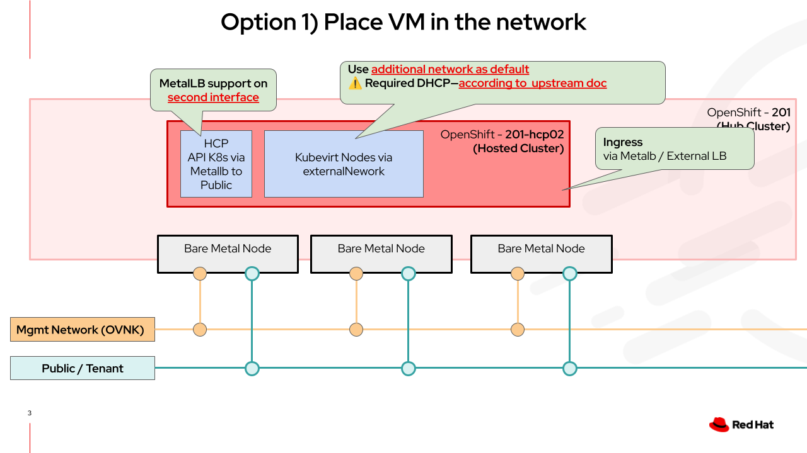

# Hosted Control Plane - KubeVirt Networking

Tested with:

|Component|Version|
|---|---|
|OpenShift|v4.18|
|OpenShift Virt|v4.18|



## Test cluster information

### Nodes

|NAME|STATUS|ROLES|Second interface|
|---|---|---|---|
|ucs55 | Ready | control-plane,master,virt-node,worker|enp79s0f1|
|ucs56 | Ready | control-plane,master,virt-node,worker|enp80s0f1|
|ucs57 | Ready | control-plane,master,virt-node,worker|enp80s0f1|

## Cluster network configuration

```shell
oc edit network.operator
```

Change/Add settings:

```yaml
spec:
  defaultNetwork:
    ovnKubernetesConfig:
      gatewayConfig:
        ipForwarding: Global
        routingViaHost: true
```

## Prepare node interface


??? example "NodeNetworkConfigurationPolicy/coe-bridge-via-enp79s0f1"

    ```yaml
    --8<-- "content/cluster-installation/hosted-control-plane/kubevirt-networking/coe-bridge-via-enp79s0f1.yaml"
    ```

??? example "NodeNetworkConfigurationPolicy/coe-bridge-via-enp80s0f1"

    ```yaml
    --8<-- "content/cluster-installation/hosted-control-plane/kubevirt-networking/coe-bridge-via-enp80s0f1.yaml"
    ```

??? example "NetworkAttachmentDefinition/br-vlan-2003"

    ```yaml
    --8<-- "content/cluster-installation/hosted-control-plane/kubevirt-networking/br-vlan-2003.yaml"
    ```

## MetalLB

* [Documetation, second interface](https://docs.redhat.com/en/documentation/openshift_container_platform/4.19/html-single/ingress_and_load_balancing/index#nw-metallb-configure-with-L2-advertisement-label_about-advertising-ip-address-pool)

??? example "IPAddressPool"

    ```yaml
    --8<-- "content/cluster-installation/hosted-control-plane/kubevirt-networking/IPAddressPool.yaml"
    ```

    * Optional add label selector to use the pool only hypershift/hcp

??? example "L2Advertisement"

    ```yaml
    --8<-- "content/cluster-installation/hosted-control-plane/kubevirt-networking/L2Advertisement.yaml"
    ```

    * Optional use a nodeSelector to run on specific nodes
    * Optional add specific interface

## Start hosted cluster

```shell
export PULL_SECRET=${HOME}/redhat-pullsecret-rh-ee-rbohne.json
export KUBEVIRT_CLUSTER_NAME=hcp-2003-2
export TRUSTED_BUNDLE=${HOME}/Devel/gitlab.consulting.redhat.com/coe-lab/certificates/ca-bundle-v2.pem

hcp create cluster kubevirt \
  --name $KUBEVIRT_CLUSTER_NAME \
  --namespace clusters \
  --node-pool-replicas=2 \
  --memory '16Gi' \
  --cores '8' \
  --generate-ssh \
  --root-volume-size 120 \
  --root-volume-storage-class 'ocs-storagecluster-ceph-rbd-virtualization' \
  --pull-secret $PULL_SECRET \
  --etcd-storage-class ocs-storagecluster-ceph-rbd \
  --control-plane-availability-policy HighlyAvailable \
  --additional-trust-bundle $TRUSTED_BUNDLE \
  --release-image=quay.io/openshift-release-dev/ocp-release:4.18.13-x86_64 \
  --attach-default-network=false \
  --additional-network name:default/br-vlan-2003 \
  --external-dns-domain coe.muc.redhat.com
```

??? example "Render yaml"

    ```yaml
    --8<-- "content/cluster-installation/hosted-control-plane/kubevirt-networking/hcp-rendert.yaml"
    ```

## Configure Metallb for Ingress on hosted cluster

Follow: [Optional MetalLB Configuration Steps](https://hypershift.pages.dev/how-to/kubevirt/ingress-and-dns/#optional-metallb-configuration-steps)

??? example "Adjusted IPAddressPool"

    ```yaml
    apiVersion: metallb.io/v1beta1
    kind: IPAddressPool
    metadata:
      name: metallb
      namespace: metallb-system
    spec:
      addresses:
      - 192.168.203.31-192.168.203.35
    ```

### Ingress Service

with RFE [Enable preallocation of a predictable NodePort for Ingress](https://issues.redhat.com/browse/RFE-6869) it would be much easier.

??? example "Service/router-loadbalancer-default"

    ```yaml
    apiVersion: v1
    kind: Service
    metadata:
      labels:
        app: router
        ingresscontroller.operator.openshift.io/owning-ingresscontroller: default
        router: router-loadbalancer-default
      name: router-loadbalancer-default
      namespace: openshift-ingress
    spec:
      ports:
      - name: http
        port: 80
        protocol: TCP
        targetPort: http
      - name: https
        port: 443
        protocol: TCP
        targetPort: https
      selector:
        ingresscontroller.operator.openshift.io/deployment-ingresscontroller: default
      sessionAffinity: None
      type: LoadBalancer
    ```

### DNS

Fetch information from hosted cluster:

```shell
[cloud-user@router ~]$ oc get svc -n openshift-ingress router-loadbalancer-default
NAME                          TYPE           CLUSTER-IP       EXTERNAL-IP      PORT(S)                      AGE
router-loadbalancer-default   LoadBalancer   172.31.241.155   192.168.203.31   80:31572/TCP,443:30706/TCP   2m22s
[cloud-user@router ~]$

[cloud-user@router ~]$ oc get ingresscontroller -n openshift-ingress-operator default -o jsonpath="{.spec.domain}";echo
apps.hcp1.apps.rhine.coe.muc.redhat.com
[cloud-user@router ~]$
```

Create an `A` record based on the information:

```bind
*.apps.hcp1.apps.rhine.coe.muc.redhat.com. IN A 192.168.203.31
```
