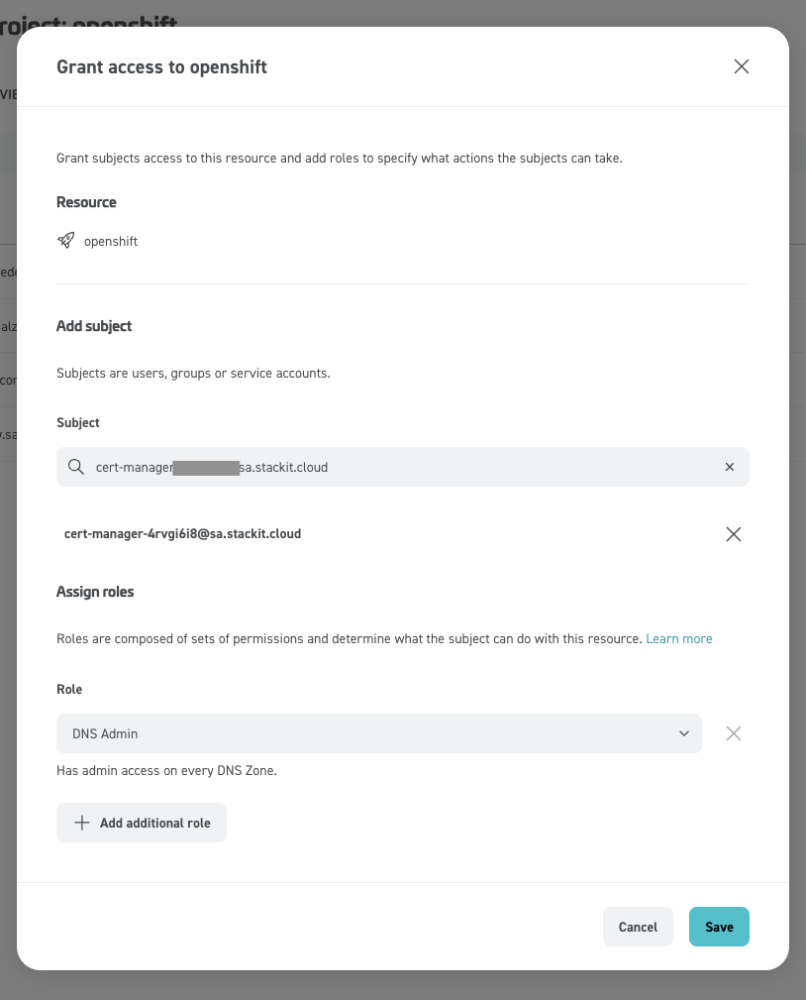

# OpenShift on STACKIT (UPI)

???+ note "POC / lab topology"

    Single failure domain, no STACKIT AZ spread, hand-built LBs and DNS. Suitable for proving the path, not as a production reference architecture.

Platform-agnostic / user-provisioned install: [Installing a cluster on any platform](https://docs.redhat.com/en/documentation/openshift_container_platform/4.21/html/installing_on_any_platform/installing-platform-agnostic) (`platform: none`).

## Outline

* RHCOS qcow2 in STACKIT as boot image
* DNS zone + records (`api`, `api-int`, `*.apps`)
* Two LBs: internal (6443, 22623) and external (6443, 80/443)
* `openshift-install create ignition-configs` locally; per-node Butane → Ignition in `user-data`
* Bootstrap Ignition in object storage (too large for metadata `user-data` alone — fetch URL from small stub config)
* VMs up → bootstrap completes → remove bootstrap VM + object → approve CSRs if needed → `install-complete`

## Admin host tooling

* `jq`, `s3cmd`, Butane, `openshift-install` / `oc` (matching cluster version, e.g. 4.21.x)
* [STACKIT CLI](https://github.com/stackitcloud/stackit-cli/): `stackit auth login`, `stackit config set --project-id …`

### RHCOS image

```shell
URL=$(./openshift-install coreos print-stream-json | jq -r '.architectures.x86_64.artifacts.openstack.formats["qcow2.gz"].disk.location')
curl -L -O "$URL"
gzip -d "$(basename "$URL")"
```

Upload qcow2 (adjust name to match your stream build):

```shell
stackit image create \
  --name rhcos-9.6.20251212.x86_64 \
  --disk-format=qcow2 \
  --local-file-path=rhcos-9.6.20251212-1-openstack.x86_64.qcow2 \
  --labels os=linux,distro=rhel,version=9.6
```

### SSH key for `core`

```shell
ssh-keygen -t ed25519 -C "ocp-on-stackit" -f ~/.ssh/ocp-on-stackit -N ""
```

Public key goes into `install-config.yaml`; private key for `ssh core@…` during bring-up.

## STACKIT project baseline

### DNS zone

Primary zone for the install base domain (portal example: ). CLI list:

```shell
stackit dns zone list

 ID                                   │ NAME      │ STATE            │ TYPE    │ DNS NAME                       │ RECORD COUNT
──────────────────────────────────────┼───────────┼──────────────────┼─────────┼────────────────────────────────┼──────────────
 <ZONE ID>                            │ openshift │ CREATE_SUCCEEDED │ primary │ openshift.runs.onstackit.cloud │ 0
```

### Private network

```shell
stackit network create --name openshift --ipv4-prefix "10.0.0.0/24"
# note Network ID for server and LB args
```

### Optional: helper / jump VM

For metadata checks, pulling artifacts, or debugging from inside the VPC. Butane source:

=== "Download: ign-helper.rcc"

    ```
    curl -L -O {{ page.canonical_url }}ign-helper.rcc
    ```

=== "ign-helper.rcc"

    ```yaml
    --8<-- "content/cluster-installation/stackit/ign-helper.rcc"
    ```

```shell
stackit server create \
  --machine-type g1a.1d \
  --name helper \
  --boot-volume-source-type image \
  --boot-volume-source-id <RHCOS_IMAGE_ID> \
  --boot-volume-delete-on-termination \
  --boot-volume-size 120 \
  --network-id <NETWORK_ID> \
  --user-data @<(butane -d ~ -r ign-helper.rcc)
# Note server id

% stackit public-ip create
# Note public ip and ID

% stackit server public-ip attach \
  <PUBLIC-IP ID> \
  --server-id <SERVER ID>
% stackit security-group create --name allow-ssh
# Note security-group id

% stackit security-group rule create \
  --security-group-id <SECURITY-GROUP ID> \
  --direction ingress \
  --protocol-name tcp \
  --port-range-min 22 \
  --port-range-max 22

% stackit server security-group attach \
  --server-id <SERVER ID> \
  --security-group-id <SECURITY-GROUP ID>

% ssh -l core -i ~/.ssh/ocp-on-stackit <PUBLIC IP>
...
[core@helper ~]$ curl -s -q http://169.254.169.254/openstack/2012-08-10/meta_data.json | jq
{
  "uuid": "6f3fcf4f-c813-4cd6-b55d-b6fe309996f3",
  "hostname": "helper",
  "name": "helper",
  "launch_index": 0,
  "availability_zone": "eu01-m"
}
```

### Object store

### Object storage (bootstrap Ignition)

```shell
stackit object-storage enable
stackit object-storage bucket create ignition
```

`stackit object-storage credentials create` has been observed to panic in some CLI versions — create S3-compatible keys in the portal if needed.

???+ warning "Bootstrap object visibility"

    A wide-open bucket policy makes `bootstrap.ign` (cluster secrets) world-readable. Tighten to source IPs or VPC egress only; remove or restrict policy after bootstrap.

=== "Download: s3-policy-all-public.json"

    ```
    curl -L -O {{ page.canonical_url }}s3-policy-all-public.json
    ```

=== "s3-policy-all-public.json"

    ```json
    --8<-- "content/cluster-installation/stackit/s3-policy-all-public.json"
    ```

```shell
s3cmd --configure   # endpoint + keys from STACKIT object storage
s3cmd setpolicy s3-policy-all-public.json s3://ignition
```

Clear policy when done: `s3cmd delpolicy s3://ignition`

## Ignition and install config

=== "Download: install-config.yaml"

    ```
    curl -L -O {{ page.canonical_url }}install-config.yaml
    ```

=== "install-config.yaml"

    ```yaml
    --8<-- "content/cluster-installation/stackit/install-config.yaml"
    ```

???+ note "Adjust `install-config.yaml`"

    Edit `pullSecret`, `sshKey`, and optionally `metadata.name` / `baseDomain` / machine replicas, then:

```shell
mkdir -p conf
cp install-config.yaml conf/
./openshift-install create ignition-configs --dir conf
```

Preserves `conf/install-config.yaml` (do not commit); emits `bootstrap.ign`, master/worker stubs, and `auth/`.

Upload bootstrap payload (the merge `source` in `ign-bootstrap.rcc` must match this object’s reachable HTTPS URL):

```shell
s3cmd put conf/bootstrap.ign s3://ignition/
```

Per-node Butane in this repo: bootstrap merges the object-store URL of `bootstrap.ign`; control plane nodes merge `conf/master.ign`, workers merge `conf/worker.ign` (paths relative to `butane -d .`).

Download node configs (or maintain alongside repo):

=== "Download"

    ```shell
    for node in bootstrap control-plane-0 control-plane-1 control-plane-2 worker-0 worker-1 worker-2; do
      curl -L -O {{ page.canonical_url }}ign-${node}.rcc
    done
    ```

=== "ign-bootstrap.rcc"

    ```json
    --8<-- "content/cluster-installation/stackit/ign-bootstrap.rcc"
    ```

=== "ign-control-plane-0.rcc"

    ```json
    --8<-- "content/cluster-installation/stackit/ign-control-plane-0.rcc"
    ```

=== "ign-control-plane-1.rcc"

    ```json
    --8<-- "content/cluster-installation/stackit/ign-control-plane-1.rcc"
    ```

=== "ign-control-plane-2.rcc"

    ```json
    --8<-- "content/cluster-installation/stackit/ign-control-plane-2.rcc"
    ```

=== "ign-worker-0.rcc"

    ```json
    --8<-- "content/cluster-installation/stackit/ign-worker-0.rcc"
    ```

=== "ign-worker-1.rcc"

    ```json
    --8<-- "content/cluster-installation/stackit/ign-worker-1.rcc"
    ```

=== "ign-worker-2.rcc"

    ```json
    --8<-- "content/cluster-installation/stackit/ign-worker-2.rcc"
    ```

### Create servers

Use your RHCOS image ID and network ID; `c2a.8d` (or larger) is an example flavor.

```shell
for node in bootstrap control-plane-0 control-plane-1 control-plane-2 worker-0 worker-1 worker-2; do
  stackit server create \
    --assume-yes --async \
    --machine-type c2a.8d \
    --name "cluster-a-${node}" \
    --boot-volume-source-type image \
    --boot-volume-source-id <RHCOS_IMAGE_ID> \
    --boot-volume-delete-on-termination \
    --boot-volume-size 120 \
    --network-id <NETWORK_ID> \
    --user-data @<(butane -d . -r "ign-${node}.rcc")
done
```

`stackit server list` until nodes have addresses; map them into LB target pools and DNS as below.

## Load balancers and DNS

### Internal LB — `api-int` (6443, 22623)

=== "Download: stackit-lb-int.json"

    ```
    curl -L -O {{ page.canonical_url }}stackit-lb-int.json
    ```

=== "stackit-lb-int.json"

    ```json
    --8<-- "content/cluster-installation/stackit/stackit-lb-int.json"
    ```

???+ note "Adjust `stackit-lb-int.json`"

    Fill target pools with **control plane** node IPs (API + MCS). Create LB:

```shell
stackit load-balancer create --payload @stackit-lb-int.json
```

Private VIP may not appear in `stackit load-balancer list` — take listener / pool IP from API or portal when wiring DNS.

`api-int.<cluster_name>` A record → internal LB VIP (example):

```shell
stackit dns record-set create \
  --zone-id <ZONE_ID> \
  --name api-int.cluster-a \
  --record 10.0.0.195 \
  --ttl 60
```

### External LB — `api` and `*.apps` (6443, 80, 443)

Reserve a public IP for the external LB; point both `api.<name>.<baseDomain>` and `*.apps.<name>.<baseDomain>` at it (wildcard apps record).

```shell
stackit public-ip create
# attach to external LB / listener as required by STACKIT networking model
stackit dns record-set create --zone-id <ZONE_ID> --name api.cluster-a --record <PUBLIC_IP> --ttl 60
stackit dns record-set create --zone-id <ZONE_ID> --name '*.apps.cluster-a' --record <PUBLIC_IP> --ttl 60
```

=== "Download: stackit-lb-ext.json"

    ```
    curl -L -O {{ page.canonical_url }}stackit-lb-ext.json
    ```

=== "stackit-lb-ext.json"

    ```json
    --8<-- "content/cluster-installation/stackit/stackit-lb-ext.json"
    ```

???+ note "Adjust `stackit-lb-ext.json`"

    Adjust listeners and backends (API → masters; 80/443 → workers or ingress nodes), then:

```shell
stackit load-balancer create --payload @stackit-lb-ext.json
```

## Bootstrap teardown and finish

```shell
./openshift-install wait-for bootstrap-complete --dir conf
```

```shell
s3cmd delete s3://ignition/bootstrap.ign
stackit server delete <bootstrap-server-id>
```

CSRs (if `Pending` — common when kubelet/API timing is tight):

```shell
export KUBECONFIG="$PWD/conf/auth/kubeconfig"
oc get csr | awk '/Pending/{print $1}' | xargs oc adm certificate approve
```

Re-run until nothing pending; `machine-approver` normally takes over post-bootstrap.

```shell
./openshift-install wait-for install-complete --dir conf
```

Console URL and `kubeadmin` password are printed on success.

## Day-2: default Ingress TLS

### Let’s Encrypt via cert-manager (DNS-01 / STACKIT)

Install **cert-manager Operator for Red Hat OpenShift** from OperatorHub (align minor with cluster; ships CRDs + controller).

**Webhook identity** — the [STACKIT cert-manager webhook](https://github.com/stackitcloud/stackit-cert-manager-webhook) needs API credentials for DNS in the project that **owns** the public zone for `*.apps` (typically the same project as the cluster).

```shell
stackit service-account create --name cert-manager
# Export the service-account key JSON from the portal; keep it off shell history and out of docs.
```

Grant that principal **DNS admin** (or equivalent) on the zone:



Secret name below should match Helm `values` / webhook config for the STACKIT SA file:

```shell
oc create secret generic stackit-sa-authentication \
  -n cert-manager \
  --from-file=sa.json=./stackit-cert-manager-sa.json
```

**Webhook** (Helm):

```shell
helm repo add stackit-cert-manager-webhook https://stackitcloud.github.io/stackit-cert-manager-webhook
helm repo update
helm install stackit-cert-manager-webhook stackit-cert-manager-webhook/stackit-cert-manager-webhook \
  --namespace cert-manager \
  --create-namespace

oc -n cert-manager adm policy add-scc-to-user nonroot-v2 -z stackit-cert-manager-webhook
```

If the chart exposes secret name / key path values, point them at `stackit-sa-authentication` / `sa.json`.

**ClusterIssuer** (production ACME; use Let’s Encrypt **staging** while debugging):

```yaml
apiVersion: cert-manager.io/v1
kind: ClusterIssuer
metadata:
  name: letsencrypt-prod
spec:
  acme:
    server: https://acme-v02.api.letsencrypt.org/directory
    email: Repalce # Replace this with your email address
    privateKeySecretRef:
      name: letsencrypt-prod
    solvers:
      - dns01:
          webhook:
            solverName: stackit
            groupName: acme.stackit.de
            config:
              projectId: "<STACKIT_PROJECT_ID>"
```

**Wildcard `Certificate`** in `openshift-ingress` for the default router:

```yaml
apiVersion: cert-manager.io/v1
kind: Certificate
metadata:
  name: letsencrypt-wildcard
  namespace: openshift-ingress
spec:
  secretName: letsencrypt-wildcard
  issuerRef:
    group: cert-manager.io
    name: letsencrypt-prod
    kind: ClusterIssuer
  commonName: '*.apps.cluster-a.openshift.runs.onstackit.cloud' # project must be the owner of this zone
  duration: 8760h0m0s
  dnsNames:
    - '*.apps.cluster-a.openshift.runs.onstackit.cloud'
```

Match `dnsNames` / `commonName` to your apps subdomain. The `projectId` in the issuer must be allowed to publish `_acme-challenge` for that zone.

**Observe issuance** (DNS-01 can take several minutes):

```shell
oc -n openshift-ingress get certificate,order,challenge
oc -n openshift-ingress describe certificate letsencrypt-wildcard
```

**Default `IngressController`** → issued secret:

```shell
oc patch ingresscontroller/default -n openshift-ingress-operator --type=merge \
  --patch '{"spec":{"defaultCertificate":{"name":"letsencrypt-wildcard"}}}'
```

Until the secret is populated, the router keeps serving the installer default; after issuance, HAProxy reload picks up the Let’s Encrypt chain.

## Day-2: Add GPU Node

=== "Download"

    ```shell
    curl -L -O {{ page.canonical_url }}ign-gpu-worker-0.rcc
    ```

=== "ign-gpu-worker-0.rcc"

    ```json
    --8<-- "content/cluster-installation/stackit/ign-gpu-worker-0.rcc"
    ```

```shell
  stackit server create \
    --assume-yes \
    --availability-zone eu01-1 \
    --machine-type n2.14d.g1 \
    --name "cluster-a-gpu-worker-0" \
    --boot-volume-source-type image \
    --boot-volume-source-id 6055861d-6641-4a45-b00e-fcfb250d65e6 \
    --boot-volume-delete-on-termination \
    --boot-volume-size 120 \
    --network-id 459afb3e-54fa-45d4-a972-ae39ec370761 \
    --user-data @<(butane -d . -r "ign-gpu-worker-0.rcc")
```

Wait and approve CSR

```shell
export KUBECONFIG="$PWD/conf/auth/kubeconfig"
oc get csr | awk '/Pending/{print $1}' | xargs oc adm certificate approve
```

Install Nvidia GPU Operator: [NVIDIA GPU Operator on Red Hat OpenShift Container Platform](https://docs.nvidia.com/datacenter/cloud-native/openshift/latest/index.html)

```shell
oc create -f - <<EOF
apiVersion: v1
kind: Pod
metadata:
  name: nvidia-smi
spec:
  containers:
  - image: registry.redhat.io/rhai/base-image-cuda-13.0-rhel9:3.3.1-1775076057
    name: nvidia-smi
    command: [ nvidia-smi ]
    resources:
      limits:
        nvidia.com/gpu: 1
      requests:
        nvidia.com/gpu: 1
EOF

$ oc logs nvidia-smi
Tue May  5 13:27:54 2026
+-----------------------------------------------------------------------------------------+
| NVIDIA-SMI 580.126.20             Driver Version: 580.126.20     CUDA Version: 13.0     |
+-----------------------------------------+------------------------+----------------------+
| GPU  Name                 Persistence-M | Bus-Id          Disp.A | Volatile Uncorr. ECC |
| Fan  Temp   Perf          Pwr:Usage/Cap |           Memory-Usage | GPU-Util  Compute M. |
|                                         |                        |               MIG M. |
|=========================================+========================+======================|
|   0  NVIDIA L40S                    On  |   00000000:05:00.0 Off |                    0 |
| N/A   29C    P8             36W /  350W |       0MiB /  46068MiB |      0%      Default |
|                                         |                        |                  N/A |
+-----------------------------------------+------------------------+----------------------+

+-----------------------------------------------------------------------------------------+
| Processes:                                                                              |
|  GPU   GI   CI              PID   Type   Process name                        GPU Memory |
|        ID   ID                                                               Usage      |
|=========================================================================================|
|  No running processes found                                                             |
+-----------------------------------------------------------------------------------------+
```

## Day-2: Deploy Cloud Controller Manager (CCM)

[Upstream documentation](https://github.com/stackitcloud/cloud-provider-stackit/blob/main/docs/deployment.md)

* Create an Service Account at STACKIT called `ccm-and-csi`
* Create Service account keys and download the json file
* Assign editor role for the entire project.

Deployment steps:

```shell
oc create secret generic -n kube-system stackit-cloud-secret --from-file=sa_key.json=<service account json>
```

=== "Download"

    ```shell
    curl -L -O {{ page.canonical_url }}cloud.yaml
    ```

=== "cloud.yaml"

    ```json
    --8<-- "content/cluster-installation/stackit/cloud.yaml"
    ```

Adjust cloud.yaml and put into configmap:

```shell
oc create configmap -n kube-system stackit-cloud-config --from-file=cloud.yaml
```

Deploy cloud controller manager:

```shell
oc apply -f https://raw.githubusercontent.com/stackitcloud/cloud-provider-stackit/refs/heads/main/deploy/cloud-controller-manager/rbac.yaml
oc apply -f https://github.com/stackitcloud/cloud-provider-stackit/raw/refs/heads/main/deploy/cloud-controller-manager/service.yaml
```

=== "Apply"

    ```shell
    oc apply -f{{ page.canonical_url }}ccm-and-csi-deployment.yaml
    ```

=== "ccm-and-csi-deployment.yaml"

    ```json
    --8<-- "content/cluster-installation/stackit/ccm-and-csi-deployment.yaml"
    ```

???+ failure

    ```
    starting Controller
    I0507 12:55:45.723462 1 serving.go:411] Generated self-signed cert in-memory
    W0507 12:55:45.723531 1 client_config.go:683] Neither --kubeconfig nor --master was specified. Using the inClusterConfig. This might not work.
    panic: runtime error: invalid memory address or nil pointer dereference
    [signal SIGSEGV: segmentation violation code=0x1 addr=0x18 pc=0x4fe685]
    ```

    **No further investigation, because it looks CSI works without CCM**

## Day-2: Container Storage Interface (CSI) Driver

[Upstream documentation](https://github.com/stackitcloud/cloud-provider-stackit/blob/main/docs/csi-driver.md)

* Create an Service Account at STACKIT called `ccm-and-csi` (already done in `[Day-2: Deploy Cloud Controller Manager (CCM)` )
* Create Service account keys and download the json file (already done in `[Day-2: Deploy Cloud Controller Manager (CCM)` )
* Assign editor role for the entire project. (already done in `[Day-2: Deploy Cloud Controller Manager (CCM)` )

Let's deploy the csi-driver into namespace/project `stackit-csi-driver`

```shell
oc new-project stackit-csi-driver
```

```shell
oc create secret generic -n kube-system stackit-cloud-secret --from-file=sa_key.json=<service account json>
```

=== "Download"

    ```shell
    curl -L -O {{ page.canonical_url }}cloud.yaml
    ```

=== "cloud.yaml"

    ```json
    --8<-- "content/cluster-installation/stackit/cloud.yaml"
    ```

Adjust cloud.yaml and put into configmap:

```shell
oc create configmap stackit-cloud-config --from-file=cloud.yaml
```

Allow the CSI node componentes to run privileged, looks like it only need hostpath and hostnetwork. It's recommended to pick and/or create a more precise security context constraint.

```shell
oc adm policy add-scc-to-user privileged -z csi-stackit-node-sa
```

Download and apply `kustomization.yaml` to deploy csi driver into specific namespace and propper image url

=== "Download"

    ```shell
    curl -L -O {{ page.canonical_url }}kustomization.yaml
    ```

=== "kustomization.yaml"

    ```json
    --8<-- "content/cluster-installation/stackit/kustomization.yaml"
    ```

```shell
oc apply -k .
```

### Let's try to storage

```shell
oc new-project storage-test
```

=== "Apply"

    ```shell
    oc apply -f {{ page.canonical_url }}lets-try-storage.yaml
    ```

=== "lets-try-storage.yaml"

    ```json
    --8<-- "content/cluster-installation/stackit/lets-try-storage.yaml"
    ```
