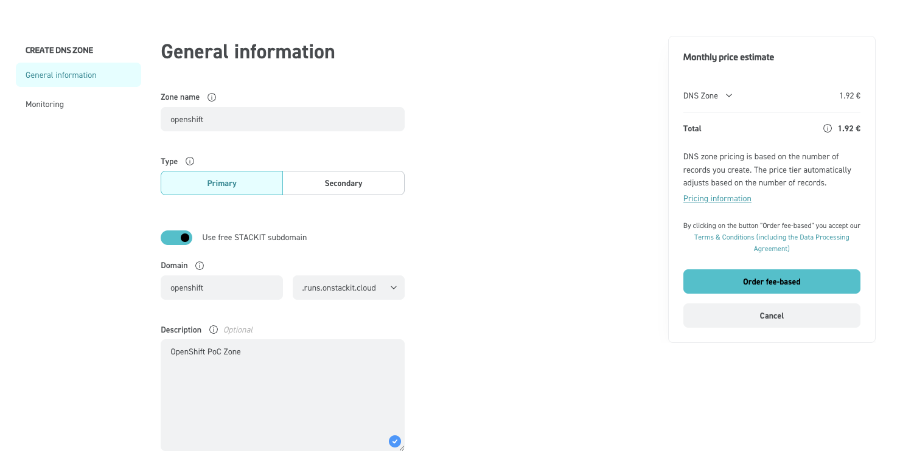

# OpenShift on STACKIT (UPI)

???+ note "POC / lab topology"

    Single failure domain, no STACKIT AZ spread, hand-built LBs and DNS. Suitable for proving the path, not as a production reference architecture.

Platform-agnostic / user-provisioned install: [Installing a cluster on any platform](https://docs.redhat.com/en/documentation/openshift_container_platform/4.21/html/installing_on_any_platform/installing-platform-agnostic) (`platform: none`).

## Outline

* RHCOS qcow2 in STACKIT as boot image
* DNS zone + records (`api`, `api-int`, `*.apps`)
* Two LBs: internal (6443, 22623) and external (6443, 80/443)
* `openshift-install create ignition-configs` locally; per-node Butane → Ignition in `user-data`
* Bootstrap Ignition in object storage (too large for metadata `user-data` alone — fetch URL from small stub config)
* VMs up → bootstrap completes → remove bootstrap VM + object → approve CSRs if needed → `install-complete`

## Admin host tooling

* `jq`, `s3cmd`, Butane, `openshift-install` / `oc` (matching cluster version, e.g. 4.21.x)
* [STACKIT CLI](https://github.com/stackitcloud/stackit-cli/): `stackit auth login`, `stackit config set --project-id …`

### RHCOS image

```shell
URL=$(./openshift-install coreos print-stream-json | jq -r '.architectures.x86_64.artifacts.openstack.formats["qcow2.gz"].disk.location')
curl -L -O "$URL"
gzip -d "$(basename "$URL")"
```

Upload qcow2 (adjust name to match your stream build):

```shell
stackit image create \
  --name rhcos-9.6.20251212.x86_64 \
  --disk-format=qcow2 \
  --local-file-path=rhcos-9.6.20251212-1-openstack.x86_64.qcow2 \
  --labels os=linux,distro=rhel,version=9.6
```

### SSH key for `core`

```shell
ssh-keygen -t ed25519 -C "ocp-on-stackit" -f ~/.ssh/ocp-on-stackit -N ""
```

Public key goes into `install-config.yaml`; private key for `ssh core@…` during bring-up.

## STACKIT project baseline

### DNS zone

Primary zone for the install base domain (portal example: ). CLI list:

```shell
stackit dns zone list

 ID                                   │ NAME      │ STATE            │ TYPE    │ DNS NAME                       │ RECORD COUNT
──────────────────────────────────────┼───────────┼──────────────────┼─────────┼────────────────────────────────┼──────────────
 <ZONE ID>                            │ openshift │ CREATE_SUCCEEDED │ primary │ openshift.runs.onstackit.cloud │ 0
```

### Private network

```shell
stackit network create --name openshift --ipv4-prefix "10.0.0.0/24"
# note Network ID for server and LB args
```

### Optional: helper / jump VM

For metadata checks, pulling artifacts, or debugging from inside the VPC. Butane source:

=== "Download: ign-helper.rcc"

    ```
    curl -L -O {{ page.canonical_url }}ign-helper.rcc
    ```

=== "ign-helper.rcc"

    ```yaml
    --8<-- "content/cluster-installation/stackit/ign-helper.rcc"
    ```

```shell
stackit server create \
  --machine-type g1a.1d \
  --name helper \
  --boot-volume-source-type image \
  --boot-volume-source-id <RHCOS_IMAGE_ID> \
  --boot-volume-delete-on-termination \
  --boot-volume-size 120 \
  --network-id <NETWORK_ID> \
  --user-data @<(butane -d ~ -r ign-helper.rcc)
# Note server id

% stackit public-ip create
# Note public ip and ID

% stackit server public-ip attach \
  <PUBLIC-IP ID> \
  --server-id <SERVER ID>
% stackit security-group create --name allow-ssh
# Note security-group id

% stackit security-group rule create \
  --security-group-id <SECURITY-GROUP ID> \
  --direction ingress \
  --protocol-name tcp \
  --port-range-min 22 \
  --port-range-max 22

% stackit server security-group attach \
  --server-id <SERVER ID> \
  --security-group-id <SECURITY-GROUP ID>

% ssh -l core -i ~/.ssh/ocp-on-stackit <PUBLIC IP>
...
[core@helper ~]$ curl -s -q http://169.254.169.254/openstack/2012-08-10/meta_data.json | jq
{
  "uuid": "6f3fcf4f-c813-4cd6-b55d-b6fe309996f3",
  "hostname": "helper",
  "name": "helper",
  "launch_index": 0,
  "availability_zone": "eu01-m"
}
```

### Object store

### Object storage (bootstrap Ignition)

```shell
stackit object-storage enable
stackit object-storage bucket create ignition
```

`stackit object-storage credentials create` has been observed to panic in some CLI versions — create S3-compatible keys in the portal if needed.

???+ warning "Bootstrap object visibility"

    A wide-open bucket policy makes `bootstrap.ign` (cluster secrets) world-readable. Tighten to source IPs or VPC egress only; remove or restrict policy after bootstrap.

=== "Download: s3-policy-all-public.json"

    ```
    curl -L -O {{ page.canonical_url }}s3-policy-all-public.json
    ```

=== "s3-policy-all-public.json"

    ```json
    --8<-- "content/cluster-installation/stackit/s3-policy-all-public.json"
    ```

```shell
s3cmd --configure   # endpoint + keys from STACKIT object storage
s3cmd setpolicy s3-policy-all-public.json s3://ignition
```

Clear policy when done: `s3cmd delpolicy s3://ignition`

## Ignition and install config

=== "Download: install-config.yaml"

    ```
    curl -L -O {{ page.canonical_url }}install-config.yaml
    ```

=== "install-config.yaml"

    ```yaml
    --8<-- "content/cluster-installation/stackit/install-config.yaml"
    ```

???+ note "Adjust `install-config.yaml`"

    Edit `pullSecret`, `sshKey`, and optionally `metadata.name` / `baseDomain` / machine replicas, then:

```shell
mkdir -p conf
cp install-config.yaml conf/
./openshift-install create ignition-configs --dir conf
```

Preserves `conf/install-config.yaml` (do not commit); emits `bootstrap.ign`, master/worker stubs, and `auth/`.

Upload bootstrap payload (the merge `source` in `ign-bootstrap.rcc` must match this object’s reachable HTTPS URL):

```shell
s3cmd put conf/bootstrap.ign s3://ignition/
```

Per-node Butane in this repo: bootstrap merges the object-store URL of `bootstrap.ign`; control plane nodes merge `conf/master.ign`, workers merge `conf/worker.ign` (paths relative to `butane -d .`).

Download node configs (or maintain alongside repo):

=== "Download"

    ```shell
    for node in bootstrap control-plane-0 control-plane-1 control-plane-2 worker-0 worker-1 worker-2; do
      curl -L -O {{ page.canonical_url }}ign-${node}.rcc
    done
    ```

=== "ign-bootstrap.rcc"

    ```json
    --8<-- "content/cluster-installation/stackit/ign-bootstrap.rcc"
    ```

=== "ign-control-plane-0.rcc"

    ```json
    --8<-- "content/cluster-installation/stackit/ign-control-plane-0.rcc"
    ```

=== "ign-control-plane-1.rcc"

    ```json
    --8<-- "content/cluster-installation/stackit/ign-control-plane-1.rcc"
    ```

=== "ign-control-plane-2.rcc"

    ```json
    --8<-- "content/cluster-installation/stackit/ign-control-plane-2.rcc"
    ```

=== "ign-worker-0.rcc"

    ```json
    --8<-- "content/cluster-installation/stackit/ign-worker-0.rcc"
    ```

=== "ign-worker-1.rcc"

    ```json
    --8<-- "content/cluster-installation/stackit/ign-worker-1.rcc"
    ```

=== "ign-worker-2.rcc"

    ```json
    --8<-- "content/cluster-installation/stackit/ign-worker-2.rcc"
    ```

### Create servers

Use your RHCOS image ID and network ID; `c2a.8d` (or larger) is an example flavor.

```shell
for node in bootstrap control-plane-0 control-plane-1 control-plane-2 worker-0 worker-1 worker-2; do
  stackit server create \
    --assume-yes --async \
    --machine-type c2a.8d \
    --name "cluster-a-${node}" \
    --boot-volume-source-type image \
    --boot-volume-source-id <RHCOS_IMAGE_ID> \
    --boot-volume-delete-on-termination \
    --boot-volume-size 120 \
    --network-id <NETWORK_ID> \
    --user-data @<(butane -d . -r "ign-${node}.rcc")
done
```

`stackit server list` until nodes have addresses; map them into LB target pools and DNS as below.

## Load balancers and DNS

### Internal LB — `api-int` (6443, 22623)

=== "Download: stackit-lb-int.json"

    ```
    curl -L -O {{ page.canonical_url }}stackit-lb-int.json
    ```

=== "stackit-lb-int.json"

    ```json
    --8<-- "content/cluster-installation/stackit/stackit-lb-int.json"
    ```

???+ note "Adjust `stackit-lb-int.json`"

    Fill target pools with **control plane** node IPs (API + MCS). Create LB:

```shell
stackit load-balancer create --payload @stackit-lb-int.json
```

Private VIP may not appear in `stackit load-balancer list` — take listener / pool IP from API or portal when wiring DNS.

`api-int.<cluster_name>` A record → internal LB VIP (example):

```shell
stackit dns record-set create \
  --zone-id <ZONE_ID> \
  --name api-int.cluster-a \
  --record 10.0.0.195 \
  --ttl 60
```

### External LB — `api` and `*.apps` (6443, 80, 443)

Reserve a public IP for the external LB; point both `api.<name>.<baseDomain>` and `*.apps.<name>.<baseDomain>` at it (wildcard apps record).

```shell
stackit public-ip create
# attach to external LB / listener as required by STACKIT networking model
stackit dns record-set create --zone-id <ZONE_ID> --name api.cluster-a --record <PUBLIC_IP> --ttl 60
stackit dns record-set create --zone-id <ZONE_ID> --name '*.apps.cluster-a' --record <PUBLIC_IP> --ttl 60
```

=== "Download: stackit-lb-ext.json"

    ```
    curl -L -O {{ page.canonical_url }}stackit-lb-ext.json
    ```

=== "stackit-lb-ext.json"

    ```json
    --8<-- "content/cluster-installation/stackit/stackit-lb-ext.json"
    ```

???+ note "Adjust `stackit-lb-ext.json`"

    Adjust listeners and backends (API → masters; 80/443 → workers or ingress nodes), then:

```shell
stackit load-balancer create --payload @stackit-lb-ext.json
```

## Bootstrap teardown and finish

```shell
./openshift-install wait-for bootstrap-complete --dir conf
```

```shell
s3cmd delete s3://ignition/bootstrap.ign
stackit server delete <bootstrap-server-id>
```

CSRs (if `Pending` — common when kubelet/API timing is tight):

```shell
export KUBECONFIG="$PWD/conf/auth/kubeconfig"
oc get csr | awk '/Pending/{print $1}' | xargs oc adm certificate approve
```

Re-run until nothing pending; `machine-approver` normally takes over post-bootstrap.

```shell
./openshift-install wait-for install-complete --dir conf
```

Console URL and `kubeadmin` password are printed on success.
