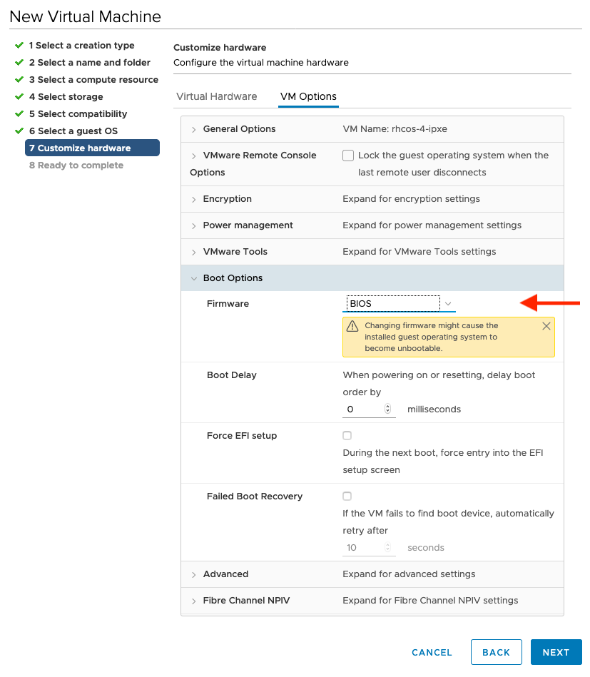

# Example installation at my VMware Lab

## Architecture


## Setup LB virtual machine

#### Install RHEL 8

#### Enable repos:

```bash
subscription-manager repos \
    --enable="rhel-8-for-x86_64-baseos-rpms" \
    --enable="rhel-8-for-x86_64-appstream-rpms"
```

#### Install tmux

```bash
yum install tmux -y
```

Start tmux session ;-)

#### Update

```bash
yum update -y
```

#### Install & Setup dnsmasq

```bash
yum install -y dnsmasq

cat > /etc/dnsmasq.d/openshift-4.conf <<EOF
strict-order
domain=rbohne.lab.example.com
expand-hosts
server=10.19.143.247
# except-interface=lo
# bind-dynamic
interface=ens224
address=/apps.rbohne.lab.example.com/192.168.100.148
addn-hosts=/etc/dnsmasq-openshift-4.addnhosts
EOF

cat > /etc/dnsmasq-openshift-4.addnhosts <<EOF
192.168.100.148 api.rbohne.lab.example.com api-int.rbohne.lab.example.com
192.168.100.149 master-0.rbohne.lab.example.com etcd-0.rbohne.lab.example.com
192.168.100.150 master-1.rbohne.lab.example.com etcd-1.rbohne.lab.example.com
192.168.100.151 master-2.rbohne.lab.example.com etcd-2.rbohne.lab.example.com
192.168.100.152 bootstrap.rbohne.lab.example.com
192.168.100.153 worker-1.rbohne.lab.example.com
192.168.100.154 worker-2.rbohne.lab.example.com
192.168.100.155 worker-3.rbohne.lab.example.com
EOF


systemctl enable --now dnsmasq
systemctl status dnsmasq

firewall-cmd --zone=public --permanent --add-service=dns
firewall-cmd --reload

```

Testing with:
```bash
dig wild.apps.apps.rbohne.lab.example.com @192.168.100.148
```

#### Install & setup load balancer

```bash
yum install -y podman

podman pull quay.io/redhat-emea-ssa-team/openshift-4-loadbalancer

cat > /etc/systemd/system/openshift-4-loadbalancer.service <<EOF
[Unit]
Description=OpenShift 4 LoadBalancer CLUSTER
After=network.target

[Service]
Type=simple
TimeoutStartSec=5m

ExecStartPre=-/usr/bin/podman rm "openshift-4-loadbalancer"
ExecStartPre=/usr/bin/podman pull quay.io/redhat-emea-ssa-team/openshift-4-loadbalancer
ExecStart=/usr/bin/podman run --name openshift-4-loadbalancer --net host \
  -e API=bootstrap=192.168.100.152:6443,master-0=192.168.100.149:6443,master-1=192.168.100.150:6443,master-2=192.168.100.151:6443 \
  -e API_LISTEN=192.168.100.148:6443 \
  -e INGRESS_HTTP=bootstrap=192.168.100.152:80,master-0=192.168.100.149:80,master-1=192.168.100.150:80,master-2=192.168.100.151:80,worker-1=192.168.100.153:80,worker-2=192.168.100.154:80,worker-3=192.168.100.155:80 \
  -e INGRESS_HTTP_LISTEN=192.168.100.148:80 \
  -e INGRESS_HTTPS=bootstrap=192.168.100.152:443,master-0=192.168.100.149:443,master-1=192.168.100.150:443,master-2=192.168.100.151:443,worker-1=192.168.100.153:443,worker-2=192.168.100.154:443,worker-3=192.168.100.155:443 \
  -e INGRESS_HTTPS_LISTEN=192.168.100.148:443 \
  -e MACHINE_CONFIG_SERVER=bootstrap=192.168.100.152:22623,master-0=192.168.100.149:22623,master-1=192.168.100.150:22623,master-2=192.168.100.151:22623 \
  -e MACHINE_CONFIG_SERVER_LISTEN=192.168.100.148:22623 \
  -e STATS_LISTEN=192.168.100.148:1984 \
  -e STATS_ADMIN_PASSWORD=aengeo4oodoidaiP \
  quay.io/redhat-emea-ssa-team/openshift-4-loadbalancer

ExecReload=-/usr/bin/podman stop "openshift-4-loadbalancer"
ExecReload=-/usr/bin/podman rm "openshift-4-loadbalancer"
ExecStop=-/usr/bin/podman stop "openshift-4-loadbalancer"
Restart=always
RestartSec=30

[Install]
WantedBy=multi-user.target
EOF

systemctl daemon-reload
systemctl enable --now openshift-4-loadbalancer.service
systemctl status openshift-4-loadbalancer.service

firewall-cmd --zone=public --permanent --add-port=80/tcp
firewall-cmd --zone=public --permanent --add-port=443/tcp
firewall-cmd --zone=public --permanent --add-port=6443/tcp
firewall-cmd --zone=public --permanent --add-port=22623/tcp
firewall-cmd --zone=public --permanent --add-port=1984/tcp
firewall-cmd --reload

```

#### Install openshift-install, oc, kubectl, govc

```
curl -L -O https://mirror.openshift.com/pub/openshift-v4/x86_64/clients/ocp/stable-4.6/openshift-client-linux-4.6.48.tar.gz
curl -L -O https://mirror.openshift.com/pub/openshift-v4/x86_64/clients/ocp/stable-4.6/openshift-install-linux-4.6.48.tar.gz
curl -L -O https://github.com/vmware/govmomi/releases/download/v0.27.2/govc_Linux_x86_64.tar.gz

tar -xzvf openshift-client-linux-4.6.48.tar.gz -C /usr/local/bin/ kubectl oc
tar -xzvf openshift-install-linux-4.6.48.tar.gz -C /usr/local/bin/ openshift-install
tar -xzvf govc_Linux_x86_64.tar.gz -C /usr/local/bin/ govc

```
#### Create ssh key

``` ssh-keygen ```

#### Download pull secret from cloud.redhat.com

Store it in `~/redhat-pullsecret.json`

#### Install configure govc

Add GOVC env to bashrc:
```
export GOVC_URL='vcenterip'
export GOVC_USERNAME='user'
export GOVC_PASSWORD='pass'
export GOVC_INSECURE=1
export GOVC_DATACENTER="DC"
export GOVC_DATASTORE="ds"

```

## Create rhcos vm template

Create tempalte vm from OVA `rhcos-4.6.47`

Configure the template

=== "Info"

    * CPU, RAM, Disk
    * BIOS Boot
    * Disk.EnableUUID
    * Latency high

=== "Screenshots"

    

    

    

    


## Install openshift

### Create install-config.yaml

```yaml
cat > install-config.yaml <<EOF
apiVersion: v1
baseDomain: lab.example.com
compute:
- hyperthreading: Enabled
  name: worker
  replicas: 0
controlPlane:
  hyperthreading: Enabled
  name: master
  replicas: 3
metadata:
  name: rbohne
platform:
  none: {}
fips: false
pullSecret: '$( cat ~/redhat-pullsecret.json )'
sshKey: '$( cat ~/.ssh/id_rsa.pub )'
EOF
```

In case you want integrated:
```yaml
platform:
  vsphere:
    vcenter: ${GOVC_URL}
    username: ${GOVC_USERNAME}
    password: ${GOVC_PASSWORD}
    datacenter: ${GOVC_DATACENTER}
    defaultDatastore: ${GOVC_DATASTORE}
```

### Running installation

```bash
mkdir rbohne
cp -v install-config.yaml rbohne/

openshift-install create manifests --dir=rbohne/
rm -rf rbohne/openshift/99_openshift-cluster-api_master-machines-*.yaml
rm -rf rbohne/openshift/99_openshift-cluster-api_worker-machineset-0.yaml

# Disable Scheduler if you like...

openshift-install create ignition-configs --dir=rbohne/

```

Deploy VM's

Prepare ignition files:

```bash
cat rbohne/bootstrap.ign | base64 -w0 > rbohne/bootstrap.ign.base64
cat rbohne/master.ign | base64 -w0 > rbohne/master.ign.base64
cat rbohne/worker.ign | base64 -w0 > rbohne/worker.ign.base64
```


=== "By hand"

    ```bash

    NODE="bootstrap.rbohne.lab.example.com"
    # IP::GATEWAY:NETMASK:HOSTNAME:INTERFACE:none
    IP_CFG="ip='192.168.100.152::192.168.100.1:255.255.255.0:$NODE:ens192:none nameserver=192.168.100.148'"
    IGN="$(pwd)/rbohne/bootstrap.ign.base64"
    CLUSTERNAME=rbohne

    govc vm.clone -vm "/${GOVC_DATACENTER}/vm/${CLUSTERNAME}/rhcos-4.6.47"  \
      -annotation=$ignition \
      -c=4 \
      -m=16384 \
      -net 'DC-Provisioning' \
      -on=false \
      -folder=${CLUSTERNAME} \
      -ds="${GOVC_DATASTORE}" \
      $NODE

    govc vm.change -vm="/${GOVC_DATACENTER}/vm/${CLUSTERNAME}/$NODE" \
      -e="guestinfo.afterburn.initrd.network-kargs=$IP_CFG" \
      -e="guestinfo.ipxe.ignition=$ignition" \
      -e="guestinfo.ignition.config.data.encoding=base64" \
      -f="guestinfo.ignition.config.data=${IGN}"

    govc vm.power -on=true "/${GOVC_DATACENTER}/vm/${CLUSTERNAME}/$NODE"


    ```

    !!! info

        Repeat for other VM's masters and computer

=== "Short script"

    [Download]({{ page.canonical_url }}openshift-deploy.sh)

    ```bash
    --8<-- "content/cluster-installation/vmware/example/openshift-deploy.sh"
    ```


```bash
openshift-install wait-for bootstrap-complete --dir=rbohne

# Power off bootstrap
govc vm.power -off bootstrap.rbohne.lab.example.com

# Watch for pending csr and approve it for nodes
#    two for each node
oc get csr | awk '/Pending/ { print $1 }' | xargs oc adm certificate approve


openshift-install wait-for install-complete --dir=rbohne
```