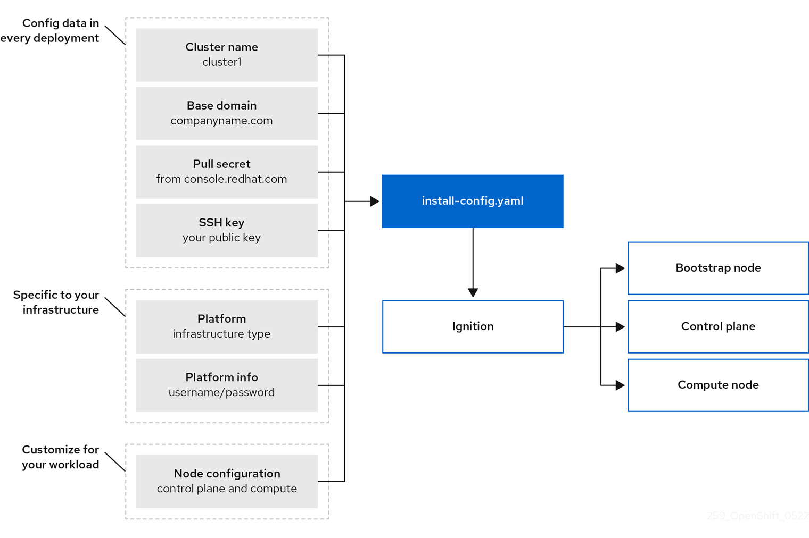

# vSphere IPI & Proxy



## Preperations

* Download `oc` client - [Red Hat Console](https://console.redhat.com/openshift/downloads)
  * Alternative source - [Mirror OpenShift](https://mirror.openshift.com/pub/openshift-v4/clients/ocp/stable/)
* Download `openshift-installer` - [Red Hat Console](https://console.redhat.com/openshift/downloads)
  * Alternative source - [Mirror OpenShift](https://mirror.openshift.com/pub/openshift-v4/clients/ocp/stable/)

* Install `oc` Openshift CLI
  * tar -zxvf openshift-client-mac.tar.gz
  * chmod +x `oc`
  * `sudo mv oc /usr/local/bin/oc`
* Download and untar `openshift-installer`

!!! info
    **vCenter must be reachable directly**
    the connection does not go through the proxy.

## Install vCenter Root CA

```code
curl -k -L -O  https://vcenter/certs/download.zip
unzip download.zip
cp -v certs/lin/*  /etc/pki/ca-trust/source/anchors/
update-ca-trust
```

## **Optional** Reverse proxy for vCenter in a different Network

* Install nginx
* [Create certificates](/certificate/#general-own-root-ca-and-certificate)

Nginx configuration:

```code
http {
  proxy_set_header            Host            $http_host;
  proxy_set_header            X-Real-IP       $remote_addr;
  proxy_set_header            X-Forwared-For  $proxy_add_x_forwarded_for;

  upstream vcsa-443 {
    server vcenter.mycomp.com:443;
  }

  server {
    listen        80;
    server_name   vcenter.openshift.pub;

    location / {
      allow all;
      return 302 https://$server_name$request_uri;
    }
  }
  server {
    listen        443 ssl;
    server_name   vcenter.openshift.pub;

    ssl_certificate  /etc/nginx/cert-crt.pem;
    ssl_certificate_key  /etc/nginx/cert-key.pem;
    ssl_protocols  TLSv1 TLSv1.1 TLSv1.2;
    ssl_ciphers    HIGH:!aNULL:!MD5;
    keepalive_timeout 60;

    location / {
      allow all;
      proxy_set_header Host $http_host;
      proxy_set_header Upgrade $http_upgrade;
      proxy_set_header Connection "upgrade";
      proxy_pass https://vcsa-443;
    }
  }
}
```

## Prepare Install Config

Via `openshift-install create install-config --dir=config`

Don't forget to add the proxy!

### Example install-config.yaml DHCP

```yaml
apiVersion: v1
baseDomain: openshift.pub
compute:
- architecture: amd64
  hyperthreading: Enabled
  name: worker
  platform: {}
  replicas: 3
controlPlane:
  architecture: amd64
  hyperthreading: Enabled
  name: master
  platform: {}
  replicas: 3
metadata:
  creationTimestamp: null
  name: vde
networking:
  clusterNetwork:
  - cidr: 10.128.0.0/14
    hostPrefix: 23
  machineNetwork:
  - cidr: 10.0.0.0/16
  networkType: OpenShiftSDN
  serviceNetwork:
  - 172.30.0.0/16
platform:
  vsphere:
    apiVIP: 172.16.0.15
    cluster: vmware-cluster
    datacenter: DC
    defaultDatastore: datastore
    ingressVIP: 172.16.0.16
    network: VM Network
    password: xxxxx
    username: ocp-account
    vCenter: vcenter.example.de
    folder: /DC/vm/rbohne/                        <===== Added
publish: External
proxy:                                            <===== Added
  httpProxy: http://172.16.0.1:3128/              <===== Added # Sometimes also: http://<username>:<pswd>@<ip>:<port>
  httpsProxy: http://172.16.0.1:3128/             <===== Added # Sometimes also: https://<username>:<pswd>@<ip>:<port>
  noProxy: 172.16.0.0/24,apps.vde.openshift.pub   <===== Added # Must include <Machine CIDR> and <vCenter IP>
sshKey: "....."                                   <===== Added
pullSecret: '{"auths":{"cloud.openshift.com":....'
```

### Example install-config.yaml Static IPs

```yaml
additionalTrustBundlePolicy: Always
apiVersion: v1
baseDomain: openshift.jarvis.lab
compute:
- architecture: amd64
  hyperthreading: Enabled
  name: worker
  platform: {}
  replicas: 3
controlPlane:
  architecture: amd64
  hyperthreading: Enabled
  name: master
  platform: {}
  replicas: 3
metadata:
  name: ocp-mk1
networking:
  clusterNetwork:
  - cidr: 10.128.0.0/14
    hostPrefix: 23
  machineNetwork:
  - cidr: 10.10.80.0/24   # same L2 as k8s-nodes
  networkType: OVNKubernetes
  serviceNetwork:
  - 172.30.0.0/16
platform:
  vsphere:
    hosts:
    - role: bootstrap
      networkDevice:
        ipAddrs:
        - 10.10.80.99/24
        gateway: 10.10.80.1
        nameservers:
        - 10.10.10.53
    - role: control-plane
      networkDevice:
        ipAddrs:
        - 10.10.80.151/24
        gateway: 10.10.80.1
        nameservers:
        - 10.10.10.53
    - role: control-plane
      networkDevice:
        ipAddrs:
        - 10.10.80.152/24
        gateway: 10.10.80.1
        nameservers:
        - 10.10.10.53
    - role: control-plane
      networkDevice:
        ipAddrs:
        - 10.10.80.153/24
        gateway: 10.10.80.1
        nameservers:
        - 10.10.10.53
    - role: compute
      networkDevice:
        ipAddrs:
        - 10.10.80.154/24
        gateway: 10.10.80.1
        nameservers:
        - 10.10.10.53
    - role: compute
      networkDevice:
        ipAddrs:
        - 10.10.80.155/24
        gateway: 10.10.80.1
        nameservers:
        - 10.10.10.53
    - role: compute
      networkDevice:
        ipAddrs:
        - 10.10.80.156/24
        gateway: 10.10.80.1
        nameservers:
        - 10.10.10.53
    apiVIPs:
    - 10.10.80.100
    failureDomains:
    - name: failure-domain
      region: homelab-region
      server: vcsa.jarvis.lab
      topology:
        computeCluster: /dc-1/host/cl-1
        datacenter: dc-1
        datastore: /dc-1/datastore/vsanDatastore
        networks:
        - 1080-wkld-net
        resourcePool: /dc-1/host/cl-1/Resources/ocp-mk1
        folder: /dc-1/vm/ocp-mk1
      zone: zone1
    ingressVIPs:
    - 10.10.80.102
    vcenters:
    - datacenters:
      - dc-1
      password: ******
      port: 443
      server: vcsa.jarvis.lab
      user: administrator@vsphere.local
publish: External
proxy:
  httpProxy: http://<proxy-ip>:3128/ # Sometimes also: http://<username>:<pswd>@<ip>:<port>
  httpsProxy: http://<proxy-ip>:3128/ #Sometimes also: https://<username>:<pswd>@<ip>:<port>
  noProxy: <Machine CIDR>,<vCenter IP>,apps.openshift.jarvis.lab
pullSecret: '{"auths":{"cloud.openshift.com":...
sshKey: |
  ssh-rsa AAAAB3N...
```

### Troubleshooting the Installation

The installation log messages are in $MY_CLUSTER/.openshift_install.log. If the installation fails, check the log for error messages and make changes to the environment accordingly. Then re-run the installation with the following command:

`tail -f $MY_CLUSTER/.openshift_install.log`

`openshift-install wait-for install-complete`

### Destroy a Cluster

`openshift-install destroy cluster --dir=<installation_directory> --log-level=debug`

## Explain installconfig.platform.vsphere

```shell
openshift-install explain installconfig.platform.vsphere

KIND:     InstallConfig
VERSION:  v1

RESOURCE: <object>
  VSphere is the configuration used when installing on vSphere.

FIELDS:
    apiVIP <string>
      DeprecatedAPIVIP is the virtual IP address for the api endpoint Deprecated: Use APIVIPs

    apiVIPs <[]string>
      Format: ip
      APIVIPs contains the VIP(s) for the api endpoint. In dual stack clusters it contains an IPv4 and IPv6 address, otherwise only one VIP

    cluster <string>
      Cluster is the name of the cluster virtual machines will be cloned into. Deprecated: Use FailureDomains.Topology.Cluster

    clusterOSImage <string>
      ClusterOSImage overrides the url provided in rhcos.json to download the RHCOS OVA

    datacenter <string>
      Datacenter is the name of the datacenter to use in the vCenter. Deprecated: Use FailureDomains.Topology.Datacenter

    defaultDatastore <string>
      DefaultDatastore is the default datastore to use for provisioning volumes. Deprecated: Use FailureDomains.Topology.Datastore

    defaultMachinePlatform <object>
      DefaultMachinePlatform is the default configuration used when installing on VSphere for machine pools which do not define their own platform configuration.

    diskType <string>
      Valid Values: "","thin","thick","eagerZeroedThick"
      DiskType is the name of the disk provisioning type, valid values are thin, thick, and eagerZeroedThick. When not specified, it will be set according to the default storage policy of vsphere.

    failureDomains <[]object>
      FailureDomains holds the VSpherePlatformFailureDomainSpec which contains the definition of region, zone and the vCenter topology. If this is omitted failure domains (regions and zones) will not be used.
      FailureDomain holds the region and zone failure domain and the vCenter topology of that failure domain.

    folder <string>
      Folder is the absolute path of the folder that will be used and/or created for virtual machines. The absolute path is of the form /<datacenter>/vm/<folder>/<subfolder>. Deprecated: Use FailureDomains.Topology.Folder

    hosts <[]object>
      Hosts defines network configurations to be applied by the installer. Hosts is available in TechPreview.
      Host defines host VMs to generate as part of the installation.

    ingressVIP <string>
      DeprecatedIngressVIP is the virtual IP address for ingress Deprecated: Use IngressVIPs

    ingressVIPs <[]string>
      Format: ip
      IngressVIPs contains the VIP(s) for ingress. In dual stack clusters it contains an IPv4 and IPv6 address, otherwise only one VIP

    loadBalancer <object>
      LoadBalancer defines how the load balancer used by the cluster is configured. LoadBalancer is available in TechPreview.

    network <string>
      Network specifies the name of the network to be used by the cluster. Deprecated: Use FailureDomains.Topology.Network

    password <string>
      Password is the password for the user to use to connect to the vCenter. Deprecated: Use VCenters.Password

    resourcePool <string>
      ResourcePool is the absolute path of the resource pool where virtual machines will be created. The absolute path is of the form /<datacenter>/host/<cluster>/Resources/<resourcepool>. Deprecated: Use FailureDomains.Topology.ResourcePool

    username <string>
      Username is the name of the user to use to connect to the vCenter. Deprecated: Use VCenters.Username

    vCenter <string>
      VCenter is the domain name or IP address of the vCenter. Deprecated: Use VCenters.Server

    vcenters <[]object>
      VCenters holds the connection details for services to communicate with vCenter. Currently only a single vCenter is supported.
      VCenter stores the vCenter connection fields https://github.com/kubernetes/cloud-provider-vsphere/blob/master/pkg/common/config/types_yaml.go
```
