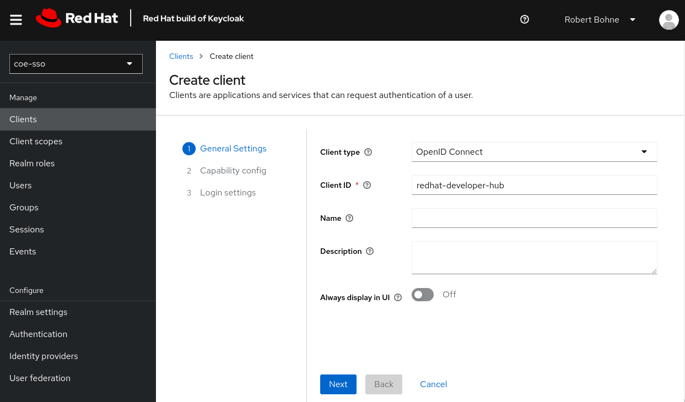
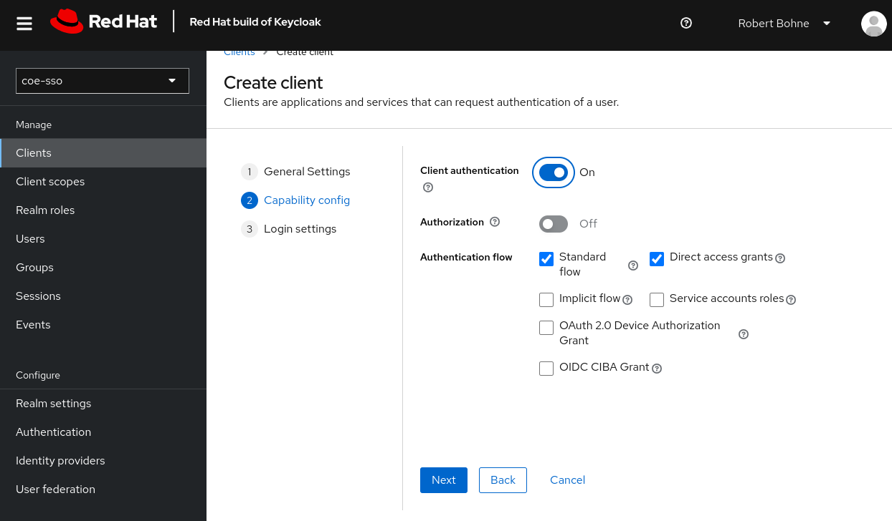
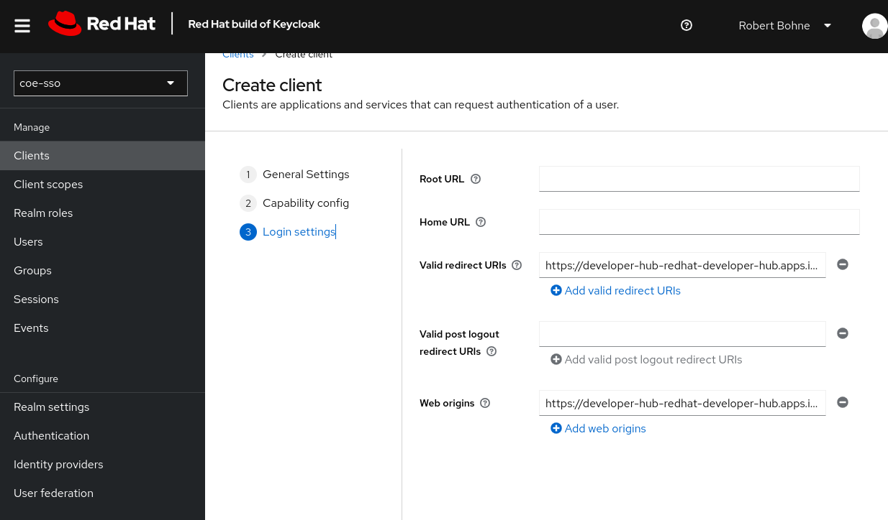

# Red Hat Developer Hub aka Backstage

      - args:
        - --provider=oidc
        - --email-domain=*
        - --upstream=http://localhost:7007
        - --http-address=0.0.0.0:4180
        - --skip-provider-button
        - --insecure-oidc-allow-unverified-email=true
        env:
        - name: OAUTH2_PROXY_CLIENT_ID
          valueFrom:
            secretKeyRef:
              key: CLIENT_ID
              name: keycloak-client-secret-backstage
        - name: OAUTH2_PROXY_CLIENT_SECRET
          valueFrom:
            secretKeyRef:
              key: CLIENT_SECRET
              name: keycloak-client-secret-backstage
        - name: OAUTH2_PROXY_COOKIE_SECRET
          value: bmpvaGV3cXBhbmVvYWJ1Z2ZiYWpoZXh3aWphYmR0b3g=
        - name: OAUTH2_PROXY_OIDC_ISSUER_URL
          value: https://sso.coe.muc.redhat.com/auth/realms/coe-sso
        - name: OAUTH2_PROXY_SSL_INSECURE_SKIP_VERIFY
          value: "true"

Client ID redhat-developer-hub

Valid redirect URIs : https://developer-hub-redhat-developer-hub.apps.isar.coe.muc.redhat.com/oauth2/callback
Web origins : https://developer-hub-redhat-developer-hub.apps.isar.coe.muc.redhat.com/

-> Credentials
    Client Secret: Xyt8GaEQwyudjfnJgdzJpSWT19whszHd

oc create secret generic rh-developer-hub-sso \
  --from-literal=CLIENT_ID=redhat-developer-hub \
  --from-literal=CLIENT_SECRET=Xyt8GaEQwyudjfnJgdzJpSWT19whszHd

    signInPage: oauth2Proxy
    auth:
      environment: production
      providers:
        oauth2Proxy: {}

        

Prakisch:

helm get values -a developer-hub | yq -o props
https://www.baeldung.com/ops/kubernetes-update-helm-values

# ToDo
- [ ] Service anpassen
cat values.yaml

https://stackoverflow.com/questions/48927233/updating-kubernetes-helm-values

https://github.com/rhdh-bot/openshift-helm-charts/tree/rhdh-1-rhel-9/charts/redhat/redhat/developer-hub/1.1-59-CI

https://keycloak-backstage.apps.cluster-cqf2k.sandbox2351.opentlc.com/auth/realms/backstage/.well-known/openid-configuration

oc create -f - <<EOF
apiVersion: v1
kind: ConfigMap
metadata:
  labels:
    config.openshift.io/inject-trusted-cabundle: "true"
  name: trusted-ca
EOF

export NODE_EXTRA_CA_CERTS=/ca/ca-bundle.crt

