# How to deploy and configure keycloak

## Goals

* [X] One central Keycloak/SSO instance for varios OpenShift Cluster
* [X] Keycloak use Google as identifyprovider (via oauth)
* [X] Configurat OpenShift with two different Identify Providers:
    * [X] "COE SSO Admin"
      * [X] User created with `-admin` postfix
      * [X] User is automatic in keycloak group `idp-coe-sso-admin`
    * [X] "COE SSO"
      * [X] User is automatic in keycloak group `idp-coe-sso`
* [X] Keycloak provide a group `coe-sso-admin` where we add admin user
* [X] OpenShift Cluster give group `coe-sso-admin` cluster-admin privileges: `oc adm policy add-cluster-role-to-group cluster-admin coe-sso-admin`

## Keycloak installation

* Install following operators via OperatorHub
    * CloudNativePG (Cerified Operator)
    * Keycloak Operator (Red Hat Operator)

### Spinup PostgreSQL database via CloudNativePG

In my setup we use SAN Storage (iscsi) provided from a Netapp via Trident and the database should run on my control plan/master nodes.

??? example "postgresql cluster cr"

    ```yaml
    kind: Cluster
    apiVersion: postgresql.cnpg.io/v1
    metadata:
      name: pq-for-rhbk
      namespace: rhbk-operator
    spec:
      affinity:
        nodeSelector:
          node-role.kubernetes.io/master: ""
        tolerations:
          - effect: NoSchedule
            key: node-role.kubernetes.io/master
            operator: Exists
      instances: 3
      logLevel: info
      primaryUpdateStrategy: unsupervised
      storage:
        size: 3Gi
        storageClass: coe-netapp-san
      walStorage:
        size: 3Gi
        storageClass: coe-netapp-san
    ```

### Spinup Keycloak

* I'm using a customer DNS name, `sso.coe.muc.redhat.com`
  DNS configuration:

    ```bind
    sso.coe.muc.redhat.com.   86400   IN  CNAME  *.apps.isar.coe.muc.redhat.com.
    ```

* SSL Certificate for `sso.coe.muc.redhat.com` is stared in Vault and copied into a secret via ExternalSecret Operator

    ??? example "ExternalSecret"

        ```yaml
        apiVersion: external-secrets.io/v1beta1
        kind: ExternalSecret
        metadata:
          name: cert-wildcard-coe
          namespace: rhbk-operator
        spec:
          data:
          - remoteRef:
              key: coe-lab/wildcard-cert-coe
              property: wildcard-coe.chain.cert
            secretKey: tls.crt
          - remoteRef:
              key: coe-lab/wildcard-cert-coe
              property: wildcard-coe.key
            secretKey: tls.key
          refreshInterval: 12h
          secretStoreRef:
            kind: ClusterSecretStore
            name: redhat-vault
          target:
            creationPolicy: Owner
            deletionPolicy: Retain
            name: cert-wildcard-coe
            template:
              type: kubernetes.io/tls
        ```

* Deploy Red Hat Build of Keycloak

    ??? example "Keycloak"

        ```yaml
        apiVersion: k8s.keycloak.org/v2alpha1
        kind: Keycloak
        metadata:
          name: coe-sso
          namespace: rhbk-operator
        spec:
          instances: 2
          db:
            vendor: postgres
            host: pq-for-rhbk-rw
            database: app
            usernameSecret:
              name: pq-for-rhbk-app
              key: username
            passwordSecret:
              name: pq-for-rhbk-app
              key: password
          http:
            tlsSecret: cert-wildcard-coe
          hostname:
            hostname: sso.coe.muc.redhat.com
        ```

**GitOpsified deployment** is here: <https://github.com/stormshift/clusters/tree/main/isar-apps/keycloak>

## Keycloak Configuration

Login into keycloak, in my case <https://sso.coe.muc.redhat.com>

Get the initial admin user and password:

```bash
# Username
$ oc get secrets -n rhbk-operator  coe-sso-initial-admin  -o jsonpath="{.data.username}" | base64 -d;echo
admin

# Password
$ oc get secrets -n rhbk-operator  coe-sso-initial-admin  -o jsonpath="{.data.password}" | base64 -d;echo
cbd4f....
```

### Create a new realm `coe-sso`

* Create realm

    ??? note "Screenshot"

        

* **Realm name:** coe-sso

#### Add group `idp-coe-sso`

* Select **Groups** on the left

* Click **Greate group**

* Fill out the form, Name: `idp-coe-sso`

* Click **Create**

#### Add identity provider

* Go to "Identity providers" and select one provider of choice - in my case Google.

    ??? note "Screenshot"

        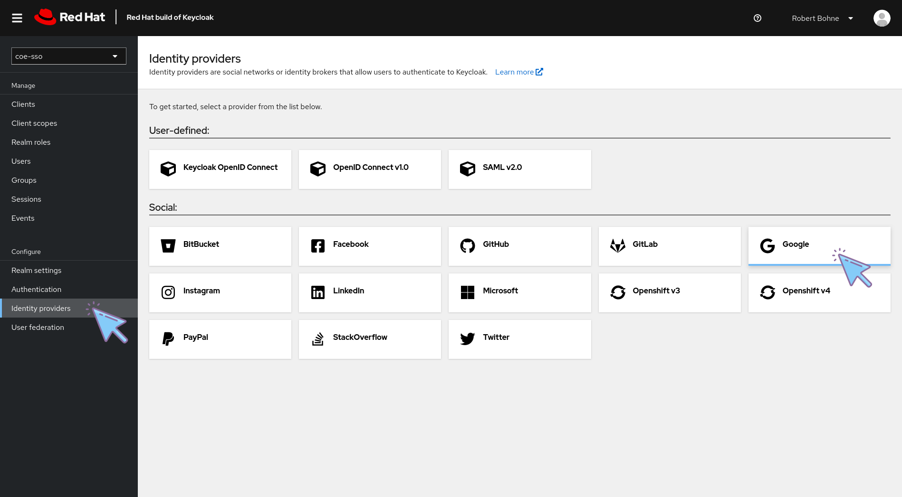

* Fill out the form in your Keycloak instance:

    * Copy the **Redirect URI** and paste it into Google's  **Authorised redirect URIs** part, details: [Red Hat SSO - via Google¶](/cluster-configuration/authentication/redhat-sso/)

    * Copy & Paste **Client ID** and **Client Secret** from Google to Keycloak

    * Click Add

        ??? note "Screenshot"

            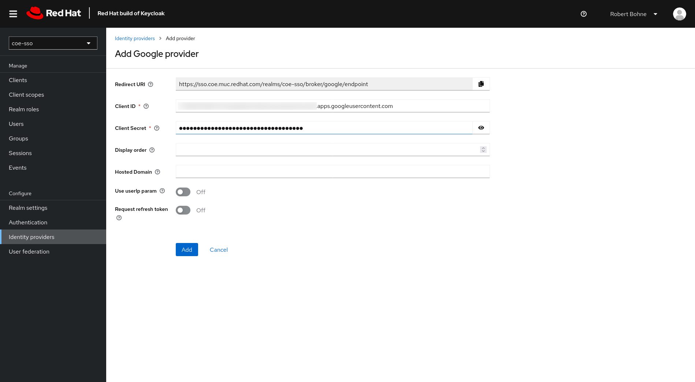

#### Configure Identity provider

* **Advanced settings** -> Switch on **Trust Email**

    ??? note "Screenshot"

        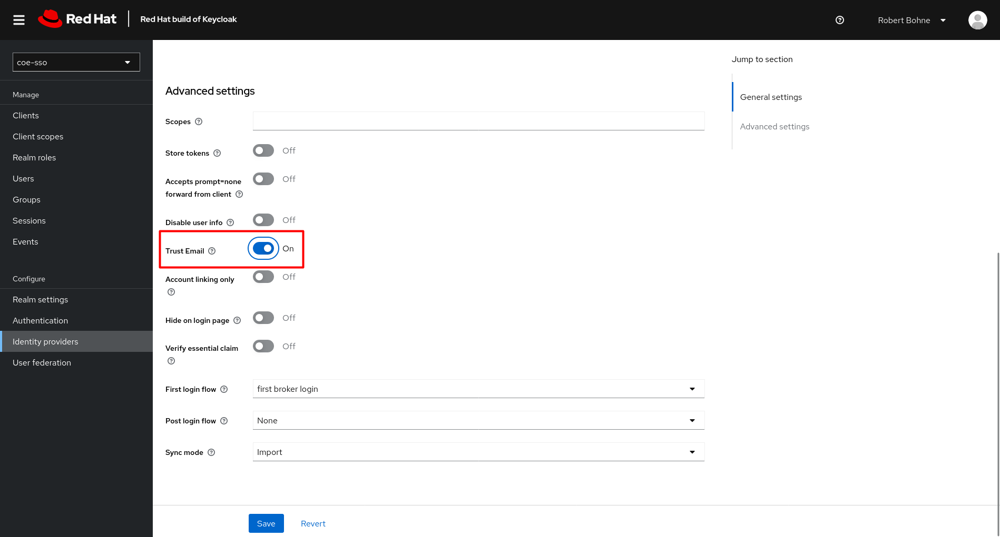

* Add Hardcoded Group mapper,

    * Go to your identity provider, click **Mappers** tab next to Settings tab

    * Fill out the form:

        ??? note "Screenshot"

            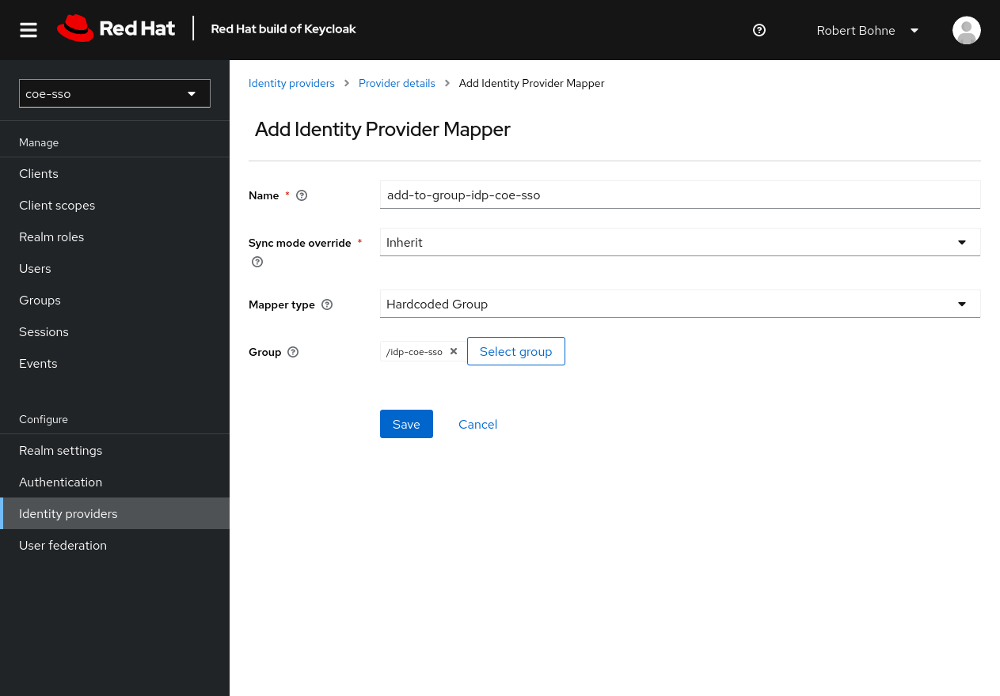

### Create another realm `coe-sso-admin`

Idea here is having a second realm analog to the first one, but it creates user with `-admin` post-fix to the username.

* Create a new realm and add identity provider, as described above.

* Add a **Username Template Importer** mapper

    * Go to your identity provider, click **Mappers** tab next to Settings tab

    * Fill out the form:

      * **Template:** `${CLAIM.email}-admin`

          ??? note "Screenshot"

              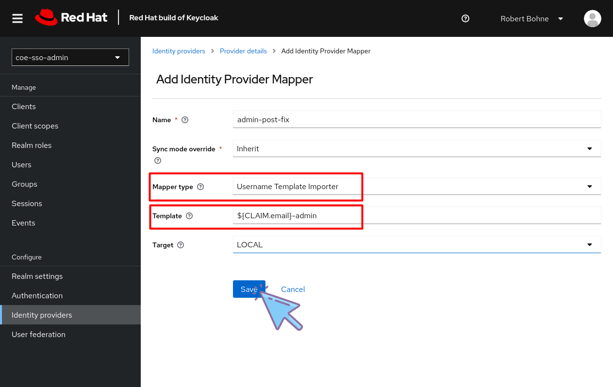

### Skip the Keycloak login page

* Click **Authentication** at the left menu

* Select Tab **Flows**

* Click Flow name **browser**

    ??? note "Screenshot"

        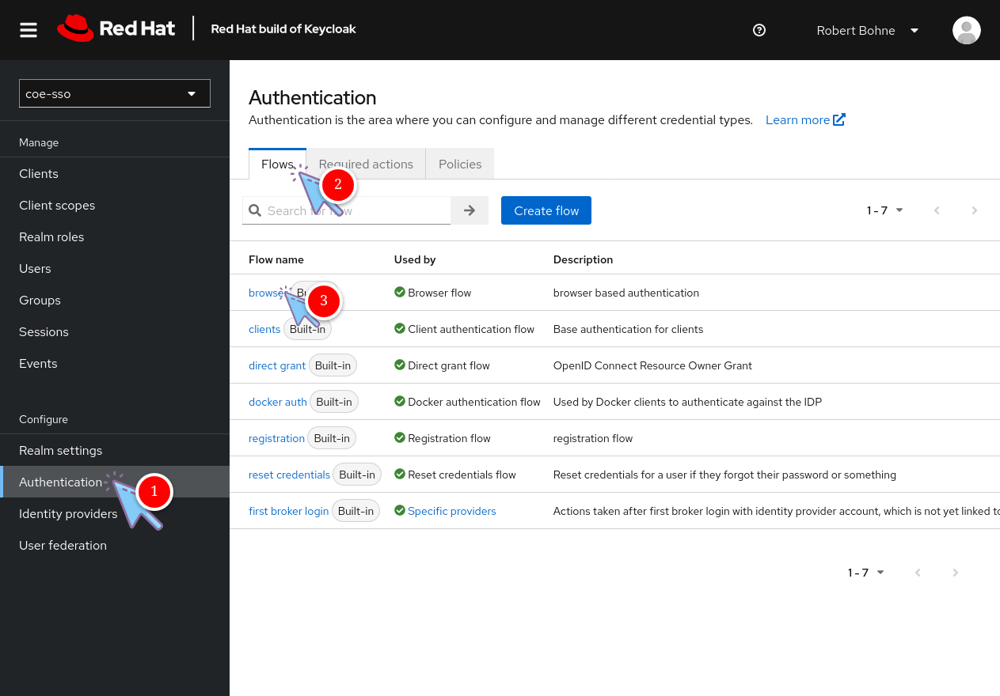

* Configure **Identity Provider Redirector**

    ??? note "Screenshot"

        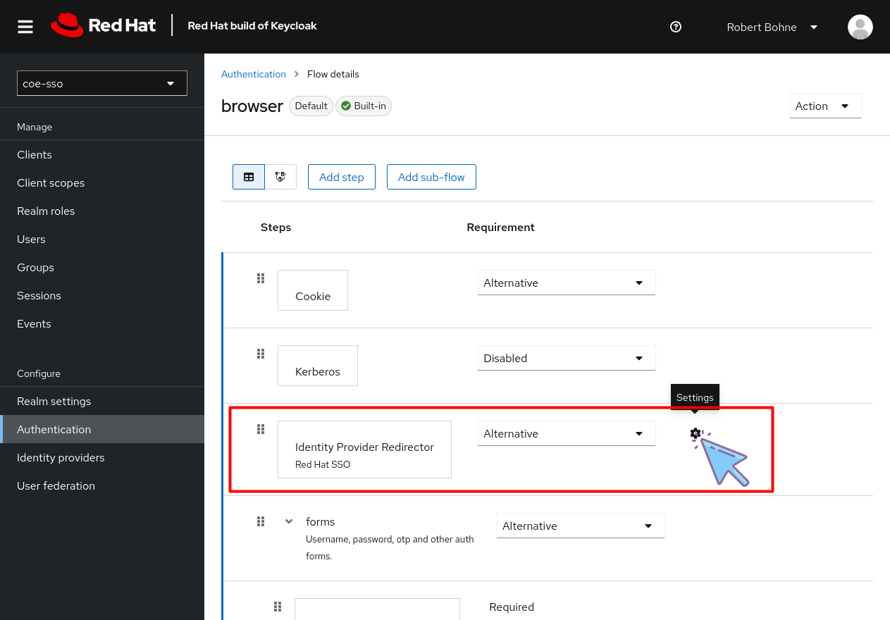

    ??? note "Screenshot"

        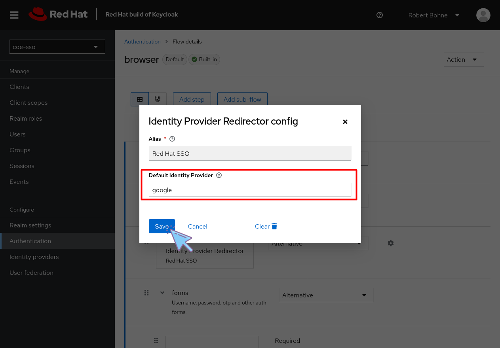

### Create Client for OpenShift Cluster

* Click **Clients**

* Select Tab **Client list**

* Click **Create client**

* **General Settings**

    * Important is here **Client ID**, this is needed for OpenShift OAuth config later

    ??? note "Screenshot"

        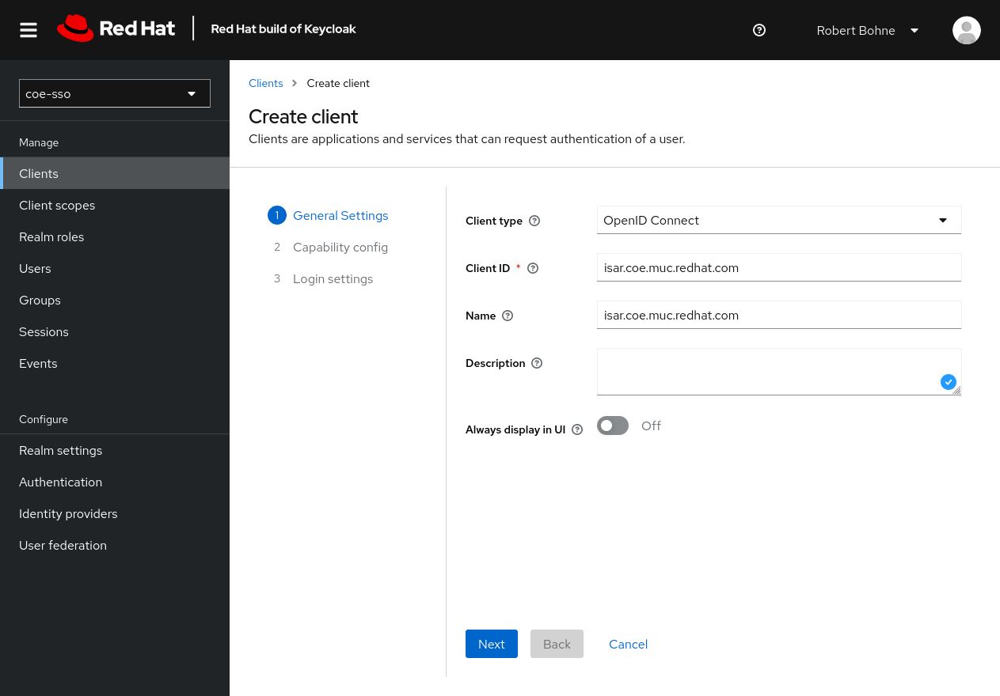

* **Capability config**

    ??? note "Screenshot"

        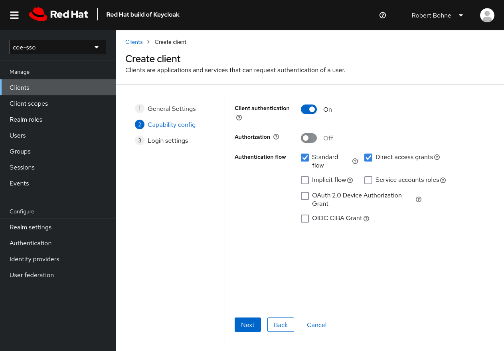

* **Login settings**

    * Valid redirect URIs: `https://oauth-openshift.apps.$cluster-name$.$basedomain$:443/oauth2callback/*`

    * Web origins: `https://oauth-openshift.apps.$cluster-name$.$basedomain$:443`

    ??? note "Screenshot"

        

* Click **Create**

* Select tab **Client scopes**

* Click `$NAME`**-dedicted** client scope

* Click **Configure a new mapper**

* Click **Group Membership**

    ??? note "Screenshot"

        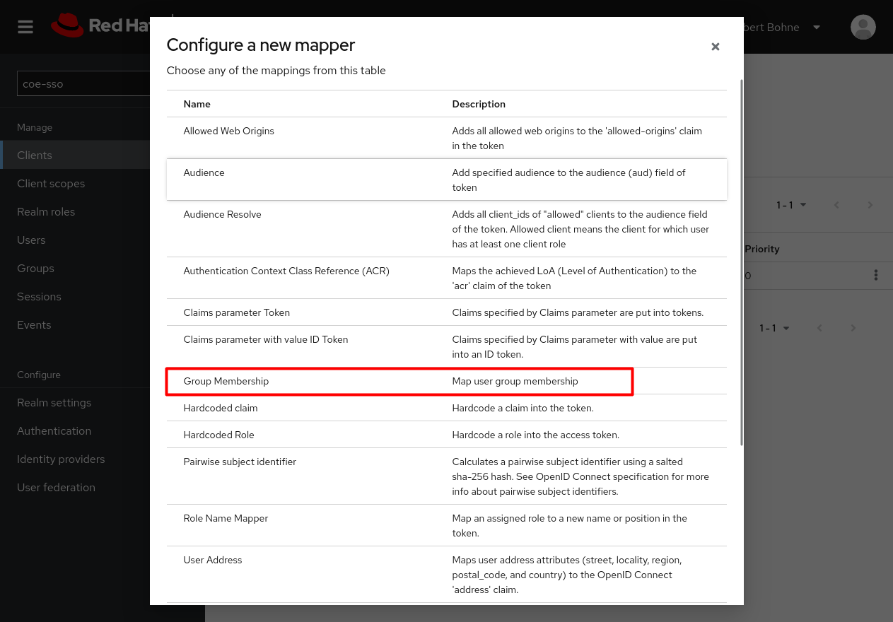

* Fill out form

    ??? note "Screenshot"

        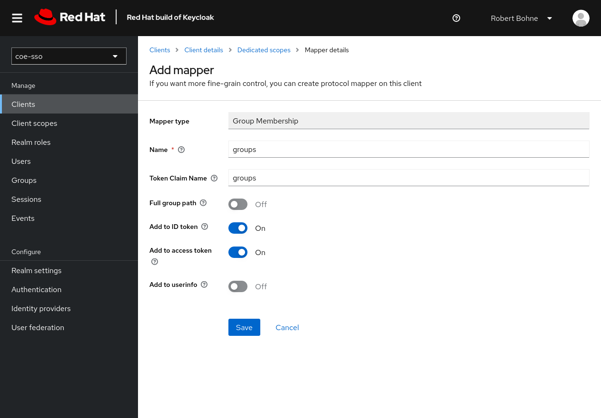

* Go back to Client details

* Select tab **Credentials**

* Store/Copy **Client secret** this is needed for OpenShift OAuth config later

## Configure Keycloak at your OpenShift Cluster

* Go to Administration -> Cluster Settings -> Configuration -> OAuth

* Added YAML and add OpenID Connect provider:

    ```yaml
    - mappingMethod: add
        name: COE-SSO-Admin
        openID:
          ca:
            # Configmap with root ca, key: ca.crt
            name: openid-ca-gnmjm
          claims:
            email:
            - email
            groups:
            - groups
            name:
            - name
            preferredUsername:
            - preferred_username
          clientID: isar.coe.muc.redhat.com
          clientSecret:
            # Secret with client secret, key: clientSecret
            name: openid-client-secrot-coe-sso-admin
          issuer: https://sso.coe.muc.redhat.com/realms/coe-sso-admin
        type: OpenID
    ```

# Resources

* <https://keycloakthemes.com/blog/how-to-setup-sign-in-with-google-using-keycloak>
* <https://medium.com/keycloak/using-keycloak-identity-provider-to-secure-openshift-f929a7a0f7f1>
