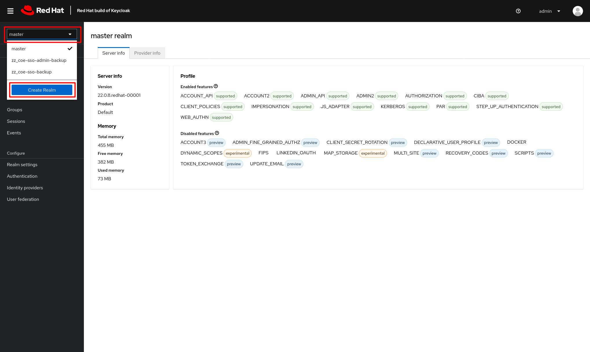

# How to deploy and configure keycloak

## Goals

* [X] One central Keycloak/SSO instance for varios OpenShift Cluster
* [ ] Keycloak use Google as identifyprovider (via oauth)
* [ ] Configurat OpenShift with two different Identify Providers:
  * [ ] "COE SSO Admin"
    * [ ] User created with `-admin` postfix
    * [ ] User is automatic in keycloak group `idp-coe-sso-admins`
  * [ ] "COE SSO"
    * [ ] User is automatic in keycloak group `idp-coe-sso`
* [ ] Keycloak provide a group `coe-sso-admin` where we add admin user
* [ ] OpenShift Cluster give group `coe-sso-admin` cluster-admin privileges.

## Keycloak installation

* Install following operators via OperatorHub
  * CloudNativePG (Cerified Operator)
  * Keycloak Operator (Red Hat Operator)

### Spinup PostgreSQL database via CloudNativePG

In my setup we use SAN Storage (iscsi) provided from a Netapp via Trident and the database should run on my control plan/master nodes.

??? example "postgresql cluster cr"

    ```yaml
    kind: Cluster
    apiVersion: postgresql.cnpg.io/v1
    metadata:
      name: pq-for-rhbk
      namespace: rhbk-operator
    spec:
      affinity:
        nodeSelector:
          node-role.kubernetes.io/master: ""
        tolerations:
          - effect: NoSchedule
            key: node-role.kubernetes.io/master
            operator: Exists
      instances: 3
      logLevel: info
      primaryUpdateStrategy: unsupervised
      storage:
        size: 3Gi
        storageClass: coe-netapp-san
      walStorage:
        size: 3Gi
        storageClass: coe-netapp-san
    ```

### Spinup Keycloak

* I'm using a customer DNS name, `sso.coe.muc.redhat.com`
  DNS configuration:

    ```bind
    sso.coe.muc.redhat.com.   86400   IN  CNAME  *.apps.isar.coe.muc.redhat.com.
    ```

* SSL Certificate for `sso.coe.muc.redhat.com` is stared in Vault and copied into a secret via ExternalSecret Operator

    ??? example "ExternalSecret"

        ```yaml
        apiVersion: external-secrets.io/v1beta1
        kind: ExternalSecret
        metadata:
          name: cert-wildcard-coe
          namespace: rhbk-operator
        spec:
          data:
          - remoteRef:
              key: coe-lab/wildcard-cert-coe
              property: wildcard-coe.chain.cert
            secretKey: tls.crt
          - remoteRef:
              key: coe-lab/wildcard-cert-coe
              property: wildcard-coe.key
            secretKey: tls.key
          refreshInterval: 12h
          secretStoreRef:
            kind: ClusterSecretStore
            name: redhat-vault
          target:
            creationPolicy: Owner
            deletionPolicy: Retain
            name: cert-wildcard-coe
            template:
              type: kubernetes.io/tls
        ```

* Deploy Red Hat Build of Keycloak

    ??? example "Keycloak"

        ```yaml
        apiVersion: k8s.keycloak.org/v2alpha1
        kind: Keycloak
        metadata:
          name: coe-sso
          namespace: rhbk-operator
        spec:
          instances: 2
          db:
            vendor: postgres
            host: pq-for-rhbk-rw
            database: app
            usernameSecret:
              name: pq-for-rhbk-app
              key: username
            passwordSecret:
              name: pq-for-rhbk-app
              key: password
          http:
            tlsSecret: cert-wildcard-coe
          hostname:
            hostname: sso.coe.muc.redhat.com
        ```

**GitOpsified deployment** is here: <https://github.com/stormshift/clusters/tree/main/isar-apps/keycloak>

## Keycloak Configuration

Login into keycloak, in my case https://sso.coe.muc.redhat.com

Get the initial admin user and password:

```bash
# Username
$ oc get secrets -n rhbk-operator  coe-sso-initial-admin  -o jsonpath="{.data.username}" | base64 -d;echo
admin

# Password
$ oc get secrets -n rhbk-operator  coe-sso-initial-admin  -o jsonpath="{.data.password}" | base64 -d;echo
cbd4f....
```

### Create a new realm `coe-sso`

* Create realm

    ??? note "Screenshot"

        

* **Realm name:** coe-sso

```yaml
apiVersion: v1
data:
  ca.crt: |-
    -----BEGIN CERTIFICATE-----
    MIIDlTCCAn2gAwIBAgIUWMhTpeR0h6PkJETCi71TbayM+4wwDQYJKoZIhvcNAQEL
    BQAwWjEyMDAGA1UEAwwpa2V5Y2xvYWsuYXBwcy5zZW5kbGluZy5jb2UubXVjLnJl
    ZGhhdC5jb20xFzAVBgNVBAoMDlRlc3QgS2V5Y2xvYWsuMQswCQYDVQQGEwJVUzAe
    Fw0yNDAyMDkxNDExMThaFw0yNTAyMDgxNDExMThaMFoxMjAwBgNVBAMMKWtleWNs
    b2FrLmFwcHMuc2VuZGxpbmcuY29lLm11Yy5yZWRoYXQuY29tMRcwFQYDVQQKDA5U
    ZXN0IEtleWNsb2FrLjELMAkGA1UEBhMCVVMwggEiMA0GCSqGSIb3DQEBAQUAA4IB
    DwAwggEKAoIBAQCJrpwksbqZKzReVMjNiDVMwJrrPO51TaQnUgDKJXhAAGBBsCS4
    MchqCBBonn4NOEhOuf555I0ayZexGr7rGtzprkmBmszcGcElm6dqlZitsLKq/lC5
    J8PbJU2vPnNWVu21100ZVSqngFY614IwjHn+nPWbZDuXz7V6eWnGFMqklTYWSjsN
    6c4+/ZiHiG6Tewi5vICnq5i0LbVC5VSPGRCRCJXssfKE2K9/LlF8p4FxmBTvLCEM
    ffZhE4a+7nQpOTypXu8TongiZUg6OAECHtQqXNaU7fdGINx1u/5hYZKSziJ2abGo
    j+thMGU+QvbSbnmHpN0EH3hDwocsn1MLCJ1xAgMBAAGjUzBRMB0GA1UdDgQWBBTD
    Qx8faafJUd+zG3ZdF1ndjjG/eDAfBgNVHSMEGDAWgBTDQx8faafJUd+zG3ZdF1nd
    jjG/eDAPBgNVHRMBAf8EBTADAQH/MA0GCSqGSIb3DQEBCwUAA4IBAQAa30Y+4YOa
    N4KHb0kbcj5cGGwWI+j3xo454dCG39jhMru3eClW8X0n50vHNPB12VpdKdUbJBmC
    u54aqi8Pinf7gFrPfjZAPaLdH4nJBCG02QvbGkl/uMFAcXVWEtAQ7e/329Xn2FiJ
    M7+Npss7zG2Jo/xJReXx23vUHAJYbqpjY3hUPWbbKBT6RbfnqZWqrk2/wGpS29gc
    vjvn2NX2moeUGR4RsQDGecx0do7u0nQYkuuwAiGfOh6czUe5Ii1wnsIELdC+ryrH
    TjnvbqpRaEtGwepmyqN/eANljJnrGBaFxZnrxpeqBCdqgUhvKMnrnEoBzF7OZA3+
    XtZzo9trJzN2
    -----END CERTIFICATE-----
kind: ConfigMap
metadata:
  name: keycloak-coe
```

```yaml
spec:
  configuration:
    oauth:
      identityProviders:
        - type: OpenID
          name: keycloak
          openID:
            ca:
              name: keycloak-coe
            clientID: coe-ocp-sendling
            clientSecret:
              name:
            issuer: https://keycloak.apps.sendling.coe.muc.redhat.com/realms/master
```

# Resources

* <https://keycloakthemes.com/blog/how-to-setup-sign-in-with-google-using-keycloak>
* <https://medium.com/keycloak/using-keycloak-identity-provider-to-secure-openshift-f929a7a0f7f1>
