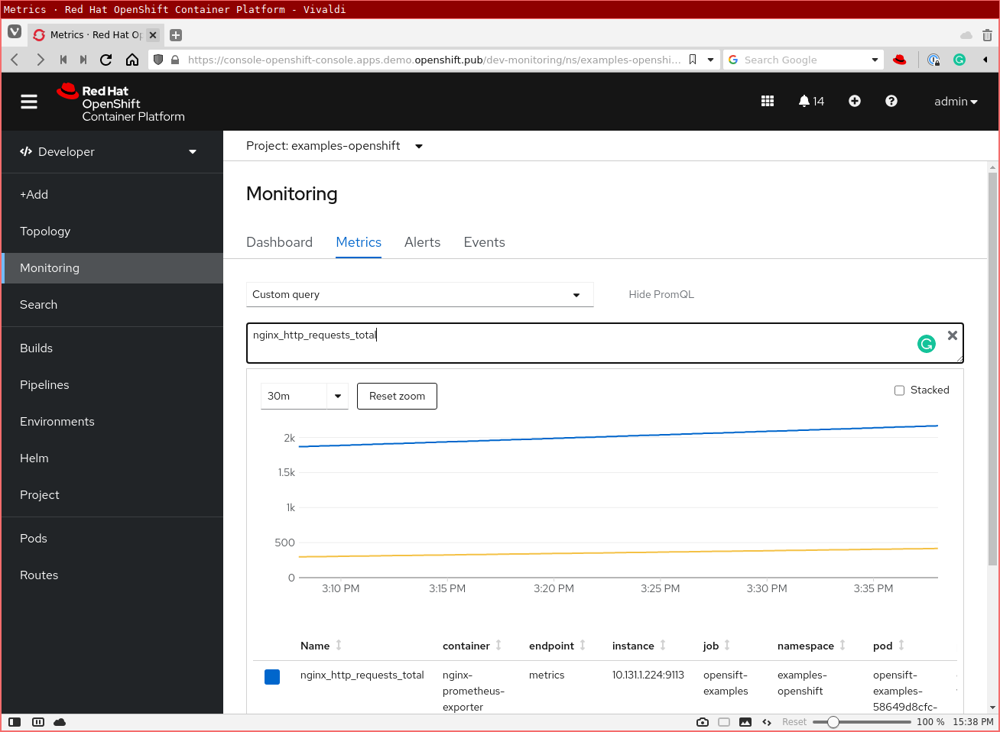

# Application Monitoring example


## Deploy cluster wide workload monitoring (cluster-admin needed)

[Enabling monitoring for user-defined projects](https://docs.openshift.com/container-platform/latest/monitoring/enabling-monitoring-for-user-defined-projects.html)

### Enable user workload monitoring

```yaml
oc create -f - <<EOF
apiVersion: v1
kind: ConfigMap
metadata:
  name: cluster-monitoring-config
  namespace: openshift-monitoring
data:
  config.yaml: |
    enableUserWorkload: true
EOF
```

### Check user workload monitoring stack

```bash
$ oc get pods -n openshift-user-workload-monitoring
NAME                                   READY   STATUS    RESTARTS   AGE
prometheus-operator-84d9857947-wlmws   2/2     Running   0          49s
prometheus-user-workload-0             5/5     Running   1          37s
prometheus-user-workload-1             5/5     Running   1          37s
thanos-ruler-user-workload-0           3/3     Running   0          38s
thanos-ruler-user-workload-1           3/3     Running   0          37s
```

## Granting permission

 * [Granting users permission to monitor user-defined projects](https://docs.openshift.com/container-platform/latest/monitoring/enabling-monitoring-for-user-defined-projects.html#granting-users-permission-to-monitor-user-defined-projects_enabling-monitoring-for-user-defined-projects)
* Granting user permissions by using the [web console](https://docs.openshift.com/container-platform/latest/monitoring/enabling-monitoring-for-user-defined-projects.html#granting-user-permissions-using-the-web-console_enabling-monitoring-for-user-defined-projects) or [CLI](https://docs.openshift.com/container-platform/4.7/monitoring/enabling-monitoring-for-user-defined-projects.html#granting-user-permissions-using-the-cli_enabling-monitoring-for-user-defined-projects)


## Deploy application

=== "OC"

    ```
    oc apply -f {{ page.canonical_url }}deployment.yaml
    ```

=== "deployment.yaml"

    ```yaml
    --8<-- "content/deploy/monitoring/deployment.yaml"
    ```


## Create Service Monitoring


=== "OC"

    ```
    oc apply -f {{ page.canonical_url }}servicemonitor.yaml
    ```

=== "deployment.yaml"

    ```yaml
    --8<-- "content/deploy/monitoring/servicemonitor.yaml"
    ```


## Result

