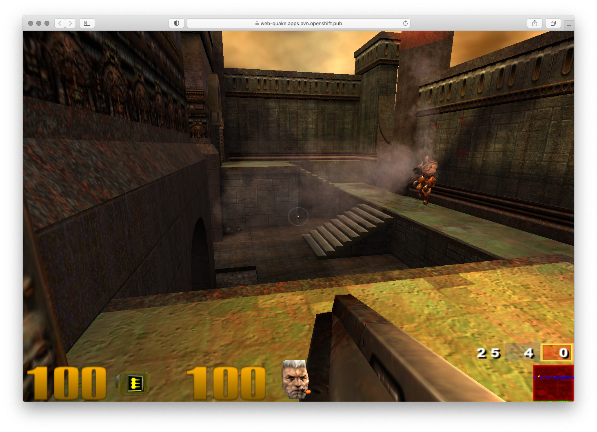

# Run Quake3 on OpenShift

## Deployment
Based on [https://github.com/criticalstack/quake-kube](https://github.com/criticalstack/quake-kube)


```bash
oc new-project quake
oc apply -f https://raw.githubusercontent.com/criticalstack/quake-kube/master/example.yaml
oc expose --name web svc/quake
oc create route edge web \
  --insecure-policy='Redirect' \
  --service='quake'
```



## My configuration

* [The Q3A Guide - Basic Console Commands and Cheats](http://planetquake.gamespy.com/Viewb04f.html?view=Guides.Detail&id=53&game=4)

```bash
oc apply -f - <<EOF
apiVersion: v1
kind: ConfigMap
metadata:
  name: quake3-server-config
data:
  config.yaml: |
    fragLimit: 25
    timeLimit: 15m
    bot:
      minPlayers: 3
    game:
      motd: "Welcome to Quake 3 on OpenShift"
      type: FreeForAll
      forceRespawn: false
      inactivity: 10m
      quadFactor: 3
      weaponRespawn: 3
    server:
      hostname: "quakekube"
      maxClients: 12
      password: "$(pwgen -n 16 1)"
    commands:
      - addbot sarge 2
    maps:
    - name: q3dm17
      type: FreeForAll
      timeLimit: 10m
EOF

oc delete pods -l run=quake
```

### Get the rcon password:

```bash
oc get cm/quake3-server-config -oyaml | grep 'password: "'
```

### Gametype
```
/g_gametype
Will display or set the current game type:

"0" - free-for-all DM
"1" - Tournament 1-on-1
"2" - Single-Player
"3" - Team Deathmatch
"4" - Capture the Flag.

Example: /g_gametype "3"


```