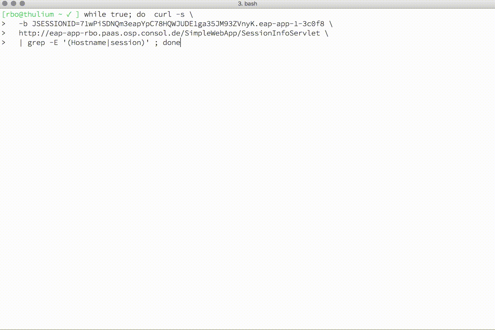

# EAP Cluster demo

## Grant view permission to default service account

This ensures that the EAP can query which PODs are still available:

```bash
oc policy add-role-to-user view -z default
```

## Deploy JBoss EAP with demo application

```text
oc process -n openshift eap70-basic-s2i \
   -v SOURCE_REPOSITORY_URL=https://github.com/openshift-examples/SimpleWebApp.git \
      SOURCE_REPOSITORY_REF=master \
  | oc create -f -
```

## Scale up deployment to more than 1 pod

```text
oc scale --replicas=2 dc/eap-app
```

## Enforce round robin

This should be default, but we will enforce just in case roundrobin to check the session replication. For more information: [routes.html\#route-specific-annotations](https://docs.openshift.com/container-platform/3.4/architecture/core_concepts/routes.html#route-specific-annotations%20)

```text
oc patch \
  -p '{"metadata":{"annotations":{"haproxy.router.openshift.io/balance": "roundrobin"}}}' \
  route/eap-app
```

## Check session replication

2017-03-14: since there is a haproxy stickyness bug in OCP 3.4 \(disable\_cookies is ignored\), we have to delete the HttpOnly line in our temporary cookie cache.

```text
$  while true; do \
     curl -s -b /tmp/mycookies.jar -c /tmp/mycookies.jar \
     http://<your-application-route>/SimpleWebApp/SessionInfoServlet | \
     grep -E '(Hostname|session)'; \
     sleep 1; \
     sed -i '/HttpOnly/d' /tmp/mycookies.jar; \
     echo ""; \
     done
```

### Example

Expected behaviour: session ID and creation time remains the same, hostname changes.

```text
$  while true; do \
>    curl -s -b /tmp/mycookies.jar -c /tmp/mycookies.jar \
>    http://eap-app-zisis.paas.osp.consol.de/SimpleWebApp/SessionInfoServlet | \
>    grep -E '(Hostname|session)'; \
>    sleep 1; \
>    sed -i '/HttpOnly/d' /tmp/mycookies.jar; \
>    echo ""; \
>    done
Hostname: eap-app-1-n52jz
session id:             NtXAm9gUvpHvYPmAmprjH0JBAUA3wGgfEHk4Tzvw
session createTime:     Tue Mar 14 13:52:17 UTC 2017
session lastAccessTime: Tue Mar 14 13:54:18 UTC 2017

Hostname: eap-app-1-m1qz6
session id:             NtXAm9gUvpHvYPmAmprjH0JBAUA3wGgfEHk4Tzvw
session createTime:     Tue Mar 14 13:52:17 UTC 2017
session lastAccessTime: Tue Mar 14 13:55:29 UTC 2017

Hostname: eap-app-1-n52jz
session id:             NtXAm9gUvpHvYPmAmprjH0JBAUA3wGgfEHk4Tzvw
session createTime:     Tue Mar 14 13:52:17 UTC 2017
session lastAccessTime: Tue Mar 14 13:55:30 UTC 2017

Hostname: eap-app-1-m1qz6
session id:             NtXAm9gUvpHvYPmAmprjH0JBAUA3wGgfEHk4Tzvw
session createTime:     Tue Mar 14 13:52:17 UTC 2017
session lastAccessTime: Tue Mar 14 13:55:31 UTC 2017

...
```


