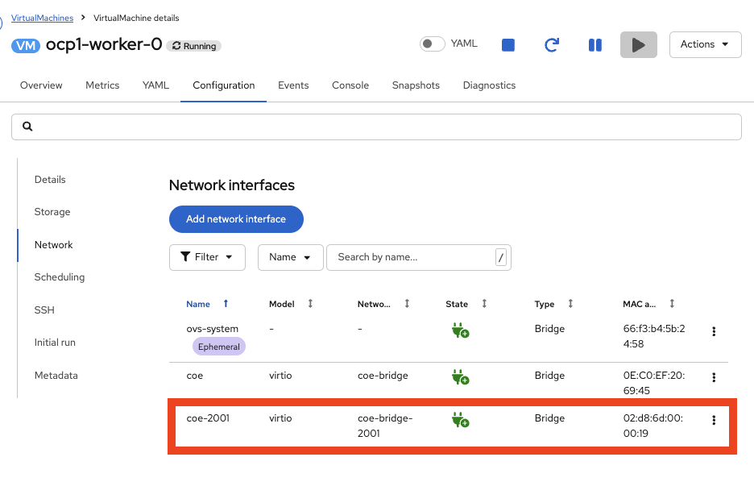
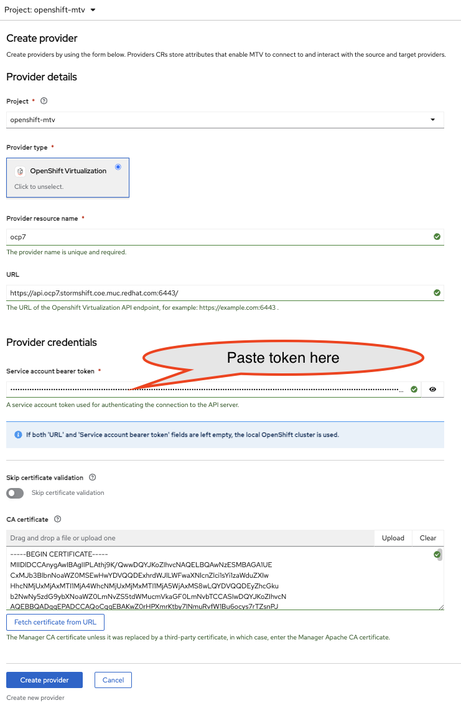

# Cross cluster live migration

Tested with:

|Component|Version|
|---|---|
|OpenShift|v4.21.1|
|OpenShift Virt|v4.21.0|
|MTV|v2.10.5|
|ACM|v2.15.1|

Walk through a cross cluster live migration with Red Hat Advanced Cluster Management for Kubernetes (ACM). Behind the scense Migration Toolkit for Virtualsation (MTV) is also needed.

Documentation for an configuration with ACM: [1.3. Migrating virtual machines between clusters (Technology Preview)](https://docs.redhat.com/en/documentation/red_hat_advanced_cluster_management_for_kubernetes/2.15/html/virtualization/acm-virt?utm_source=chatgpt.com#migrate-vm)

Documentation for an MTV only configuration: [12.4. Enabling cross-cluster live migration for virtual machines](https://docs.redhat.com/en/documentation/openshift_container_platform/4.21/html/virtualization/live-migration#virt-enabling-cclm-for-vms)

During a cross cluster livemigration the entire virtual machine (metadata, RAM, CPU State and disks) will be copied from the source cluster into the target cluster. (Yes, that includes the disks of the virtual machine). 

To synchornise the data virt-handle and  virt-synchronization-controller pods in source and target cluster have to able to communication wiht each other. There are two options available to connected these components:

A) Using a shared L2 network to connect the cluster
B) Using submariner to connected the cluster 

## Cluster overview

We have three identicial clusters in terms of

* OpenShift Version
* CPU Type and Model

Cluster one called ocp1 is the cluster where ACM is located
Cluster two called ocp6 is the source cluster.
Cluster three called ocp7 is the target cluster with mtv.

This cluster are running on bare OpenShift Cluster called ISAR.


CPU Architure is the same at all worker clusters

```shell
oc get nodes -o name | while read line ; do oc debug -q $line -- cat /proc/cpuinfo | grep 'model name' | head -n 1|cut -f2 -d':'| ts  "[$line] " ; done
```

```log
[node/ocp1-cp-0]   Intel Xeon E3-12xx v2 (Ivy Bridge, IBRS)
[node/ocp1-cp-1]   Intel Xeon E3-12xx v2 (Ivy Bridge, IBRS)
[node/ocp1-cp-2]   Intel Xeon E3-12xx v2 (Ivy Bridge, IBRS)
[node/ocp1-worker-0]   Intel Xeon E3-12xx v2 (Ivy Bridge, IBRS)
[node/ocp1-worker-1]   Intel Xeon E3-12xx v2 (Ivy Bridge, IBRS)
[node/ocp1-worker-2]   Intel Xeon E3-12xx v2 (Ivy Bridge, IBRS)
```

```log
[node/ocp6-cp-0]   Intel Xeon E3-12xx v2 (Ivy Bridge, IBRS)
[node/ocp6-cp-1]   Intel Xeon E3-12xx v2 (Ivy Bridge, IBRS)
[node/ocp6-cp-2]   Intel Xeon E3-12xx v2 (Ivy Bridge, IBRS)
[node/ocp6-worker-0]   Intel Xeon E3-12xx v2 (Ivy Bridge, IBRS)
[node/ocp6-worker-1]   Intel Xeon E3-12xx v2 (Ivy Bridge, IBRS)
[node/ocp6-worker-2]   Intel Xeon E3-12xx v2 (Ivy Bridge, IBRS)
```

```log
[node/ocp7-cp-0]   Intel Xeon E3-12xx v2 (Ivy Bridge, IBRS)
[node/ocp7-cp-1]   Intel Xeon E3-12xx v2 (Ivy Bridge, IBRS)
[node/ocp7-cp-2]   Intel Xeon E3-12xx v2 (Ivy Bridge, IBRS)
[node/ocp7-worker-0]   Intel Xeon E3-12xx v2 (Ivy Bridge, IBRS)
[node/ocp7-worker-1]   Intel Xeon E3-12xx v2 (Ivy Bridge, IBRS)
[node/ocp7-worker-2]   Intel Xeon E3-12xx v2 (Ivy Bridge, IBRS)
```

### Start basic ACM Installation and configuration

* Install ACM at Hub Cluster ocp1
* Import Managed Cluster ocp6
* Import Managed Cluster ocp7

Follow the official documentation: [1.3. Migrating virtual machines between clusters (Technology Preview)](https://docs.redhat.com/en/documentation/red_hat_advanced_cluster_management_for_kubernetes/2.15/html/virtualization/acm-virt?utm_source=chatgpt.com#migrate-vm)

* Enable `cnv-mtv-integrations-preview` at Hub Cluster
* Step 6: Enable cross-cluster migration from the OpenShift Virtualization console. **At Hub Cluster** 

!!! warning

    ToDo: Create Docbug

* Step 7: **Is Not Optional.** Configure your network 

!!! warning

    ToDo: Create Docbug

### Network Option A) L2 Network

Both clusters have to be connected via an L2 network.
In my case it's vlan 2001 with `192.168.201.0/24 subnet

Here an high level overview:


In my lab first I have to attach a second interface for live migration traffice

??? quote "Add second interface for live migration"


    #### Add second interface into vlan 2001 for the VM's/nodes

    === "oc apply -f ...."

        ```bash
        oc apply -n stormshift-ocp6-infra -f {{ page.canonical_url }}cclm/isar-2001-net-attach-def.yaml
        oc apply -n stormshift-ocp7-infra -f {{ page.canonical_url }}cclm/isar-2001-net-attach-def.yaml

        ```

    === "isar-2001-net-attach-def.yaml"

        ```yaml
        --8<-- "content/kubevirt/livemigration/cclm/isar-2001-net-attach-def.yaml"
        ```

    #### Adjust VM's to add second interface to worker nodes:

    


???+ bug "There is an documetion bug in the offical docs"

    <https://issues.redhat.com/browse/CNV-74609>

??? example "NodeNetworkConfigurationPolicy for linux bridge into VLAN 2001"

    Apply this to source cluster ocp6 and target cluster ocp7

    === "coe-bridge-via-enp2s0.yaml"

        ```yaml
        --8<-- "content/kubevirt/livemigration/cclm/coe-bridge-via-enp2s0.yaml"
        ```

    === "oc apply -f ...."

        ```bash
        oc apply -f {{ page.canonical_url }}cclm/coe-bridge-via-enp2s0.yaml
        ```

??? example "NetworkAttachmentDefinition for source ocp6 and target ocp7"

    Little helper for find out the interfaces on the nodes:

    ```shell
    oc get nodes -l node-role.kubernetes.io/worker -o name | while read line ; do echo "# $line";oc debug -q $line -- ip -br l | grep enp ; done
    ```

    Apply this to source ocp6

    === "ocp1.net-attach-def.yaml"

        ```yaml
        --8<-- "content/kubevirt/livemigration/cclm/ocp6.net-attach-def.yaml"
        ```

    === "oc apply -f ...."

        ```bash
        oc apply -f {{ page.canonical_url }}cclm/ocp6.net-attach-def.yaml
        ```

    Apply this to target ocp7

    === "ocp7.net-attach-def.yaml"

        ```yaml
        --8<-- "content/kubevirt/livemigration/cclm/ocp7.net-attach-def.yaml"
        ```

    === "oc apply -f ...."

        ```bash
        oc apply -f {{ page.canonical_url }}cclm/ocp7.net-attach-def.yaml
        ```


Apply following `AddOnDeploymentConfig` to Hub Cluster

```yaml hl_lines="10 12"
apiVersion: addon.open-cluster-management.io/v1alpha1
kind: AddOnDeploymentConfig
metadata:
  name: cnv-hco-config
  namespace: open-cluster-management
spec:
  agentInstallNamespace: openshift-cnv
  customizedVariables:
    - name: LIVE_NETWORK_KEY
      value: network
    - name: LIVE_NETWORK_VALUE
      value: livemigration-network
```


Wait until `virt-synchronization-controller-xxx` pods are running:

```shell
oc get pods -n openshift-cnv -l kubevirt.io=virt-synchronization-controller
```

```shell
% oc get pods -n openshift-cnv -l kubevirt.io=virt-synchronization-controller
NAME                                               READY   STATUS    RESTARTS   AGE
virt-synchronization-controller-5b58bd4478-5l25n   1/1     Running   0          3d21h
virt-synchronization-controller-5b58bd4478-zwpn4   1/1     Running   0          3d21h
```

Optional: Check the virt-handler migration network configuration:

```shell
% oc project openshift-cnv
% oc get pods -l kubevirt.io=virt-handler  -o name | while read line ; do oc exec -q $line -- /bin/sh -c 'echo -n "$HOSTNAME $NODE_NAME "; ip -4 -br a show dev migration0' ; done
virt-handler-7qdf4 ocp6-worker-1 migration0@if9   UP             192.168.201.130/24
virt-handler-ptmss ocp6-worker-2 migration0@if9   UP             192.168.201.128/24
virt-handler-txgfq ocp6-worker-0 migration0@if9   UP             192.168.201.129/24
```

```shell
% oc project openshift-cnv
% oc get pods -l kubevirt.io=virt-handler  -o name | while read line ; do oc exec -q $line -- /bin/sh -c 'echo -n "$HOSTNAME $NODE_NAME "; ip -4 -br a show dev migration0' ; done
virt-handler-bjwvt ocp7-worker-1 migration0@if9   UP             192.168.201.3/24
virt-handler-gl8gs ocp7-worker-0 migration0@if9   UP             192.168.201.1/24
virt-handler-kxg7k ocp7-worker-2 migration0@if8   UP             192.168.201.4/24
```

Permissions

ocp6/7
```
oc adm policy add-cluster-role-to-user kubevirt.io:admin rbohne@redhat.com-admin
```

### Network Option B) Use Submariner

Official ACM Submariner documentation: [1.4. Submariner multicluster networking and service discovery](https://docs.redhat.com/en/documentation/red_hat_advanced_cluster_management_for_kubernetes/2.15/html/networking/networking#submariner)

* Create a new clusterset call `virt-clusters` (Optional)
* Attach source (ocp6) and target (ocp7) to the clusterset `virt-clusters` (optional)
* Install Submariner add-ons

In my case I have to enable Globalnet because all my clusters have the clusternetwork.

!!! warning

    ToDo: Create Docbug

    Label nodes!

    ```
    oc label node -l node-role.kubernetes.io/worker submariner.io/gateway=true
    ```

!!! info

    Submariner is no yet available for 4.21

    ```bash
    % podman run -p 50051:50051 -ti --rm   registry.redhat.io/redhat/redhat-operator-index:v4.21
    ```

    ```bash
    % grpcurl -plaintext localhost:50051 api.Registry/ListPackages | jq -r '.name' | wc -l
     129
    % grpcurl -plaintext localhost:50051 api.Registry/ListPackages | jq -r '.name' | grep submar
    %
    ```

    Stop here and try L2..

## OCP1 and OCP7 cluster preperation

### Install following operators

* Nmstate Operator (instantiate the operator now)
* OpenShift Virtualization (instantiate the operator **LATER!**)
* Migration Toolkit for Virtualization (instantiate the operator **LATER!**)

### Instantiate the operator


#### Migration toolkit for Virtualization on OCP1

Instantiate with following change:

```yaml
spec:
  feature_ocp_live_migration: 'true'
```

## Migration toolkit for Virtualization

### Create provide at OCP1

#### Create service account and token at OCP7

Create clusterrole `live-migration-role`

```shell
oc apply  -f {{ page.canonical_url }}cclm/clusterrole.yaml
```

```shell
oc create namespace openshift-mtv
oc create serviceaccount cclm -n openshift-mtv
oc create clusterrolebinding cclm --clusterrole=live-migration-role --serviceaccount=openshift-mtv:cclm
oc apply -f - <<EOF
apiVersion: v1
kind: Secret
metadata:
  name: cclm
  namespace: openshift-mtv
  annotations:
    kubernetes.io/service-account.name: cclm
type: kubernetes.io/service-account-token
EOF
```

Get the token:

```shell

oc get secret "cclm" -n "openshift-mtv" -o  go-template='{{ .data.token | base64decode}}{{"\n"}}'

```

#### Add provider `ocp7` to OCP1



## Run a cross cluster live migration

<iframe width="560" height="315" src="https://www.youtube-nocookie.com/embed/ctx9qYyQlms" title="YouTube video player" frameborder="0" allow="accelerometer; autoplay; clipboard-write; encrypted-media; gyroscope; picture-in-picture" allowfullscreen></iframe>

## Resources

* <https://access.redhat.com/solutions/7130438>
* <https://docs.redhat.com/en/documentation/openshift_container_platform/4.20/html/virtualization/networking#virt-dedicated-network-live-migration>
* <https://github.com/k8snetworkplumbingwg/whereabouts>
* <https://docs.google.com/document/d/1x4r9gJVXVGe8ef6lMcciOqNbywJ5HKtR7E9kHVzIjAQ/edit?tab=t.0>
* <https://github.com/openshift/runbooks/pull/362>
