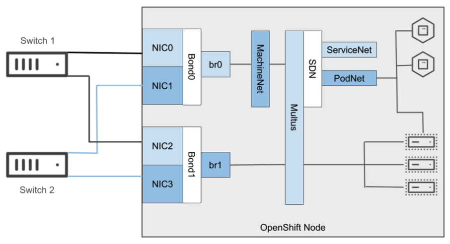

# Networking

An OpenShift cluster is configured using an overlay software-defined network (SDN) for both the Pod and Service networks. By default, VMs are configured with connectivity to the SDN and have the same features/connectivity as Pod-based applications.

Host-level networking configurations are created and applied using the NMstate operator. This includes the ability to report the current configuration options, such as bonds, bridges, and VLAN tags to help segregate networking resources, as well as apply desired-state configuration for those entities.

* *Source: [Red Hat Architecting OpenShift Virtualization](https://redhatquickcourses.github.io/architect-the-ocpvirt/Red%20Hat%20OpenShift%20Virtualization%20-%20Architecting%20OpenShift%20Virtualization/1/chapter5/section2.html)*



## Bonded NICs for Management and SDN

The initial bond interface, consisting of two adapters bonded together with an IP address on the machine network specified and configured at install time, is used for the SDN, management traffic between the node and the control plane (and administrator access), and live migration traffic. During installation, use the [host network interface configuration options](https://docs.openshift.com/container-platform/4.15/installing/installing_bare_metal_ipi/ipi-install-installation-workflow.html#configuring-host-network-interfaces-in-the-install-config-yaml-file_ipi-install-installation-workflow) to configure the bond and set the IP address needed.

## Additional dedicated Network Interfaces for traffic types

The following is a sample NMstate configuration making use of two adapters on the host to create a bonded interface in the LACP (802.1ad) run mode. The bonds are intended to be used for isolating network traffic for different purposes. This provides the advantage of avoiding noisy neighbor scenarios for some interfaces that may have a large impact, for example a backup for a virtual machine consuming significant network throughput impacting ODF or etcd traffic on a shared interface.

```yaml
apiVersion: nmstate.io/v1
kind: NodeNetworkConfigurationPolicy
metadata:
  annotations:
    description: a bond for VM traffic and VLANs
  name: bonding-policy
spec:
  desiredState:
    interfaces:
      - link-aggregation:
          mode: 802.3ad
          port:
            - enp6s0f0
            - enp6s0f1
        name: bond1
        state: up
        type: bond
```

## Example VM Network Configuration

An example configuration for VM network connectivity is below, note that the bond configuration should be a part of the same NodeNetworkConfigurationPolicy to ensure they are configured together.

```yaml
apiVersion: nmstate.io/v1
kind: NodeNetworkConfigurationPolicy
metadata:
  name: ovs-br1-vlan-trunk
spec:
  nodeSelector:
    node-role.kubernetes.io/worker: ''
  desiredState:
    interfaces:
    - name: ovs-br1
      description: |-
        A dedicated OVS bridge with bond2 as a port
        allowing all VLANs and untagged traffic
      type: ovs-bridge
      state: up
      bridge:
        allow-extra-patch-ports: true
        options:
          stp: true
        port:
        - name: bond2
    ovn:
      bridge-mappings:
      - localnet: vlan-2024
        bridge: ovs-br1
        state: present
      - localnet: vlan-1993
        bridge: ovs-br1
        state: present
---
apiVersion: k8s.cni.cncf.io/v1
kind: NetworkAttachmentDefinition
metadata:
  annotations:
    description: VLAN 2024 connection for VMs
  name: vlan-2024
  namespace: default
spec:
  config: |-
    {
      "cniVersion": "0.3.1",
      "name": "vlan-2024",
      "type": "ovn-k8s-cni-overlay",
      "topology": "localnet",
      "netAttachDefName": "default/vlan-2024",
      "vlanID": 2024,
      "ipam": {}
    }
---
apiVersion: k8s.cni.cncf.io/v1
kind: NetworkAttachmentDefinition
metadata:
  annotations:
    description: VLAN 1993 connection for VMs
  name: vlan-1993
  namespace: default
spec:
  config: |-
    {
      "cniVersion": "0.3.1",
      "name": "vlan-1993",
      "type": "ovn-k8s-cni-overlay",
      "topology": "localnet",
      "netAttachDefName": "default/vlan-1993",
      "vlanID": 1993,
      "ipam": {}
    }
```

## Create a bridge on the main interface

All nodes on which the configuration is executed are restarted.

```yaml
oc apply -f - <<EOF
apiVersion: nmstate.io/v1alpha1
kind: NodeNetworkConfigurationPolicy
metadata:
  name: br1-ens3-policy-workers
spec:
  nodeSelector:
    node-role.kubernetes.io/worker: ""
  desiredState:
    interfaces:
      - name: br1
        description: Linux bridge with ens3 as a port
        type: linux-bridge
        state: up
        ipv4:
          enabled: true
          dhcp: true
        bridge:
          options:
            stp:
              enabled: false
          port:
            - name: ens3
EOF
```

## Create Network Attachment Definition

```yaml
cat << EOF | oc apply -f -
apiVersion: "k8s.cni.cncf.io/v1"
kind: NetworkAttachmentDefinition
metadata:
  name: tuning-bridge-fixed
  annotations:
    k8s.v1.cni.cncf.io/resourceName: bridge.network.kubevirt.io/br1
spec:
  config: '{
    "cniVersion": "0.3.1",
    "name": "br1",
    "plugins": [
      {
        "type": "cnv-bridge",
        "bridge": "br1"
      },
      {
        "type": "cnv-tuning"
      }
    ]
  }'
EOF
```

## Localnet example

* Tested with OpenShift 4.17.0
* [Blog post: Red Hat OpenShift Virtualization: Configuring virtual machines to use external networks](https://www.redhat.com/en/blog/access-external-networks-with-openshift-virtualization)

### Configure localnet via NNCP

=== "OC"

    ```bash
    oc apply -f {{ page.canonical_url }}localnet-nncp.yaml
    ```

    ```bash
    % oc get nncp,nnce
    NAME                                                     STATUS      REASON
    nodenetworkconfigurationpolicy.nmstate.io/localnet-coe   Available   SuccessfullyConfigured

    NAME                                                                      STATUS      STATUS AGE   REASON
    nodenetworkconfigurationenactment.nmstate.io/ocp1-worker-1.localnet-coe   Available   2s           SuccessfullyConfigured
    nodenetworkconfigurationenactment.nmstate.io/ocp1-worker-2.localnet-coe   Available   9s           SuccessfullyConfigured
    nodenetworkconfigurationenactment.nmstate.io/ocp1-worker-3.localnet-coe   Available   8s           SuccessfullyConfigured
    ```

=== "localnet-nncp.yaml"

    ```yaml
    --8<-- "content/kubevirt/networking/localnet-nncp.yaml"
    ```

### Apply localnet-demo

#### Create new project

```bash
oc new project localnet-demo
```

#### Create net-attach-def

=== "OC"

    ```bash
    oc apply -f {{ page.canonical_url }}localnet-net-attach-def.yaml
    ```

=== "localnet-net-attach-def.yaml"

    ```yaml
    --8<-- "content/kubevirt/networking/localnet-net-attach-def.yaml"
    ```

#### Attach Fedora VM

=== "OC"

    ```bash
    oc apply -f {{ page.canonical_url }}localnet-fedora-vm.yaml
    ```

=== "localnet-fedora-vm.yaml"

    ```yaml
    --8<-- "content/kubevirt/networking/localnet-fedora-vm.yaml"
    ```

## Debugging purpose

### Create br1 via nmcli

```bash
nmcli con show --active
nmcli con add type bridge ifname br1 con-name br1
nmcli con add type bridge-slave ifname ens3 master br1
nmcli con modify br1 bridge.stp no
nmcli con down 'Wired connection 1'
nmcli con up br1
nmcli con mod br1 connection.autoconnect yes
nmcli con mod 'Wired connection 1' connection.autoconnect no
```

```bash
[root@compute-0 ~]# nmcli con show
NAME                UUID                                  TYPE      DEVICE
br1                 2ae82518-2ff3-4d49-b95c-fc8fbf029d48  bridge    br1
bridge-slave-ens3   faac459f-ce51-4ce9-8616-ea9d23aff675  ethernet  ens3
Wired connection 1  e158d160-1743-3b00-9f67-258849993562  ethernet  --
[root@compute-0 ~]# nmcli -f bridge con show br1
bridge.mac-address:                     --
bridge.stp:                             no
bridge.priority:                        32768
bridge.forward-delay:                   15
bridge.hello-time:                      2
bridge.max-age:                         20
bridge.ageing-time:                     300
bridge.group-forward-mask:              0
bridge.multicast-snooping:              yes
bridge.vlan-filtering:                  no
bridge.vlan-default-pvid:               1
bridge.vlans:                           --
[root@compute-0 ~]# ip a show dev ens3
2: ens3: <BROADCAST,MULTICAST,UP,LOWER_UP> mtu 1500 qdisc fq_codel master br1 state UP group default qlen 1000
    link/ether 52:54:00:a8:34:0d brd ff:ff:ff:ff:ff:ff
[root@compute-0 ~]# ip a show dev br1
17: br1: <BROADCAST,MULTICAST,UP,LOWER_UP> mtu 1500 qdisc noqueue state UP group default qlen 1000
    link/ether 52:54:00:a8:34:0d brd ff:ff:ff:ff:ff:ff
    inet 192.168.52.13/24 brd 192.168.52.255 scope global dynamic noprefixroute br1
       valid_lft 3523sec preferred_lft 3523sec
    inet6 fe80::70f0:71c5:53ea:71ee/64 scope link noprefixroute
       valid_lft forever preferred_lft forever

```

## Connection problem with `kubevirt.io/allow-pod-bridge-network-live-migration` after live migration

### HCP Cluster sendling

```bash
oc get nodes
NAME                      STATUS   ROLES    AGE   VERSION
sendling-d0c14274-6nbvl   Ready    worker   11d   v1.27.8+4fab27b
sendling-d0c14274-sz7rb   Ready    worker   11d   v1.27.8+4fab27b
```

<details>
  <summary>Ping check details node/sendling-d0c14274-6nbvl</summary>

```bash
oc debug node/sendling-d0c14274-6nbvl
Starting pod/sendling-d0c14274-6nbvl-debug ...
To use host binaries, run `chroot /host`
Pod IP: 10.128.8.133
If you don't see a command prompt, try pressing enter.
sh-4.4# ping www.google.de
PING www.google.de (172.253.62.94) 56(84) bytes of data.
64 bytes from bc-in-f94.1e100.net (172.253.62.94): icmp_seq=1 ttl=99 time=112 ms
64 bytes from bc-in-f94.1e100.net (172.253.62.94): icmp_seq=2 ttl=99 time=98.3 ms
^C
--- www.google.de ping statistics ---
2 packets transmitted, 2 received, 0% packet loss, time 1000ms
rtt min/avg/max/mdev = 98.310/105.047/111.785/6.745 ms
sh-4.4# exit
exit

Removing debug pod ...
```

</details>

<details>
  <summary>Ping check details node/sendling-d0c14274-sz7rb</summary>

```bash
$ oc debug node/sendling-d0c14274-sz7rb
Starting pod/sendling-d0c14274-sz7rb-debug ...
To use host binaries, run `chroot /host`
Pod IP: 10.131.9.28
If you don't see a command prompt, try pressing enter.
sh-4.4# ping www.google.de
PING www.google.de (172.253.62.94) 56(84) bytes of data.
```

</details>

* Node sendling-d0c14274-**6nbvl** - Ping google ✅
* Node sendling-d0c14274-**sz7rb** - Ping google ❌

```bash
$ oc get pods -l kubevirt.io=virt-launcher -o wide -n rbohne-hcp-sendling
NAME                                          READY   STATUS      RESTARTS   AGE     IP             NODE                 NOMINATED NODE   READINESS GATES
virt-launcher-sendling-d0c14274-6nbvl-pb6zd   1/1     Running     0          6d2h    10.128.8.133   inf8                 <none>           1/1
virt-launcher-sendling-d0c14274-sz7rb-cw5vj   1/1     Running     0          3d20h   10.131.9.28    ucs-blade-server-1   <none>           1/1
virt-launcher-sendling-d0c14274-sz7rb-mbmv8   0/1     Completed   0          3d20h   10.131.9.28    ucs-blade-server-3   <none>           1/1
virt-launcher-sendling-d0c14274-sz7rb-nb25r   0/1     Completed   0          6d2h    10.131.9.28    ucs-blade-server-1   <none>           1/1
$
```

#### Checkout node routing

Host subnets:

``` bash
$ oc get nodes -o custom-columns="NODE:.metadata.name,node-subnets:.metadata.annotations.k8s\.ovn\.org/node-subnets"
NODE                 node-subnets
...
inf8                 {"default":["10.131.8.0/21"]}
ucs-blade-server-1   {"default":["10.131.0.0/21"]}
ucs-blade-server-3   {"default":["10.130.8.0/21"]}
...

$ oc get pods -n openshift-ovn-kubernetes -o wide -l  app=ovnkube-node
NAME                 READY   STATUS    RESTARTS       AGE    IP             NODE                 NOMINATED NODE   READINESS GATES
...
ovnkube-node-9xt5n   8/8     Running   8              2d7h   10.32.96.101   ucs-blade-server-1   <none>           <none>
ovnkube-node-hhsx5   8/8     Running   8              2d7h   10.32.96.8     inf8                 <none>           <none>
ovnkube-node-qx9bh   8/8     Running   9 (2d6h ago)   2d7h   10.32.96.103   ucs-blade-server-3   <none>           <none>
...

$ oc exec -n openshift-ovn-kubernetes -c ovn-controller ovnkube-node-9xt5n -- ovn-nbctl lr-route-list ovn_cluster_router
IPv4 Routes
Route Table <main>:
             10.128.8.133                100.88.0.9 dst-ip
             10.129.8.107              10.129.8.107 dst-ip rtos-ucs-blade-server-1 ecmp
             10.129.8.107                100.88.0.8 dst-ip ecmp
             10.130.10.29              10.130.10.29 dst-ip rtos-ucs-blade-server-1
              10.131.8.41               10.131.8.41 dst-ip rtos-ucs-blade-server-1
              10.131.9.28               10.131.9.28 dst-ip rtos-ucs-blade-server-1 ecmp
              10.131.9.28                100.88.0.8 dst-ip ecmp
              10.131.9.44               10.131.9.44 dst-ip rtos-ucs-blade-server-1
               100.64.0.2                100.88.0.2 dst-ip
               100.64.0.3                100.88.0.3 dst-ip
               100.64.0.4                100.88.0.4 dst-ip
               100.64.0.5                100.64.0.5 dst-ip
               100.64.0.6                100.88.0.6 dst-ip
               100.64.0.8                100.88.0.8 dst-ip
               100.64.0.9                100.88.0.9 dst-ip
              100.64.0.10               100.88.0.10 dst-ip
            10.128.0.0/21                100.88.0.2 dst-ip
            10.128.8.0/21                100.88.0.6 dst-ip
           10.128.16.0/21               100.88.0.10 dst-ip
            10.129.0.0/21                100.88.0.3 dst-ip
            10.130.0.0/21                100.88.0.4 dst-ip
            10.130.8.0/21                100.88.0.8 dst-ip
            10.131.8.0/21                100.88.0.9 dst-ip
            10.128.0.0/14                100.64.0.5 src-ip

$ oc exec -n openshift-ovn-kubernetes -c ovn-controller ovnkube-node-hhsx5   -- ovn-nbctl lr-route-list ovn_cluster_router
IPv4 Routes
Route Table <main>:
             10.128.8.133              10.128.8.133 dst-ip rtos-inf8
             10.129.8.107                100.88.0.5 dst-ip ecmp
             10.129.8.107                100.88.0.8 dst-ip ecmp
             10.130.10.29                100.88.0.5 dst-ip
              10.131.8.41                100.88.0.5 dst-ip
              10.131.9.28                100.88.0.5 dst-ip ecmp
              10.131.9.28                100.88.0.8 dst-ip ecmp
              10.131.9.44                100.88.0.5 dst-ip
               100.64.0.2                100.88.0.2 dst-ip
               100.64.0.3                100.88.0.3 dst-ip
               100.64.0.4                100.88.0.4 dst-ip
               100.64.0.5                100.88.0.5 dst-ip
               100.64.0.6                100.88.0.6 dst-ip
               100.64.0.8                100.88.0.8 dst-ip
               100.64.0.9                100.64.0.9 dst-ip
              100.64.0.10               100.88.0.10 dst-ip
            10.128.0.0/21                100.88.0.2 dst-ip
            10.128.8.0/21                100.88.0.6 dst-ip
           10.128.16.0/21               100.88.0.10 dst-ip
            10.129.0.0/21                100.88.0.3 dst-ip
            10.130.0.0/21                100.88.0.4 dst-ip
            10.130.8.0/21                100.88.0.8 dst-ip
            10.131.0.0/21                100.88.0.5 dst-ip
            10.128.0.0/14                100.64.0.9 src-ip
$

$ oc exec -n openshift-ovn-kubernetes -c ovn-controller ovnkube-node-qx9bh -- ovn-nbctl lr-route-list ovn_cluster_router
IPv4 Routes
Route Table <main>:
             10.128.8.133                100.88.0.9 dst-ip
             10.129.8.107                100.88.0.5 dst-ip
             10.130.10.29                100.88.0.5 dst-ip
              10.131.8.41                100.88.0.5 dst-ip
              10.131.9.28                100.88.0.5 dst-ip
              10.131.9.44                100.88.0.5 dst-ip
               100.64.0.2                100.88.0.2 dst-ip
               100.64.0.3                100.88.0.3 dst-ip
               100.64.0.4                100.88.0.4 dst-ip
               100.64.0.5                100.88.0.5 dst-ip
               100.64.0.6                100.88.0.6 dst-ip
               100.64.0.8                100.64.0.8 dst-ip
               100.64.0.9                100.88.0.9 dst-ip
              100.64.0.10               100.88.0.10 dst-ip
            10.128.0.0/21                100.88.0.2 dst-ip
            10.128.8.0/21                100.88.0.6 dst-ip
           10.128.16.0/21               100.88.0.10 dst-ip
            10.129.0.0/21                100.88.0.3 dst-ip
            10.130.0.0/21                100.88.0.4 dst-ip
            10.131.0.0/21                100.88.0.5 dst-ip
            10.131.8.0/21                100.88.0.9 dst-ip
            10.128.0.0/14                100.64.0.8 src-ip
```
