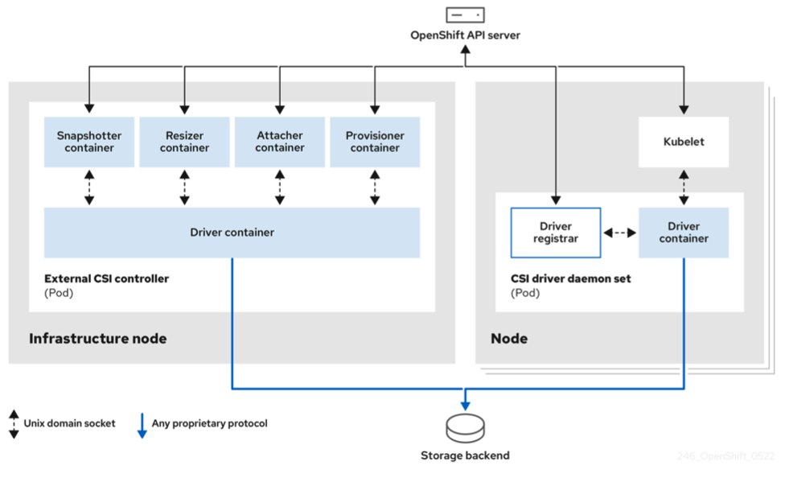
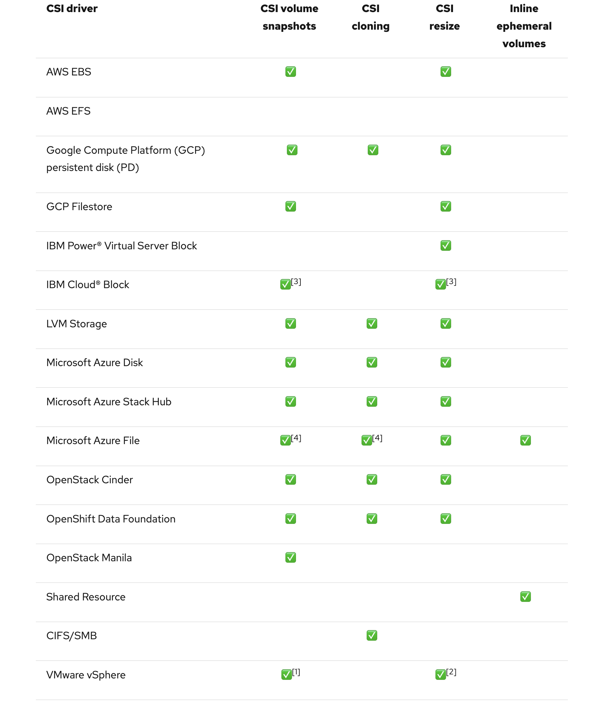

# OpenShift Virtualization Storage

OpenShift Virtualization uses the Persistent Volume (PV) paradigm from Kubernetes to provide storage for virtual machines. More specifically, each VM disk is stored in a dedicated persistent volume provisioned and managed by a CSI (Container Storage Interface) driver provided by Red Hat or a supported storage vendor. This is different from the paradigm used by other virtualization offerings where a single storage device, e.g. an iSCSI/FC LUN or NFS export, is used to store many virtual machine disks.

Live migration of virtual machines requires that all virtual machine disks for the VM being migrated use PVCs with the read-write-many (RWX) access mode.

???+ Important

    OCP Virtualization works differently for storage than vSphere and RHV: The reuse of existing storage is the aim by customers across the board but only little is known about the differences in the consumption of storage with OpenShift Virtualization. This reveals to be a major challenge for most of the vSphere to OCP-V projects.

    In vSphere plain storage consumption, the storage capacity is provided using large volumes (aka described as LUNs) as datastores and then the vmdk "block" devices carved out as files coming from vmfs residing on the datastores. A similar approach is used by RHV.

    In OCP Virtualization instead, every persistent volume for a virtual disk coming from a block storage must be provided as a real world block storage device. This usually leads to trouble on the OCP nodes as well as on the enterprise storage: the number of PVs used for VMs define the number of block volumes to create on the enterprise storage subsystems, to be handled in SAN mappings, and to be managed by FC/iSCSI and multi-pathing on the OCP nodes.

## Overview of the CSI Components

The diagram below provides a high-level overview of the CSI components in an OpenShift cluster. The CSI driver coordinates the creation and management of the volume on the storage device, mounting of the volume to the node hosting the virtual machine, and implementing features like snapshots and volume resizing at the storage volume level.

* *Source: [Docs Red Hat - OCP 4.17 Using CSI](https://docs.openshift.com/container-platform/4.17/storage/container_storage_interface/persistent-storage-csi.html)*



## CSI drivers supported by OpenShift Container Platform

OpenShift Container Platform installs certain CSI drivers by default, giving users storage options that are not possible with in-tree volume plugins.

The following table describes the CSI drivers that are installed with OpenShift Container Platform supported by OpenShift Container Platform and which CSI features they support, such as volume snapshots and resize.

### *Applies to OCP-V version 4.17*

* *Source: [Docs Red Hat - OCP 4.17 Using CSI](https://docs.openshift.com/container-platform/4.17/storage/container_storage_interface/persistent-storage-csi.html)*



* (1) Requires vSphere version 7.0 Update 3 or later for both vCenter Server and ESXi.
  * Does not support fileshare volumes.

* (2) Offline volume expansion: minimum required vSphere version is 6.7 Update 3 P06
  * Online volume expansion: minimum required vSphere version is 7.0 Update 2.

* (3) Does not support offline snapshots or resize. Volume must be attached to a running pod.

* (4) Azure File cloning does not supports NFS protocol. It supports the azurefile-csi storage class, which uses SMB protocol.
  * Azure File cloning and snapshot are Technology Preview features.

## Configuring local storage for virtual machines

When you install the OpenShift Virtualization Operator, the Hostpath Provisioner Operator is automatically installed. HPP is a local storage provisioner designed for OpenShift Virtualization that is created by the Hostpath Provisioner Operator.

Official documentation: [Creating a hostpath provisioner with a basic storage pool](https://docs.redhat.com/en/documentation/openshift_container_platform/4.17/html/virtualization/storage#virt-creating-hpp-basic-storage-pool_virt-configuring-local-storage-with-hpp)

## Using locally created directories as local-storage

The described way below creates an directory and mounts it as a device (`/dev/vdb`) on each node. The appropriate resources must be created accordingly.

### Create a backing directory on each node

Label your CNV nodes:

```code
oc label node/compute-0 node-role.kubernetes.io/cnv
```

### Create MachineConfigPool

!!! important
    One node can only apply one MachineConfigPool! That's why you have to include all worker machineconfigurations.

```yaml
oc apply -f - <<EOF
apiVersion: machineconfiguration.openshift.io/v1
kind: MachineConfigPool
metadata:
  name: cnv
spec:
  machineConfigSelector:
    matchExpressions:
      - {key: machineconfiguration.openshift.io/role, operator: In, values: [worker,cnv]}
  nodeSelector:
    matchLabels:
      node-role.kubernetes.io/cnv: ""
EOF
```

Source: [custom-pools](https://github.com/openshift/machine-config-operator/blob/master/docs/custom-pools.md)

### Create MachineConfig

!!! note
    Machine Config Operator do not support the Ignition filesystem.directory method.
    [Supported vs Unsupported Ignition config changes](https://github.com/openshift/machine-config-operator/blob/master/docs/MachineConfigDaemon.md#supported-vs-unsupported-ignition-config-changes)

```yaml
oc apply -f - <<EOF
apiVersion: machineconfiguration.openshift.io/v1
kind: MachineConfig
metadata:
  name: 50-cnv-local-storage
  labels:
    machineconfiguration.openshift.io/role: cnv
spec:
  config:
    ignition:
      version: 2.2.0
    storage:
      filesystems:
      - name: storage
        mount:
          device: /dev/vdb
          format: xfs
          wipe_filesystem: false
    systemd:
      units:
        - contents: |
            [Unit]
            Description=Create mountpoint /var/srv/storage
            Before=kubelet.service

            [Service]
            ExecStart=/bin/mkdir -p /var/srv/storage

            [Install]
            WantedBy=var-srv-storage.mount
          enabled: true
          name: create-mountpoint-var-srv-storage.service
        - name: var-srv-storage.mount
          enabled: true
          contents: |
            [Unit]
            Before=local-fs.target
            [Mount]
            What=/dev/vdb
            Where=/var/srv/storage
            Type=xfs
            [Install]
            WantedBy=local-fs.target
        - contents: |
            [Unit]
            Description=Set SELinux chcon for hostpath provisioner
            Before=kubelet.service

            [Service]
            ExecStart=/usr/bin/chcon -Rt container_file_t /var/srv/storage

            [Install]
            WantedBy=multi-user.target
          enabled: true
          name: hostpath-provisioner.service
EOF
```

### Create HostPathProvisioner

```yaml
oc apply -f - <<EOF
apiVersion: hostpathprovisioner.kubevirt.io/v1alpha1
kind: HostPathProvisioner
metadata:
  name: hostpath-provisioner
spec:
  imagePullPolicy: IfNotPresent
  pathConfig:
    path: "/var/srv/storage"
    useNamingPrefix: "false"
EOF
```

### Create StorageClass

```yaml
oc apply -f - <<EOF
apiVersion: storage.k8s.io/v1
kind: StorageClass
metadata:
  name: hostpath-provisioner
provisioner: kubevirt.io/hostpath-provisioner
reclaimPolicy: Delete
volumeBindingMode: WaitForFirstConsumer
EOF
```
