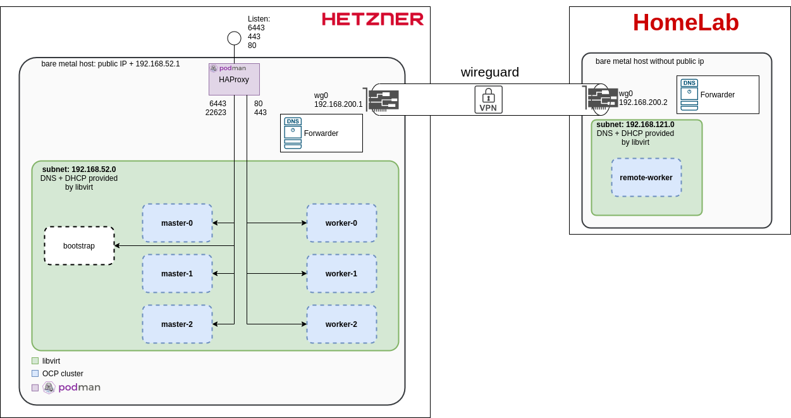

# OpenShift Remote worker

These are my personal nodes, nothing more nothing less and of course not perfect.



## Install WireGuard VPN on all sites

```bash
sudo yum install https://dl.fedoraproject.org/pub/epel/epel-release-latest-8.noarch.rpm https://www.elrepo.org/elrepo-release-8.el8.elrepo.noarch.rpm

sudo yum install kmod-wireguard wireguard-tools


reboot # because of kernel modules


wg genkey > wg-private-key-$(hostname -f )
chmod 600 wg-private-key-$(hostname -f )
cat wg-private-key-$(hostname -f )
wg pubkey < wg-private-key-$(hostname -f ) >  wg-public-key-$(hostname -f )
cat wg-public-key-$(hostname -f )

```

Don't forgot to open the UDP port at your hetzner firewall and linux firewall:
`firewall-cmd --zone=public --add-port 51820/udp --permanent && firewall-cmd --reload`

*Wireguard config on Hetzner server*
```bash
cat > /etc/wireguard/wg0.conf <<EOF
# host01.openshift.pub
[Interface]
Address = 192.168.200.1/24
PrivateKey = xxxx # Private key from hetzner
ListenPort = 51820


# skull.egamting.bohne.io
[Peer]
PublicKey = xxxx # PubKey of your HomeLab
AllowedIPs = 192.168.200.2/32,192.168.121.0/24
PersistentKeepalive = 25
EOF
```

*Wireguard config on HomeLab*

```bash
cat > /etc/wireguard/wg0.conf <<EOF
[Interface]
Address = 192.168.200.2/24
PrivateKey =
ListenPort = 51820

[Peer]
PublicKey = xxxxx
Endpoint = $HETZER_SERVER_IP$:51820
AllowedIPs = 192.168.200.1/32,192.168.52.0/24
PersistentKeepalive = 25
EOF
```

Start service on both sites:
```bash
systemctl enable --now wg-quick@wg0.service
```

Check Wireguard status wih `wg` commad.

Add wg0 interface to trusted zone on all sites:
```
firewall-cmd --zone=trusted --add-interface=wg0 --permanent
firewall-cmd --reload
```

## Prepare Hetzner Host (host01.openshift.pub)

Setup your cluster with hetzner-ocp4

Stop cluster

Adjust network, add forwarder
```
<forwarder domain='skull.egmating.bohne.io' addr='192.168.200.2'/>
```

Setup DNS forwarder

```bash
cat > /etc/dnsmasq.d/wireguard-dns-forwarder.conf <<EOF
interface=wg0
listen-address=192.168.200.1
server=/compute.local/192.168.52.1
server=/api-int.demo.openshift.pub/192.168.52.1
no-resolv
strict-order
expand-hosts
except-interface=lo
EOF

systemctl enable --now dnsmasq

```


## Prepare HomeLab Host (skull)

Install libvirt
`yum install...`

Setup DNS forwarder
```bash
cat > /etc/dnsmasq.d/wireguard-dns-forwarder.conf <<EOF
bind-interfaces
interface=wg0
listen-address=192.168.200.2
server=/skull.egmating.bohne.io/192.168.121.1
no-resolv
strict-order
expand-hosts
except-interface=lo
EOF

systemctl enable --now dnsmasq

```

Create remote worker network

```bash
cat - > network-remote-worker.xml <<EOF

<network>
  <name>remote-worker</name>
  <uuid>3f22931e-fcf7-437f-9085-d8adcab53451</uuid>
  <forward mode='nat'>
    <nat>
      <port start='1024' end='65535'/>
    </nat>
  </forward>
  <bridge name='virbr1' stp='on' delay='0'/>
  <mac address='52:54:00:4d:92:bf'/>
  <domain name='skull.egmating.bohne.io'/>
  <dns>
    <forwarder domain='compute.local' addr='192.168.200.1'/>
    <forwarder domain='api-int.demo.openshift.pub' addr='192.168.200.1'/>
    <host ip='192.168.121.2'>
      <hostname>remote-worker.skull.egmating.bohne.io</hostname>
    </host>
  </dns>
  <ip address='192.168.121.1' netmask='255.255.255.0'>
    <dhcp>
      <range start='192.168.121.200' end='192.168.121.254'/>
      <host mac='52:54:00:a8:79:02' name='remote-worker.skull.egmating.bohne.io' ip='192.168.121.2'/>
    </dhcp>
  </ip>
</network>
EOF

virsh net-create network-remote-worker.xml
```

Download CoreOS
```bash
cd /var/lib/libvirt/images/
curl -L -O https://mirror.openshift.com/pub/openshift-v4/dependencies/rhcos/4.7/latest/rhcos-4.7.0-x86_64-live.x86_64.iso
```


Create remote worker VM boot into live iso

```bash

qemu-img create -f qcow2 /var/lib/libvirt/images/remote-worker.qcow2 120G
virt-install \
  --name remote-worker \
  --memory 8192 --vcpus 4 \
  --disk /var/lib/libvirt/images/remote-worker.qcow2 \
  --os-variant rhel8.0 \
  --cdrom /var/lib/libvirt/images/rhcos-4.7.0-x86_64-live.x86_64.iso \
  --network network=remote-worker,mac=52:54:00:a8:79:02 \
  --console pty,target_type=virtio

```

At CoreOS Live ISO
```bash
# Use curl to avoid SSL chizzel

curl -k -o worker.ign https://api-int.demo.openshift.pub:22623/config/worker

sudo coreos-installer install /dev/vda \
  --ignition-file worker.ign

reboot

```


Approve CSR and debug errors :-)
