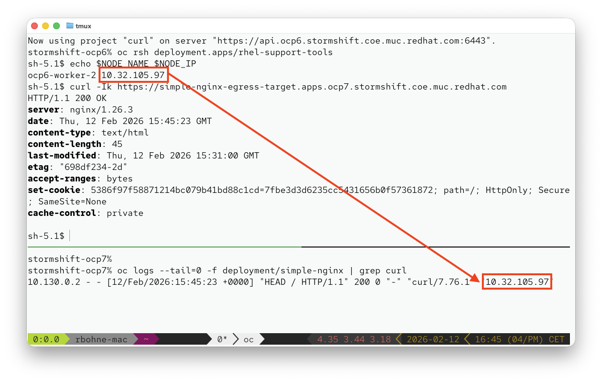

# Egress IP

This example shows how to configure **egress IP addresses** on OpenShift so that traffic from selected namespaces uses a fixed source IP. That makes it easy to whitelist cluster workloads in firewalls or identify traffic in logs (e.g., from a specific app or team).

**Official documentation:** [Chapter 9. Configuring an egress IP address](https://docs.redhat.com/en/documentation/openshift_container_platform/4.20/html/ovn-kubernetes_network_plugin/configuring-egress-ips-ovn)

**Tested with:**

| Component | Version |
|-----------|---------|
| OpenShift | v4.20.1 |

## Overview


Two OpenShift clusters are used:

### Cluster: ocp6

**Source cluster** — here we configure egress IPs and run a pod that sends HTTP requests (via `curl`) to the web server on **ocp7**.

=== "Worker Nodes"

    | NAME            | IP           |
    |-----------------|--------------|
    | ocp6-worker-0   | 10.32.105.95 |
    | ocp6-worker-1   | 10.32.105.96 |
    | ocp6-worker-2   | 10.32.105.97 |

=== "oc output"

    ```shell
    % oc get nodes -l node-role.kubernetes.io/worker -o custom-columns='NAME:.metadata.name,IP:.status.addresses[0].address'
    NAME            IP
    ocp6-worker-0   10.32.105.95
    ocp6-worker-1   10.32.105.96
    ocp6-worker-2   10.32.105.97
    ```

### Cluster: ocp7

**Target cluster** — hosts a simple web server so we can see the **sender IP** in the server logs and verify egress IP behavior.

=== "Worker Nodes"

    | NAME            | IP            |
    |-----------------|---------------|
    | ocp7-worker-0   | 10.32.105.103 |
    | ocp7-worker-1   | 10.32.105.104 |
    | ocp7-worker-2   | 10.32.105.105 |

=== "oc output"

    ```shell
    % oc get nodes -l node-role.kubernetes.io/worker -o custom-columns='NAME:.metadata.name,IP:.status.addresses[0].address'
    NAME            IP
    ocp7-worker-0   10.32.105.103
    ocp7-worker-1   10.32.105.104
    ocp7-worker-2   10.32.105.105
    ```

## Deploy simple-nginx on ocp7

Deploy the target web server on **ocp7** (target cluster):

```shell
oc new-project egress-target
oc apply -k 'git@github.com:openshift-examples/kustomize/components/simple-nginx?ref=2026-02-12'
```

Get the route hostname:

```shell
% oc get route simple-nginx -o jsonpath='{.spec.host}'
simple-nginx-egress-target.apps.ocp7.stormshift.coe.muc.redhat.com
```

Call the web server from your machine (or any client):

```shell
% curl -I https://simple-nginx-egress-target.apps.ocp7.stormshift.coe.muc.redhat.com

HTTP/1.1 200 OK
server: nginx/1.26.3
date: Thu, 12 Feb 2026 15:19:17 GMT
content-type: text/html
content-length: 45
last-modified: Thu, 12 Feb 2026 15:17:31 GMT
etag: "698def0b-2d"
accept-ranges: bytes
set-cookie: 5386f97f58871214bc079b41bd88c1cd=43357b3d3312239cb10b42b1c3d17138; path=/; HttpOnly; Secure; SameSite=None
cache-control: private
```

Check the pod logs to see the client IP that nginx recorded:

```shell
% oc logs -f deployment/simple-nginx | grep curl
10.130.0.2 - - [12/Feb/2026:15:26:45 +0000] "HEAD / HTTP/1.1" 200 0 "-" "curl/8.12.1" "10.32.96.62"
```

- `10.130.0.2` — cluster-internal IP of the ingress/router pod
- `10.32.96.62` — **real client IP** (your machine or the pod making the request)

## Configure egress IP on ocp6

1. **Label worker nodes** so they can be assigned egress IPs:

    ```shell
    % oc label node -l node-role.kubernetes.io/worker k8s.ovn.org/egress-assignable=""
    node/ocp6-worker-0 labeled
    node/ocp6-worker-1 labeled
    node/ocp6-worker-2 labeled
    ```

2. **Create an `EgressIP` object** with the IPs to use and which namespaces (via label) will use them. Use IPs that are valid on your cluster’s egress network and not in use by nodes or other services:

    ```shell
    oc apply -f - <<EOF
    apiVersion: k8s.ovn.org/v1
    kind: EgressIP
    metadata:
      name: egress-coe
    spec:
      egressIPs:
        - 10.32.105.72
        - 10.32.105.73
      namespaceSelector:
        matchLabels:
          egress: coe
    EOF
    ```

3. **Deploy a curl pod** in a new project — first **without** the egress label so traffic uses the node IP:

    ```shell
    oc new-project curl
    oc apply -k 'git@github.com:openshift-examples/kustomize/components/rhel-support-tools?rev=2026-02-12'
    ```

    From inside the pod, run `curl` against the ocp7 route. The pod is on `ocp6-worker-2` (node IP `10.32.105.97`):

    ```shell
    % oc rsh deployment.apps/rhel-support-tools
    sh-5.1$ echo $NODE_NAME $NODE_IP
    ocp6-worker-2 10.32.105.97
    sh-5.1$ curl -Ik https://simple-nginx-egress-target.apps.ocp7.stormshift.coe.muc.redhat.com
    HTTP/1.1 200 OK
    server: nginx/1.26.3
    date: Thu, 12 Feb 2026 15:42:30 GMT
    content-type: text/html
    content-length: 45
    last-modified: Thu, 12 Feb 2026 15:31:00 GMT
    etag: "698df234-2d"
    accept-ranges: bytes
    set-cookie: 5386f97f58871214bc079b41bd88c1cd=7fbe3d3d6235cc5431656b0f57361872; path=/; HttpOnly; Secure; SameSite=None
    cache-control: private

    sh-5.1$
    ```

    On **ocp7**, check the `simple-nginx` logs. The client IP should be the **node IP** (`10.32.105.97`), because the namespace does not use egress IP yet:

    ```shell
    10.130.0.2 - - [12/Feb/2026:15:42:30 +0000] "HEAD / HTTP/1.1" 200 0 "-" "curl/7.76.1" "10.32.105.97"
    ```

    

4. **Enable egress IP** for the `curl` namespace by adding the label that matches the `EgressIP` `namespaceSelector`:

    ```shell
    oc label namespace/curl egress=coe
    ```

    Run `curl` again from the same pod (still on the same node):

    ```shell
    % oc rsh deployment.apps/rhel-support-tools
    sh-5.1$ echo $NODE_NAME $NODE_IP
    ocp6-worker-2 10.32.105.97
    sh-5.1$ curl -Ik https://simple-nginx-egress-target.apps.ocp7.stormshift.coe.muc.redhat.com
    HTTP/1.1 200 OK
    server: nginx/1.26.3
    date: Thu, 12 Feb 2026 15:48:38 GMT
    content-type: text/html
    content-length: 45
    last-modified: Thu, 12 Feb 2026 15:31:00 GMT
    etag: "698df234-2d"
    accept-ranges: bytes
    set-cookie: 5386f97f58871214bc079b41bd88c1cd=7fbe3d3d6235cc5431656b0f57361872; path=/; HttpOnly; Secure; SameSite=None
    cache-control: private

    sh-5.1$
    ```

    On **ocp7**, check the `simple-nginx` logs again. The client IP should now be **10.32.105.72** — one of the egress IPs — instead of the node IP:

    ```shell
    10.130.0.2 - - [12/Feb/2026:15:48:38 +0000] "HEAD / HTTP/1.1" 200 0 "-" "curl/7.76.1" "10.32.105.72"
    ```

    **Source IP is now the egress IP.**

    
