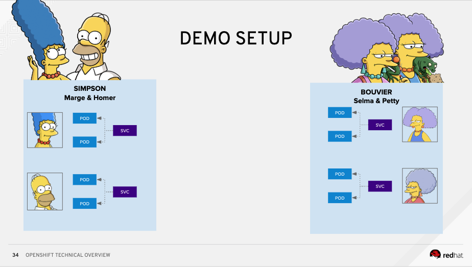
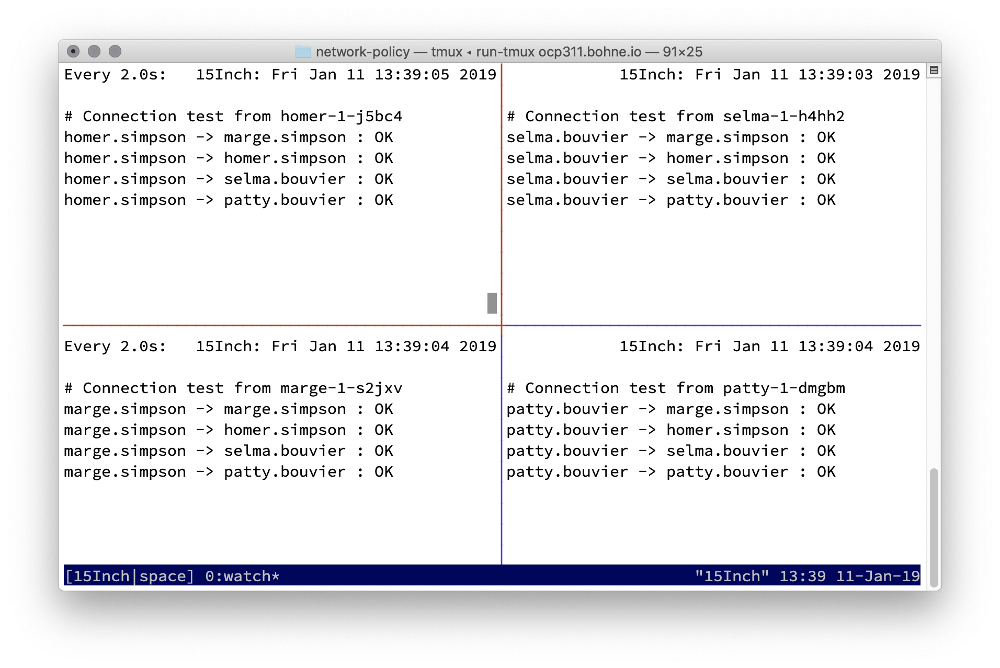
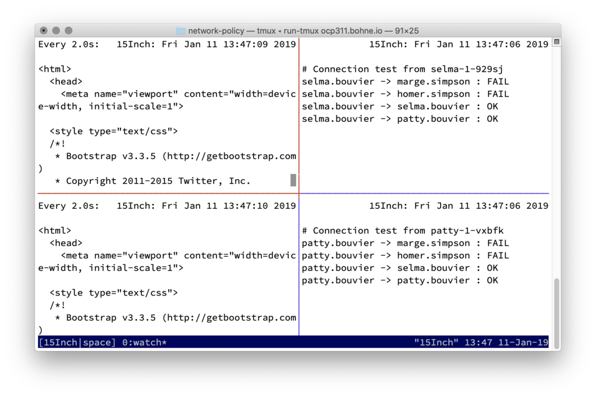
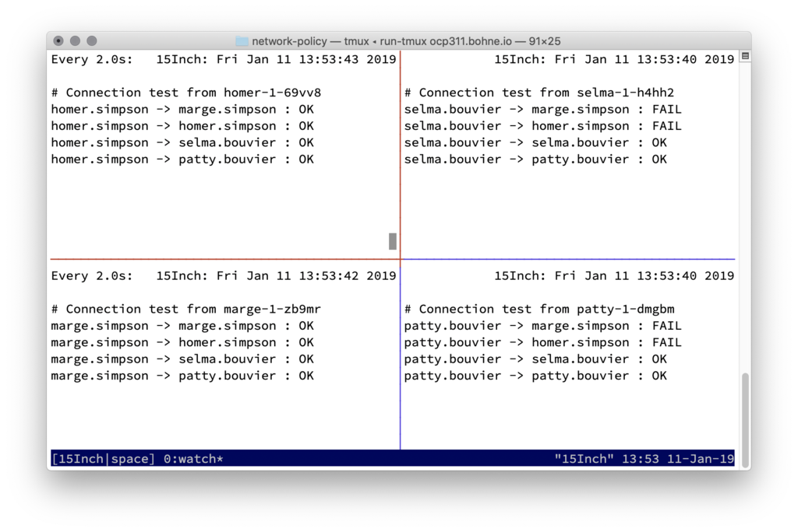
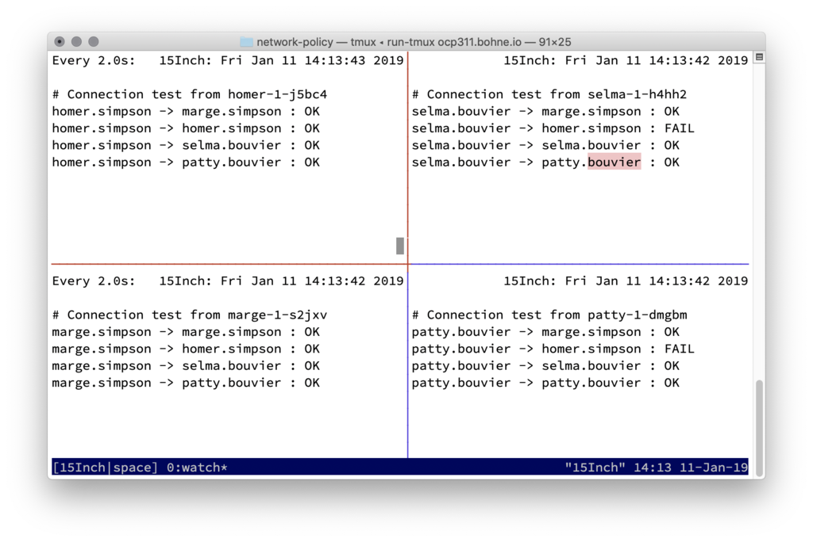

# Network Policy with OVS - DRAFT

## ToDo

* [x] Provide helper scripts
* [ ] Add node labels to ensure to run only on one or two nodes
* [ ] Know Issue: [Bug 1768608](https://bugzilla.redhat.com/show_bug.cgi?id=1768608) - NetworkPolicy not applied to router

## Nice to know / Basics

1. Based on labeling or annotations
2. Empty label selector match all
3. Rules for allowing
4. Ingress -&gt; who can connect to this POD
5. Egress -&gt; where can this POD connect to
6. **Rules**
   1. traffic is allowed unless a Network Policy selecting the POD
   2. traffic is denied if pod is selected in policie but none of them have any rules allowing it
   3. =  You can only write rules that allow traffic!
   4. Scope: Namespace

## Tutorial / Demo - OpenShift v4!

### Deploy demo environment 

Install openshift  
OpenShift 3 with redhat/openshift-ovs-networkpolicy  
OpenShift 4 network policy is the default



```text
oc new-project bouvier
oc new-app quay.io/rbo/demo-http:master --name patty
oc expose svc/patty
oc scale dc/patty --replicas=2
oc new-app quay.io/rbo/demo-http:master --name selma
oc scale dc/selma --replicas=2
oc expose svc/selma

oc new-project simpson
oc new-app quay.io/rbo/demo-http:master --name homer
oc expose svc/homer
oc scale dc/homer --replicas=2
oc new-app quay.io/rbo/demo-http:master --name marge
oc scale dc/marge --replicas=2
oc expose svc/marge
```

### Download some helper scripts



```text
curl -L -O https://raw.githubusercontent.com/rbo/openshift-examples/master/networking/network-policy-ovs/run-tmux
curl -L -O https://raw.githubusercontent.com/rbo/openshift-examples/master/networking/network-policy-ovs/dump-net.sh
```



```
git clone https://github.com/rbo/openshift-examples.git
cd openshift-examples/networking/network-policy-ovs/
```



### Run connection overview

```
./run-tmux <domain>
```


Connection's to yourself \(eg. homer.simpson -&gt; homer.simpson\) is flapping if you have more than one pod. Because of:  [https://gist.github.com/rbo/4aa7840ebabf11aad3bf7961619e18e3](https://gist.github.com/rbo/4aa7840ebabf11aad3bf7961619e18e3)

### Discover the environment

#### List network namespaces

```bash
$ oc get netnamespaces | grep -E '(NAME|simpson|bouvier|default|openshift-ingress)'
NAME                                                    NETID      EGRESS IPS
bouvier                                                 11758537
default                                                 0
openshift-ingress                                       16110902
openshift-ingress-operator                              9037087
simpson                                                 8829068
```

#### List POD's

```text
$ oc get pods -o wide -n simpson
NAME            READY     STATUS    RESTARTS   AGE       IP           NODE      NOMINATED NODE
homer-1-69vv8   1/1       Running   0          2h        10.30.2.88   node0     <none>
homer-1-j5bc4   1/1       Running   0          2h        10.30.3.62   node1     <none>
marge-1-s2jxv   1/1       Running   0          2h        10.30.3.60   node1     <none>
marge-1-zb9mr   1/1       Running   0          2h        10.30.2.90   node0     <none>

$ oc get pods -o wide -n bouvier
NAME            READY     STATUS    RESTARTS   AGE       IP           NODE      NOMINATED NODE
patty-1-dmgbm   1/1       Running   0          2h        10.30.3.61   node1     <none>
patty-1-vxbfk   1/1       Running   0          2h        10.30.2.85   node0     <none>
selma-1-929sj   1/1       Running   0          2h        10.30.3.59   node1     <none>
selma-1-h4hh2   1/1       Running   0          2h        10.30.2.89   node0     <none>
```

### Let's start with the Network Policy demonstration

Every one can connect to each other



```bash
./dump-net.sh --all case0
```

### Case 1 - Simpson - default-deny

```text
oc create -n simpson  -f - <<EOF
kind: NetworkPolicy
apiVersion: networking.k8s.io/v1
metadata:
  name: default-deny
spec:
  podSelector: {}
EOF
```

!!! failure
    Screenshot - Passt nicht zu OpenShift 4

    


```text
$ ./dump-net.sh compute-0 compute-0.case1
$ diff -Nuar compute-0.case0.OpenFlow13 compute-0.case1.OpenFlow13
--- node1.case0.OpenFlow13    2019-01-11 16:26:55.000000000 +0100
+++ node1.case1.OpenFlow13    2019-01-11 16:27:15.000000000 +0100
@@ -97,7 +97,6 @@
  table=80, priority=50,reg1=15425483 actions=output:NXM_NX_REG2[]
  table=80, priority=50,reg1=4095272 actions=output:NXM_NX_REG2[]
  table=80, priority=50,reg1=3770897 actions=output:NXM_NX_REG2[]
- table=80, priority=50,reg1=13787457 actions=output:NXM_NX_REG2[]
  table=80, priority=0 actions=drop
  cookie=0xd685fff4, table=90, priority=100,ip,nw_dst=10.30.2.0/24 actions=move:NXM_NX_REG0[]->NXM_NX_TUN_ID[0..31],set_field:192.168.1.104->tun_dst,output:vxlan0
  cookie=0x22f1ebcf, table=90, priority=100,ip,nw_dst=10.30.1.0/24 actions=move:NXM_NX_REG0[]->NXM_NX_TUN_ID[0..31],set_field:192.168.1.111->tun_dst,output:vxlan0

```

#### 2\) Simpson allow from openshift-ingress namespaces, because of router

```text
$ oc create -n simpson -f - <<EOF
apiVersion: networking.k8s.io/v1
kind: NetworkPolicy
metadata:
  name: allow-from-openshift-ingress-namespace
spec:
  podSelector:
  ingress:
  - from:
    - namespaceSelector:
        matchLabels:
          name: openshift-ingress
EOF
$ ./dump-net.sh node1 node1.case2
$ $ diff -Nuar node1.case1.OpenFlow13 node1.case2.OpenFlow13
--- node1.case1.OpenFlow13    2019-01-11 16:27:15.000000000 +0100
+++ node1.case2.OpenFlow13    2019-01-11 16:28:32.000000000 +0100
@@ -77,6 +77,7 @@
  table=70, priority=0 actions=drop
  table=80, priority=300,ip,nw_src=10.30.3.1 actions=output:NXM_NX_REG2[]
  table=80, priority=200,ct_state=+rpl,ip actions=output:NXM_NX_REG2[]
+ table=80, priority=150,reg0=0,reg1=13787457 actions=output:NXM_NX_REG2[]
  table=80, priority=50,reg1=0 actions=output:NXM_NX_REG2[]
  table=80, priority=50,reg1=9337404 actions=output:NXM_NX_REG2[]
  table=80, priority=50,reg1=10389750 actions=output:NXM_NX_REG2[]
```


#### 3\) Simpson allow internal communcation

```text
$ oc create -n simpson -f - <<EOF
apiVersion: networking.k8s.io/v1
kind: NetworkPolicy
metadata:
  name: allow-from-same-namespace
spec:
  podSelector:
  ingress:
  - from:
    - podSelector: {}
EOF
$ ./dump-net.sh node1 node1.case3
$ diff -Nuar node1.case2.OpenFlow13 node1.case3.OpenFlow13
--- node1.case2.OpenFlow13    2019-01-11 16:28:32.000000000 +0100
+++ node1.case3.OpenFlow13    2019-01-11 16:29:46.000000000 +0100
@@ -78,6 +78,7 @@
  table=80, priority=300,ip,nw_src=10.30.3.1 actions=output:NXM_NX_REG2[]
  table=80, priority=200,ct_state=+rpl,ip actions=output:NXM_NX_REG2[]
  table=80, priority=150,reg0=0,reg1=13787457 actions=output:NXM_NX_REG2[]
+ table=80, priority=150,reg0=13787457,reg1=13787457 actions=output:NXM_NX_REG2[]
  table=80, priority=50,reg1=0 actions=output:NXM_NX_REG2[]
  table=80, priority=50,reg1=9337404 actions=output:NXM_NX_REG2[]
  table=80, priority=50,reg1=10389750 actions=output:NXM_NX_REG2[]
```



#### 4\) Selma and Patty want's to talk with Marge!

```text
$ oc label namespace/bouvier name=bouvier
$ oc create -n simpson -f - <<EOF
apiVersion: networking.k8s.io/v1
kind: NetworkPolicy
metadata:
  name: allow-from-bouviers-to-marge
spec:
  podSelector:
    matchLabels:
      app: marge
  ingress:
  - from:
    - namespaceSelector:
        matchLabels:
          name: bouvier
EOF
$ ./dump-net.sh node1 node1.case4
$ diff -Nuar node1.case3.OpenFlow13 node1.case4.OpenFlow13
--- node1.case3.OpenFlow13    2019-01-11 16:29:46.000000000 +0100
+++ node1.case4.OpenFlow13    2019-01-11 16:31:57.000000000 +0100
@@ -79,6 +79,8 @@
  table=80, priority=200,ct_state=+rpl,ip actions=output:NXM_NX_REG2[]
  table=80, priority=150,reg0=0,reg1=13787457 actions=output:NXM_NX_REG2[]
  table=80, priority=150,reg0=13787457,reg1=13787457 actions=output:NXM_NX_REG2[]
+ table=80, priority=150,ip,reg0=3770897,reg1=13787457,nw_dst=10.30.2.90 actions=output:NXM_NX_REG2[]
+ table=80, priority=150,ip,reg0=3770897,reg1=13787457,nw_dst=10.30.3.60 actions=output:NXM_NX_REG2[]
  table=80, priority=50,reg1=0 actions=output:NXM_NX_REG2[]
  table=80, priority=50,reg1=9337404 actions=output:NXM_NX_REG2[]
  table=80, priority=50,reg1=10389750 actions=output:NXM_NX_REG2[]
```



### Bonus, one EgressNetworkPolicy


Not supported in OpenShift 4.2


```text
$ ./dump-net.sh ip-10-0-137-107.us-east-2.compute.internal bevore-egress
$ oc create -f - <<EOF
apiVersion: network.openshift.io/v1
kind: EgressNetworkPolicy
metadata:
  name: default
spec:
  egress:
  - to:
      cidrSelector: 1.2.3.0/24
    type: Allow
  - to:
      dnsName: www.foo.com
    type: Allow
  - to:
      cidrSelector: 0.0.0.0/0
    type: Deny
EOF
$ ./dump-net.sh ip-10-0-137-107.us-east-2.compute.internal after-egress
$ diff -Nuar bevore-egress*OpenFlow13  after-egress*OpenFlow13
--- bevore-egress.ip-10-0-137-107.us-east-2.compute.internal.OpenFlow13    2019-04-10 15:37:26.000000000 +0200
+++ after-egress.ip-10-0-137-107.us-east-2.compute.internal.OpenFlow13    2019-04-10 15:38:28.000000000 +0200
@@ -187,7 +187,11 @@
  table=100, priority=200,tcp,nw_dst=10.0.137.107,tp_dst=53 actions=output:tun0
  table=100, priority=200,udp,nw_dst=10.0.137.107,tp_dst=53 actions=output:tun0
  table=100, priority=0 actions=goto_table:101
+ table=101, priority=3,ip,reg0=12517435,nw_dst=1.2.3.0/24 actions=output:tun0
+ table=101, priority=2,ip,reg0=12517435,nw_dst=52.73.176.251 actions=output:tun0
+ table=101, priority=2,ip,reg0=12517435,nw_dst=54.165.87.12 actions=output:tun0
  table=101, priority=1,reg0=598050 actions=drop
+ table=101, priority=1,ip,reg0=12517435 actions=drop
  table=101, priority=0 actions=output:tun0
  table=110, priority=0 actions=drop
  table=111, priority=100 actions=move:NXM_NX_REG0[]->NXM_NX_TUN_ID[0..31],set_field:10.0.132.241->tun_dst,output:vxlan0,set_field:10.0.153.82->tun_dst,output:vxlan0,set_field:10.0.170.239->tun_dst,output:vxlan0,goto_table:120
```

### Destroy demo env

```text
oc delete project simpson bouvier
```

## Useful commands

| Info | Command |
| :--- | :--- |
| Convert HEX -&gt; DEC | `printf "%d\n" 0xcc4bb1` |
| Convert DEC -&gt; HEX | `printf "0x%x\n" 13388721` |
| Dump OpenFlow rules | `oc rsh -n openshift-sdn PODNAME ovs-ofctl -O OpenFlow13 --no-stats dump-flows br0` |
| List bridges and ports | `oc rsh -n openshift-sdn PODNAME ovs-vsctl show` |
| Convert HEX to DEC in OpenFlow dump | `perl -pe 's/(reg0\|reg1)=([^ ,]+)/sprintf("%s=%d",$1, hex($2))/eg'` |
| Clean stats in OpenFlow dump | `sed -E 's!(duration\|n_packets\|n_bytes)=[^ ]+!\1=CLEANED!g'`   please consider: `--no-stats` |
| List contract table | `conntrack -L` |
| List iptables | `iptables-save` |
| List NETID's | `oc get netnamespaces` |
| List host subnets | `oc get hostsubnets` |
| List cluster network | `oc get clusternetwork` |

