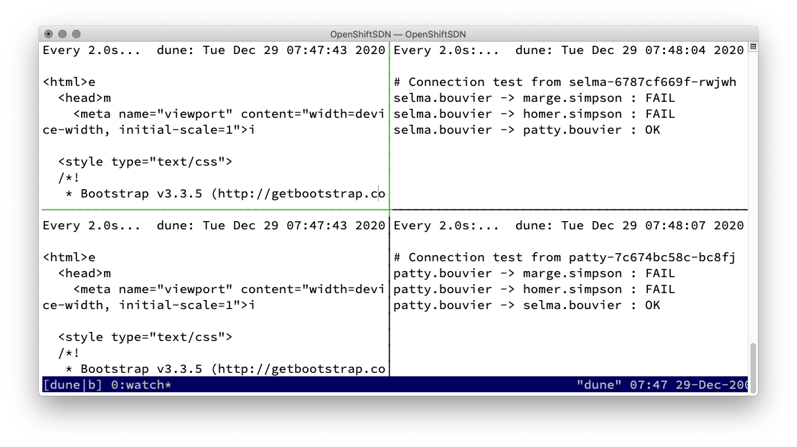

# Network Policy with OpenShiftSDN

## Nice to know / Basics

1. Based on labeling or annotations
    * project / namespaces seldom have labels :-/
2. Empty label selector match all
2. Rules for allowing
    * Ingress -&gt; who can connect to this POD
    * Egress -&gt; where can this POD connect to
4. **Rules**
    * traffic is allowed unless a Network Policy selecting the POD
    * traffic is denied if pod is selected in policie but none of them have any rules allowing it
    * =  You can only write rules that allow traffic!
    * Scope: Namespace

## Tutorial / Demo - OpenShift v4!

### Deploy demo environment

Install OpenShift
OpenShift 3 with redhat/openshift-ovs-networkpolicy
OpenShift 4 network policy is the default


```bash
oc new-project bouvier
oc new-app quay.io/rbo/demo-http:master --name patty
oc expose svc/patty
oc scale deployment/patty --replicas=2
oc new-app quay.io/rbo/demo-http:master --name selma
oc scale deployment/selma --replicas=2
oc expose svc/selma

oc new-project simpson
oc new-app quay.io/rbo/demo-http:master --name homer
oc expose svc/homer
oc scale deployment/homer --replicas=2
oc new-app quay.io/rbo/demo-http:master --name marge
oc scale deployment/marge --replicas=2
oc expose svc/marge
```
### Download some helper scripts

```bash
git clone https://github.com/openshift-examples/network-policies-tests.git
cd network-policies-tests/
```
### Run connection overview

```bash
./run-tmux.sh apps.<cluster_name>.<base_domain>
```


### Discover the environment

#### List network namespaces

```bash
$ oc get netnamespaces | grep -E '(NAME|simpson|bouvier|default|openshift-ingress)'
NAME                                               NETID      EGRESS IPS
bouvier                                            7511589
default                                            0
openshift-ingress                                  3002648
openshift-ingress-operator                         13811611
simpson                                            12446308
```

#### List POD's

```bash
$ oc get pods -o wide -n simpson
NAME                     READY   STATUS    RESTARTS   AGE   IP            NODE       NOMINATED NODE   READINESS GATES
homer-789b78ddf5-njfpf   1/1     Running   0          86m   10.128.0.63   master-0   <none>           <none>
marge-5887b4985f-4b7md   1/1     Running   0          86m   10.128.0.64   master-0   <none>           <none>

$ oc get pods -o wide -n bouvier
NAME                     READY   STATUS    RESTARTS   AGE   IP            NODE       NOMINATED NODE   READINESS GATES
patty-7c674bc58c-bc8fj   1/1     Running   0          87m   10.128.0.62   master-0   <none>           <none>
selma-6787cf669f-rwjwh   1/1     Running   0          87m   10.129.1.8    master-2   <none>           <none>
```

### Let's start with the Network Policy demonstration

Every one can connect to each other


```bash
$ ./OpenShiftSDN/dump-net.sh --all case0
Run dump at
master-0;sdn-ht7pl
master-2;sdn-kv9l5
master-1;sdn-qh2wm
Write: case0.2020-12-29-08-43-00.1609227780.master-0.OpenFlow13
Write: case0.2020-12-29-08-43-00.1609227780.master-0.iptables
Write: case0.2020-12-29-08-43-00.1609227780.master-2.OpenFlow13
Write: case0.2020-12-29-08-43-00.1609227780.master-2.iptables
Write: case0.2020-12-29-08-43-00.1609227780.master-1.OpenFlow13
Write: case0.2020-12-29-08-43-00.1609227780.master-1.iptables
```

### Case 1 - Simpson - default-deny

```yaml
oc create -n simpson  -f - <<EOF
kind: NetworkPolicy
apiVersion: networking.k8s.io/v1
metadata:
  name: default-deny
spec:
  podSelector: {}
EOF
```




```bash
$ ./OpenShiftSDN/dump-net.sh master-0 master-0.case1
Run dump at
master-0;sdn-ht7pl
Write: master-0.case1.master-0.OpenFlow13
Write: master-0.case1.master-0.iptables
```

Diff of OpenFlow13
```diff
$ diff -Nuar case0.2020-12-29-08-43-00.1609227780.master-0.OpenFlow13 master-0.case1.OpenFlow13
--- case0.2020-12-29-08-43-00.1609227780.master-0.OpenFlow13	2020-12-29 08:43:01.000000000 +0100
+++ master-0.case1.OpenFlow13	1970-01-01 01:00:00.000000000 +0100
@@ -1,190 +0,0 @@
- priority=1000,ct_state=-trk,ip actions=ct(table=0)
- priority=400,ip,in_port=tun0,nw_src=10.128.0.1 actions=goto_table:30
- priority=300,ip,in_port=tun0,nw_src=10.128.0.0/23,nw_dst=10.128.0.0/14 actions=goto_table:25
- priority=250,ip,in_port=tun0,nw_dst=224.0.0.0/4 actions=drop
- priority=200,arp,in_port=vxlan0,arp_spa=10.128.0.0/14,arp_tpa=10.128.0.0/23 actions=move:NXM_NX_TUN_ID[0..31]->NXM_NX_REG0[],goto_table:10
- priority=200,ip,in_port=vxlan0,nw_src=10.128.0.0/14 actions=move:NXM_NX_TUN_ID[0..31]->NXM_NX_REG0[],goto_table:10
- priority=200,ip,in_port=vxlan0,nw_dst=10.128.0.0/14 actions=move:NXM_NX_TUN_ID[0..31]->NXM_NX_REG0[],goto_table:10
- priority=200,arp,in_port=tun0,arp_spa=10.128.0.1,arp_tpa=10.128.0.0/14 actions=goto_table:30
- priority=200,ip,in_port=tun0 actions=goto_table:30
- priority=150,in_port=vxlan0 actions=drop
- priority=150,in_port=tun0 actions=drop
- priority=100,arp actions=goto_table:20
- priority=100,ip actions=goto_table:20
- priority=0 actions=drop
- cookie=0x1d71af99, table=10, priority=100,tun_src=192.168.50.12 actions=goto_table:30
- cookie=0x161a7f59, table=10, priority=100,tun_src=192.168.50.11 actions=goto_table:30
- table=10, priority=0 actions=drop
- table=20, priority=100,arp,in_port=vethd46201d2,arp_spa=10.128.0.2,arp_sha=00:00:0a:80:00:02/00:00:ff:ff:ff:ff actions=load:0x475327->NXM_NX_REG0[],goto_table:21
- table=20, priority=100,arp,in_port=veth4e414189,arp_spa=10.128.0.3,arp_sha=00:00:0a:80:00:03/00:00:ff:ff:ff:ff actions=load:0x475327->NXM_NX_REG0[],goto_table:21
- table=20, priority=100,arp,in_port=veth0025790d,arp_spa=10.128.0.4,arp_sha=00:00:0a:80:00:04/00:00:ff:ff:ff:ff actions=load:0xc46324->NXM_NX_REG0[],goto_table:21
- table=20, priority=100,arp,in_port=veth25fb1f17,arp_spa=10.128.0.5,arp_sha=00:00:0a:80:00:05/00:00:ff:ff:ff:ff actions=load:0x9230fb->NXM_NX_REG0[],goto_table:21
- table=20, priority=100,arp,in_port=veth9ed8d346,arp_spa=10.128.0.6,arp_sha=00:00:0a:80:00:06/00:00:ff:ff:ff:ff actions=load:0xd8a3cf->NXM_NX_REG0[],goto_table:21
- table=20, priority=100,arp,in_port=vethbd80adef,arp_spa=10.128.0.7,arp_sha=00:00:0a:80:00:07/00:00:ff:ff:ff:ff actions=load:0x7819d6->NXM_NX_REG0[],goto_table:21
- table=20, priority=100,arp,in_port=veth6d10aca6,arp_spa=10.128.0.8,arp_sha=00:00:0a:80:00:08/00:00:ff:ff:ff:ff actions=load:0x71b55a->NXM_NX_REG0[],goto_table:21
- table=20, priority=100,arp,in_port=vethf4d750d6,arp_spa=10.128.0.9,arp_sha=00:00:0a:80:00:09/00:00:ff:ff:ff:ff actions=load:0xc1d466->NXM_NX_REG0[],goto_table:21
- table=20, priority=100,arp,in_port=veth31039f7e,arp_spa=10.128.0.10,arp_sha=00:00:0a:80:00:0a/00:00:ff:ff:ff:ff actions=load:0xc1d466->NXM_NX_REG0[],goto_table:21
- table=20, priority=100,arp,in_port=vetha565fc85,arp_spa=10.128.0.12,arp_sha=00:00:0a:80:00:0c/00:00:ff:ff:ff:ff actions=load:0xc46324->NXM_NX_REG0[],goto_table:21
- table=20, priority=100,arp,in_port=veth3e1b4c0d,arp_spa=10.128.0.19,arp_sha=00:00:0a:80:00:13/00:00:ff:ff:ff:ff actions=load:0xc1d466->NXM_NX_REG0[],goto_table:21
- table=20, priority=100,arp,in_port=veth2ef77857,arp_spa=10.128.0.22,arp_sha=00:00:0a:80:00:16/00:00:ff:ff:ff:ff actions=load:0x6b2011->NXM_NX_REG0[],goto_table:21
- table=20, priority=100,arp,in_port=vethbdf38f86,arp_spa=10.128.0.26,arp_sha=00:00:0a:80:00:1a/00:00:ff:ff:ff:ff actions=load:0xeda37e->NXM_NX_REG0[],goto_table:21
- table=20, priority=100,arp,in_port=veth7ef4c743,arp_spa=10.128.0.32,arp_sha=00:00:0a:80:00:20/00:00:ff:ff:ff:ff actions=load:0x802940->NXM_NX_REG0[],goto_table:21
- table=20, priority=100,arp,in_port=veth3f643c57,arp_spa=10.128.0.34,arp_sha=00:00:0a:80:00:22/00:00:ff:ff:ff:ff actions=load:0x61697e->NXM_NX_REG0[],goto_table:21
- table=20, priority=100,arp,in_port=veth98d3cbc2,arp_spa=10.128.0.37,arp_sha=00:00:0a:80:00:25/00:00:ff:ff:ff:ff actions=load:0xca8cd4->NXM_NX_REG0[],goto_table:21
- table=20, priority=100,arp,in_port=veth1e8a5ed2,arp_spa=10.128.0.43,arp_sha=00:00:0a:80:00:2b/00:00:ff:ff:ff:ff actions=load:0xc1d466->NXM_NX_REG0[],goto_table:21
- table=20, priority=100,arp,in_port=vethbd015c31,arp_spa=10.128.0.44,arp_sha=00:00:0a:80:00:2c/00:00:ff:ff:ff:ff actions=load:0xc1d466->NXM_NX_REG0[],goto_table:21
- table=20, priority=100,arp,in_port=vethe69cad58,arp_spa=10.128.0.45,arp_sha=00:00:0a:80:00:2d/00:00:ff:ff:ff:ff actions=load:0xc1d466->NXM_NX_REG0[],goto_table:21
- table=20, priority=100,arp,in_port=veth24794758,arp_spa=10.128.0.47,arp_sha=00:00:0a:80:00:2f/00:00:ff:ff:ff:ff actions=load:0xc1d466->NXM_NX_REG0[],goto_table:21
- table=20, priority=100,arp,in_port=vethf72ff6f7,arp_spa=10.128.0.52,arp_sha=00:00:0a:80:00:34/00:00:ff:ff:ff:ff actions=load:0x15e784->NXM_NX_REG0[],goto_table:21
- table=20, priority=100,arp,in_port=vethad55f19e,arp_spa=10.128.0.62,arp_sha=00:00:0a:80:00:3e/00:00:ff:ff:ff:ff actions=load:0x729e25->NXM_NX_REG0[],goto_table:21
- table=20, priority=100,arp,in_port=veth21dbd829,arp_spa=10.128.0.63,arp_sha=00:00:0a:80:00:3f/00:00:ff:ff:ff:ff actions=load:0xbdea64->NXM_NX_REG0[],goto_table:21
- table=20, priority=100,arp,in_port=vethcbfe86ee,arp_spa=10.128.0.64,arp_sha=00:00:0a:80:00:40/00:00:ff:ff:ff:ff actions=load:0xbdea64->NXM_NX_REG0[],goto_table:21
- table=20, priority=100,ip,in_port=vethd46201d2,nw_src=10.128.0.2 actions=load:0x475327->NXM_NX_REG0[],goto_table:21
- table=20, priority=100,ip,in_port=veth4e414189,nw_src=10.128.0.3 actions=load:0x475327->NXM_NX_REG0[],goto_table:21
- table=20, priority=100,ip,in_port=veth0025790d,nw_src=10.128.0.4 actions=load:0xc46324->NXM_NX_REG0[],goto_table:21
- table=20, priority=100,ip,in_port=veth25fb1f17,nw_src=10.128.0.5 actions=load:0x9230fb->NXM_NX_REG0[],goto_table:21
- table=20, priority=100,ip,in_port=veth9ed8d346,nw_src=10.128.0.6 actions=load:0xd8a3cf->NXM_NX_REG0[],goto_table:21
- table=20, priority=100,ip,in_port=vethbd80adef,nw_src=10.128.0.7 actions=load:0x7819d6->NXM_NX_REG0[],goto_table:21
- table=20, priority=100,ip,in_port=veth6d10aca6,nw_src=10.128.0.8 actions=load:0x71b55a->NXM_NX_REG0[],goto_table:21
- table=20, priority=100,ip,in_port=vethf4d750d6,nw_src=10.128.0.9 actions=load:0xc1d466->NXM_NX_REG0[],goto_table:21
- table=20, priority=100,ip,in_port=veth31039f7e,nw_src=10.128.0.10 actions=load:0xc1d466->NXM_NX_REG0[],goto_table:21
- table=20, priority=100,ip,in_port=vetha565fc85,nw_src=10.128.0.12 actions=load:0xc46324->NXM_NX_REG0[],goto_table:21
- table=20, priority=100,ip,in_port=veth3e1b4c0d,nw_src=10.128.0.19 actions=load:0xc1d466->NXM_NX_REG0[],goto_table:21
- table=20, priority=100,ip,in_port=veth2ef77857,nw_src=10.128.0.22 actions=load:0x6b2011->NXM_NX_REG0[],goto_table:21
- table=20, priority=100,ip,in_port=vethbdf38f86,nw_src=10.128.0.26 actions=load:0xeda37e->NXM_NX_REG0[],goto_table:21
- table=20, priority=100,ip,in_port=veth7ef4c743,nw_src=10.128.0.32 actions=load:0x802940->NXM_NX_REG0[],goto_table:21
- table=20, priority=100,ip,in_port=veth3f643c57,nw_src=10.128.0.34 actions=load:0x61697e->NXM_NX_REG0[],goto_table:21
- table=20, priority=100,ip,in_port=veth98d3cbc2,nw_src=10.128.0.37 actions=load:0xca8cd4->NXM_NX_REG0[],goto_table:21
- table=20, priority=100,ip,in_port=veth1e8a5ed2,nw_src=10.128.0.43 actions=load:0xc1d466->NXM_NX_REG0[],goto_table:21
- table=20, priority=100,ip,in_port=vethbd015c31,nw_src=10.128.0.44 actions=load:0xc1d466->NXM_NX_REG0[],goto_table:21
- table=20, priority=100,ip,in_port=vethe69cad58,nw_src=10.128.0.45 actions=load:0xc1d466->NXM_NX_REG0[],goto_table:21
- table=20, priority=100,ip,in_port=veth24794758,nw_src=10.128.0.47 actions=load:0xc1d466->NXM_NX_REG0[],goto_table:21
- table=20, priority=100,ip,in_port=vethf72ff6f7,nw_src=10.128.0.52 actions=load:0x15e784->NXM_NX_REG0[],goto_table:21
- table=20, priority=100,ip,in_port=vethad55f19e,nw_src=10.128.0.62 actions=load:0x729e25->NXM_NX_REG0[],goto_table:21
- table=20, priority=100,ip,in_port=veth21dbd829,nw_src=10.128.0.63 actions=load:0xbdea64->NXM_NX_REG0[],goto_table:21
- table=20, priority=100,ip,in_port=vethcbfe86ee,nw_src=10.128.0.64 actions=load:0xbdea64->NXM_NX_REG0[],goto_table:21
- table=20, priority=0 actions=drop
- table=21, priority=200,ip,nw_dst=10.128.0.0/14 actions=ct(commit,table=30)
- table=21, priority=0 actions=goto_table:30
- table=25, priority=100,ip,nw_src=10.128.0.2 actions=load:0x475327->NXM_NX_REG0[],goto_table:30
- table=25, priority=100,ip,nw_src=10.128.0.3 actions=load:0x475327->NXM_NX_REG0[],goto_table:30
- table=25, priority=100,ip,nw_src=10.128.0.4 actions=load:0xc46324->NXM_NX_REG0[],goto_table:30
- table=25, priority=100,ip,nw_src=10.128.0.5 actions=load:0x9230fb->NXM_NX_REG0[],goto_table:30
- table=25, priority=100,ip,nw_src=10.128.0.6 actions=load:0xd8a3cf->NXM_NX_REG0[],goto_table:30
- table=25, priority=100,ip,nw_src=10.128.0.7 actions=load:0x7819d6->NXM_NX_REG0[],goto_table:30
- table=25, priority=100,ip,nw_src=10.128.0.8 actions=load:0x71b55a->NXM_NX_REG0[],goto_table:30
- table=25, priority=100,ip,nw_src=10.128.0.9 actions=load:0xc1d466->NXM_NX_REG0[],goto_table:30
- table=25, priority=100,ip,nw_src=10.128.0.10 actions=load:0xc1d466->NXM_NX_REG0[],goto_table:30
- table=25, priority=100,ip,nw_src=10.128.0.12 actions=load:0xc46324->NXM_NX_REG0[],goto_table:30
- table=25, priority=100,ip,nw_src=10.128.0.19 actions=load:0xc1d466->NXM_NX_REG0[],goto_table:30
- table=25, priority=100,ip,nw_src=10.128.0.22 actions=load:0x6b2011->NXM_NX_REG0[],goto_table:30
- table=25, priority=100,ip,nw_src=10.128.0.26 actions=load:0xeda37e->NXM_NX_REG0[],goto_table:30
- table=25, priority=100,ip,nw_src=10.128.0.32 actions=load:0x802940->NXM_NX_REG0[],goto_table:30
- table=25, priority=100,ip,nw_src=10.128.0.34 actions=load:0x61697e->NXM_NX_REG0[],goto_table:30
- table=25, priority=100,ip,nw_src=10.128.0.37 actions=load:0xca8cd4->NXM_NX_REG0[],goto_table:30
- table=25, priority=100,ip,nw_src=10.128.0.43 actions=load:0xc1d466->NXM_NX_REG0[],goto_table:30
- table=25, priority=100,ip,nw_src=10.128.0.44 actions=load:0xc1d466->NXM_NX_REG0[],goto_table:30
- table=25, priority=100,ip,nw_src=10.128.0.45 actions=load:0xc1d466->NXM_NX_REG0[],goto_table:30
- table=25, priority=100,ip,nw_src=10.128.0.47 actions=load:0xc1d466->NXM_NX_REG0[],goto_table:30
- table=25, priority=100,ip,nw_src=10.128.0.52 actions=load:0x15e784->NXM_NX_REG0[],goto_table:30
- table=25, priority=100,ip,nw_src=10.128.0.62 actions=load:0x729e25->NXM_NX_REG0[],goto_table:30
- table=25, priority=100,ip,nw_src=10.128.0.63 actions=load:0xbdea64->NXM_NX_REG0[],goto_table:30
- table=25, priority=100,ip,nw_src=10.128.0.64 actions=load:0xbdea64->NXM_NX_REG0[],goto_table:30
- table=25, priority=0 actions=drop
- table=30, priority=300,arp,arp_tpa=10.128.0.1 actions=output:tun0
- table=30, priority=300,ip,nw_dst=10.128.0.1 actions=output:tun0
- table=30, priority=300,ct_state=+rpl,ip,nw_dst=10.128.0.0/23 actions=ct(table=70,nat)
- table=30, priority=200,arp,arp_tpa=10.128.0.0/23 actions=goto_table:40
- table=30, priority=200,ip,nw_dst=10.128.0.0/23 actions=goto_table:70
- table=30, priority=100,arp,arp_tpa=10.128.0.0/14 actions=goto_table:50
- table=30, priority=100,ip,nw_dst=10.128.0.0/14 actions=goto_table:90
- table=30, priority=100,ip,nw_dst=172.30.0.0/16 actions=goto_table:60
- table=30, priority=50,ip,in_port=vxlan0,nw_dst=224.0.0.0/4 actions=goto_table:120
- table=30, priority=25,ip,nw_dst=224.0.0.0/4 actions=goto_table:110
- table=30, priority=0,ip actions=goto_table:100
- table=30, priority=0,arp actions=drop
- table=40, priority=100,arp,arp_tpa=10.128.0.2 actions=output:vethd46201d2
- table=40, priority=100,arp,arp_tpa=10.128.0.3 actions=output:veth4e414189
- table=40, priority=100,arp,arp_tpa=10.128.0.4 actions=output:veth0025790d
- table=40, priority=100,arp,arp_tpa=10.128.0.5 actions=output:veth25fb1f17
- table=40, priority=100,arp,arp_tpa=10.128.0.6 actions=output:veth9ed8d346
- table=40, priority=100,arp,arp_tpa=10.128.0.7 actions=output:vethbd80adef
- table=40, priority=100,arp,arp_tpa=10.128.0.8 actions=output:veth6d10aca6
- table=40, priority=100,arp,arp_tpa=10.128.0.9 actions=output:vethf4d750d6
- table=40, priority=100,arp,arp_tpa=10.128.0.10 actions=output:veth31039f7e
- table=40, priority=100,arp,arp_tpa=10.128.0.12 actions=output:vetha565fc85
- table=40, priority=100,arp,arp_tpa=10.128.0.19 actions=output:veth3e1b4c0d
- table=40, priority=100,arp,arp_tpa=10.128.0.22 actions=output:veth2ef77857
- table=40, priority=100,arp,arp_tpa=10.128.0.26 actions=output:vethbdf38f86
- table=40, priority=100,arp,arp_tpa=10.128.0.32 actions=output:veth7ef4c743
- table=40, priority=100,arp,arp_tpa=10.128.0.34 actions=output:veth3f643c57
- table=40, priority=100,arp,arp_tpa=10.128.0.37 actions=output:veth98d3cbc2
- table=40, priority=100,arp,arp_tpa=10.128.0.43 actions=output:veth1e8a5ed2
- table=40, priority=100,arp,arp_tpa=10.128.0.44 actions=output:vethbd015c31
- table=40, priority=100,arp,arp_tpa=10.128.0.45 actions=output:vethe69cad58
- table=40, priority=100,arp,arp_tpa=10.128.0.47 actions=output:veth24794758
- table=40, priority=100,arp,arp_tpa=10.128.0.52 actions=output:vethf72ff6f7
- table=40, priority=100,arp,arp_tpa=10.128.0.62 actions=output:vethad55f19e
- table=40, priority=100,arp,arp_tpa=10.128.0.63 actions=output:veth21dbd829
- table=40, priority=100,arp,arp_tpa=10.128.0.64 actions=output:vethcbfe86ee
- table=40, priority=0 actions=drop
- cookie=0x1d71af99, table=50, priority=100,arp,arp_tpa=10.129.0.0/23 actions=move:NXM_NX_REG0[]->NXM_NX_TUN_ID[0..31],set_field:192.168.50.12->tun_dst,output:vxlan0
- cookie=0x161a7f59, table=50, priority=100,arp,arp_tpa=10.130.0.0/23 actions=move:NXM_NX_REG0[]->NXM_NX_TUN_ID[0..31],set_field:192.168.50.11->tun_dst,output:vxlan0
- table=50, priority=0 actions=drop
- table=60, priority=200 actions=output:tun0
- table=60, priority=0 actions=drop
- table=70, priority=100,ip,nw_dst=10.128.0.2 actions=load:0x475327->NXM_NX_REG1[],load:0x3->NXM_NX_REG2[],goto_table:80
- table=70, priority=100,ip,nw_dst=10.128.0.3 actions=load:0x475327->NXM_NX_REG1[],load:0x4->NXM_NX_REG2[],goto_table:80
- table=70, priority=100,ip,nw_dst=10.128.0.4 actions=load:0xc46324->NXM_NX_REG1[],load:0x5->NXM_NX_REG2[],goto_table:80
- table=70, priority=100,ip,nw_dst=10.128.0.5 actions=load:0x9230fb->NXM_NX_REG1[],load:0x6->NXM_NX_REG2[],goto_table:80
- table=70, priority=100,ip,nw_dst=10.128.0.6 actions=load:0xd8a3cf->NXM_NX_REG1[],load:0x7->NXM_NX_REG2[],goto_table:80
- table=70, priority=100,ip,nw_dst=10.128.0.7 actions=load:0x7819d6->NXM_NX_REG1[],load:0x8->NXM_NX_REG2[],goto_table:80
- table=70, priority=100,ip,nw_dst=10.128.0.8 actions=load:0x71b55a->NXM_NX_REG1[],load:0x9->NXM_NX_REG2[],goto_table:80
- table=70, priority=100,ip,nw_dst=10.128.0.9 actions=load:0xc1d466->NXM_NX_REG1[],load:0xa->NXM_NX_REG2[],goto_table:80
- table=70, priority=100,ip,nw_dst=10.128.0.10 actions=load:0xc1d466->NXM_NX_REG1[],load:0xb->NXM_NX_REG2[],goto_table:80
- table=70, priority=100,ip,nw_dst=10.128.0.12 actions=load:0xc46324->NXM_NX_REG1[],load:0xd->NXM_NX_REG2[],goto_table:80
- table=70, priority=100,ip,nw_dst=10.128.0.19 actions=load:0xc1d466->NXM_NX_REG1[],load:0x14->NXM_NX_REG2[],goto_table:80
- table=70, priority=100,ip,nw_dst=10.128.0.22 actions=load:0x6b2011->NXM_NX_REG1[],load:0x17->NXM_NX_REG2[],goto_table:80
- table=70, priority=100,ip,nw_dst=10.128.0.26 actions=load:0xeda37e->NXM_NX_REG1[],load:0x1b->NXM_NX_REG2[],goto_table:80
- table=70, priority=100,ip,nw_dst=10.128.0.32 actions=load:0x802940->NXM_NX_REG1[],load:0x21->NXM_NX_REG2[],goto_table:80
- table=70, priority=100,ip,nw_dst=10.128.0.34 actions=load:0x61697e->NXM_NX_REG1[],load:0x23->NXM_NX_REG2[],goto_table:80
- table=70, priority=100,ip,nw_dst=10.128.0.37 actions=load:0xca8cd4->NXM_NX_REG1[],load:0x26->NXM_NX_REG2[],goto_table:80
- table=70, priority=100,ip,nw_dst=10.128.0.43 actions=load:0xc1d466->NXM_NX_REG1[],load:0x2c->NXM_NX_REG2[],goto_table:80
- table=70, priority=100,ip,nw_dst=10.128.0.44 actions=load:0xc1d466->NXM_NX_REG1[],load:0x2d->NXM_NX_REG2[],goto_table:80
- table=70, priority=100,ip,nw_dst=10.128.0.45 actions=load:0xc1d466->NXM_NX_REG1[],load:0x2e->NXM_NX_REG2[],goto_table:80
- table=70, priority=100,ip,nw_dst=10.128.0.47 actions=load:0xc1d466->NXM_NX_REG1[],load:0x30->NXM_NX_REG2[],goto_table:80
- table=70, priority=100,ip,nw_dst=10.128.0.52 actions=load:0x15e784->NXM_NX_REG1[],load:0x35->NXM_NX_REG2[],goto_table:80
- table=70, priority=100,ip,nw_dst=10.128.0.62 actions=load:0x729e25->NXM_NX_REG1[],load:0x3f->NXM_NX_REG2[],goto_table:80
- table=70, priority=100,ip,nw_dst=10.128.0.63 actions=load:0xbdea64->NXM_NX_REG1[],load:0x40->NXM_NX_REG2[],goto_table:80
- table=70, priority=100,ip,nw_dst=10.128.0.64 actions=load:0xbdea64->NXM_NX_REG1[],load:0x41->NXM_NX_REG2[],goto_table:80
- table=70, priority=0 actions=drop
- table=80, priority=300,ip,nw_src=10.128.0.1 actions=output:NXM_NX_REG2[]
- table=80, priority=200,ct_state=+rpl,ip actions=output:NXM_NX_REG2[]
- table=80, priority=50,reg1=4674343 actions=output:NXM_NX_REG2[]
- table=80, priority=50,reg1=12870436 actions=output:NXM_NX_REG2[]
- table=80, priority=50,reg1=9580795 actions=output:NXM_NX_REG2[]
- table=80, priority=50,reg1=14197711 actions=output:NXM_NX_REG2[]
- table=80, priority=50,reg1=7870934 actions=output:NXM_NX_REG2[]
- table=80, priority=50,reg1=7451994 actions=output:NXM_NX_REG2[]
- table=80, priority=50,reg1=12702822 actions=output:NXM_NX_REG2[]
- table=80, priority=50,reg1=6383998 actions=output:NXM_NX_REG2[]
- table=80, priority=50,reg1=7020561 actions=output:NXM_NX_REG2[]
- table=80, priority=50,reg1=13274324 actions=output:NXM_NX_REG2[]
- table=80, priority=50,reg1=15573886 actions=output:NXM_NX_REG2[]
- table=80, priority=50,reg1=8399168 actions=output:NXM_NX_REG2[]
- table=80, priority=50,reg1=1435524 actions=output:NXM_NX_REG2[]
- table=80, priority=50,reg1=7511589 actions=output:NXM_NX_REG2[]
- table=80, priority=50,reg1=12446308 actions=output:NXM_NX_REG2[]
- table=80, priority=0 actions=drop
- cookie=0x1d71af99, table=90, priority=100,ip,nw_dst=10.129.0.0/23 actions=move:NXM_NX_REG0[]->NXM_NX_TUN_ID[0..31],set_field:192.168.50.12->tun_dst,output:vxlan0
- cookie=0x161a7f59, table=90, priority=100,ip,nw_dst=10.130.0.0/23 actions=move:NXM_NX_REG0[]->NXM_NX_TUN_ID[0..31],set_field:192.168.50.11->tun_dst,output:vxlan0
- table=90, priority=0 actions=drop
- table=100, priority=300,udp,tp_dst=4789 actions=drop
- table=100, priority=200,tcp,nw_dst=192.168.50.10,tp_dst=53 actions=output:tun0
- table=100, priority=200,udp,nw_dst=192.168.50.10,tp_dst=53 actions=output:tun0
- table=100, priority=0 actions=goto_table:101
- table=101, priority=0 actions=output:tun0
- table=110, priority=0 actions=drop
- table=111, priority=100 actions=move:NXM_NX_REG0[]->NXM_NX_TUN_ID[0..31],set_field:192.168.50.11->tun_dst,output:vxlan0,set_field:192.168.50.12->tun_dst,output:vxlan0,goto_table:120
- table=120, priority=0 actions=drop
- table=253, actions=note:02.08.00.00.00.00
```

#### 2\) Simpson allow from openshift-ingress namespaces, because of router
```yaml
cat << EOF| oc create -f -
apiVersion: networking.k8s.io/v1
kind: NetworkPolicy
metadata:
  name: allow-from-openshift-ingress
spec:
  ingress:
  - from:
    - namespaceSelector:
        matchLabels:
          network.openshift.io/policy-group: ingress
  podSelector: {}
  policyTypes:
  - Ingress
EOF
```

Because of HostNetwork access of the OpenShift Ingress you have to apply a label to the default namespace:
```bash
oc label namespace default 'network.openshift.io/policy-group=ingress'
```
[Documentation: 2. If the default Ingress Controller configuration has the...](https://access.redhat.com/documentation/en-us/openshift_container_platform/4.6/html-single/networking/index#nw-networkpolicy-multitenant-isolation_multitenant-network-policy)

```bash
$ ./OpenShiftSDN/dump-net.sh master-0 master-0.case2
Run dump at
master-0;sdn-ht7pl
Write: master-0.case2.master-0.OpenFlow13
Write: master-0.case2.master-0.iptables
```

Diff:
```diff
$ diff -Nuar master-0.case1.master-0.OpenFlow13 master-0.case2.master-0.OpenFlow13
--- master-0.case1.master-0.OpenFlow13	2020-12-29 08:44:30.000000000 +0100
+++ master-0.case2.master-0.OpenFlow13	2020-12-29 08:55:26.000000000 +0100
@@ -160,6 +160,8 @@
  table=70, priority=0 actions=drop
  table=80, priority=300,ip,nw_src=10.128.0.1 actions=output:NXM_NX_REG2[]
  table=80, priority=200,ct_state=+rpl,ip actions=output:NXM_NX_REG2[]
+ table=80, priority=150,reg0=0,reg1=12446308 actions=output:NXM_NX_REG2[]
+ table=80, priority=150,reg0=3002648,reg1=12446308 actions=output:NXM_NX_REG2[]
  table=80, priority=50,reg1=4674343 actions=output:NXM_NX_REG2[]
  table=80, priority=50,reg1=12870436 actions=output:NXM_NX_REG2[]
  table=80, priority=50,reg1=9580795 actions=output:NXM_NX_REG2[]
@@ -174,7 +176,6 @@
  table=80, priority=50,reg1=8399168 actions=output:NXM_NX_REG2[]
  table=80, priority=50,reg1=1435524 actions=output:NXM_NX_REG2[]
  table=80, priority=50,reg1=7511589 actions=output:NXM_NX_REG2[]
- table=80, priority=50,reg1=12446308 actions=output:NXM_NX_REG2[]
  table=80, priority=0 actions=drop
  cookie=0x1d71af99, table=90, priority=100,ip,nw_dst=10.129.0.0/23 actions=move:NXM_NX_REG0[]->NXM_NX_TUN_ID[0..31],set_field:192.168.50.12->tun_dst,output:vxlan0
  cookie=0x161a7f59, table=90, priority=100,ip,nw_dst=10.130.0.0/23 actions=move:NXM_NX_REG0[]->NXM_NX_TUN_ID[0..31],set_field:192.168.50.11->tun_dst,output:vxlan0
```


#### 3\) Simpson allow internal communcation

```yaml
$ cat << EOF| oc create -f -
kind: NetworkPolicy
apiVersion: networking.k8s.io/v1
metadata:
  name: allow-same-namespace
spec:
  podSelector:
  ingress:
  - from:
    - podSelector: {}
EOF
```

```bash
$ ./OpenShiftSDN/dump-net.sh master-0 master-0.case3
Run dump at
master-0;sdn-ht7pl
Write: master-0.case3.master-0.OpenFlow13
Write: master-0.case3.master-0.iptables
```

Diff
```diff
$ diff -Nuar master-0.case2.master-0.OpenFlow13 master-0.case3.master-0.OpenFlow13
--- master-0.case2.master-0.OpenFlow13	2020-12-29 08:55:26.000000000 +0100
+++ master-0.case3.master-0.OpenFlow13	2020-12-29 08:57:27.000000000 +0100
@@ -162,6 +162,7 @@
  table=80, priority=200,ct_state=+rpl,ip actions=output:NXM_NX_REG2[]
  table=80, priority=150,reg0=0,reg1=12446308 actions=output:NXM_NX_REG2[]
  table=80, priority=150,reg0=3002648,reg1=12446308 actions=output:NXM_NX_REG2[]
+ table=80, priority=150,reg0=12446308,reg1=12446308 actions=output:NXM_NX_REG2[]
  table=80, priority=50,reg1=4674343 actions=output:NXM_NX_REG2[]
  table=80, priority=50,reg1=12870436 actions=output:NXM_NX_REG2[]
  table=80, priority=50,reg1=9580795 actions=output:NXM_NX_REG2[]
```


#### 4\) Selma and Patty want's to talk with Marge!
1) First label the namespace bouvier:
   ```bash
   oc label namespace/bouvier name=bouvier
   ```

2) Apply Network Policy
   ```yaml
   oc create -n simpson -f - <<EOF
   apiVersion: networking.k8s.io/v1
   kind: NetworkPolicy
   metadata:
     name: allow-from-bouviers-to-marge
   spec:
     podSelector:
       matchLabels:
         deployment: marge
     ingress:
     - from:
       - namespaceSelector:
           matchLabels:
             name: bouvier
   EOF
   ```


```bash
$ ./OpenShiftSDN/dump-net.sh master-0 master-0.case4
Run dump at
master-0;sdn-ht7pl
Write: master-0.case4.master-0.OpenFlow13
Write: master-0.case4.master-0.iptables
```

Diff
```diff
$ diff -Nuar master-0.case3.master-0.OpenFlow13 master-0.case4.master-0.OpenFlow13
--- master-0.case3.master-0.OpenFlow13	2020-12-29 08:57:27.000000000 +0100
+++ master-0.case4.master-0.OpenFlow13	2020-12-29 08:59:41.000000000 +0100
@@ -163,6 +163,7 @@
  table=80, priority=150,reg0=0,reg1=12446308 actions=output:NXM_NX_REG2[]
  table=80, priority=150,reg0=3002648,reg1=12446308 actions=output:NXM_NX_REG2[]
  table=80, priority=150,reg0=12446308,reg1=12446308 actions=output:NXM_NX_REG2[]
+ table=80, priority=150,ip,reg0=7511589,reg1=12446308,nw_dst=10.128.0.64 actions=output:NXM_NX_REG2[]
  table=80, priority=50,reg1=4674343 actions=output:NXM_NX_REG2[]
  table=80, priority=50,reg1=12870436 actions=output:NXM_NX_REG2[]
  table=80, priority=50,reg1=9580795 actions=output:NXM_NX_REG2[]
```


### Bonus, one EgressNetworkPolicy

```yaml
oc create -n simpson -f - <<EOF
apiVersion: network.openshift.io/v1
kind: EgressNetworkPolicy
metadata:
  name: default
spec:
  egress:
  - to:
      cidrSelector: 1.2.3.0/24
    type: Allow
  - to:
      dnsName: www.foo.com
    type: Allow
  - to:
      cidrSelector: 0.0.0.0/0
    type: Deny
EOF
```


```bash
$ ./OpenShiftSDN/dump-net.sh master-0 master-0.case5
Run dump at
master-0;sdn-ht7pl
Write: master-0.case5.master-0.OpenFlow13
Write: master-0.case5.master-0.iptables
```

Diff
```diff
$ diff -Nuar master-0.case4.master-0.OpenFlow13 master-0.case5.master-0.OpenFlow13
--- master-0.case4.master-0.OpenFlow13	2020-12-29 08:59:41.000000000 +0100
+++ master-0.case5.master-0.OpenFlow13	2020-12-29 09:01:28.000000000 +0100
@@ -186,6 +186,9 @@
  table=100, priority=200,tcp,nw_dst=192.168.50.10,tp_dst=53 actions=output:tun0
  table=100, priority=200,udp,nw_dst=192.168.50.10,tp_dst=53 actions=output:tun0
  table=100, priority=0 actions=goto_table:101
+ table=101, priority=3,ip,reg0=12446308,nw_dst=1.2.3.0/24 actions=output:tun0
+ table=101, priority=2,ip,reg0=12446308,nw_dst=34.206.39.153 actions=output:tun0
+ table=101, priority=1,ip,reg0=12446308 actions=drop
  table=101, priority=0 actions=output:tun0
  table=110, priority=0 actions=drop
  table=111, priority=100 actions=move:NXM_NX_REG0[]->NXM_NX_TUN_ID[0..31],set_field:192.168.50.11->tun_dst,output:vxlan0,set_field:192.168.50.12->tun_dst,output:vxlan0,goto_table:120
```


### Destroy demo env

```bash
oc delete project simpson bouvier
```

## Useful commands

| Info | Command |
| :--- | :--- |
| Convert HEX -&gt; DEC | `printf "%d\n" 0xcc4bb1` |
| Convert DEC -&gt; HEX | `printf "0x%x\n" 13388721` |
| Dump OpenFlow rules | `oc rsh -n openshift-sdn PODNAME ovs-ofctl -O OpenFlow13 --no-stats dump-flows br0` |
| List bridges and ports | `oc rsh -n openshift-sdn PODNAME ovs-vsctl show` |
| Convert HEX to DEC in OpenFlow dump | `perl -pe 's/(reg0\|reg1)=([^ ,]+)/sprintf("%s=%d",$1, hex($2))/eg'` |
| Clean stats in OpenFlow dump | `sed -E 's!(duration\|n_packets\|n_bytes)=[^ ]+!\1=CLEANED!g'`   please consider: `--no-stats` |
| List contract table | `conntrack -L` |
| List iptables | `iptables-save` |
| List NETID's | `oc get netnamespaces` |
| List host subnets | `oc get hostsubnets` |
| List cluster network | `oc get clusternetwork` |

