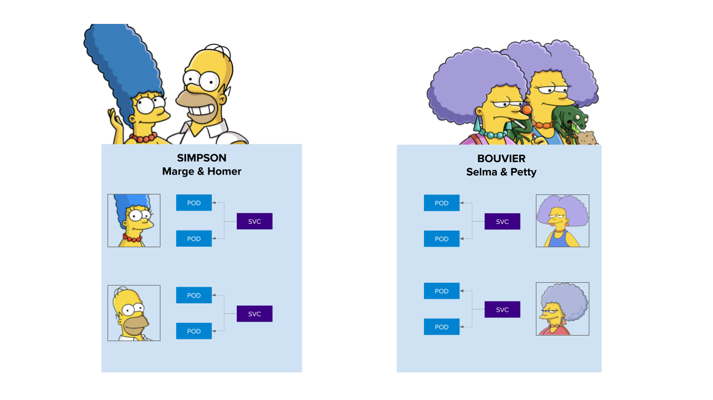
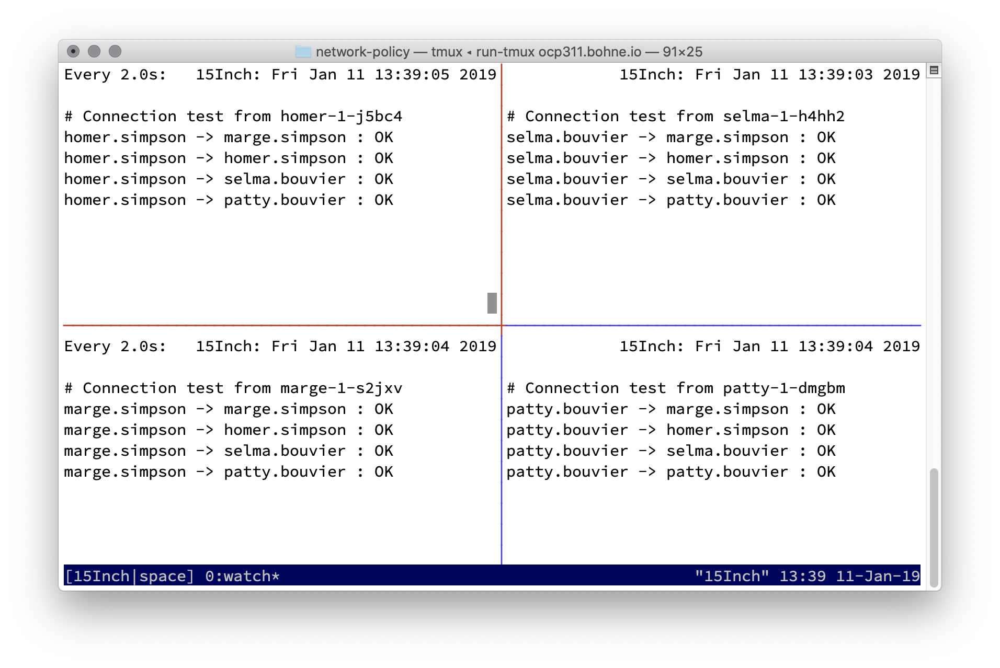
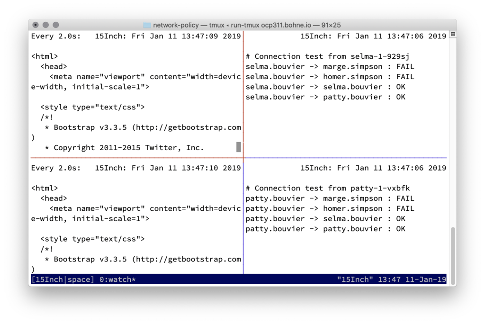
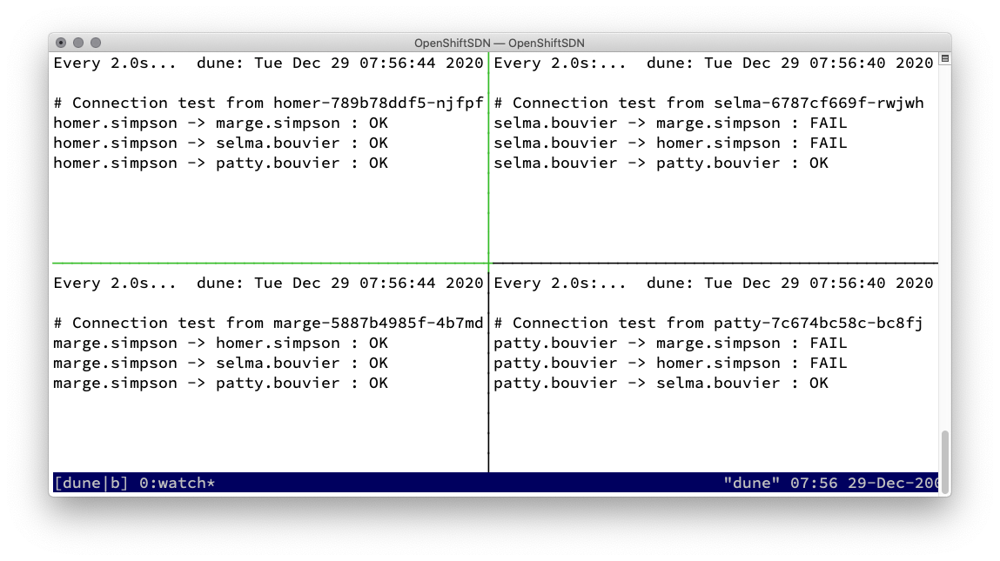

# Network Policy

Official documentation: [About network policy
](https://docs.openshift.com/container-platform/4.6/networking/network_policy/about-network-policy.html)

## Basics

1. Based on labeling or annotations
2. Empty label selector match all
2. Rules for allowing
    * Ingress -&gt; who can connect to this POD
    * Egress -&gt; where can this POD connect to
4. **Rules**
    * traffic is allowed unless a Network Policy selecting the POD
    * traffic is denied if pod is selected in policie but none of them have any rules allowing it
    * =  You can only write rules that allow traffic!
    * Scope: Namespace

## Demo Network Policies



```text
oc new-project bouvier
oc new-app quay.io/rbo/demo-http:master --name patty
oc expose svc/patty
oc scale dc/patty --replicas=2
oc new-app quay.io/rbo/demo-http:master --name selma
oc scale dc/selma --replicas=2
oc expose svc/selma

oc new-project simpson
oc new-app quay.io/rbo/demo-http:master --name homer
oc expose svc/homer
oc scale dc/homer --replicas=2
oc new-app quay.io/rbo/demo-http:master --name marge
oc scale dc/marge --replicas=2
oc expose svc/marge
```


### Let's start with the Network Policy demonstration

Every one can connect to each other



### Case 1 - Simpson - default-deny

```text
oc create -n simpson  -f - <<EOF
kind: NetworkPolicy
apiVersion: networking.k8s.io/v1
metadata:
  name: default-deny
spec:
  podSelector: {}
EOF
```

!!! failure
    Screenshot - Passt nicht zu OpenShift 4

    


#### 2\) Simpson allow from openshift-ingress namespaces, because of router

```text
$ oc create -n simpson -f - <<EOF
apiVersion: networking.k8s.io/v1
kind: NetworkPolicy
metadata:
  name: allow-from-openshift-ingress-namespace
spec:
  podSelector:
  ingress:
  - from:
    - namespaceSelector:
        matchLabels:
          name: openshift-ingress
EOF
```


#### 3\) Simpson allow internal communcation

```text
$ oc create -n simpson -f - <<EOF
apiVersion: networking.k8s.io/v1
kind: NetworkPolicy
metadata:
  name: allow-from-same-namespace
spec:
  podSelector:
  ingress:
  - from:
    - podSelector: {}
EOF
```



#### 4\) Selma and Patty want's to talk with Marge!

```text
$ oc label namespace/bouvier name=bouvier
$ oc create -n simpson -f - <<EOF
apiVersion: networking.k8s.io/v1
kind: NetworkPolicy
metadata:
  name: allow-from-bouviers-to-marge
spec:
  podSelector:
    matchLabels:
      app: marge
  ingress:
  - from:
    - namespaceSelector:
        matchLabels:
          name: bouvier
EOF
```


### Bonus, one EgressNetworkPolicy


Not supported in OpenShift


```text
$ ./dump-net.sh ip-10-0-137-107.us-east-2.compute.internal bevore-egress
$ oc create -f - <<EOF
apiVersion: network.openshift.io/v1
kind: EgressNetworkPolicy
metadata:
  name: default
spec:
  egress:
  - to:
      cidrSelector: 1.2.3.0/24
    type: Allow
  - to:
      dnsName: www.foo.com
    type: Allow
  - to:
      cidrSelector: 0.0.0.0/0
    type: Deny
EOF
```

### Destroy demo env

```text
oc delete project simpson bouvier
```