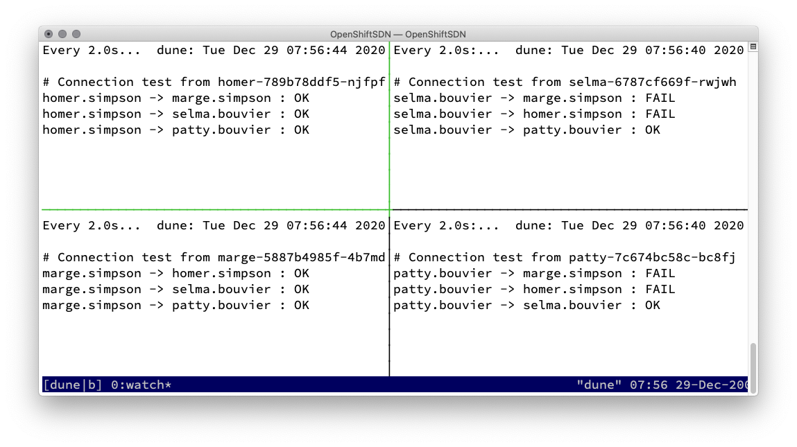

# Network Policy

Official documentation: [About network policy
](https://docs.openshift.com/container-platform/4.6/networking/network_policy/about-network-policy.html)

## Basics

1. Based on labeling or annotations
2. Empty label selector match all
2. Rules for allowing
    * Ingress -&gt; who can connect to this POD
    * Egress -&gt; where can this POD connect to
4. **Rules**
    * traffic is allowed unless a Network Policy selecting the POD
    * traffic is denied if pod is selected in policie but none of them have any rules allowing it
    * => You can only write rules that allow traffic!
    * Scope: Namespace

## Demo Network Policies

Tested on **OpenShift 4.6.8** with **OpenShift SDN** network plugin


```bash
oc new-project bouvier
oc new-app quay.io/rbo/demo-http:master --name patty
oc expose svc/patty
oc scale deployment/patty --replicas=2
oc new-app quay.io/rbo/demo-http:master --name selma
oc scale deployment/selma --replicas=2
oc expose svc/selma

oc new-project simpson
oc new-app quay.io/rbo/demo-http:master --name homer
oc expose svc/homer
oc scale deployment/homer --replicas=2
oc new-app quay.io/rbo/demo-http:master --name marge
oc scale deployment/marge --replicas=2
oc expose svc/marge
```


### Let's start with the Network Policy demonstration

Every one can connect to each other


### Case 1 - Simpson - default-deny

```yaml
oc create -n simpson  -f - <<EOF
kind: NetworkPolicy
apiVersion: networking.k8s.io/v1
metadata:
  name: default-deny
spec:
  podSelector: {}
EOF
```


#### 2\) Simpson allow from openshift-ingress namespaces, because of router

```yaml
cat << EOF| oc create -f -
apiVersion: networking.k8s.io/v1
kind: NetworkPolicy
metadata:
  name: allow-from-openshift-ingress
spec:
  ingress:
  - from:
    - namespaceSelector:
        matchLabels:
          network.openshift.io/policy-group: ingress
  podSelector: {}
  policyTypes:
  - Ingress
EOF
```

Because of HostNetwork access of the OpenShift Ingress you have to apply a label to the default namespace:
```bash
oc label namespace default 'network.openshift.io/policy-group=ingress'
```
[Documentation: 2. If the default Ingress Controller configuration has the...](https://access.redhat.com/documentation/en-us/openshift_container_platform/4.6/html-single/networking/index#nw-networkpolicy-multitenant-isolation_multitenant-network-policy)


#### 3\) Simpson allow internal communcation

```yaml
$ cat << EOF| oc create -f -
kind: NetworkPolicy
apiVersion: networking.k8s.io/v1
metadata:
  name: allow-same-namespace
spec:
  podSelector:
  ingress:
  - from:
    - podSelector: {}
EOF
```



#### 4\) Selma and Patty want's to talk with Marge!

1) First label the namespace bouvier:
   ```bash
   oc label namespace/bouvier name=bouvier
   ```

2) Apply Network Policy
   ```yaml
   oc create -n simpson -f - <<EOF
   apiVersion: networking.k8s.io/v1
   kind: NetworkPolicy
   metadata:
     name: allow-from-bouviers-to-marge
   spec:
     podSelector:
       matchLabels:
         deployment: marge
     ingress:
     - from:
       - namespaceSelector:
           matchLabels:
             name: bouvier
   EOF
   ```


### Destroy demo env

```bash
oc delete project simpson bouvier
```