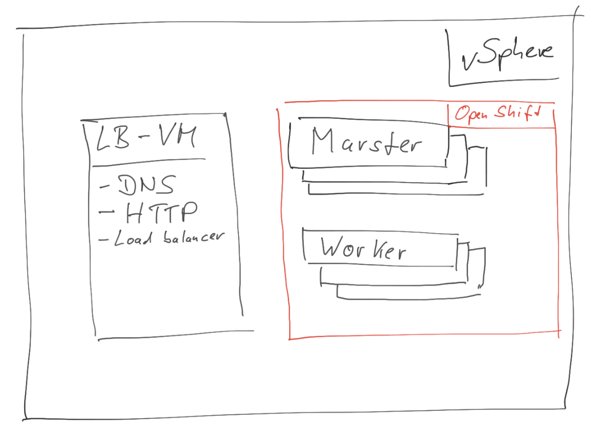
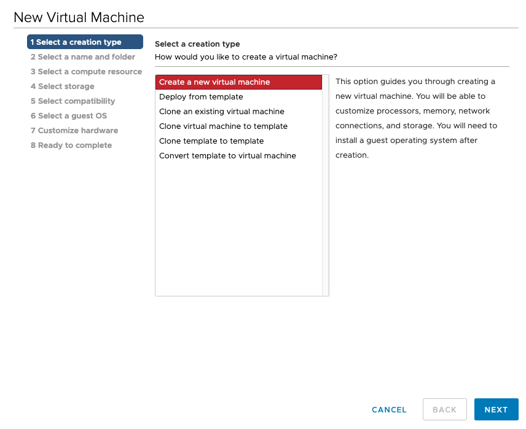
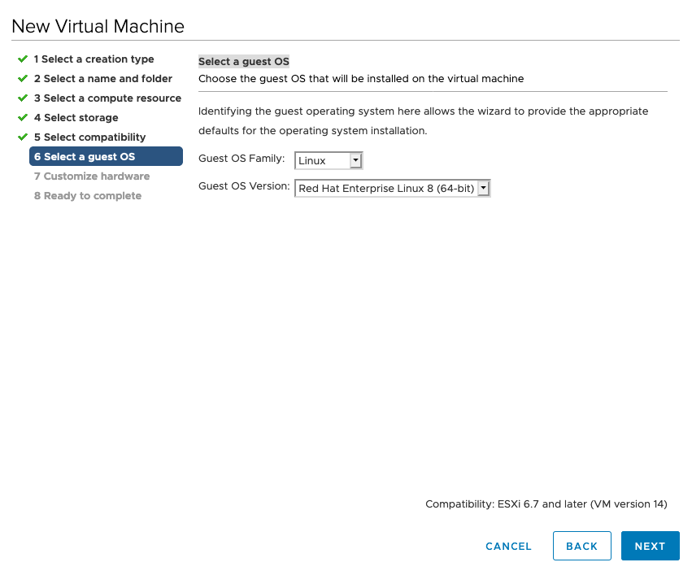
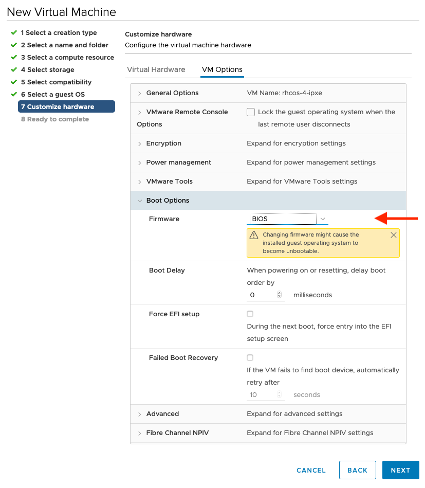
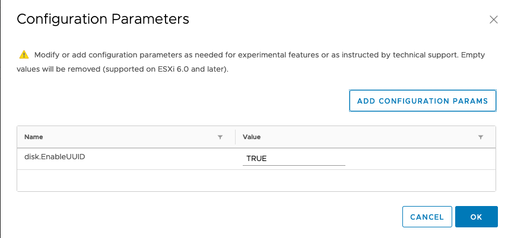
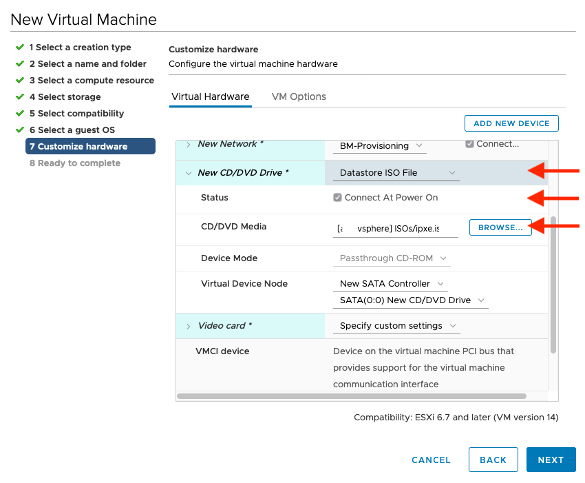

# Example installation at my VMware Lab

## Architecture



## Setup LB virtual machine

#### Install RHEL 8

#### Enable repos:
  
``` 
subscription-manager repos \
    --enable="rhel-8-for-x86_64-baseos-rpms" \
    --enable="rhel-8-for-x86_64-appstream-rpms"
```

#### Install tmux

```
yum install tmux -y
```

Start tmux session ;-)

#### Update

```
yum update -y
```

#### Install httpd

```
yum install -y httpd
sed -i 's/Listen 80/Listen 8080/' /etc/httpd/conf/httpd.conf
mv /etc/httpd/conf.d/ssl.conf /etc/httpd/conf.d-ssl.conf-backup

systemctl enable --now httpd
systemctl status httpd

firewall-cmd --zone=public --permanent --add-port=8080/tcp
firewall-cmd --reload

curl -I http://192.168.100.148:8080/
HTTP/1.1 403 Forbidden
Date: Tue, 21 Apr 2020 08:50:55 GMT
Server: Apache/2.4.37 (Red Hat Enterprise Linux) OpenSSL/1.1.1c mod_fcgid/2.3.9
Last-Modified: Mon, 02 Sep 2019 14:29:46 GMT
ETag: "f91-59192cdb50a80"
Accept-Ranges: bytes
Content-Length: 3985
Content-Type: text/html; charset=UTF-8

```

Fine for now...

#### Install & Setup dnsmasq

```
yum install -y dnsmasq

cat > /etc/dnsmasq.d/openshift-4.conf <<EOF
strict-order
domain=rbohne.lab.example.com
expand-hosts
server=10.19.143.247
# except-interface=lo
# bind-dynamic
# interface=virbr1
srv-host=_etcd-server-ssl._tcp.rbohne.lab.example.com,etcd-0.rbohne.lab.example.com,2380,0,10
srv-host=_etcd-server-ssl._tcp.rbohne.lab.example.com,etcd-1.rbohne.lab.example.com,2380,0,10
srv-host=_etcd-server-ssl._tcp.rbohne.lab.example.com,etcd-2.rbohne.lab.example.com,2380,0,10
address=/apps.rbohne.lab.example.com/192.168.100.148
addn-hosts=/etc/dnsmasq-openshift-4.addnhosts
EOF
cat > /etc/dnsmasq-openshift-4.addnhosts <<EOF
192.168.100.148 lb.rbohne.lab.example.com api.rbohne.lab.example.com api-int.rbohne.lab.example.com
192.168.100.149 master-0.rbohne.lab.example.com etcd-0.rbohne.lab.example.com
192.168.100.150 master-1.rbohne.lab.example.com etcd-1.rbohne.lab.example.com
192.168.100.151 master-2.rbohne.lab.example.com etcd-2.rbohne.lab.example.com
192.168.100.152 bootstrap.rbohne.lab.example.com
192.168.100.153 worker-1.rbohne.lab.example.com
192.168.100.154 worker-2.rbohne.lab.example.com
192.168.100.155 worker-3.rbohne.lab.example.com
EOF


systemctl enable --now dnsmasq
systemctl status dnsmasq

firewall-cmd --zone=public --permanent --add-service=dns
firewall-cmd --reload

```

Optional but useful change dns in /etc/resolv.conf wie nmcli from 10.19.143.247 to 127.0.0.1

```
nmcli conn modify ens192 ipv4.dns  "127.0.0.1"
```


#### Install & setup load balancer

```
yum install -y podman

podman pull quay.io/redhat-emea-ssa-team/openshift-4-loadbalancer

cat > /etc/systemd/system/openshift-4-loadbalancer.service <<EOF
[Unit]
Description=OpenShift 4 LoadBalancer CLUSTER
After=network.target

[Service]
Type=simple
TimeoutStartSec=5m

ExecStartPre=-/usr/bin/podman rm "openshift-4-loadbalancer"
ExecStartPre=/usr/bin/podman pull quay.io/redhat-emea-ssa-team/openshift-4-loadbalancer
ExecStart=/usr/bin/podman run --name openshift-4-loadbalancer --net host \
  -e API=bootstrap=192.168.100.152:6443,master-0=192.168.100.149:6443,master-1=192.168.100.150:6443,master-2=192.168.100.151:6443 \
  -e API_LISTEN=192.168.100.148:6443 \
  -e INGRESS_HTTP=bootstrap=192.168.100.152:80,master-0=192.168.100.149:80,master-1=192.168.100.150:80,master-2=192.168.100.151:80,worker-1=192.168.100.153:80,worker-2=192.168.100.154:80,worker-3=192.168.100.155:80 \
  -e INGRESS_HTTP_LISTEN=192.168.100.148:80 \
  -e INGRESS_HTTPS=bootstrap=192.168.100.152:443,master-0=192.168.100.149:443,master-1=192.168.100.150:443,master-2=192.168.100.151:443,worker-1=192.168.100.153:443,worker-2=192.168.100.154:443,worker-3=192.168.100.155:443 \
  -e INGRESS_HTTPS_LISTEN=192.168.100.148:443 \
  -e MACHINE_CONFIG_SERVER=bootstrap=192.168.100.152:22623,master-0=192.168.100.149:22623,master-1=192.168.100.150:22623,master-2=192.168.100.151:22623 \
  -e MACHINE_CONFIG_SERVER_LISTEN=192.168.100.148:22623 \
  -e STATS_LISTEN=192.168.100.148:1984 \
  -e STATS_ADMIN_PASSWORD=aengeo4oodoidaiP \
  quay.io/redhat-emea-ssa-team/openshift-4-loadbalancer

ExecReload=-/usr/bin/podman stop "openshift-4-loadbalancer"
ExecReload=-/usr/bin/podman rm "openshift-4-loadbalancer"
ExecStop=-/usr/bin/podman stop "openshift-4-loadbalancer"
Restart=always
RestartSec=30

[Install]
WantedBy=multi-user.target
EOF

systemctl daemon-reload
systemctl enable --now openshift-4-loadbalancer.service
systemctl status openshift-4-loadbalancer.service

firewall-cmd --zone=public --permanent --add-port=80/tcp
firewall-cmd --zone=public --permanent --add-port=443/tcp
firewall-cmd --zone=public --permanent --add-port=6443/tcp
firewall-cmd --zone=public --permanent --add-port=22623/tcp
firewall-cmd --zone=public --permanent --add-port=1984/tcp
firewall-cmd --reload

```

#### Download coreos

```
for i in rhcos-4.4.0-rc.1-x86_64-installer-initramfs.x86_64.img rhcos-4.4.0-rc.1-x86_64-installer-kernel-x86_64 rhcos-4.4.0-rc.1-x86_64-metal.x86_64.raw.gz ; do curl -L -O https://mirror.openshift.com/pub/openshift-v4/dependencies/rhcos/4.4/latest/${i}; done;
mv -v rhcos-4.4.0-rc.1-x86_64-* /var/www/html/

restorecon -vr /var/www/html/

for i in `ls -1 /var/www/html/rhcos-*` ; do set -x ; curl -I http://192.168.100.148:8080/$( basename $i ); set +x; done

```

#### Install openshift-install, oc, kubectl

```
curl -L -O https://mirror.openshift.com/pub/openshift-v4/clients/ocp/4.4.0-rc.8/openshift-client-linux.tar.gz
curl -L -O https://mirror.openshift.com/pub/openshift-v4/clients/ocp/4.4.0-rc.8/openshift-install-linux.tar.gz

tar -xzvf openshift-client-linux.tar.gz -C /usr/local/bin/ kubectl oc
tar -xzvf openshift-install-linux.tar.gz -C /usr/local/bin/ openshift-install


```
#### Create ssh key

``` ssh-keygen ```

#### Download pull secret from cloud.redhat.com

Store it in `~/redhat-pullsecret.json`

#### Install govc & setup govc

```
curl -L -O https://github.com/vmware/govmomi/releases/download/v0.22.1/govc_linux_amd64.gz
gzip -d govc_linux_amd64.gz && chmod +x govc_linux_amd64 && mv govc_linux_amd64 /usr/local/bin/govc
```

Add GOVC env to bashrc:
```
export GOVC_URL='vcenterip'
export GOVC_USERNAME='user'
export GOVC_PASSWORD='pass'
export GOVC_INSECURE=1
export GOVC_DATACENTER="DC"
```

## Create rhcos-4-ipxe vm template

Prerequisite: 

 * Upload IPXE.iso from [https://github.com/ralvares/ipxe/releases](https://github.com/ralvares/ipxe/releases/download/v0.1/ipxe.iso) to Datastore

1) New Virtual Machine... 

2) Create a new Virtual machine
    *  
 
3) Set Virtual machine name: `rhcos-4-ipxe` & select a location 
    * 
 
4) Select a compute resource
 
5) Select storage
 
6) Select compatibility - ESXi 6.7 and later
 
7) Select a guest OS - Linux - Red Hat Enterprise Linux 8 (64-bit)
    * 
 
8) **Customize hardware** - very important!
    * 
    * 
    * 
    * 
    * 
    * 
 
9) Ready to complete


## Create `openshift-deploy.sh`

** Create a file `openshift-deploy.sh` with the content of:**
```bash
#!/usr/bin/env bash

# How to use the script: copy it and adjust what you have to adjust!
#   For example: ip adresses ;-)

set -euo pipefail
set -x

# Moved into ~/.basrc ;-)
# export GOVC_URL='vcenter'
# export GOVC_USERNAME='user'
# export GOVC_PASSWORD='pwd'
# export GOVC_INSECURE=1
# export GOVC_DATACENTER="DC"
# export GOVC_DATASTORE="datastore"

basedomain="lab.example.com"
clustername="rbohne"

nodes=(
    "bootstrap.${clustername}.${basedomain}"
    "master-0.${clustername}.${basedomain}"
    "master-1.${clustername}.${basedomain}"
    "master-2.${clustername}.${basedomain}"
    "worker-1.${clustername}.${basedomain}"
    "worker-2.${clustername}.${basedomain}"
    "worker-3.${clustername}.${basedomain}"
)

ignitions=(
    'bootstrap.ign'
    'master.ign'
    'master.ign'
    'master.ign'
    'worker.ign'
    'worker.ign'
    'worker.ign'
);

# By default not needed.
# mac_adresses=(
#     '00:50:56:23:F7:21'
#     '00:50:56:1E:A5:6A'
#     '00:50:56:1E:33:25'
#     '00:50:56:0C:F8:E0'
#     '00:50:56:1E:2C:5D'
#     '00:50:56:24:CD:19'
#     '00:50:56:24:CD:20'
# )

ips=(
    '192.168.100.152'
    '192.168.100.149'
    '192.168.100.150'
    '192.168.100.151'
    '192.168.100.153'
    '192.168.100.154'
    '192.168.100.155'
)

# function govc {
#     echo "Dummy function"
# }

# Setup vm's
for (( i=0; i< ${#nodes[@]} ; i++ )) ; do
    node=${nodes[$i]}
    ip=${ips[$i]}
    ignition=${ignitions[$i]}
    
    echo "Setup $node -> $ip";

    # If you want to setup mac adress
    # mac_adresse=${mac_adresses[$i]}
    # -net.address ${mac_adresse} \
    govc vm.clone -vm "/${GOVC_DATACENTER}/vm/${clustername}/rhcos-4-ipxe"  \
        -annotation=$ignition \
        -c=4 \
        -m=16384 \
        -net 'VM Network' \
        -on=false \
        -folder=${clustername} \
        -ds="${GOVC_DATASTORE}" \
        $node

    # iPXE settings
    govc vm.change \
        -e="guestinfo.ipxe.hostname=$node" \
        -e="guestinfo.ipxe.ignition=$ignition" \
        -e="guestinfo.ipxe.net0.ip=$ip" \
        -e="guestinfo.ipxe.net0.netmask=255.255.254.0" \
        -e="guestinfo.ipxe.net0.gateway=10.19.115.254" \
        -e="guestinfo.ipxe.fileserver=http://192.168.100.148:8080" \
        -e="guestinfo.ipxe.dns=192.168.100.148" \
        -e="guestinfo.ipxe.kernel-installer=rhcos-4.4.0-rc.1-x86_64-installer-kernel-x86_64" \
        -e="guestinfo.ipxe.initrd-installer=rhcos-4.4.0-rc.1-x86_64-installer-initramfs.x86_64.img" \
        -e="guestinfo.ipxe.rhcos-image=rhcos-4.4.0-rc.1-x86_64-metal.x86_64.raw.gz" \
        -e="guestinfo.ipxe.disk=sda" \
        -e="guestinfo.ipxe.net_interface=ens192" \
        -vm="/${GOVC_DATACENTER}/vm/${clustername}/$node"
  
done;

# Start vm's
for node in ${nodes[@]} ; do
    echo "# Start $node";
    govc vm.power -on=true $node
done;
```

Make it executable 
```
chmod +x openshift-deploy.sh
```

## Install openshift

### Create install-config.yaml

```
cat > install-config.yaml <<EOF
apiVersion: v1
baseDomain: lab.example.com
compute:
- hyperthreading: Enabled   
  name: worker
  replicas: 0 
controlPlane:
  hyperthreading: Enabled   
  name: master
  replicas: 3 
metadata:
  name: rbohne 
platform:
  vsphere:
    vcenter: ${GOVC_URL}
    username: ${GOVC_USERNAME}
    password: ${GOVC_PASSWORD} 
    datacenter: ${GOVC_DATACENTER} 
    defaultDatastore: ${GOVC_DATASTORE} 
fips: false 
pullSecret: '$( cat ~/redhat-pullsecret.json )' 
sshKey: '$( cat ~/.ssh/id_rsa.pub )' 
EOF
```

### Running installation
```
mkdir rbohne
cp -v install-config.yaml rbohne/
```
Create Manifest files
To avoid issues with machines and machineset
see https://access.redhat.com/solutions/5086271
We need to create the manifest files and delete the specific machines and
machineset files. Without deleting this file you might get alerts
like "Machine is in phase".
```
openshift-install create manifests --dir=rbohne/
rm -rf rbohne/openshift/99_openshift-cluster-api_master-machines-*.yaml
rm -rf rbohne/openshift/99_openshift-cluster-api_worker-machineset-0.yaml

openshift-install create ignition-configs --dir=rbohne/
cp -v rbohne/*ign /var/www/html
chmod o+r /var/www/html/*.ign

restorecon -vr /var/www/html/
for i in `ls -1 /var/www/html/*.ign` ; do set -x ; curl -I http://192.168.100.148:8080/$( basename $i ); set +x; done

# Check all is HTTP/1.1 200 OK


./openshift-deploy.sh

openshift-install wait-for bootstrap-complete --dir=rbohne

govc vm.power -off bootstrap.rbohne.lab.example.com

openshift-install wait-for install-complete --dir=rbohne


```

In case you have to approve certificates: 
```
oc get csr | awk '/Pending/ { print $1 }' | xargs oc adm certificate approve
```