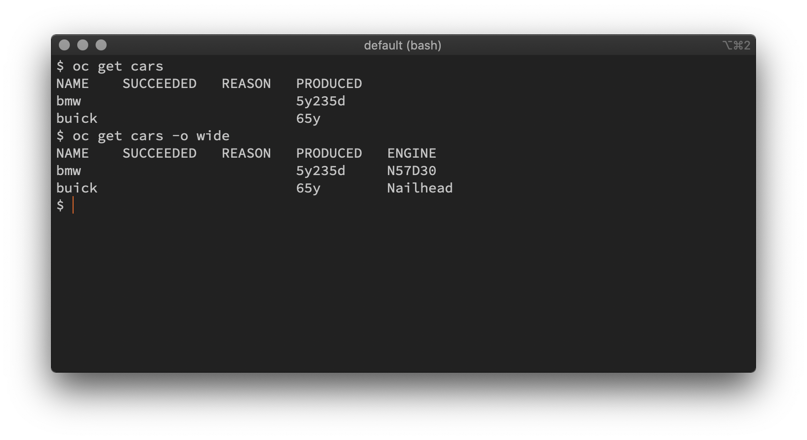
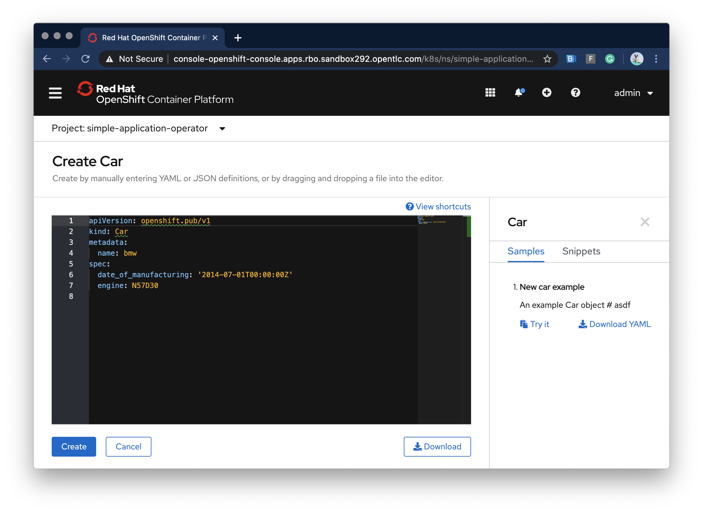

# Custom Resource Definition (CRD)

## Simple example

```yaml
apiVersion: apiextensions.k8s.io/v1beta1
kind: CustomResourceDefinition
metadata:
  name: cars.openshift.pub
spec:
  group: openshift.pub
  names:
    kind: Car
    listKind: CarList
    plural: cars
    singular: car
  scope: Namespaced
  subresources:
    status: {}
  version: v1
```

```yaml
apiVersion: openshift.pub/v1
kind: Car
metadata:
  name: bmw
spec:
  date_of_manufacturing: "2014-07-01T00:00:00Z"
  engine: N57D30
```

## Advanced example

```yaml
apiVersion: apiextensions.k8s.io/v1beta1
kind: CustomResourceDefinition
metadata:
  name: cars.openshift.pub
spec:
  group: openshift.pub
  names:
    kind: Car
    listKind: CarList
    plural: cars
    singular: car
    shortNames:
    - c
  scope: Namespaced
  subresources:
    status: {}
  version: v1
  validation:
  additionalPrinterColumns:
  - JSONPath: .status.conditions[?(@.type=="Succeeded")].status
    name: Succeeded
    type: string
  - JSONPath: .status.conditions[?(@.type=="Succeeded")].reason
    name: Reason
    type: string
  - JSONPath: .spec.date_of_manufacturing
    name: Produced
    type: date
  - JSONPath: .spec.engine
    name: Engine
    type: string
    priority: 1
```



## Add examples and/or snippets to webconsole

### Snippet

```yaml
apiVersion: console.openshift.io/v1
kind: ConsoleYAMLSample
metadata:
  name: car-snippet-buick
spec:
  description: ...
  snippet: true
  targetResource:
    apiVersion: openshift.pub/v1
    kind: Car
  title: Buick example
  yaml: |
    date_of_manufacturing: "1955-01-01T00:00:00Z"
    engine: Nailhead
```

### Example

```yaml
apiVersion: console.openshift.io/v1
kind: ConsoleYAMLSample
metadata:
  creationTimestamp: '2020-02-20T09:18:12Z'
  generation: 4
  name: cars
  resourceVersion: '2617237'
  selfLink: /apis/console.openshift.io/v1/consoleyamlsamples/cars
  uid: b1c75da9-e9d7-4b62-8324-7055b624c4de
spec:
  description: |
    An example Car object

    # asdf
  targetResource:
    apiVersion: openshift.pub/v1
    kind: Car
  title: New car example
  yaml: |
    apiVersion: openshift.pub/v1
    kind: Car
    metadata:
      name: bmw
    spec:
      date_of_manufacturing: "2014-07-01T00:00:00Z"
      engine: N57D30

```




