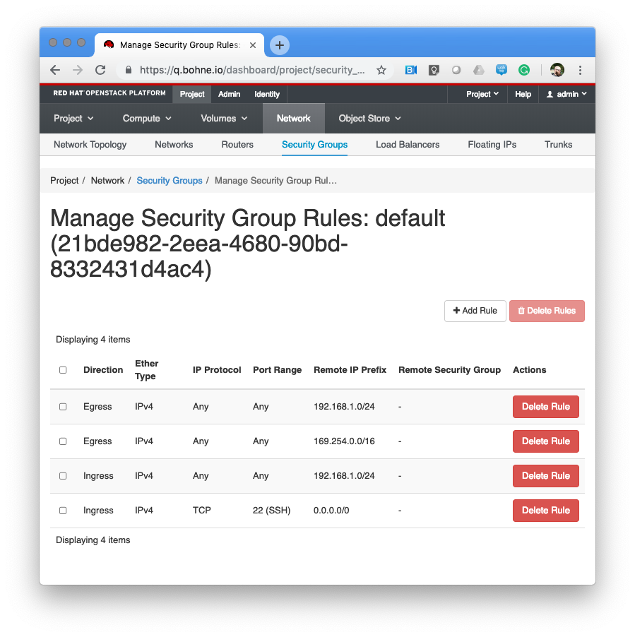
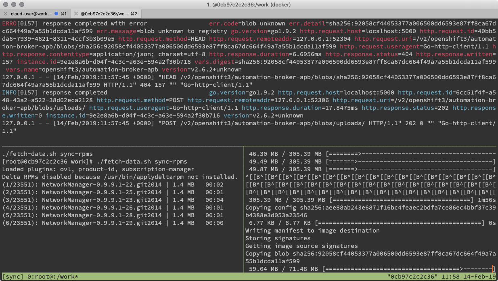

# Disconnected installation notes

https://docs.openshift.com/container-platform/3.11/install/disconnected_install.html[Documentation]

## Prepare OpenStack Env.
### Default security without internet access



### Useful cloud-init config
```ini
#cloud-config

# set the locale
locale: en_US.UTF-8
 
# timezone: set the timezone for this instance
timezone: UTC

hostname: instance
fqdn: instance
```


## Fetch data (images & rpms)
### via Docker (on your MacBook)

Build the Image:
```
docker build -t ocp3-disconnected-fetcher --build-arg RH_ORG_ID=xxx --build-arg RH_ACTIVATIONKEY=xxx --build-arg RH_POOL_ID=xxx .
docker run -ti -v $(pwd):/work ocp3-disconnected-fetcher
./fetch-data.sh sync
```




### On an RHEL box 
On an RHEL box with an openshift subscription and enabled repos

```
rpm --import /etc/pki/rpm-gpg/RPM-GPG-KEY-redhat-release
subscription-manager register

subscription-manager list --available --matches '*OpenShift*'
subscription-manager attach --pool=<pool_id>
subscription-manager repos --disable="*"

subscription-manager repos \
    --enable="rhel-7-server-rpms" \
    --enable="rhel-7-server-extras-rpms" \
    --enable="rhel-7-server-ose-3.11-rpms" \
    --enable="rhel-7-server-ansible-2.6-rpms"

yum install -y skopeo openssl docker-distribution tmux lsof telnet yum-utils createrepo git
```

Fetch & execute download script:

```
curl -O -L https://raw.githubusercontent.com/rbo/openshift-examples/master/disconnected/fetch-data.sh
chmod +x fetch-data.sh
./fetch-data.sh sync
```

Prepare package `tar cf ocp-3.11-data.tar registry/ repos/`

Go to the customer ;-)

## Prepare bastion at customer

Extract repos into /var/www/html
```
sudo tar -C /var/www/html -xf ocp-3.11-data.tgz repos/
```

Add repos into `/etc/yum.repos.d/ose.repo`
```
[rhel-7-server-rpms]
name=rhel-7-server-rpms
baseurl=file:///var/www/html/repos/rhel-7-server-rpms
enabled=1
gpgcheck=0
[rhel-7-server-extras-rpms]
name=rhel-7-server-extras-rpms
baseurl=file:///var/www/html/repos/rhel-7-server-extras-rpms
enabled=1
gpgcheck=0
[rhel-7-server-ansible-2.6-rpms]
name=rhel-7-server-ansible-2.6-rpms
baseurl=file:///var/www/html/repos/rhel-7-server-ansible-2.6-rpms
enabled=1
gpgcheck=0
[rhel-7-server-ose-3.11-rpms]
name=rhel-7-server-ose-3.11-rpms
baseurl=file:///var/www/html/repos/rhel-7-server-ose-3.11-rpms
enabled=1
gpgcheck=0
```

Install webserver & docker registry
```
sudo yum install -y httpd docker-distribution
```

Extract registry data:
```
sudo tar -C /var/lib/registry/ --strip-components=1 -xf ocp-3.11-data.tgz registry/docker
```

[NOTE]
====
If SELinux is enabled: `chcon -R -t httpd_sys_content_t /var/www/html/repos/`
====

Startup webserver and registry
```
systemctl enable docker-distribution.service httpd.service
systemctl start docker-distribution.service httpd.service
systemctl status docker-distribution.service httpd.service
```


[NOTE]
====
ToDo: Check authentication for docker-distribution, it looks like everyone can push and overwrite images!
```
REGISTRY_AUTH_HTPASSWD_PATH=/var/lib/registry/htpasswd
REGISTRY_AUTH=htpasswd
REGISTRY_AUTH_HTPASSWD_REALM=Registry Realm
```
====

## Startup instances

Maybe run your host prep.

Repos are set up by prerequisites.yml

## Install OpenShift

Please replace `bastion:5000` and `bastion`

```ini
[OSEv3:children]
masters
nodes
etcd

[OSEv3:vars]
ansible_ssh_user=cloud-user
ansible_become=yes
openshift_deployment_type=openshift-enterprise

# --- Important part for disconnected ----

# Cluster Image Source (registry) configuration
# openshift-enterprise default is 'registry.redhat.io/openshift3/ose-${component}:${version}'
# origin default is 'docker.io/openshift/origin-${component}:${version}'
oreg_url=bastion:5000/openshift3/ose-${component}:${version}
# If oreg_url points to a registry other than registry.redhat.io we can
# modify image streams to point at that registry by setting the following to true
openshift_examples_modify_imagestreams=true
# Add insecure and blocked registries to global docker configuration
openshift_docker_insecure_registries=['bastion:5000']
openshift_docker_blocked_registries=['registry.access.redhat.com', 'docker.io', 'registry.fedoraproject.org', 'quay.io', 'registry.centos.org']
# You may also configure additional default registries for docker, however this
# is discouraged. Instead you should make use of fully qualified image names.
openshift_docker_additional_registries=['bastion:5000']

# OpenShift repository configuration
openshift_additional_repos=[{'id': 'rhel-7-server-rpms', 'name': 'rhel-7-server-rpms', 'baseurl': 'http://bastion/repos/rhel-7-server-rpms', 'enabled': 1, 'gpgcheck': 0},{'id': 'rhel-7-server-extras-rpms', 'name': 'rhel-7-server-extras-rpms', 'baseurl': 'http://bastion/repos/rhel-7-server-extras-rpms', 'enabled': 1, 'gpgcheck': 0},{'id': 'rhel-7-server-ansible-2.6-rpms', 'name': 'rhel-7-server-ansible-2.6-rpms', 'baseurl': 'http://bastion/repos/rhel-7-server-ansible-2.6-rpms', 'enabled': 1, 'gpgcheck': 0},{'id': 'rhel-7-server-ose-3.11-rpms', 'name': 'rhel-7-server-ose-3.11-rpms', 'baseurl': 'http://bastion/repos/rhel-7-server-ose-3.11-rpms', 'enabled': 1, 'gpgcheck': 0}]

# Important: docker_image_availability, maybe the skopoe check did not work with your repo
openshift_disable_check=disk_availability,memory_availability,docker_image_availability


# Don't work very well, becaude ose-pod-v3.11.69 is hardcoded
#openshift_image_tag=v3.11

# Arg, hardcoded registry.redhat.io/....
#    https://github.com/openshift/openshift-ansible/blob/master/roles/etcd/defaults/main.yaml#L15
osm_etcd_image=bastion:5000/rhel7/etcd:3.2.22

# --- Important part for disconnected ----

os_sdn_network_plugin_name='redhat/openshift-ovs-multitenant'

openshift_node_groups=[{'name': 'node-config-all-in-one', 'labels': ['node-role.kubernetes.io/master=true', 'node-role.kubernetes.io/infra=true', 'node-role.kubernetes.io/compute=true']}]

# htpasswd auth
openshift_master_identity_providers=[{'name': 'htpasswd_auth', 'login': 'true', 'challenge': 'true', 'kind': 'HTPasswdPasswordIdentityProvider'}]
# Defining htpasswd users
openshift_master_htpasswd_users={'admin': '$apr1$5slPL.BP$waLoQ10SWU6HYokq1wV5t1', 'dev': '$apr1$xATuF0Is$amNbjuDTUN1eQP0hwdMGC0'}

[masters]
instance

[etcd]
instance

[nodes]
# openshift_node_group_name should refer to a dictionary with matching key of name in list openshift_node_groups.
instance openshift_node_group_name="node-config-all-in-one"


```
