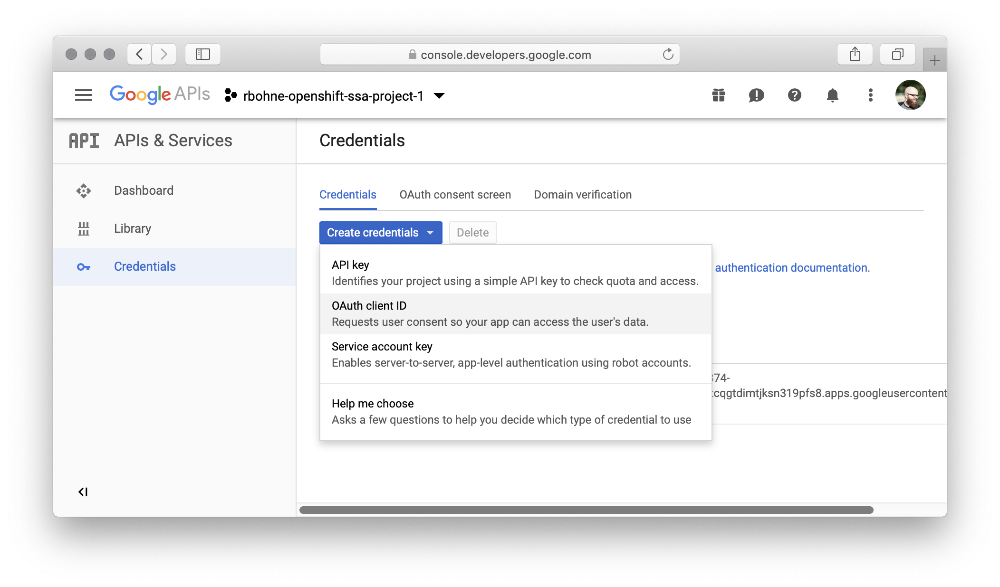

# How to setup google oauth 

https://docs.openshift.com/container-platform/4.1/authentication/identity_providers/configuring-google-identity-provider.html

## Setup OAuth 2.0 client at Google.

. Visit: https://console.developers.google.com/apis/credentials
+

. Create OAuth client ID
+
image::google-oauth-ocp4/screenshot2.png[Screenshot 2]

. Copy Client ID and Client secret
+ 
Example Client ID and secret
+
Client ID:
`1079862778375-60es8d8ugvg3e54csnesgf94p6r4rc6s.apps.googleusercontent.com`
+
Client Secret:
`rJR1jmiUnk_ZWZFxqbMxhShn`

. Create client secret
+
    oc create secret generic google-secret --from-literal=clientSecret=rJR1jmiUnk_ZWZFxqbMxhShn -n openshift-config

. Update OAuth Config
+
.oauth.yaml
[source,yaml]
----
apiVersion: config.openshift.io/v1
kind: OAuth
metadata:
name: cluster
spec:
identityProviders:
- name: RedHatSSO 
    mappingMethod: claim 
    type: Google
    google:
    clientID: "1079862778375-60es8d8ugvg3e54csnesgf94p6r4rc6s.apps.googleusercontent.com"
    clientSecret: 
        name: google-secret
    hostedDomain: "redhat.com"
----
+
`oc apply -f oauth.yaml`

. *Optional* Remove kubeadm account
+
    oc delete secrets kubeadmin -n kube-system
+
https://docs.openshift.com/container-platform/4.1/authentication/remove-kubeadmin.html
. *Optional* Remove self-provisioner

    oc adm policy remove-cluster-role-from-group self-provisioner system:authenticated system:authenticated:oauth
    Warning: Your changes may get lost whenever a master is restarted, unless you prevent reconciliation of this rolebinding using the following command: oc annotate clusterrolebinding.rbac self-provisioners 'rbac.authorization.kubernetes.io/autoupdate=false' --overwriteclusterrole.rbac.authorization.k8s.io/self-provisioner removed: ["system:authenticated" "system:authenticated:oauth"]

