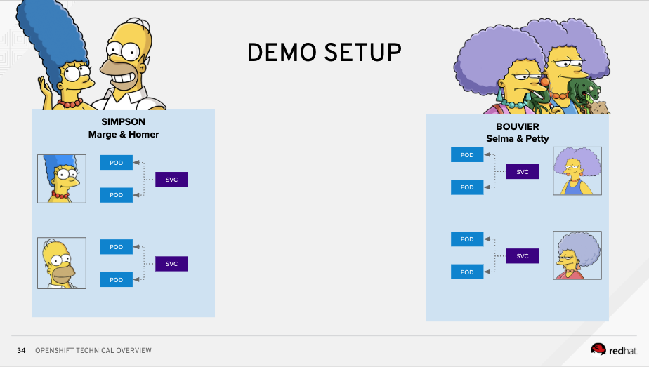
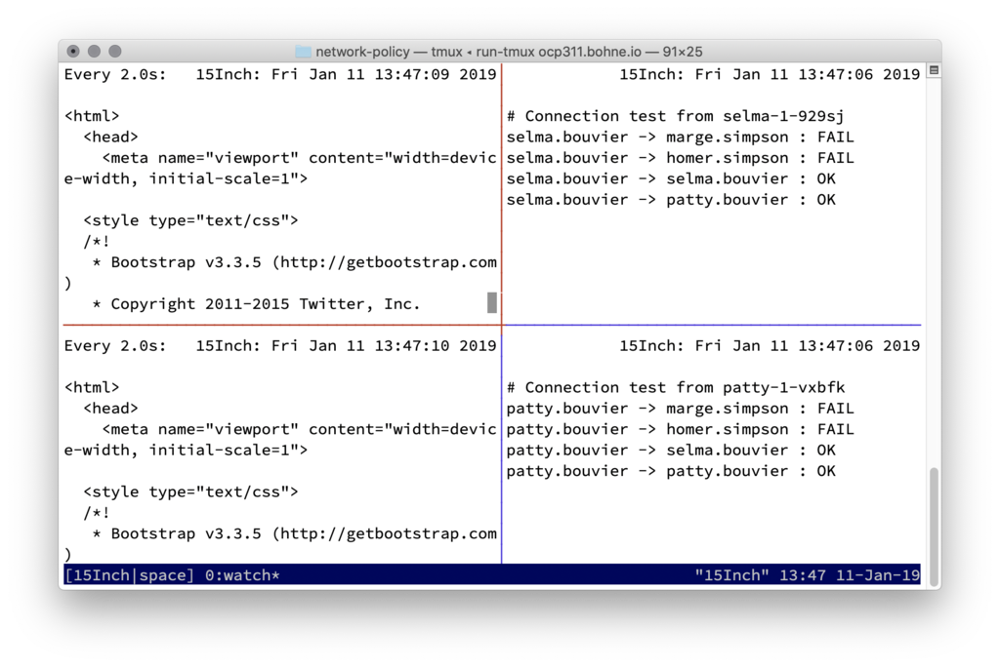
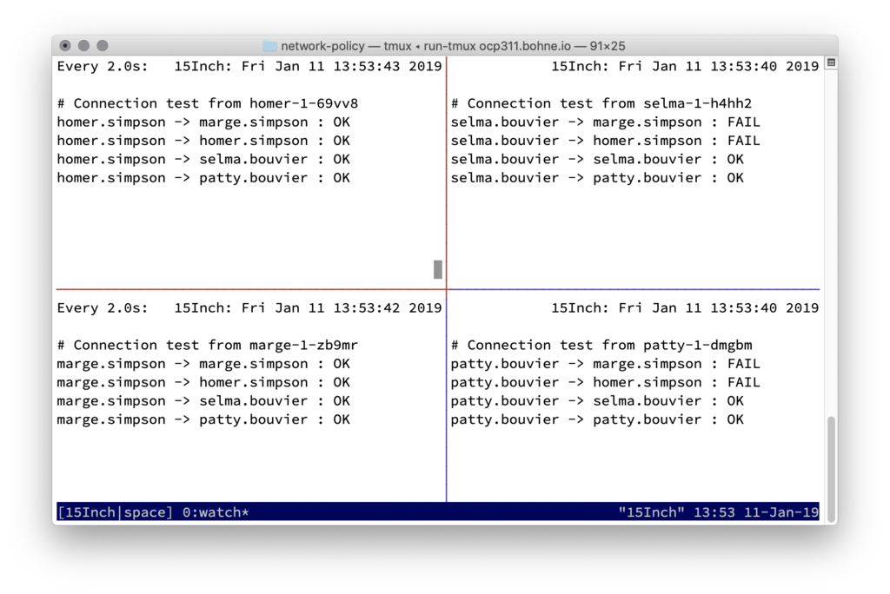
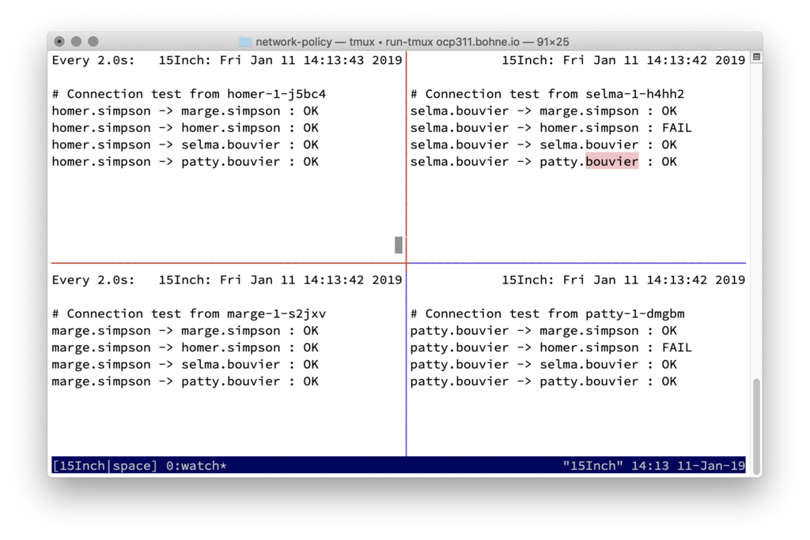

# README

## Network policy

### Nice to know

1\) Based on labeling

* project / namespaces seldom have labels

  2\) Empty label selector match all

  3\) rules for allowing

* Ingress -&gt; who can connect to this POD?
* Engress -&gt; where can this POD connect to?

  4\) **Rules**

* traffic is allowed unless a Network Policy selecting the POD
* traffic is denied if pod is selected in policie but none of them have any rules allowing it
* = You can only write rules that allow traffic!
* Scope: Namespace

### Deploy demo env.

Install openshift with redhat/openshift-ovs-networkpolicy



```text
oc new-project bouvier
oc new-app quay.io/rbo/demo-http:master --name patty
oc expose svc/patty
oc scale dc/patty --replicas=2
oc new-app quay.io/rbo/demo-http:master --name selma
oc scale dc/selma --replicas=2
oc expose svc/selma

oc new-project simpson
oc new-app quay.io/rbo/demo-http:master --name homer
oc expose svc/homer
oc scale dc/homer --replicas=2
oc new-app quay.io/rbo/demo-http:master --name marge
oc scale dc/marge --replicas=2
oc expose svc/marge
```

### Label project where router is located

```text
oc label namespace/openshift-ingress name=openshift-ingress
```

### Run connection overview

`./run-tmux <domain>` 

### Play arround..

Some enviroment info's:

| Namespace | NETID |
| :--- | :--- |
| default | 0 |
| bouvier | 3770897 |
| simpson | 13787457 |

```text
$ oc get pods -o wide -n simpson
NAME            READY     STATUS    RESTARTS   AGE       IP           NODE      NOMINATED NODE
homer-1-69vv8   1/1       Running   0          2h        10.30.2.88   node0     <none>
homer-1-j5bc4   1/1       Running   0          2h        10.30.3.62   node1     <none>
marge-1-s2jxv   1/1       Running   0          2h        10.30.3.60   node1     <none>
marge-1-zb9mr   1/1       Running   0          2h        10.30.2.90   node0     <none>

$ oc get pods -o wide -n bouvier
NAME            READY     STATUS    RESTARTS   AGE       IP           NODE      NOMINATED NODE
patty-1-dmgbm   1/1       Running   0          2h        10.30.3.61   node1     <none>
patty-1-vxbfk   1/1       Running   0          2h        10.30.2.85   node0     <none>
selma-1-929sj   1/1       Running   0          2h        10.30.3.59   node1     <none>
selma-1-h4hh2   1/1       Running   0          2h        10.30.2.89   node0     <none>
```


#### 1\) Simpson deny all

```text
$ ./dump-net.sh node1 node1.case0
$ oc create -f default-deny.yml -n simpson
$ ./dump-net.sh node1 node1.case1
$ diff -Nuar node1.case0.OpenFlow13 node1.case1.OpenFlow13
--- node1.case0.OpenFlow13    2019-01-11 16:26:55.000000000 +0100
+++ node1.case1.OpenFlow13    2019-01-11 16:27:15.000000000 +0100
@@ -97,7 +97,6 @@
  table=80, priority=50,reg1=15425483 actions=output:NXM_NX_REG2[]
  table=80, priority=50,reg1=4095272 actions=output:NXM_NX_REG2[]
  table=80, priority=50,reg1=3770897 actions=output:NXM_NX_REG2[]
- table=80, priority=50,reg1=13787457 actions=output:NXM_NX_REG2[]
  table=80, priority=0 actions=drop
  cookie=0xd685fff4, table=90, priority=100,ip,nw_dst=10.30.2.0/24 actions=move:NXM_NX_REG0[]->NXM_NX_TUN_ID[0..31],set_field:192.168.1.104->tun_dst,output:vxlan0
  cookie=0x22f1ebcf, table=90, priority=100,ip,nw_dst=10.30.1.0/24 actions=move:NXM_NX_REG0[]->NXM_NX_TUN_ID[0..31],set_field:192.168.1.111->tun_dst,output:vxlan0
```



#### 2\) Simpson allow from openshift-ingress namespaces, because of router

```text
$ oc create -f allow-from-openshift-ingress-namespace.yml -n simpson
$ ./dump-net.sh node1 node1.case2
$ $ diff -Nuar node1.case1.OpenFlow13 node1.case2.OpenFlow13
--- node1.case1.OpenFlow13    2019-01-11 16:27:15.000000000 +0100
+++ node1.case2.OpenFlow13    2019-01-11 16:28:32.000000000 +0100
@@ -77,6 +77,7 @@
  table=70, priority=0 actions=drop
  table=80, priority=300,ip,nw_src=10.30.3.1 actions=output:NXM_NX_REG2[]
  table=80, priority=200,ct_state=+rpl,ip actions=output:NXM_NX_REG2[]
+ table=80, priority=150,reg0=0,reg1=13787457 actions=output:NXM_NX_REG2[]
  table=80, priority=50,reg1=0 actions=output:NXM_NX_REG2[]
  table=80, priority=50,reg1=9337404 actions=output:NXM_NX_REG2[]
  table=80, priority=50,reg1=10389750 actions=output:NXM_NX_REG2[]
```


#### 3\) Simpson allow internal communcation

```text
$ oc create -f allow-from-same-namespace.yml -n simpson
$ ./dump-net.sh node1 node1.case3
$ diff -Nuar node1.case2.OpenFlow13 node1.case3.OpenFlow13
--- node1.case2.OpenFlow13    2019-01-11 16:28:32.000000000 +0100
+++ node1.case3.OpenFlow13    2019-01-11 16:29:46.000000000 +0100
@@ -78,6 +78,7 @@
  table=80, priority=300,ip,nw_src=10.30.3.1 actions=output:NXM_NX_REG2[]
  table=80, priority=200,ct_state=+rpl,ip actions=output:NXM_NX_REG2[]
  table=80, priority=150,reg0=0,reg1=13787457 actions=output:NXM_NX_REG2[]
+ table=80, priority=150,reg0=13787457,reg1=13787457 actions=output:NXM_NX_REG2[]
  table=80, priority=50,reg1=0 actions=output:NXM_NX_REG2[]
  table=80, priority=50,reg1=9337404 actions=output:NXM_NX_REG2[]
  table=80, priority=50,reg1=10389750 actions=output:NXM_NX_REG2[]
```



#### 4\) Selma and Patty want's to talk with Marge!

```text
$ oc label namespace/bouvier name=bouvier
$ oc create -f allow-from-bouviers-to-marge.yml -n simpson
$ ./dump-net.sh node1 node1.case4
$ diff -Nuar node1.case3.OpenFlow13 node1.case4.OpenFlow13
--- node1.case3.OpenFlow13    2019-01-11 16:29:46.000000000 +0100
+++ node1.case4.OpenFlow13    2019-01-11 16:31:57.000000000 +0100
@@ -79,6 +79,8 @@
  table=80, priority=200,ct_state=+rpl,ip actions=output:NXM_NX_REG2[]
  table=80, priority=150,reg0=0,reg1=13787457 actions=output:NXM_NX_REG2[]
  table=80, priority=150,reg0=13787457,reg1=13787457 actions=output:NXM_NX_REG2[]
+ table=80, priority=150,ip,reg0=3770897,reg1=13787457,nw_dst=10.30.2.90 actions=output:NXM_NX_REG2[]
+ table=80, priority=150,ip,reg0=3770897,reg1=13787457,nw_dst=10.30.3.60 actions=output:NXM_NX_REG2[]
  table=80, priority=50,reg1=0 actions=output:NXM_NX_REG2[]
  table=80, priority=50,reg1=9337404 actions=output:NXM_NX_REG2[]
  table=80, priority=50,reg1=10389750 actions=output:NXM_NX_REG2[]
```



### Bonus, one EgressNetworkPolicy

```text
$ ./dump-net.sh ip-10-0-137-107.us-east-2.compute.internal bevore-egress
$ oc create -f EgressNetworkPolicy.yml
$ ./dump-net.sh ip-10-0-137-107.us-east-2.compute.internal after-egress
$ diff -Nuar bevore-egress*OpenFlow13  after-egress*OpenFlow13
--- bevore-egress.ip-10-0-137-107.us-east-2.compute.internal.OpenFlow13    2019-04-10 15:37:26.000000000 +0200
+++ after-egress.ip-10-0-137-107.us-east-2.compute.internal.OpenFlow13    2019-04-10 15:38:28.000000000 +0200
@@ -187,7 +187,11 @@
  table=100, priority=200,tcp,nw_dst=10.0.137.107,tp_dst=53 actions=output:tun0
  table=100, priority=200,udp,nw_dst=10.0.137.107,tp_dst=53 actions=output:tun0
  table=100, priority=0 actions=goto_table:101
+ table=101, priority=3,ip,reg0=12517435,nw_dst=1.2.3.0/24 actions=output:tun0
+ table=101, priority=2,ip,reg0=12517435,nw_dst=52.73.176.251 actions=output:tun0
+ table=101, priority=2,ip,reg0=12517435,nw_dst=54.165.87.12 actions=output:tun0
  table=101, priority=1,reg0=598050 actions=drop
+ table=101, priority=1,ip,reg0=12517435 actions=drop
  table=101, priority=0 actions=output:tun0
  table=110, priority=0 actions=drop
  table=111, priority=100 actions=move:NXM_NX_REG0[]->NXM_NX_TUN_ID[0..31],set_field:10.0.132.241->tun_dst,output:vxlan0,set_field:10.0.153.82->tun_dst,output:vxlan0,set_field:10.0.170.239->tun_dst,output:vxlan0,goto_table:120
```

### Destroy demo env

```text
oc delete project simpson bouvier
```

## Useful commands

| Info | Command |
| :--- | :--- |
| Convert HEX -&gt; DEC | `printf "%d\n" 0xcc4bb1` |
| Convert DEC -&gt; HEX | `printf "0x%x\n" 13388721` |
| Dump OpenFlow rules | `oc rsh -n openshift-sdn PODNAME ovs-ofctl -O OpenFlow13 --no-stats dump-flows br0` |
| List bridges and ports | `oc rsh -n openshift-sdn PODNAME ovs-vsctl show` |
| Convert HEX to DEC in OpenFlow dump | `perl -pe 's/(reg0\|reg1)=([^ ,]+)/sprintf("%s=%d",$1, hex($2))/eg'` |
| Clean stats in OpenFlow dump | `sed -E 's!(duration\|n_packets\|n_bytes)=[^ ]+!\1=CLEANED!g'`   please consider: `--no-stats` |
| List contract table | `conntrack -L` |
| List iptables | `iptables-save` |
| List NETID's | `oc get netnamespaces` |
| List host subnets | `oc get hostsubnets` |
| List cluster network | `oc get clusternetwork` |

