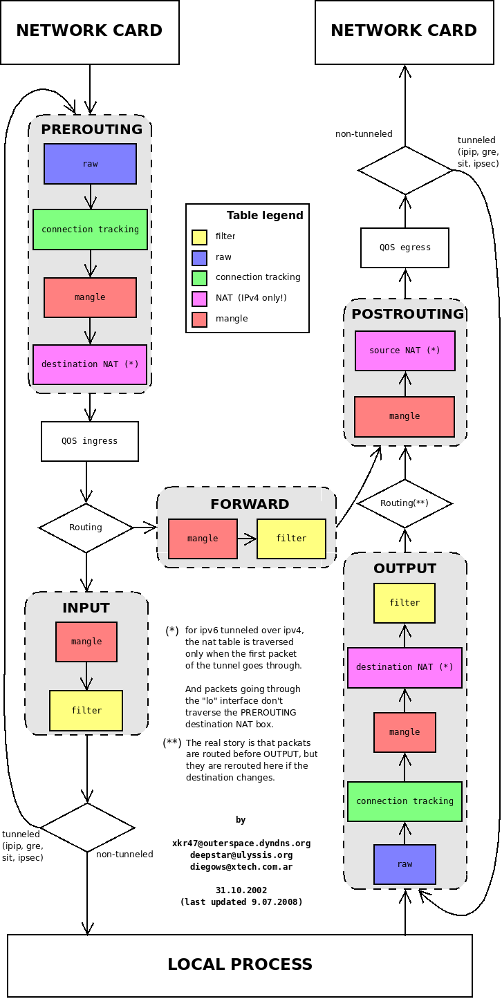

# Networking

## Kubernetes iptables chains

[Documentation](https://kubernetes.io/docs/tasks/debug-application-cluster/debug-service/)

1\) **KUBE-SERVICES\(CHAIN\)** Containts all Services

```text
   -A PREROUTING -m comment --comment "kubernetes service portals" -j KUBE-SERVICES
   -A OUTPUT -m comment --comment "kubernetes service portals" -j KUBE-SERVICES

   -A KUBE-SERVICES ! -s 10.30.0.0/16 -d 172.30.229.64/32 -p tcp -m comment --comment "simpson/homer:8080-tcp cluster IP" -m tcp --dport 8080 -j KUBE-MARK-MASQ
   -A KUBE-SERVICES -d 172.30.229.64/32 -p tcp -m comment --comment "simpson/homer:8080-tcp cluster IP" -m tcp --dport 8080 -j KUBE-SVC-UNWFIWS7624VL6XI
```

2\) **KUBE-SVC-\* the "LoadBalance"** Every services has an KUBE-SVC entry

```text
   -A KUBE-SVC-UNWFIWS7624VL6XI -m comment --comment "simpson/homer:8080-tcp" -m statistic --mode random --probability 0.50000000000 -j KUBE-SEP-HKFKWO5PFFO7Z3EC
   -A KUBE-SVC-UNWFIWS7624VL6XI -m comment --comment "simpson/homer:8080-tcp" -j KUBE-SEP-N3H7ASEQYKKEG23L
```

3\) **KUBE-SEP-\* the Service EndPoint** Every endpoint of an service. \(`oc get endpoints`\)

```text
   -A KUBE-SEP-HKFKWO5PFFO7Z3EC -s 10.30.2.88/32 -m comment --comment "simpson/homer:8080-tcp" -j KUBE-MARK-MASQ
   -A KUBE-SEP-HKFKWO5PFFO7Z3EC -p tcp -m comment --comment "simpson/homer:8080-tcp" -m tcp -j DNAT --to-destination 10.30.2.88:8080

   -A KUBE-SEP-N3H7ASEQYKKEG23L -s 10.30.3.62/32 -m comment --comment "simpson/homer:8080-tcp" -j KUBE-MARK-MASQ
   -A KUBE-SEP-N3H7ASEQYKKEG23L -p tcp -m comment --comment "simpson/homer:8080-tcp" -m tcp -j DNAT --to-destination 10.30.3.62:8080
```

## NetFilter / IPTables Package flow



Source: [http://xkr47.outerspace.dyndns.org/netfilter/packet\_flow/](http://xkr47.outerspace.dyndns.org/netfilter/packet_flow/)

