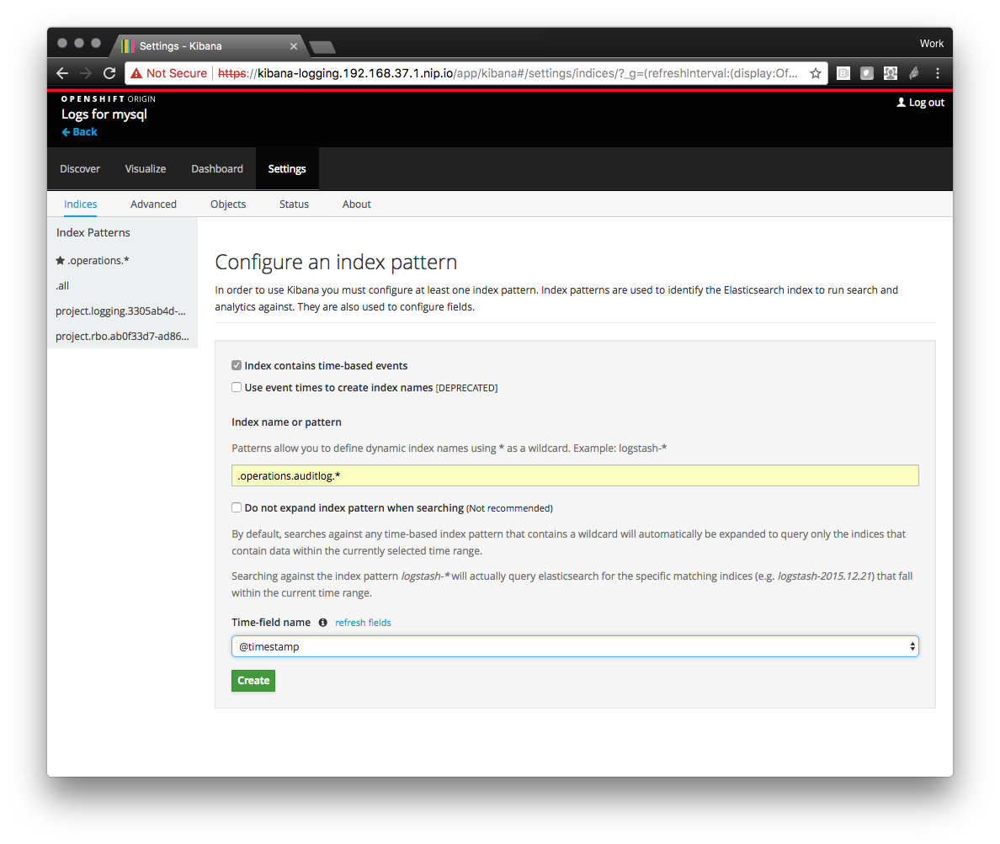
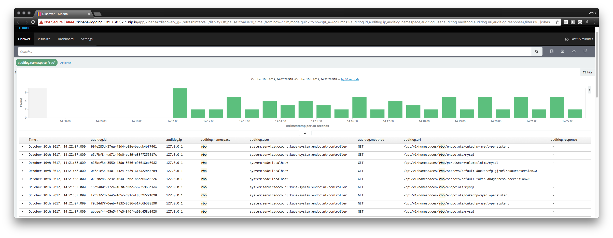
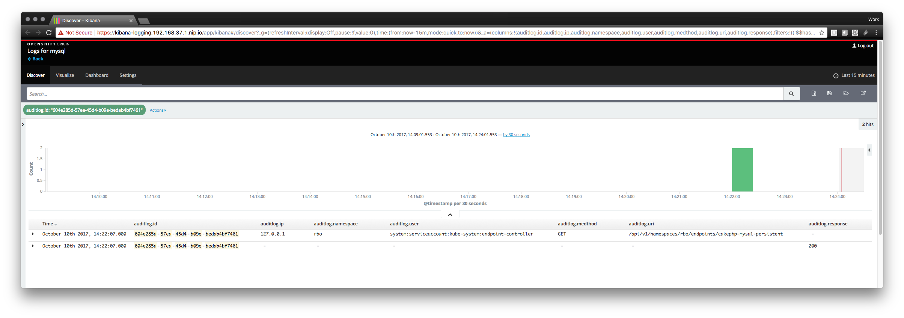
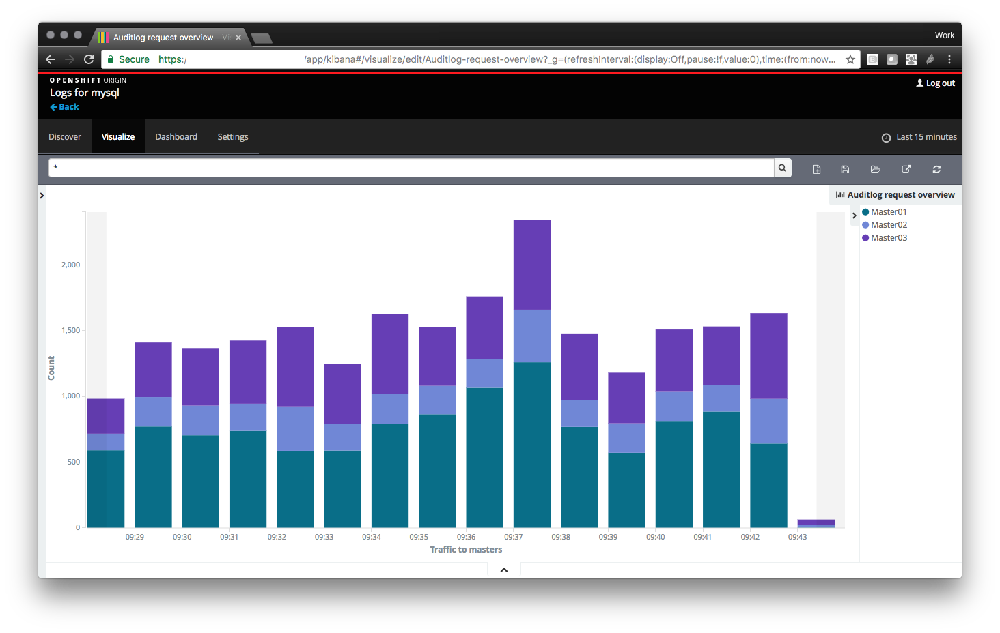

# EFK - Auditlogs \(OpenShift 3\)

A quick-n-diry example to put the openshift audit log into elasticsearch.

How to do it with Advanced Audit: [Integrating Advanced Audit with Aggregated Logging in OpenShift 3.11](https://austindewey.com/2018/10/17/integrating-advanced-audit-with-aggregated-logging-in-openshift-3-11/)

## Installation with OpenShift on RHEL

* Add to `/etc/origin/master/master-config.yaml`

  ```text
    auditConfig:
      auditFilePath: /var/log/audit-ocp.log
      enabled: true
  ```

  For example:

  ```text
    $ grep -A7 ^auditConfig /etc/origin/master/master-config.yaml
    auditConfig:
      auditFilePath: /var/log/audit-ocp.log
      enabled: true
      maximumFileRetentionDays: 14
      maximumFileSizeMegabytes: 500
      maximumRetainedFiles: 5
    authConfig:
      requestHeader:
  ```

* Edit configmap logging-fluentd `oc edit configmap/logging-fluentd -n logging`
  * Adjust fluent.conf after `@include configs.d/openshift/input-post-*.conf`, add:

    ```text
       @include configs.d/user/input-auditlog.conf
    ```

  * Add [input-auditlog.conf](https://github.com/rbo/openshift-examples/tree/43511bbb16abaf8280889de74ea12f3649972693/efk-auditlog/input-auditlog.conf) to configmap. Do not forget to adjust the audit log filename, default: /var/log/audit-ocp.log
  * Restart all fluent pods: `oc delete pods -l component=fluentd -n logging`
* Adjust kibana to use the new .operations.audit.\* indicies 

## Screenhosts

### Whats happen at namespace rbo?



### Whats happen with request 604e...



### How may requests gets every master



### Info for oc cluster up users

Start oc cluster up with \(mac os\)

## Know issues

* Ignores timezone in auditlog file \(It is recommended to use UTC.\)

  ```text
    UTC timestamp : 2017-10-12T06:55:59.496790107Z
    CET timestamp : 2017-10-12T08:56:52.795808328+02:00
  ```

* Container installation is not tested
* ~~Missing hostname in document~~ - fixed
* Adjust & test curator
* Cluster update?

#### Add Local ip adress

`sudo ifconfig lo0 alias 192.168.37.1`

#### Start OpenShift

```text
oc cluster up \
  --host-config-dir=${BASE_PATH}/host-config-dir/ \
  --host-data-dir=${BASE_PATH}/host-data-dir/ \
  --host-pv-dir=${BASE_PATH}/host-pv-dir/ \
  --public-hostname=192.168.37.1 \
  --logging=true
```

#### Add pv for auditlog to fluent

```text
oc create -f pvc.yml -n logging
oc volume daemonset/logging-fluentd --add --mount-path=/auditlog --name=auditlog -t pvc --claim-name=auditlog
```

#### Stop cluster

```text
oc cluster down
```

#### Adjust master config, write audit log to audit pv from fluent

In my case:

```text
grep audit host-config-dir/master/master-config.yaml
auditConfig:
  auditFilePath: "/Users/rbo/Development/oc-cluster/host-pv-dir/pv0044/auditlog.log"
```

#### Start OpenShift again

```text
oc cluster up \
 --service-catalog=true \
 --host-config-dir=${BASE_PATH}/host-config-dir/ \
 --host-data-dir=${BASE_PATH}/host-data-dir/ \
 --host-pv-dir=${BASE_PATH}/host-pv-dir/ \
 --public-hostname=192.168.37.1 \
 --use-existing-config \
 --logging=true
```

## Better access to elasticsearch with Kopf

[https://blog.openshift.com/managing-elasticsearch-with-kopf-in-openshift-origin-3-6/](https://blog.openshift.com/managing-elasticsearch-with-kopf-in-openshift-origin-3-6/)

